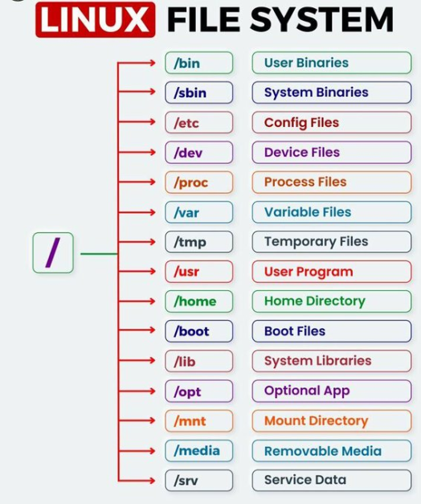
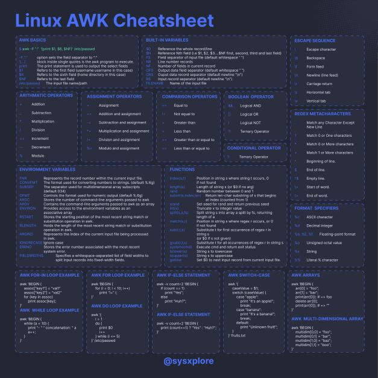

# Born2beroot

Env: Linux/Debian

To do:

- [ ] Check PermitRootlogin with ssh in /etc/ssh/sshd_config
- [ ] ...

📔 [Notes](#notes)

✅ [Correction CMD](#correction-cmd)

## Setup VM

- Download [Debian].iso
- Create VM
  - Click `New`
  - Change Machine Folder to `sgoinfre/foldername`
  - Mem `1024mb`
  - `Virtual hard disk`
  - `Virtual Box Disk Image`
  - Storage type: `Dynamically alloc` (12gb)
- Install Debian on your VM
  - Details > Storage > Controler IDE > Empty -> Optical Drive - Select Image Disk File -> Select `Debian.iso`
- Start VM

## Access VM

- Start
- Install
  - Language
  - location
  - Keyboard
  - Hostname: `rcutte42` (machine name)
  - Domain name: `none`
  - Root passwd: `Pass42pass`
  - User name && pass: `rcutte`
  - Partition disk: `guided use entire disk and set up encrypted LVM`
    - SCSI3
    - Separate home, var and tmp partitions
    - Wait during erasing...
    - Encryption passphrases: `pass42pass`
    - Guide partitioning: `max`
    - Finish partitioning and write changes to disk
  - Configure package manager
    - `no`
    - country : `france`
    - package manager: `deb.debian.org`
    - proxy: `none`
  - Popularity contest : `no`
  - Software selection : deselect `ssh-server` and `standard system util`
  - GRUB:
    - Install `yes`
    - boot loader : `dev/sda`
  - Finish: `continue`

## Connect into VM

- Wait Grub restart -> select `GNU Debian/linux`
- Enter Encryption pass - unlock disk
- Enter User pass - unlock session

## Log as root

- `su -`

## Sudo

1. First type `su -` to login in as the root user.
2. Then type `apt-get update -y` -y means 'yes' prevent confirmation prompt
3. Then type `apt-get upgrade -y`
4. Then type `apt install sudo` (install to allow other user to have sudo privilege)
5. Then type `usermod -aG sudo your_username` to add user in the sudo group (To check if user is in sudo group, type `getent group sudo`)
6. Type `sudo visudo` to open sudoers file
7. Lastly find - # User privilege specification, type `your_username  ALL=(ALL) ALL` - Add sudo privilege to user `your_username`

## Git

1. Then type `apt-get install git -y` to install Git
2. Then type `git --version` to check the Git Version

## SSH (Secure Shell Host)

1. Type `sudo apt install openssh-server`
2. Type `sudo systemctl status ssh` to check SSH Server Status
3. Type `sudo vim /etc/ssh/sshd_config` - if vim is install
4. Find this line `#Port22`
5. Change the line to Port 4242 `without the #` (Hash) in front of it. And change PermitRootLogin to no
6. Save and Exit Vim
7. Then type `sudo grep Port /etc/ssh/sshd_config` to check if the port settings are right
8. Lastly type `sudo service ssh restart` to restart the SSH Service

## UFW (Uncomplicated FireWall)

1. First type `apt-get install ufw` to install UFW
2. Type `sudo ufw enable` to inable UFW
3. Type `sudo ufw status numbered` to check the status of UFW
4. Type `sudo ufw allow 4242` to configure the Port Rules
5. Lastly Type `sudo ufw status numbered` to check the status of UFW 4242 Port

- Pb to connect via port 4242 : Tunneling in VM to port 4444 -> 4242 (without changing firewall).

## Connect to SSH

- Go in VirtualBox
- To exit your Virtual Machine and use your mouse, press command on your Apple Keyboard and your mouse should appear
- Go to your Virtual Box Program
- Click on your Virtual Machine and select Settings
- Click Network then Adapter 1 then Advanced and then click on Port Forwarding
- Change the Host Port and Guest Port to `4242`
- Then head back to your Virtual Machine
- Type `sudo systemctl restart ssh` to restart your SSH Server
- Type `sudo service sshd status` to check your SSH Status
- Open an iTerm and type the following `ssh your_username@127.0.0.1 -p 4242`
- In case an error occurs, then type `rm ~/.ssh/known_hosts` in your iTerm and then retype `ssh your_username@127.0.0.1 -p 4242`
- Lastly type exit to quit your SSH iTerm Connection

### IP / Ports

- ss -tunlp
  - display open ports

Change IP to Static and Disable DHCP(Dyn Host Config Protocol)

- Edit the network configuration file (Change ip to static and close port 68 use by DHClient when ip dyn)
  - Open the network configuration file: `sudo nano /etc/network/interfaces`

  ```text
  allow-hotplug enp0s3
  iface enp0s3 inet static
  address 10.0.2.15
  netmask 255.255.255.0
  gateway 10.0.2.2
  ```

  - To change between dhcp and static change upper code in interface
  - Restart: `sudo systemctl restart networking`
- Check DNS:
  - Leave as default, to access do `sudo nano /etc/resolv.conf`

- Apply change: `sudo systemctl restart networking`
- `ifup` : if DHCP down to Start it
- `ip a`: config reseau
- `ip r`: route reseau (list ip root - CDIR(use to get netmask) - Gateway - Address ...)
- `traceroute 8.8.8.8`: trace ip root of packet/ping
- Disable if needed: `systemctl stop ifup@enp0s3.service` then `disable` (change stop to disable in cmd)

Port Fowarding(In VM change tunnel from 4444 to 4242):

|Rule | Protocol | Host ip | host port | Guest Ip | Guest Port
| ----| --------| ------- | --------- | ---------| --------
| SSH  | TCP| 127.0.0.1 | 4444 | 10.0.2.15 | 4242

## Manage Passwords

1. First type `sudo apt-get install libpam-pwquality` to install Password Quality Checking Library
2. Then type `sudo vim /etc/pam.d/common-password`
3. Find this line. `password  requisite  pam_deny.so`
4. Add this to the end of that line `minlen=10 ucredit=-1 dcredit=-1 maxrepeat=3 reject_username difok=7 enforce_for_root`.
 The line should now look like this `- password  requisite     pam_pwquality.so  retry=3 minlen=10 ucredit=-1 dcredit=-1 maxrepeat=3 reject_username difok=7 enforce_for_root`
   1. `minlen=10`: This sets the minimum length of the password to 10 characters.
   2. `ucredit=-1`: This means that at least one uppercase letter is required in the password.
   3. `dcredit=-1`: This means that at least one digit is required in the password.
   4. `maxrepeat=3`: This sets the maximum number of repeated characters allowed in the password to 3.
   5. `reject_username`: This option, when set, rejects passwords that are the same as the username.
   6. `difok=7`: This sets the minimum number of required different characters in the password to 7.
   7. `enforce_for_root`: This option, when set, enforces the password policy for the root user.
5. Save and Exit Vim
6. Next type in your Virtual Machine `sudo vim /etc/login.defs`
7. Find this part `PASS_MAX_DAYS 9999 PASS_MIN_DAYS 0 PASS_WARN_AGE 7`
8. Change that part to `PASS_MAX_DAYS 30` (max days for a pwd) and `PASS_MIN_DAYS 2` (min days between change of pwd). Keep `PASS_WARN_AGE 7` (warn to change pwd) as the same
9. Lastly type `sudo reboot` to reboot the change affects

## User Groups

- create a group: `sudo groupadd user42`
- create an evaluating group: `sudo groupadd evaluating`
- check if the group has been created: `getent group`

Add user to groups:

- Check all local users `cut -d: -f1 /etc/passwd`
- Create a username `sudo adduser new_username`
  - Type `sudo usermod -aG user42 new_username`
    - Type `sudo usermod -aG evaluating new_username`
- Check if the user is the group `getent group user42`
- Same here:  `getent group evaluating`
- Type `groups` to see which groups the user account belongs to
- Lastly type `chage -l new_username` to check if the password rules are working in users

To change manually passwd rule for a account use: `sudo chage` cmd with needed option.

To change a passwd:

- Use `sudo passwd username`

Add/Remove user:

- Add: `sudo useradd username` add `-m` to create a user dir
- Remove: `sudo deluser username` add `--remove-home` to remove user dir

Add/Remove group:

- Add: `sudo groudadd group_name`
- Delete: `sudo grouddel group_name`

## Logs for Sudo commands

- First type `cd ~/../` (go to root folder etc, var, home...)
- Then type `cd var/log`
- Then type `mkdir sudo` (if it already exists, then continue to the next step).
- Then type `cd sudo && touch sudo.log`
- Then type `cd ~/../`

### Sudo config

First type `sudo nano /etc/sudoers` or `sudo visudo` to go the sudoers file

Edit to add the following code:

```text
Defaults env_reset
Defaults mail_badpass
Defaults secure_path="/usr/local/sbin:/usr/local/bin:/usr/bin:/sbin:/bin"
Defaults badpass_message="Password is wrong, please try again!"
Defaults passwd_tries=3
Defaults logfile="/var/log/sudo/sudo.log"
Defaults log_input, log_output
Defaults requiretty
```

- `Defaults env_reset`: This line resets the terminal environment to remove any user variables. This is a safety measure used to clear potentially harmful environmental variables from the sudo session.
- `Defaults mail_badpass`: This line tells the system to mail notices of bad sudo password attempts to the configured mailto user. By default, this is the root account.
- `Defaults secure_path="/usr/local/sbin:/usr/local/bin:/usr/bin:/sbin:/bin"`: This line specifies the PATH (the places in the filesystem the operating system will look for applications) that will be used for sudo operations. This prevents using user paths which may be harmful.
- `Defaults badpass_message="Password is wrong, please try again ... !"`: This line sets the message that will be displayed when a user enters an incorrect password.
- `Defaults passwd_tries=3`: This line sets the number of times a user can enter a wrong password before being locked out.
- `Defaults logfile="/var/log/sudo.log"`: This line sets the log file where sudo will record its activities.
- `Defaults log_input, log_output`: These lines instruct sudo to log both the input and output of the commands that are run.
- `Defaults requiretty`: This line requires that sudo commands be run from a terminal. This is a security measure to prevent unauthorized users from running sudo commands.

## Script Setup

- Then type `apt-get install -y net-tools` to install the netstat tools or ss tools (nestat deprecated)
- Then type `cd /usr/local/bin/`
- Then type `touch monitoring.sh`
- To add permission (exec  and others) type `chmod 777 monitoring.sh`
  - Do `chmod +x monitoring.sh` if doesnt load with current permissions
- open monitoring.sh (via SSH if you want to access clipboard)
- Add following code:

```bash
#!/bin/bash
arc=$(uname -a)
pcpu=$(grep "physical id" /proc/cpuinfo | sort | uniq | wc -l) 
vcpu=$(grep "^processor" /proc/cpuinfo | wc -l)
fram=$(free -m | awk '$1 == "Mem:" {print $2}')
uram=$(free -m | awk '$1 == "Mem:" {print $3}')
pram=$(free | awk '$1 == "Mem:" {printf("%.2f"), $3/$2*100}')
fdisk=$(df -BG | grep '^/dev/' | grep -v '/boot$' | awk '{ft += $2} END {print ft}')
udisk=$(df -BM | grep '^/dev/' | grep -v '/boot$' | awk '{ut += $3} END {print ut}')
pdisk=$(df -BM | grep '^/dev/' | grep -v '/boot$' | awk '{ut += $3} {ft+= $2} END {printf("%d"), ut/ft*100}')
cpul=$(top -bn1 | grep '^%Cpu' | cut -c 9- | xargs | awk '{printf("%.1f%%"), $1 + $3}')
lb=$(who -b | awk '$1 == "system" {print $3 " " $4}')
lvmu=$(if [ $(lsblk | grep "lvm" | wc -l) -eq 0 ]; then echo no; else echo yes; fi)
ctcp=$(ss -neopt state established | wc -l)
ulog=$(users | wc -w)
ip=$(hostname -I | awk '{ print $1}')
mac=$(ip link show | grep "ether" | awk '{print $2}')
cmds=$(journalctl _COMM=sudo | grep COMMAND | wc -l)
wall " #Architecture: $arc
 #CPU physical: $pcpu
 #vCPU: $vcpu
 #Memory Usage: $uram/${fram}MB ($pram%)
 #Disk Usage: $udisk/${fdisk}Gb ($pdisk%)
 #CPU load: $cpul
 #Last boot: $lb
 #LVM use: $lvmu
 #Connections TCP: $ctcp ESTABLISHED
 #User log: $ulog
 #Network: IP $ip ($mac)
 #Sudo: $cmds cmd"
```

- `arc=$(uname -a)`: This line uses the uname -a command to get the architecture of the system and store it in the arc variable

- `pcpu=$(grep "physical id" /proc/cpuinfo | sort | uniq | wc -l)`: This line uses grep to find lines containing "physical id" in the /proc/cpuinfo file, sorts them, removes duplicates with uniq, and counts the number of unique physical CPUs with wc -l. The result is stored in the pcpu variable.

- `vcpu=$(grep "^processor" /proc/cpuinfo | wc -l)`: This line uses grep to find lines starting with "processor" in the /proc/cpuinfo file and counts them with wc -l. The result is stored in the vcpu variable.
  - The ^ symbol in the grep command is used to indicate the start of a line. So, grep "^processor" is used to search for lines that start with the word "processor".
  - In the context of this script, grep "^processor" /proc/cpuinfo is used to count the number of virtual CPUs. The /proc/cpuinfo file contains information about the system's CPUs, and each CPU is represented by a block of lines that start with "processor". By counting the number of these blocks, the script can determine the number of virtual CPUs.

- `fram=$(free -m | awk '\$1 == "Mem:" {print \$2}')`: This line uses the free -m command to get the total amount of RAM in megabytes and stores it in the fram variable.
  - if first element is Mem ($1 == "Mem:") choose the row that start with mem, then print second element in the row

- `uram=$(free -m | awk '\$1 == "Mem:" {print \$3}')`: This line uses the free -m command to get the used amount of RAM in megabytes and stores it in the uram variable.

- `pram=$(free | awk '\$1 == "Mem:" {printf("%.2f"), \$3/\$2*100}')`: This line uses the free command to get the percentage of used RAM and stores it in the pram variable.
  - if first element Mem: then use prinf cmd with param third_element/second_element * 100 to display percentage use

- `fdisk=$(df -BG | grep '^/dev/' | grep -v '/boot$' | awk '{ft += \$2} END {print ft}')`: This line uses the df -BG command to get the total size of all file systems in gigabytes, excluding the /boot partition, and stores it in the fdisk variable.
  - `-BG` option is to get result in Gigabytes(G). `/dev/` is for devices files so for the disk usage of the device here the VM. `-v` to unselect unwanted elements here `/boot$`. `ft` is a var to add result of each second element in selected rows. the `END` keyword is to exec after all input lines have been processed, in this case when all blocks of mem add into ft var. Then ft is print.

- `udisk=$(df -BM | grep '^/dev/' | grep -v '/boot$' | awk '{ut += \$3} END {print ut}')`: This line uses the df -BM command to get the used size of all file systems in megabytes, excluding the /boot partition, and stores it in the udisk variable.

- `pdisk=$(df -BM | grep '^/dev/' | grep -v '/boot$' | awk '{ut += \$3} {ft+= \$2} END {printf("%d"), ut/ft*100}')`: This line uses the df -BM command to get the percentage of used space of all file systems, excluding the /boot partition, and stores it in the pdisk variable.
  - `%d` to specify we want to print an integer, so if var is a float truncation will be apply.

- `cpul=$(top -bn1 | grep '^%Cpu' | cut -c 9- | xargs | awk '{printf("%.1f%%"), \$1 + \$3}')`: This line uses the top -bn1 command to get the CPU usage and stores it in the cpul variable.
  - `top` command is used to display dynamic real-time information about running processes. The `-b` option tells top to run in batch mode, which is useful for sending output from top to other programs or to a file. The `-n1` option tells top to only update the process list once.
  - `^%Cpu` search line (here the column) start with %Cpu.
  - `cut -c 9-` command is used to extract characters from each line of input. The `-c` option tells cut to operate on characters, and `9-` specifies that it should extract characters from the 9th character to the end of the line. This is used to remove the "%Cpu" part from the output of the grep command and keep only the CPU usage percentages
  - `xargs` command is used to build and execute commands from standard input. In this case, it's used to convert the output of the cut command into arguments for the awk command
  - `{printf("%.1f%%"), $1 + $3}` part formats the output of the awk command to be a floating-point number followed by a percentage sign. The `$1 + $3` part adds the first and third fields (columns) of each line (which are the CPU usage percentages for user and system processes).

- `lb=$(who -b | awk '\$1 == "system" {print \$3 " " \$4}')`: This line uses the who -b command to get the last boot time and stores it in the lb variable.
  - `who` command in Linux is used to display information about users who are currently logged into the system.

- `lvmu=$(if [ $(lsblk | grep "lvm" | wc -l) -eq 0 ]; then echo no; else echo yes; fi)`: This line checks if there are any logical volumes in the system and stores "yes" or "no" in the lvmu variable.
  - if [] conditions here if count of lvm in lsblk = 0, then print `no` else `yes`.

- `ctcp=$(ss -neopt state established | wc -l)`: This line uses the ss -neopt state established command to get the number of established TCP connections and stores it in the ctcp variable.
  - `-n`: This option tells ss to display addresses and port numbers in numerical form.
  - `-e`: This option tells ss to display TCP connections.
  - `-o`: This option tells ss to display timers.
  - `-p`: This option tells ss to show process using the socket

- `ulog=$(users | wc -w)`: This line uses the users command to get the number of logged-in users and stores it in the ulog variable.
  - wc -w : counts words

- `ip=$(hostname -I)`: This line uses the hostname -I command to get the IP address of the system and stores it in the ip variable.

- `mac=$(ip link show | grep "ether" | awk '{print \$2}')`: This line uses the ip link show command to get the MAC address of the system and stores it in the mac variable.
  - `ip link show`: This command displays information about all network interfaces on the system. The output includes the name of the interface, its MAC address, and other details.
  - `ether` display MAC address (Media Access Control).

- `cmds=$(journalctl _COMM=sudo | grep COMMAND | wc -l)`: This line uses the journalctl _COMM=sudo command to get the number of sudo commands executed and stores it in the cmds variable.
  - `journalctl`: This is the command itself, which is used to interact with the systemd journal. The systemd journal is a centralized logging system that collects and stores log data from various sources, including system services, kernel events, and user applications.
  - `_COMM=sudo`: This is a filter that tells journalctl to only show log messages where the _COMM field (which contains the command that generated the log message) is "sudo". In other words, it filters the log messages to only include those that were generated by the sudo command

- `wall` " #Architecture: $arc ...: This line uses the wall command to display the collected information to all logged-in users.

Add permission to exec script without password:

- In sudo file, `sudo visudo` add the following line in #Allow members of group sudo to exec any command:
  - `your_username ALL=(ALL) NOPASSWD: /usr/local/bin/monitoring.sh`

## Cron config

- Type `sudo /usr/local/bin/monitoring.sh` to execute your script as su (super user)
- Type `sudo crontab -u root -e` to open the crontab and add the rule
  - `crontab -u root -e` opens the crontab file for the root user in an editor, allowing you to add, modify, or remove cron jobs for the root user.
  - `-e` open editor `-u root` to specifies the user for whom the cron job will be set.
- Lastly at the end of the crontab, type the following `*/10 * * * * /usr/local/bin/monitoring.sh` this means that every 10 mins, this script will show

## App Armor

`sudo apt -y install apparmor`

## Bonus

### Partitions

- Display partitions: `lsblk`
- Display volume group: `sudo vgs`
- Add a volume group to encrypted partitions
  - Create logical volume with `lvcreate` -L for size of volume, -n for name of the logical volume
  - 4G for var/log
    - `sudo lvcreate -L 1G -n rcutte-vg-var-log rcutte-vg`
    - `sudo mkfs.ext4 /dev/rcutte-vg/var--log`
    - `sudo mkdir /var/log`
    - `sudo mount /dev/rcutte-vg/var--log /var/log`
  - Same for: 3G for srv
    - `sudo lvcreate -L 1G -n rcutte-vg-srv rcutte-vg` ...

Notes:

- To reduce space:
  - Check size/space of disk: `df -Th`
  - umount to prevent data loss: `sudo umount /home` remount after operation
  - `sudo lvreduce -L -3G /dev/vg-name/lv-name`
- Add space in VM, Use GParted live iso to edit partitions. (for non encrypted partitions)
🕸️ [Details](https://www.pragmaticlinux.com/2020/09/how-to-increase-the-disk-size-in-a-virtualbox-virtual-machine/)

<!-- ### WordPress

Install requirements (Wordpress, lighttpd, MariaDB, and PHP)

#### lighttpd

- Pronounced "lighty", is an open-source web server software that is known for its speed, efficiency, and flexibility. It is optimized for high-performance environments, using memory and CPU efficiently and having lower resource use than other popular web servers
- Lighttpd supports the FastCGI, SCGI, and CGI interfaces to external programs, allowing web applications written in any programming language to be served by Lighttpd. It also supports the `Secure Socket Layer and Transport Layer Security` cryptographic protocols, providing secure connections between the web server and clients
- `CGI` stands for Common Gateway Interface. It's a standard protocol for web servers to execute programs and return their output to the web browser. CGI is used to generate dynamic web content, meaning the content is created on-the-fly in response to user actions or requests

#### Installation 

[Guide for lighttpd with wordpress](https://www.atlantic.net/dedicated-server-hosting/how-to-install-wordpress-with-lighttpd-web-server-on-ubuntu-20-04/)

- `sudo apt update -y && sudo apt dist-upgrade -y && sudo apt autoremove -y sudo reboot now`

- Full install cmd:
`sudo apt-get install mariadb-server lighttpd php php-fpm php-mysql php-cli php-curl php-xml php-json php-zip php-mbstring php-gd php-intl php-cgi -y`

- Remove Apache:
`sudo apt-get remove apache2 -y`
`sudo systemctl stop apache2`

- Init lighttpd server:
`sudo systemctl start lighttpd` `sudo systemctl enable lighttpd`

- Config PHP
  - PHP-FPM(It works as a process manager, managing PHP processes and handling PHP requests separately from the web server. This allows it to efficiently handle multiple PHP requests concurrently, leading to a significant reduction in latency and improved overall performance) conf files:
    - `nano /etc/php/8.2/fpm/pool.d/www.conf`
    - find `listen = /run/php/php8.2-fpm.sock`
    - change to `listem = 127.0.0.1:9000`
  - Edit PHP conf file:
    - `nano /etc/lighttpd/conf-available/15-fastcgi-php.conf`

    ```config
    fastcgi.server += ( ".php" =>
        ((
                "bin-path" => "/usr/bin/php-cgi",
                "socket" => "/var/run/lighttpd/php.socket",
                "max-procs" => 1,
                "bin-environment" => (
                        "PHP_FCGI_CHILDREN" => "4",
                        "PHP_FCGI_MAX_REQUESTS" => "10000"
                ),
                "bin-copy-environment" => (
                        "PATH", "SHELL", "USER"
                ),
                "broken-scriptfilename" => "enable"
        ))
    ```

    - find `"bin-path" => "/usr/bin/php-cgi",
"socket" => "/var/run/lighttpd/php.socket",`
    - replace with:

    ```config
    "host" => "127.0.0.1",
    "port" => "9000",
    ```

  - Enable php cgi(common gateway interface - allow dynamic web content data can be process in database and return to web page) modules with lighttpd server: `lighty-enable-mod fastcgi` `lighty-enable-mod fastcgi-php`

  - Restart service to apply changes: `systemctl restart lighttpd` `systemctl restart php8.2-fpm`

- Create Database
  - Open mariadb: `mysql`
  - Create database: `CREATE DATABASE wpdb;`
  - Allow access to wpuser to db: `GRANT ALL PRIVILEGES ON wpdb.* TO 'wpuser'@'localhost' IDENTIFIED BY 'password';`
  - Reload grant (privilege table) to apply changes of privilege: `FLUSH PRIVILEGES; EXIT;`

- Install WordPress
  - Go to lighttpd web root dir and dl wordpress `cd /var/www/html` `wget https://wordpress.org/latest.tar.gz`
  - Open archive: `tar -xvzf latest.tar.gz`
  - Go to wordpress dir and change conf name to enable it: `cd wordpress` `mv wp-config-sample.php wp-config.php`
  - Edit conf: `nano wp-config.php` change to next conf:
  
   ```config
   /** The name of the database for WordPress */
   define( 'DB_NAME', 'wpdb' );

   /** MySQL database username */
   define( 'DB_USER', 'wpuser' );

   /** MySQL database password */
   define( 'DB_PASSWORD', 'password' );

   /** MySQL hostname */
   define( 'DB_HOST', 'localhost' );

   /** Database Charset to use in creating database tables. */
   define( 'DB_CHARSET', 'utf8' );
   ```

  - Add permissions to config (www-data is a common user and group for web servers, so this command changes the owner and group of the directory to www-data):
  `chown -R www-data:www-data /var/www/html/wordpress` `chmod -R 755 /var/www/html/wordpress`
  - Create a directory to store the virtual host configuration file (this allow to process different web application - 1 virtual host for each web app): `mkdir -p /etc/lighttpd/vhosts.d/`
  - Edit lighttpd conf (Mod_rewrite module in Lighttpd is used to rewrite URLs based on certain conditions. It's a powerful tool for URL manipulation, which can be used for a variety of purposes such as creating user-friendly URLs, redirecting old URLs to new ones, and more):
    - Add the mod_rewrite module:

    ```config
    server.modules = (
        "mod_access",
        "mod_alias",
        "mod_compress",
        "mod_redirect",
        "mod_rewrite",
    )
    ```

    - Define the path of your virtual host configuration directory: `include_shell "cat /etc/lighttpd/vhosts.d/*.conf"`
  - Create a virtual host conf for wordpress: `nano /etc/lighttpd/vhosts.d/wordpress.conf`

    ```config
    $HTTP["host"] =~ "(^|.)wordpress.example.com$" {
    server.document-root = "/var/www/html/wordpress"
    server.errorlog = "/var/log/lighttpd/wordpress-error.log"

    }
    ```

    - This configuration block is used to set up a virtual host for wordpress.example.com and its subdomains. It sets the document root to the directory where WordPress files are stored and sets the location of the error log

  - Restart lighttpd: `systemctl restart lighttpd`

- Access Wordpress dashboard
  ... fails

Start/Enable and Check the server

- `sudo service lighttpd start`
- `sudo systemctl enable lighttpd`
- `sudo systemctl status lighttpd`

#### MariaDB

- MariaDB is intended to maintain high compatibility with MySQL, with exact matching with MySQL APIs and commands, allowing it in many cases to function as a drop-in replacement for MySQL. However, new features are diverging. It includes new storage engines like Aria, ColumnStore, and MyRocks.
- MariaDB is one of the most popular open source relational databases. It’s made by the original developers of MySQL and guaranteed to stay open source. It is part of most cloud offerings and the default in most Linux distributions

- Check: `sudo systemctl status mariadb`

#### PHP

- PHP, which stands for Hypertext Preprocessor, is an open-source, interpreted, object-oriented server-side scripting language primarily used for web development.
- PHP is not limited to output HTML. You can output images or PDF files, and you can also output any text, such as XHTML and XML. It can create, open, read, write, delete, and close files on the server
- PHP can easily connect to all databases, both relational and non-relational, so it can connect in no time to MySQL, Postgress, MongoDB, or any other database.

[PHP Doc with lighttpd](https://www.php.net/manual/fr/install.unix.lighttpd-14.php)

#### Config

Configure PHP with Lighttpd and MariaDB:

Restart lighttpd : `sudo systemctl restart lighttpd`

PHP config:

- Check config: `php -l /etc/php/8.2/cli/php.ini`

#### WordPress Setup

[WordPress install exemple](https://www.digitalocean.com/community/tutorials/how-to-install-wordpress-with-lemp-nginx-mariadb-and-php-on-debian-10) -->

### Additionnal service

Add service: [Docker](https://docs.docker.com/engine/install/debian/#install-using-the-repository)

- Add docker dowload repo source to apt

```bash
# Add Docker's official GPG key:
sudo apt-get update
sudo apt-get install ca-certificates curl gnupg
sudo install -m 0755 -d /etc/apt/keyrings
curl -fsSL https://download.docker.com/linux/debian/gpg | sudo gpg --dearmor -o /etc/apt/keyrings/docker.gpg
sudo chmod a+r /etc/apt/keyrings/docker.gpg

# Add the repository to Apt sources:
echo \
  "deb [arch="$(dpkg --print-architecture)" signed-by=/etc/apt/keyrings/docker.gpg] https://download.docker.com/linux/debian \
  "$(. /etc/os-release && echo "$VERSION_CODENAME")" stable" | \
  sudo tee /etc/apt/sources.list.d/docker.list > /dev/null
sudo apt-get update
```

- Install Docker Engine: `sudo apt-get install docker-ce docker-ce-cli containerd.io docker-buildx-plugin docker-compose-plugin`

- Check Setup: `sudo docker run hello-world`
  - This command downloads a test image and runs it in a container. When the container runs, it prints a confirmation message and exits.

#### Additionnal Custom

OhMyZsh

`sudo apt install zsh`

`sh -c "$(curl -fsSL https://raw.githubusercontent.com/ohmyzsh/ohmyzsh/master/tools/install.sh)"`

## VM INFOS

- os: `Debian`
- hostname: `rcutte42` (req: 42 login follow by 42)
- username: `rcutte` (req : user with 42 login)
- userpass: `Pass42pass`, for root passwd: `Pass42demo`
- encryption pass: `pass42pass`
- open port: `4242`

- user test: `test` passwd: `Pass42pass`

- wordpress:
  - user: `wpuser` passwd: `password`

## Correction CMD

Signature:

- check signature: `sha1sum Born2BeRoot.vdi`

Log:

- Verify password with pass rules:
  - min 10 char: at least one maj, min, number. Max 3 consective same char.
  - root different from user passwd

OS Distro:

- Check distro: `uname` -a for all (hostname, os, distro etc)
- Check apparmor: `sudo aa-status`

Check UFW/SSH:

- UFW: `ufw status`
- SSH: `ssh login@ip -p port` (explanation needed in case of error)

Group:

- check group list: `groups`
  - shoulb be present: `sudo`, `user42`
- check user group: `groups login`

User:

- Add a user: `sudo useradd new_user`
  - during password check if passwd rules are applied:
    - `sudo chage -l username` check password expire rules
  - explanation of how they where applied (here with in `sudo vim /etc/pam.d/common-password`) with lib `libpam-pwquality`, PAM (Pluggable Authentication Modules)
- Add a group: `sudo groupadd evaluating` check with `groups` or `getent group`
- Assign user to `evaluating` group: `sudo usermod -aG evaluating new_user` check with `getent group evaluating`
- Check passwd policy: `sudo vim /etc/login.defs`

Hostname et Partitions:

- Check hostname:
  - Check `hostname` or `hostnamectl` for full details
  - Change hostname with your log in `sudo hostnamectl set-hostname new_hostname`, reboot.
  - Check `hostname` -> then restore original hostname.
    - NOTE (If you want to keep new hostname): You can get error `sudo: unable to resolve host debian11: Name or service not known` when you change host name. To correct do `sudo nano /etc/hosts` (replace hostname with new_hostname).
- Ask evaluated person to display partitions: `lsblk`
- Explain LVM and benefits.

Sudo:

- Check if sudo is installed with a sudo cmd
- Add new_user to sudo group

UFW:

- Explain UFW
- Add a rule: `ufw allow rule_to_add` here `8080`
- Delete a rule: `ufw status numbered` -> `ufw delete num_of_rule`

SSH:

- check ssh installed: `sudo systmctl status sshd`
- Explain SSH
- Check port: `ss -tnulp` only 4242 should be use
- try to connect with ssh: `ssh your_user_id@127.0.0.1 -p port -v`
- check to log as root, normal response should be no log possible.

Script:

- explain cron
- setup script with crontab (`sudo crontab -u root -e`)
  - change to have the script rune every minute.
  - stop the script from running without touching script

Bonus:

- Check partitions: `lsblk`
- WordPress
- Free of choice service

## NOTES

Command key : `Right CTRL` Allow to exit VM window

View: `scale`

Difference between `Debian` and `Rocky`

- Debian is known for its stability and has a massive software repository, making it a versatile option for various server applications. It uses the apt package manager, which is reliable but may lack flexibility for complex software deployments.

- Rocky Linux is a community enterprise operating system designed to be 100% bug-for-bug compatible with RHEL. It's led by Gregory Kurtzer, the founder of the CentOS project. Rocky Linux uses yum and dnf as its package managers, supporting automatic dependency resolution, versioning, and modular content. This makes it a potentially better choice for businesses looking to stay on the cutting edge of technology without sacrificing stability. (Security-Enhanced Linux (SELinux) is a security architecture for Linux systems that provides administrators with more control over who can access the system. It was originally developed by the United States National Security Agency (NSA) and was released to the open-source community)

- In conclusion, while Debian is a reliable and versatile option, Rocky Linux may be a better choice for businesses looking to stay on the cutting edge of technology and require superior SELinux implementation

`VMs` have many benefits:

- Flexibility: VMs are faster and easier to set up than installing an OS on a physical server. Developers and software testers can create new environments on demand to handle new tasks as they arise.
- Security: VMs improve security by allowing an entire snapshot of the VM to be created at any point in time and then restored to that state if it becomes infected with malware. This effectively takes the VM back in time, making it easier to recover from malware infections.
- Efficient DevOps: VMs allow for simplified testing and development processes for applications and websites. Maintenance operations have minimal impact on your production environment, and there is often no need for downtime when performing maintenance.
- Hardware Independence: VMs can be provisioned or migrated to any physical server, providing flexibility and scalability.
- Support for Legacy Applications: VMs can run multiple operating system environments on a single physical computer, supporting legacy applications and reducing the cost of migrating to a new operating system.
- Easy Provisioning and Maintainability: VMs are easy to manage and maintain, and they offer several advantages over physical machines. They can run multiple operating system environments on a single physical computer, saving physical space, time, and management costs.
- High Availability: VMs can provide integrated disaster recovery and application provisioning options.
- Snapshot Capability: VMs allow for the creation of system-level snapshots that can be instantly restored whenever needed. This provides a more comprehensive system restore option
- They also have potential disadvantages. Running multiple VMs on one physical machine can result in unstable performance if infrastructure requirements are not met. Additionally, VMs are less efficient and run slower than a full physical computer.

`AppArmor`, short for Application Armor, is a Linux kernel security module that allows system administrators to restrict the capabilities of programs using per-program profiles.

- AppArmor operates as a Mandatory Access Control (MAC) system, binding access control attributes to programs rather than users. It confines programs to a limited set of resources, restricting their capabilities to a set of files, attributes, and capabilities. This means that even if a program is compromised, it cannot wreak havoc on the system because its access is limited to what it needs to function
- Profiles are stored in the `/etc/apparmor.d` directory and are plain-text files that can contain comments. They describe how binaries should be treated when executed. A profile includes a set of rules that determine what the program can and cannot do

`APT` is a lower-level package manager that is primarily used by other higher-level package managers. It handles package installation, upgrades, system upgrades, purging packages, and resolving dependencies. APT operates on the command line and does not have a user interface

- add a package: `sudo apt-get install pack_name`
- remove a package: `sudo apt-get remove pack_name`
  - remove with config: `sudo apt-get remove --purge package_name`

`Aptitude`, on the other hand, is a higher-level package manager that integrates the functionalities of APT and its other variants, including apt-mark and apt-cache. It provides a text-only and interactive user interface along with the option of command-line operation. Aptitude can handle a lot more than APT, including functionalities like searching for a package in the list of installed packages, marking a package to be automatically or manually installed, holding a package making it unavailable for upgrade

The `Logical Volume Manager (LVM)` in Linux provides several advantages over traditional disk partitioning and management:

- Flexibility: LVM allows for dynamic resizing of storage volumes. You can increase or decrease the size of logical volumes as needed, without having to worry about the physical storage space. This is achieved by creating logical volumes that can span multiple physical volumes, and by adding or removing physical volumes from a volume group.
- Efficient use of storage: LVM allows for the aggregation of multiple physical volumes into a single volume group. This can lead to more efficient use of storage space, as it allows for the consolidation of small, fragmented volumes into larger, contiguous volumes 7.
- Snapshotting: LVM supports the creation of snapshots of logical volumes. Snapshots are read-only copies of the original volume at a specific point in time. This can be useful for backup purposes, or for creating a temporary space to test changes without affecting the original data 8.
- Data protection: LVM supports RAID configurations, which can provide data protection by mirroring data across multiple physical volumes. This can help to prevent data loss in the event of a disk failure 8.
- Improved management: LVM provides a more organized and simplified way to manage storage devices. Instead of dealing with individual partitions on each disk, you can manage all your storage through volume groups and logical volumes.

`lsblk` command in Linux is used to list information about all available block devices, whether they are mounted or not. Block devices can include physical devices such as hard drives and SSDs, as well as virtual devices such as loop devices and LVM logical volumes.

- When you run the lsblk command without any options, it displays information in a tree-like structure, with each device represented by a line in the output. The command gets its information from the sysfs file system

The lsblk command displays the following columns by default:

- NAME: The name of the block device.
- MAJ:MIN: The major and minor device number.
- RM: This column shows whether the device is removable or not.
- SIZE: This column gives information on the size of the device.
- RO: This indicates whether a device is read-only.
- TYPE: This column shows the block device is a disk or a partition(part) within a disk.
- MOUNTPOINT: This column indicates the mount point on which the device is mounted

`sda` stands for the first SCSI(Small Computer System Interface) disk in the system. This naming convention is used to identify and refer to block devices, such as hard drives or SSDs.

`mkfs.ext4` command is used to create an ext4 file system on a disk partition in a Linux system. Ext4 is a native Linux filesystem that was developed as the successor to ext3. It offers stability, high capacity, reliability, and performance while requiring minimal maintenance. You can resize (increase/decrease) the filesystem without a problem.

`systemctl` is a command-line tool used for controlling and managing the systemd system and service manager. It is part of a range of system management utilities, libraries, and daemons


`SSH`, or Secure Shell, is a protocol used for secure remote login from one computer to another. It provides several alternative options for strong authentication and protects communications security and integrity with strong encryption. SSH is a secure alternative to non-protected login protocols such as telnet and rlogin, and insecure file transfer methods such as FTP.

- SSH uses a number of different types of data manipulation techniques at various points in the transaction to secure the transmission of information. These include forms of symmetrical encryption, asymmetrical encryption, and hashing
- The sshd process is started when the system boots. The program is usually located at `/usr/sbin/sshd`. It runs as root. The initial process acts as the master server that listens to incoming connections.
- Debug: `ssh -v [user@]host` print verbose debugging output that can usually identify what the problem is
- More infos: [SSH], [SSH-Config]

The `libpam-pwquality` package provides the `pam_pwquality` module, which is used to enforce password complexity rules in Linux. It's typically used in conjunction with the `pam_unix` module to provide password authentication. The `pam_pwquality` module checks the password against the rules specified in the `/etc/pam.d/common-password` or `/etc/security/pwquality.conf` file, depending on your system.

- PAM (Pluggable Authentication Modules) library that checks the quality of a user's password. It can enforce rules such as minimum length, presence of uppercase and lowercase letters, digits, and special characters, and prevent the reuse of old passwords.

:superhero:

The `sudoers` file in Debian is a configuration file for the sudo command. It allows you to specify who can run what commands as which users on what machines and can also control special things such as whether a password is required for particular commands.

:spider_web:

`netstat` is a command-line utility that provides network statistics. It displays active network connections, routing tables, and other network interface information.
  
  -->  Deprecated to ss

`DHCP` (Dynamic Host Configuration Protocol) is a network protocol that automatically assigns IP addresses and other network configuration parameters to devices on a network. Port 68 is used by DHCP clients to communicate with DHCP servers

- If you disable port 68 or DHCP on a network device, the device will not be able to obtain an IP address automatically. This can prevent the device from connecting to the network or accessing network resources. It can also prevent other devices on the network from obtaining an IP address automatically.
- To disable anyway:
  - `sudo systemctl stop dhcpcd`
  - `sudo systemctl disable dhcpcd`
  - in my VM: `systemctl stop ifup@enp0s3.service` or disable
- To reactivate do `ifup nameofservice`

Scripts cmd:

- `uname`: The uname command in Linux is used to print system information. It can display the kernel name, network node hostname, kernel release, kernel version, machine hardware name, processor type, hardware platform, and operating system.
- `grep`: The grep command is used to search for a specific pattern in a file or output of a command. It can filter lines in a text file or output based on the specified pattern.
- `awk`: The awk command is a powerful text-processing command in Unix. It's used for manipulating data and generating reports. It can perform various operations on an input file or text, such as comparing the input line or fields with the specified pattern(s), and transforming the files and data according to a specified structure.
- `free`: The free command is used to display the amount of free and used memory and swap space in the system. It can display memory in bytes, kilobytes, megabytes, or gigabytes.
- `df`: The df command in Linux is used to display the amount of disk space used and available on filesystems. It can display the disk space in blocks, kilobytes, megabytes, gigabytes, or terabytes.
- `top`: The top command is used to display dynamic real-time view of a running system. It displays system summary information and a list of processes currently being managed by the Linux kernel.
- `who`: The who command in Linux is used to display who is logged on. It shows a list of users currently logged in, along with information such as the login time and the remote host from which they are logged in.
- `ss`: The ss command in Linux is used to dump socket statistics. It allows showing information similar to netstat. It can display more TCP and state information than other tools.
- `users`: The users command in Linux is used to print the user names of users currently logged in. It displays the number of users logged on and their names.
- `hostname`: The hostname command in Linux is used to display or set the system's host name or NIS domain name. It can display the hostname of the system.
- `ip`: The ip command in Linux is used to show / manipulate routing, devices, policy routing and tunnels. It can display and manipulate routing, devices, IP addresses, and more.
- `journalctl`: The journalctl command in Linux is used to query and display logs from the systemd journal. It can filter and format the output, and it can display logs from specific services or units.
- `wall`: The wall command in Linux is used to send a message to all users. It allows the system administrator to broadcast a message to all users currently logged into the system

The `head` command in Linux is used to output the first part of files. By default, it shows the first 10 lines of each file to the standard output. However, you can modify this behavior using different options

`TTY` stands for Teletypewriter. It was originally a hardware device that allowed messages to be typed, encoded, sent, received, decoded, and printed. The name TTY has been repurposed in modern systems to refer to the terminal, which is a software interface for interacting with the system


`Crontab`, short for cron table, is a configuration file used by the cron daemon in Unix-based operating systems. This file allows users to schedule tasks (known as cron jobs) to run automatically at specified times or intervals. Each line within the crontab file represents a job and follows a specific syntax to determine when and how frequently that job should be run

- Cron is a time-based job scheduler in Unix-like operating systems.
- An inadvertent mistake could wipe your entire crontab. You can export your entries using the command `crontab -l > crontab_backup.txt` and then restore them with `crontab crontab_backup.txt`

`chage` command in Linux is used for managing and viewing user password expiration policies. The term "chage" is derived from "change age". It allows system administrators to modify various aspects of user account passwords, such as setting expiration dates for passwords, enforcing password history, and configuring other password-related policies.

A `socket` is a software structure within a network node of a computer network that serves as an endpoint for sending and receiving data across the network. It is a way to enable inter-process communication between programs running on a computer, or between programs running on separate computers.

There are several types of sockets, including:

- Stream sockets: These use the Transmission Control Protocol (TCP) to encapsulate and ensure reliable delivery of a stream of data.
- Datagram sockets: These use the User Datagram Protocol (UDP) to transmit datagrams, without needing to establish a persistent connection between systems.
- Unix Domain Sockets: These use local files to send and receive data instead of network interfaces and IP packets.
- Raw sockets: These allow applications to create and modify packets instead of relying on the host operating system.
- Each IP-based socket on a system is unique and is identified by a combination of IP address, the protocol that the socket is using (TCP or UDP), and a numeric port number.

In programming, a socket is often referred to by a unique integer value called a socket descriptor within the operating system and the application that created the socket

The `MAC address` is a unique identifier assigned to a network interface controller (NIC) for use as a network address in communications within a network segment.

Linux:


Git: version control


Grep:


AWK: [More](https://quickref.me/awk.html)


[Sheat Sheet](https://osslab.tw/books/linux-administration/page/cheat-sheets)

[Debian]: https://cdimage.debian.org/debian-cd/current/amd64/iso-cd/
[SSH]: https://www.ssh.com/academy/ssh
[SSH-Config]: https://phoenixnap.com/kb/ssh-config#
