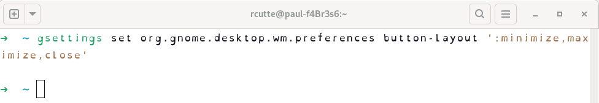
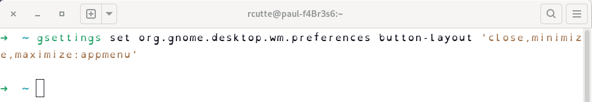
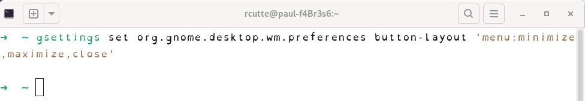

# Gnome Customization

## Gnome Window

### Gnome Window buttons



Whith this command you can change the position of the window buttons.

```bash
gsettings set org.gnome.desktop.wm.preferences button-layout '<layout>'
```

- `:` is the separator
  - at the end is the right side of the window
  - at the beginning is the left side of the window

Options:
- `appmenu` is the menu button of the window
- `close` is the close button
- `minimize` is the minimize button
- `maximize` is the maximize button
- `menu` is the menu button/icon of the window
  - it is not necessary to add it to the list
  - Example: `menu: close,minimize,maximize:`

<details>
<summary>More Layout examples</summary>

- `close,minimize,maximize:appmenu` is the left button with the appmenu button at right
  
- `menu:minimize,maximize,close` is the menu button at left and the buttons at right
  

</details>

## Gnome Theme

Install the `gnome-tweaks` package to change the theme if it is not installed.

```bash
sudo apt install gnome-tweaks
```

#### [Dracula Theme](https://draculatheme.com/gtk)


🔗 [Dracula Theme - Official Setup](https://draculatheme.com/gtk)

🔗 [Github - Dracula Theme](https://github.com/dracula/gtk)

