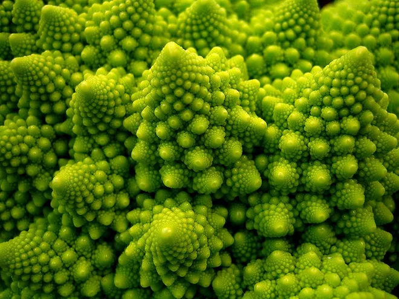
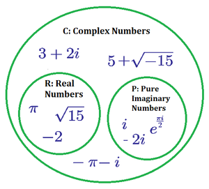

# Fract-ol

The term fractal was first used by mathematician Benoit Mandelbrot in 1974. 

He based it on the Latin word fractus which means "broken" or "fractured".

A fractal is an abstract mathematical object, like a curve or a surface, which pattern
remains the same at every scale.

Various natural phenomena – like the romanesco cabbage – have some fractal features.

⏯️ [**FRACTALES**](https://youtu.be/wUlVFYJIUNA)

## Requirements

- Use the school graphical library: the `MiniLibX`
  - Includes basic necessary tools to open a window, create images
and deal with keyboard and mouse events
- Use the mathematical notion of **complex numbers**, to take a peek at the concept of **optimization** in computer graphics and practice **event handling**

## Julia and Mandelbrot Sets

:1234: [Live Preview + Explanation](https://www.dynamicmath.xyz/mandelbrot-julia/)

➿ [Explanation with great creation a fractal step by step ⬆️ ⬆️](https://www.karlsims.com/julia.html)

Julia and Mandelbrot sets: $\ Z_{n + 1} = Z_n + c$

$\ Z = a + bi$ where **a** and **b** => are x and y axis.

$\ Z$ is repeatedly updated using:  $\ Z = Z^2 + c$  where $\ c$ is another complex number that gives a specific Julia set.

After numerous iterations, if the **magnitude** of $\ Z$ is less than **2** we say that pixel is in the Julia set and color it accordingly. Performing this calculation for a whole grid of pixels gives a fractal image.

### Math

#### Complexe Number

🔗 [Details](https://brilliant.org/wiki/complex-numbers/)

A complex number is a number that can be written in the form $\ a+bi$, where **a** and **b** are **real numbers** and **i** is the **imaginary unit** defined by $\ i^2=−1 $.

The set of complex numbers, denoted by $\mathbb{C}$ , includes the set of real numbers $\mathbb{R}$ and the set of pure imaginary numbers.

Based on the nature of the real part and imaginary part, any complex number can be classified into four types:

- imaginary number
- zero complex number
- purely imaginary number
- purely real number.

For $\ Z=a+ib$, the following four cases arise:

1. If $\ a = 0$ and $\ b \neq 0$, then $\ Z$ is an imaginary number.
2. If $\ a = 0$ and $\ b = 0$, then $\ Z$ is a zero complex number.
3. If $\ a \neq 0$ and $\ b = 0$, then $\ Z$ is a purely real number.
4. If $\ a \neq 0$ and $\ b \neq 0$, then $\ Z$ is a complex number.

**Every real number is a complex number, but every complex number is not necessarily a real number.**

The set of all complex numbers is denoted by $\ Z ∈ \mathbb{C} $. The set of all imaginary numbers is denoted as $\ Z ∈ \mathbb{C−R} $.

## Others

Math in markdown = Latex Syntax
