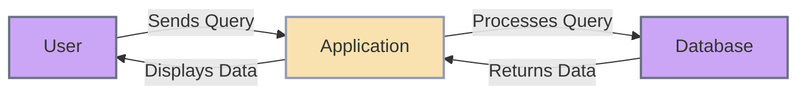

# Querying

## [What is querying?](https://www.techtarget.com/searchdatamanagement/definition/query)

Querying is a way to ask a question to the database. The database will return the data that matches the question.

Quierying can be done in different ways, depending on the database and the language used to interact with it.



## AJAX

AJAX stands for Asynchronous JavaScript and XML. It is a set of web development techniques that allows web pages to be updated asynchronously by exchanging data with a web server behind the scenes. This means that it is possible to update parts of a web page without reloading the entire page.

## JQUERY

jQuery is a fast, small, and feature-rich JavaScript library. It makes things like HTML document traversal and manipulation, event handling, and animation much simpler with an easy-to-use API that works across a multitude of browsers. With a combination of versatility and extensibility, jQuery has changed the way that millions of people write JavaScript.

Here is an example of how to use jQuery to make an AJAX request:

```javascript
$.ajax({
  url: 'https://api.example.com/data',
  method: 'GET',
  success: function(data) {
    console.log(data);
  },
  error: function(xhr, status, error) {
    console.error(error);
  }
});
```

### How to use jQuery

To use jQuery in your project, you can include it from a CDN or download it and include it in your project.

#### CDN

```html
<script src="https://code.jquery.com/jquery-3.6.0.min.js"></script>
```

#### Download

You can download jQuery from the [official website](https://jquery.com/download/).
