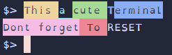

# Ascii Art

## Usefull websites

- 🔗 [Ascii Drawing](https://asciiflow.com/#/)

## Unicode

- 🔗 [List of Unicodes](https://symbl.cc/en/unicode/table/)

### Box Drawing

- :toolbox: [Unicode list for Bow Drawing](https://symbl.cc/en/unicode/blocks/box-drawing/)

| Character | Description |
| --------- | ----------- |
| `─`       | Horizontal  |
| `│`       | Vertical    |
| `┌`       | Top left corner |
| `┐`       | Top right corner |
| `└`       | Bottom left corner |
| `┘`       | Bottom right corner |
| `├`       | Left "T" |
| `┤`       | Right "T" |
| `┬`       | Top "T" |
| `┴`       | Bottom "T" |
| `┼`       | Cross |
| `╭`       | Top left curved corner |
| `╮`       | Top right curved corner |
| `╯`       | Bottom right curved corner |
| `╰`       | Bottom left curved corner |
| `╔`       | Top left double corner |
| `╚`       | Bottom left double corner |
| `═`       | Double horizontal |
| `║`       | Double vertical |
| `╗`       | Top right double corner |
| `╝`       | Bottom right double corner |

## ANSI Escape Codes



<details>
  <summary>ANSI Escape Codes - In C/C++</summary>

In C language: 
- [Download this header](https://raw.githubusercontent.com/Tablerase/42_Projects/main/Notes/color.h)
- Include it in your project with `#include "color.h"`

```c
#include "path/to/color.h"
```
Usage:

```c
printf("%sHello World%s\n", RED, RESET);
```

Example (above picture):

```cpp
std::cout
    << YELB << "This " << RESET << UCYN << "a " << RESET 
    << GRNB << "cute " << RESET << BBLU << "T" << RESET << BLUB <<  "erminal\n"
    << MAGB << "Dont forget" << REDB << " To " << RESET << "RESET\n";
```

</details>

<details>
  <summary>ANSI Escape Codes - In Python</summary>

In a Python Function:

```python
def get_color(color_symbol: str) -> str:
  """
  Find ANSI color from a Specified symbol

  :param color_symbol: Symbol corresponding a wanted ANSI color code
  :type color_symbol: str

  :return ANSI code: String code to enable terminal color,
  returns an empty str if symbol code not found
  """
  colors = {
    "BLK": "\033[0;30m",
    "RED": "\033[0;31m",
    "GRN": "\033[0;32m",
    "YEL": "\033[0;33m",
    "BLU": "\033[0;34m",
    "MAG": "\033[0;35m",
    "CYN": "\033[0;36m",
    "WHT": "\033[0;37m",
    "BBLK": "\033[1;30m",
    "BRED": "\033[1;31m",
    "BGRN": "\033[1;32m",
    "BYEL": "\033[1;33m",
    "BBLU": "\033[1;34m",
    "BMAG": "\033[1;35m",
    "BCYN": "\033[1;36m",
    "BWHT": "\033[1;37m",
    "UBLK": "\033[4;30m",
    "URED": "\033[4;31m",
    "UGRN": "\033[4;32m",
    "UYEL": "\033[4;33m",
    "UBLU": "\033[4;34m",
    "UMAG": "\033[4;35m",
    "UCYN": "\033[4;36m",
    "UWHT": "\033[4;37m",
    "BLKB": "\033[40m",
    "REDB": "\033[41m",
    "GRNB": "\033[42m",
    "YELB": "\033[43m",
    "BLUB": "\033[44m",
    "MAGB": "\033[45m",
    "CYNB": "\033[46m",
    "WHTB": "\033[47m",
    "GRAYB": "\033[100m",
    "BLKHB": "\033[0;100m",
    "REDHB": "\033[0;101m",
    "GRNHB": "\033[0;102m",
    "YELHB": "\033[0;103m",
    "BLUHB": "\033[0;104m",
    "MAGHB": "\033[0;105m",
    "CYNHB": "\033[0;106m",
    "WHTHB": "\033[0;107m",
    "HBLK": "\033[0;90m",
    "HRED": "\033[0;91m",
    "HGRN": "\033[0;92m",
    "HYEL": "\033[0;93m",
    "HBLU": "\033[0;94m",
    "HMAG": "\033[0;95m",
    "HCYN": "\033[0;96m",
    "HWHT": "\033[0;97m",
    "BHBLK": "\033[1;90m",
    "BHRED": "\033[1;91m",
    "BHGRN": "\033[1;92m",
    "BHYEL": "\033[1;93m",
    "BHBLU": "\033[1;94m",
    "BHMAG": "\033[1;95m",
    "BHCYN": "\033[1;96m",
    "BHWHT": "\033[1;97m",
    "RESET": "\033[0m"
  }
  return colors.get(color_symbol, "")
```

</details>


The format is `\033[<attribute>;<foreground>;<background>m`.

The `<attribute>` can be `0` for reset, `1` for bold, `4` for underline, `7` for inverse, `8` for concealed, and `9` for strikethrough.

| Style         | Code     | Visual Representation |
| ------------- | -------- | --------------------- |
| Bold          | `1`      | <span style="font-weight: bold;">Bold</span> |
| Faint         | `2`      | <span style="opacity: 0.5;">Faint</span> |
| Italic        | `3`      | <span style="font-style: italic;">Italic</span> |
| Underlined    | `4`      | <span style="text-decoration: underline;">Underlined</span> |
| Inverse       | `7`      | <span style="background-color: black; color: white;">Inverse</span> |
| Strikethrough | `9`      | <span style="text-decoration: line-through;">Strikethrough</span> |

The `<foreground>` color codes are from `30` to `37` for standard colors, and `90` to `97` for bright colors.

| Color         | Standard Code | Bright Code | Visual Representation |
| ------------- | ------------- | ----------- | --------------------- |
| Black         | `30`          | `90`        | <span style="color: #000000;">Black</span> / <span style="color: #808080;">Bright Black</span> |
| Red           | `31`          | `91`        | <span style="color: #800000;">Red</span> / <span style="color: #ff0000;">Bright Red</span> |
| Green         | `32`          | `92`        | <span style="color: #008000;">Green</span> / <span style="color: #00ff00;">Bright Green</span> |
| Yellow        | `33`          | `93`        | <span style="color: #808000;">Yellow</span> / <span style="color: #ffff00;">Bright Yellow</span> |
| Blue          | `34`          | `94`        | <span style="color: #000080;">Blue</span> / <span style="color: #0000ff;">Bright Blue</span> |
| Magenta       | `35`          | `95`        | <span style="color: #800080;">Magenta</span> / <span style="color: #ff00ff;">Bright Magenta</span> |
| Cyan          | `36`          | `96`        | <span style="color: #008080;">Cyan</span> / <span style="color: #00ffff;">Bright Cyan</span> |
| White         | `37`          | `97`        | <span style="color: #c0c0c0;">White</span> / <span style="color: #ffffff;">Bright White</span> |

The `<background>` color codes are from `40` to `47` for standard colors, and `100` to `107` for bright colors.

| Color         | Standard Code | Bright Code | Visual Representation |
| ------------- | ------------- | ----------- | --------------------- |
| Black         | `40`          | `100`       | <span style="background-color: #000000; color: #ffffff;">Black</span> / <span style="background-color: #808080; color: #ffffff;">Bright Black</span> |
| Red           | `41`          | `101`       | <span style="background-color: #800000; color: #ffffff;">Red</span> / <span style="background-color: #ff0000; color: #ffffff;">Bright Red</span> |
| Green         | `42`          | `102`       | <span style="background-color: #008000; color: #ffffff;">Green</span> / <span style="background-color: #00ff00; color: #ffffff;">Bright Green</span> |
| Yellow        | `43`          | `103`       | <span style="background-color: #808000; color: #ffffff;">Yellow</span> / <span style="background-color: #ffff00; color: #ffffff;">Bright Yellow</span> |
| Blue          | `44`          | `104`       | <span style="background-color: #000080; color: #ffffff;">Blue</span> / <span style="background-color: #0000ff; color: #ffffff;">Bright Blue</span> |
| Magenta       | `45`          | `105`       | <span style="background-color: #800080; color: #ffffff;">Magenta</span> / <span style="background-color: #ff00ff; color: #ffffff;">Bright Magenta</span> |
| Cyan          | `46`          | `106`       | <span style="background-color: #008080; color: #ffffff;">Cyan</span> / <span style="background-color: #00ffff; color: #ffffff;">Bright Cyan</span> |
| White         | `47`          | `107`       | <span style="background-color: #c0c0c0; color: #ffffff;">White</span> / <span style="background-color: #ffffff; color: #000000;">Bright White</span> |

For example, to set the text color to bright purple (`95`) and the background to bright yellow (`103`), you can use the following code:

```makefile
PURPLE_B_YELLOW_BG = \033[1;95;103m
```

This will make the text bold and bright purple, and set the background to bright yellow. The `1` in the sequence `\033[1;95;103m` stands for bold, `95` stands for bright purple text color, and `103` stands for bright yellow background.

### 8 bit colors

Example:

```makefile
GREY = \033[38;5;240m
```

This will give you a grey color. The `38;5;240` is a 8-bit color code. **`38;5`** is the **prefix for 8-bit foreground color** and `240` is the color code for grey.
