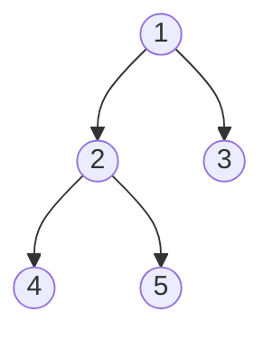
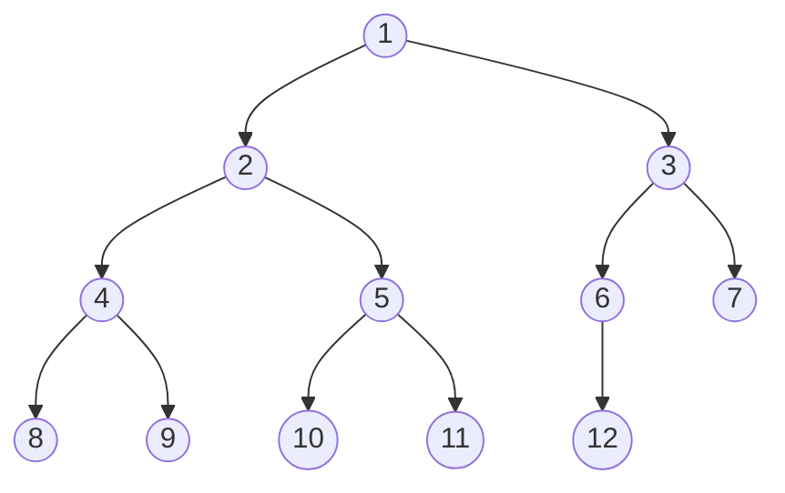
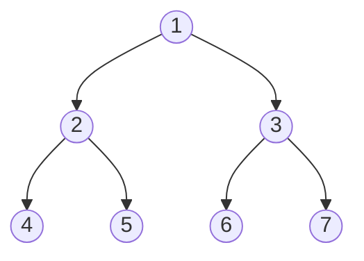
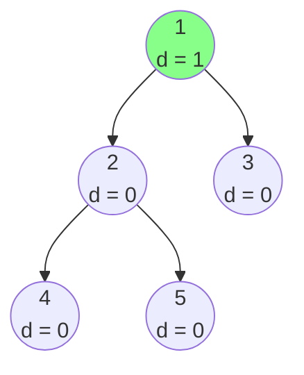
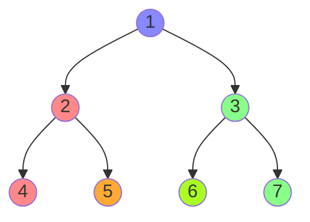
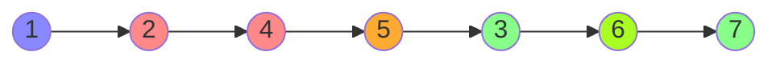
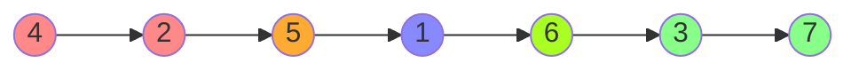
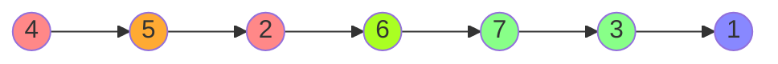

# Binary Tree

:deciduous_tree: [Binary Tree - Data Structure](https://www.programiz.com/dsa/trees)


## Definition

A binary tree is a tree data structure in which each node has at most two children, which are referred to as the left child and the right child.

## Properties

- The maximum number of nodes at level $\ l$ of a binary tree is $\ 2^l$.
- The maximum number of nodes in a binary tree of height $\ h$ is $\ 2^{h+1}-1$.
- In a binary tree with $\ n$ nodes, the minimum height or minimum depth is $\ \lceil \log_2(n+1) \rceil - 1$.
- In a binary tree with $\ n$ nodes, the maximum height or maximum depth is $\ n-1$.

## Terminologie

- **Root**: The top node in a tree.
- **Edge**: The link between two nodes.
- **Leaf**: A node with no children.
- **Height of a tree**: The height of a tree is the length of the longest path to a leaf.
- **Depth of a node**: The depth of a node is the number of edges from the root to the node.
- **Height of a node**: The height of a node is the number of edges on the longest path from the node to a leaf.
- **Degree of a node**: The degree of a node is the number of children of the node.
- **Forest**: A collection of disjoint trees.

## Types

- **Full Binary Tree**: A binary tree is full if every node has 0 or 2 children.



- **Complete Binary Tree**: A binary tree is complete if all levels are completely filled except possibly the last level and the last level has all keys as left as possible.



- **Perfect Binary Tree**: A binary tree is perfect if all internal nodes have two children and all leaves are at the same level.



- **Balanced Binary Tree**: A balanced binary tree, also referred to as a height-balanced binary tree, is defined as a binary tree in which the height of the left and right subtree of any node differ by not more than 1.

  - **Unbalanced Binary Tree**: An unbalanced binary tree is a binary tree in which the height of the left and right subtree of any node differ by more than 1.
  ```mermaid
  graph TD
    classDef diff1 fill:#8f8;
    classDef diff2 fill:#f88;
    1((1\nd = 2)):::diff2
    2((2\nd = 1)):::diff1
    3((3\nd = 0))
    4((4\nd = 0))
    5((5\nd = 1)):::diff1
    6((6\nd = 0))
    1 --> 2
    1 --> 3
    2 --> 4
    2 --> 5
    5 --> 6
  ```

d = depth of the node:
  - $ d = |height(left) - height(right)| $


## Traversal

🌳[Tree Traversal - Techniques](https://www.geeksforgeeks.org/tree-traversals-inorder-preorder-and-postorder/)



- **Preorder**: Root, Left, Right



<details>
<summary>Example in C</summary>

```c
// C program for different tree traversals
#include <stdio.h>
#include <stdlib.h>

// A binary tree node has data, pointer to left child
// and a pointer to right child
struct node {
	int data;
	struct node* left;
	struct node* right;
};

// Helper function that allocates a new node with the
// given data and NULL left and right pointers.
struct node* newNode(int data)
{
	struct node* node
		= (struct node*)malloc(sizeof(struct node));
	node->data = data;
	node->left = NULL;
	node->right = NULL;

	return (node);
}

// Given a binary tree, print its nodes in preorder
void printPreorder(struct node* node)
{
	if (node == NULL)
		return;

	// First print data of node
	printf("%d ", node->data);

	// Then recur on left subtree
	printPreorder(node->left);

	// Now recur on right subtree
	printPreorder(node->right);
}

// Driver code
int main()
{
	struct node* root = newNode(1);
	root->left = newNode(2);
	root->right = newNode(3);
	root->left->left = newNode(4);
	root->left->right = newNode(5);

	// Function call
	printf("Preorder traversal of binary tree is \n");
	printPreorder(root);

	getchar();
	return 0;
}

```

Output:
```shell
Preorder traversal of binary tree is
1 2 4 5 3
```

</details>

- **Inorder**: Left, Root, Right



<details>
<summary>Example in C</summary>

```c
// C program for different tree traversals
#include <stdio.h>
#include <stdlib.h>

// A binary tree node has data, pointer to left child
// and a pointer to right child
struct node {
	int data;
	struct node* left;
	struct node* right;
};

// Helper function that allocates a new node with the
// given data and NULL left and right pointers.
struct node* newNode(int data)
{
	struct node* node
		= (struct node*)malloc(sizeof(struct node));
	node->data = data;
	node->left = NULL;
	node->right = NULL;

	return (node);
}

// Given a binary tree, print its nodes in inorder
void printInorder(struct node* node)
{
	if (node == NULL)
		return;

	// First recur on left child
	printInorder(node->left);

	// Then print the data of node
	printf("%d ", node->data);

	// Now recur on right child
	printInorder(node->right);
}

// Driver code
int main()
{
	struct node* root = newNode(1);
	root->left = newNode(2);
	root->right = newNode(3);
	root->left->left = newNode(4);
	root->left->right = newNode(5);

	// Function call
	printf("Inorder traversal of binary tree is \n");
	printInorder(root);

	getchar();
	return 0;
}
```

Output:
```shell
Inorder traversal of binary tree is
4 2 5 1 3
```

</details>

- **Postorder**: Left, Right, Root



<details>
<summary>Example in C</summary>

```c
// C program for different tree traversals
#include <stdio.h>
#include <stdlib.h>

// A binary tree node has data, pointer to left child
// and a pointer to right child
struct node {
	int data;
	struct node* left;
	struct node* right;
};

// Helper function that allocates a new node with the
// given data and NULL left and right pointers.
struct node* newNode(int data)
{
	struct node* node
		= (struct node*)malloc(sizeof(struct node));
	node->data = data;
	node->left = NULL;
	node->right = NULL;

	return (node);
}

// Given a binary tree, print its nodes according to the
// "bottom-up" postorder traversal.
void printPostorder(struct node* node)
{
	if (node == NULL)
		return;

	// First recur on left subtree
	printPostorder(node->left);

	// Then recur on right subtree
	printPostorder(node->right);

	// Now deal with the node
	printf("%d ", node->data);
}

// Driver code
int main()
{
	struct node* root = newNode(1);
	root->left = newNode(2);
	root->right = newNode(3);
	root->left->left = newNode(4);
	root->left->right = newNode(5);

	// Function call
	printf("Postorder traversal of binary tree is \n");
	printPostorder(root);

	getchar();
	return 0;
}
```

Output:
```shell
Postorder traversal of binary tree is
4 5 2 3 1
```
