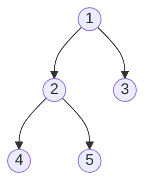
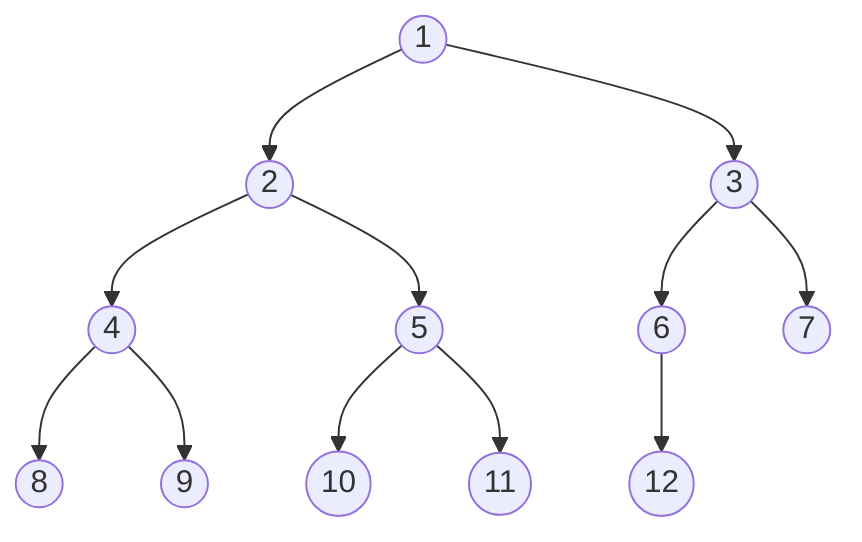
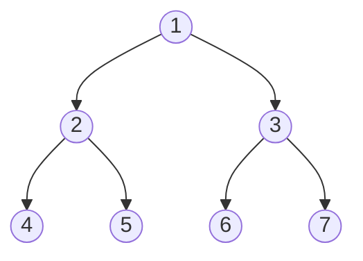
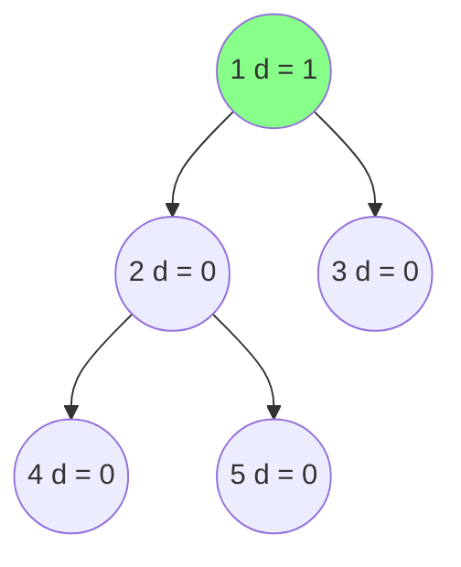
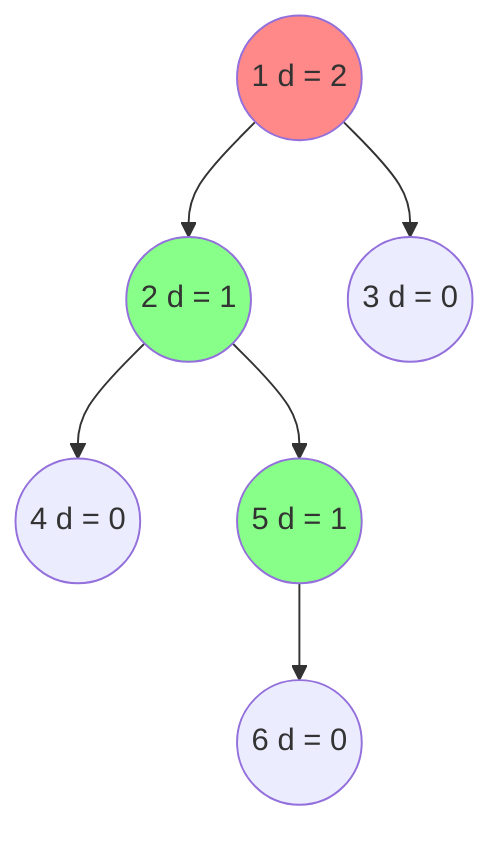

# Binary Tree

:deciduous_tree: [Binary Tree - Data Structure](https://www.programiz.com/dsa/trees)

## Definition

A binary tree is a tree data structure in which each node has at most two children, which are referred to as the left child and the right child.

## Properties

- The maximum number of nodes at level $\ l$ of a binary tree is $\ 2^l$.
- The maximum number of nodes in a binary tree of height $\ h$ is $\ 2^{h+1}-1$.
- In a binary tree with $\ n$ nodes, the minimum height or minimum depth is $\ \lceil \log_2(n+1) \rceil - 1$.
- In a binary tree with $\ n$ nodes, the maximum height or maximum depth is $\ n-1$.

## Terminologie

...

## Types

- **Full Binary Tree**: A binary tree is full if every node has 0 or 2 children.

- **Complete Binary Tree**: A binary tree is complete if all levels are completely filled except possibly the last level and the last level has all keys as left as possible.

- **Perfect Binary Tree**: A binary tree is perfect if all internal nodes have two children and all leaves are at the same level.

- **Balanced Binary Tree**: A balanced binary tree, also referred to as a height-balanced binary tree, is defined as a binary tree in which the height of the left and right subtree of any node differ by not more than 1.

- **Unbalanced Binary Tree**: An unbalanced binary tree is a binary tree in which the height of the left and right subtree of any node differ by more than 1.

d = depth of the node:
  - $ d = |height(left) - height(right)| $

## Traversal

- **Preorder**: Root, Left, Right
- **Inorder**: Left, Root, Right
- **Postorder**: Left, Right, Root
- **Level Order**: Breadth First Search
