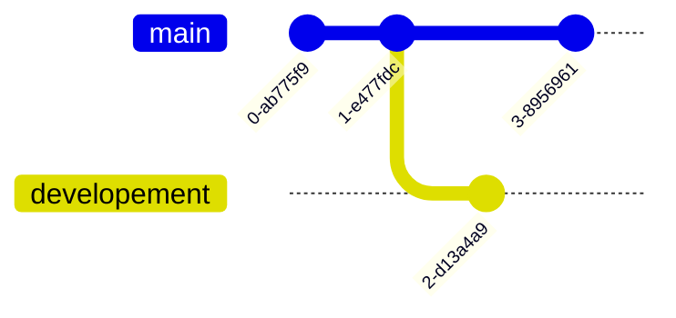

# Git

🎮 Interactive Web Tutorial : [Learn Git Branching](https://learngitbranching.js.org/?locale=en_EN)

⌨️ Command Line Game: [Githug](https://github.com/Gazler/githug)

🕸️ Game: [Oh My Git!](https://ohmygit.org/)

⏯️ [Git Fondamentaux - FR](https://www.youtube.com/watch?v=uA2WZCQP4EI)

## Git Project Workflow

A Git project has three parts:

-  A `Working Directory`: where files are created, edited, deleted, and organized
-  A `Staging Area`: where changes that are made to the working directory are listed
-  A `Repository`: where Git permanently stores changes as different versions of the project

The Git workflow consists of editing files in the working directory, adding files to the staging area, and saving changes to a Git repository.


## Init

Initialize a git repository with a `.git` folder:

```shell
git init
```

### Setup on a virtual private server

<details>
<summary>Step by step - guide</summary>

#### Create a new user

On your vps, create a new user to manage the git repository (avoid using the root user):

```shell
useradd git -m
```

#### Setup VPS ssh communication


##### Create a RSA key pair

On your local machine, create a RSA key pair to authenticate with the git server:

```shell
cd ~/.ssh
ssh-keygen -t rsa -C “mail@domain.com”
```

##### Add the public key to the server

On your local machine, add the public key to the server:

Secure Copy the RSA Public Key to the Server (VPS):
```shell
scp ~/.ssh/id_rsa.pub gituser@server_ip:./
```

Log into the VPS via SSH using your user and password, then add the public key to the authorized_keys file:

```shell
ssh gituser@server_ip
```

Create the `.ssh` folder and set the permissions:
  
```shell
mkdir ~/.ssh && touch ~/.ssh/authorized_keys
chmod 700 ~/.ssh && chmod 600 ~/.ssh/authorized_keys
```

(Append using command "cat" the contents of your rsa.pub file to the authorized_keys):

```shell
cat id_rsa.pub >> /home/gituser/.ssh/authorized_keys
```

#### Create a git repository

Create a new directory for the git repository:

```shell
mkdir /home/gituser/project.git
```

Initialize the git repository:

```shell
cd /home/gituser/project.git
git init --bare
```

- `--bare` : initialize a bare repository. A bare repository is a repository that does not have a working directory. 
  - It only contains the `.git` directory and its contents, which are used to store the history of the project.
  - Bare repositories are typically used to create a central repository that can be shared among multiple users.

#### Push to the repository

On your local machine, add the remote repository:

```shell
git remote add origin gituser@server_ip:/home/gituser/project.git
```

Push the local repository to the remote repository:

```shell
git push origin master
```

#### Clone the repository

On your local machine, clone the remote repository:

```shell
git clone gituser@server_ip:/home/gituser/project.git
```

#### Resources

- 🔗 [Setup a Git Repository in your VPS](https://intermarketing.merkados.com/setup-a-git-repository-in-your-vps)
- 🔗 [VPS guide - setup a git server on a vps](https://www.digitalocean.com/community/tutorials/how-to-set-up-a-private-git-server-on-a-vps)

</details>

## Status


## Mv

### Rename

Rename a file:

```shell
git mv file new_file
```

### Move

Move a file:

```shell
git mv file directory
```

Move multiple files:

```shell
git mv file1 file2 directory
```

```shell
git mv *.html directory
```

## Position

### HEAD

The `HEAD` is a reference to the last commit in the currently checked-out branch. It's essentially a pointer to the most recent commit, and it's used by Git to determine the current state of the repository.

### HEAD^

The `HEAD^` is a reference to the commit before the current `HEAD`. It's essentially a pointer to the parent of the current commit.

Example:

```shell
git show HEAD^
```

### HEAD~n

The `HEAD~n` is a reference to the nth commit before the current `HEAD`. It's essentially a pointer to the nth parent of the current commit.

Example:

```shell
git show HEAD~3
```

## Commit

Commit send the files from the staging area to the repository:

```shell
git commit -m "Message"
```

### Amend

Amend allow to modify a commit:

```shell
git commit --amend -m "Message"
```

### Future Date

Committing with a future date in Git is generally not recommended as it can lead to confusion and inconsistencies in your repository's history. However, if you still want to do it, you can use the `GIT_COMMITTER_DATE` and `GIT_AUTHOR_DATE` environment variables to set the date for a commit. Here's an example:

```shell
GIT_COMMITTER_DATE="2022-12-31 12:00:00" GIT_AUTHOR_DATE="2022-12-31 12:00:00" git commit -m "Future commit"
```

In this example, the commit will be dated "2022-12-31 12:00:00". Please replace the date and time with your desired future date and time. The date and time must be in the format "YYYY-MM-DD HH:MM:SS".

Remember, this can cause issues with your repository and is generally not a good practice. Use it with caution.

## Tag


Tags make it easier to navigate through the repository, allowing you to quickly jump to a specific point in your project's history. Unlike `branches`, which have history and contain changes, a tag is a static point in history.

The most common use for `tags` is to signify a specific release, or a point in history that should be preserved. For example, when you release a new version of your software, you might want to tag the commit that constitutes the `new release`. This way, even if you continue developing and adding new commits to the repository, you can always jump back to the point when you made the `release`.

### Create

Create a tag for a commit:

```shell
git tag tagname
```

### Annotated

An annotated tag is a tag that is associated with a message. This message can contain information about the tag, such as the reason for creating it, the release notes, or any other relevant information. Annotated tags are recommended for creating tags in Git because they provide more context and information about the tag.

To create an annotated tag, you can use the `-a` option with the `git tag` command, followed by the tag name and the `-m` option to provide a message for the tag. Here's an example:

```shell
git tag -a v1.0 -m "First version release"
```

<details>
<summary>Example</summary>

To create a tag for a commit in Git, you can use the `git tag` command followed by the `-a` option (which creates an annotated tag), the tag name, and the `-m` option to provide a message for the tag. Here's an example:

```shell
git tag -a v1.0 -m "First version release"
```

In this example, `v1.0` is the tag name and `"First version release"` is the message associated with the tag. This command will create a tag for the latest commit. If you want to tag a specific commit, you can specify the commit hash at the end of the command:

```shell
git tag -a v1.0 -m "First version release" commit_hash
```

Replace `commit_hash` with the hash of the commit you want to tag.

</details>

### Push

To push a tag to a remote repository in Git, you can use the `git push` command followed by the name of the remote (usually `origin`) and the name of the tag. Here's an example:

```shell
git push origin tagname
```

Replace `tagname` with the name of your tag.

If you want to push all tags to the remote repository, you can use the `--tags` option:

```shell
git push origin --tags
```

### Delete

Delete a tag:

```shell
git tag -d tag
```

Delete a tag from remote repository:

```shell
git push origin --delete tag
```

### List

List all tags:

```shell
git tag
```

## Fetch

The `git fetch` command is used to download commits, files, and refs from a remote repository into your local repo. Fetching is what you do when you want to see what everybody else has been working on. It's similar to `git pull`, but doesn't merge changes.

Here are some common uses of `git fetch`:

- `git fetch`: Fetches all branches from the remote repository.
- `git fetch <remote>`: Fetches all branches from the specified remote repository.
- `git fetch <remote> <branch>`: Fetches a specific branch from the remote repository.
- `git fetch --all`: Fetches all remotes.
- `git fetch --prune`: Fetches all remotes and also removes any remote tracking branches which no longer exist on the remote.

## Pull

The `git pull` command is used to fetch and download content from a remote repository and immediately update the local repository to match that content. It is essentially a combination of `git fetch` followed by `git merge`.

Here are some common uses of `git pull`:

- `git pull`: Fetches the branch's latest changes from the remote repository and merges them into the local checked-out branch.
- `git pull <repository> <branch>`: Fetches the specified branch from the repository and merges it into the current branch.
- `git pull --rebase`: Instead of merging, it rebases the current branch onto the fetched branch.
- `git pull --all`: Fetches all remotes and their branches.

## Rebase

The `git rebase` command is used to move or combine a sequence of commits to a new base commit. It's a way to integrate changes from one branch into another. 

Here are some common uses of `git rebase`:

- `git rebase <base>`: Rebase the current branch onto `<base>`. `<base>` can be a commit ID, branch name, a tag, or a relative reference to HEAD.
- `git rebase -i <base>` or `git rebase --interactive <base>`: This starts an interactive rebase session where you can alter individual commits in the current branch. This is often used to squash or remove specific commits.
- `git rebase --continue`: This continues the rebase process after resolving a merge conflict.
- `git rebase --abort`: This stops the rebase process and returns the branch to the state it was in before `git rebase` was called.

## Merge


The `git merge` command is used to combine changes from one branch into another. It's typically used to integrate a feature branch into the main branch.

Here are some common uses of `git merge`:

- `git merge <branch>`: Merges the specified branch into the current branch.
- `git merge --no-ff <branch>`: Merges the specified branch into the current branch, creating a new commit even if the merge could be performed with a fast-forward.
- `git merge --squash <branch>`: Merges the specified branch into the current branch, but does not create a new commit. Instead, it stages the changes, allowing you to commit them manually.

### Usage

1. First, switch to the branch that you want to merge into. This is usually the main or master branch:

```bash
git checkout main
```

2. Then, merge the other branch into the current branch:

```bash
git merge <branch-name>
```

Replace `<branch-name>` with the name of the branch that you want to merge.

This will create a new "merge commit" in the main branch that includes all of the changes from the `<branch-name>`.

If there are any conflicts between the branches, Git will give you a message and pause the merge. You can then go to the conflicting files, resolve the conflicts, and then continue the merge with `git add .` and `git commit`.

3. Remember to push your changes to the remote repository after merging:

```bash
git push origin main
```

## Reset

Reset allow to remove files from the staging area:

```shell
git reset HEAD file
```
or
```shell
git reset file
```

Reset allow to remove all files from the staging area:

```shell
git reset HEAD .
```

Reset allow to change the HEAD of the repository:

```shell
git reset commit
```

### Soft

A soft reset in Git is a way to undo commits while keeping the changes in the staging area (also known as the index). When you perform a soft reset, the HEAD pointer is moved to a previous commit, but the changes from the undone commits are kept in the staging area, ready to be committed again.

You can perform a soft reset with the `git reset --soft` command followed by the reference to the commit you want to reset to. For example, to undo the last commit while keeping the changes staged, you would use:

```shell
git reset --soft HEAD~1
```

In this command, `HEAD~1` refers to the commit before the current one. The changes from the undone commit will be kept in the staging area.

## Checkout



The `git checkout` command is used to switch between different versions of a target entity. The target can be a file, a commit, or a branch.

Here are some common uses of `git checkout`:

- `git checkout <branch>`: Switches to the specified branch and updates the working directory.
- `git checkout -b <new-branch>`: Creates a new branch and switches to it.
- `git checkout <commit>`: Switches the HEAD to point to the specified commit.
- `git checkout -- <file>`: Discards changes in the working directory for the specified file.
- `git checkout HEAD -- <file>`: Restores the specified file to the state of the last commit.

Checkout allow to change the branch:

```shell
git checkout branch
```

Restore all files in working area to last commit in HEAD :

```shell
git checkout HEAD -- .
```

Restore a file to last commit :

```shell
git checkout file
```

### Tag

Checkout to a flag:

```shell
git checkout flag
```

Checkout to a flag when there is a conflict (same name of branch and flag):

```shell
git checkout refs/tags/<tag_name>
```

### Branch

Create a new branch and switch to it:

```shell
git checkout -b branch
```

Create a new branch and switch to it from a specific commit:

```shell
git checkout -b branch commit
```

Create a new branch and switch to it from a specific position:

```shell
git checkout -b branch HEAD~1
```

## Ignore

Example of file `.gitignore`

```gitignore
# Program
program
program_bonus

# Files generated to ignore
*.a
*.o
*.so
*.out
*.txt

# Prevent send of git ignore into project
.gitignore

# miniLibX
/mlx/

# VSCode
.vscode/

# Test
/Test/
```

### Exclude

To ignore all except some files:

```gitignore
# Ignore all files
*
# Except
!file_to_keep
```

## Branch

The `git branch` command is used to manage branches in your repository. A branch represents an independent line of development in your project, and serves as a pointer to a specific commit.

Here are some common uses of `git branch`:

- `git branch`: Lists all local branches in the current repository.
- `git branch -a`: Lists all local and remote branches.
- `git branch <branch>`: Creates a new branch named `<branch>`.
- `git branch -d <branch>`: Deletes the specified branch. This is a safe operation because it prevents deletion of a branch that has unmerged changes.
- `git branch -D <branch>`: Force deletes the specified branch, even if it has unmerged changes.
- `git branch -m <oldname> <newname>`: Renames a branch from `<oldname>` to `<newname>`.

### Quick Create Branch

Create a new branch and switch to it:

```shell
git checkout -b branch
```

### Move a branch

The `git branch -f` command is used to forcefully move a branch pointer to another commit. This can be useful when you want to change where a branch is pointing without checking out the branch.

Here's an example of how to use it:

```shell
git branch -f <branch-name> <commit-hash>
```

Replace `<branch-name>` with the name of the branch that you want to move, and replace `<commit-hash>` with the hash of the commit that you want to move the branch to.

Please note that this command does not change the current HEAD or the contents of the working directory. It only changes the branch pointer. If you want to also update the working directory to match the new branch location, you will need to checkout the branch after moving it:

```shell
git checkout <branch-name>
```

Also, be careful when using `git branch -f`, as it can potentially lose commits if the branch is moved to an earlier commit in the history. Always make sure you have a backup or that the commits are reachable from another branch before using this command.

## Remote

The `git remote` command is used to manage the set of repositories ("remotes") whose branches you track. Here are some common uses of `git remote`:

- `git remote -v`: Lists all remote repositories and their URLs.
- `git remote add <name> <url>`: Adds a new remote repository with the specified name and URL.
- `git remote remove <name>`: Removes the remote repository with the specified name.
- `git remote rename <old-name> <new-name>`: Renames a remote repository from old-name to new-name.
- `git remote set-url <name> <new-url>`: Changes the URL of the remote repository.


## Stash

Stash is a temporary storage for changes to commit later. This is useful when you want to pull changes from remote repository while you have local changes that are not ready or worthy to commit.

Allow to save current work in a stash:

```shell
git stash
```

The stash can be retrieved with:

```shell
git stash pop
```

## Tree of Repository: ls-tree

List content of a branch:

```shell
git ls-tree main --name-only --full-tree
```

List content of a branch with subdirectory:

```shell
git ls-tree main --name-only --full-tree */*
```

## Diff

Show difference between two commits:

```shell
git diff commit1 commit2
```

## Blame

The `git blame` command is used to determine who made a particular change, or what changes were made in a particular commit. It shows what revision and author last modified each line of a file.

Here are some common uses of `git blame`:

- `git blame <file>`: Shows the revision, author and time for each line of the specified file.
- `git blame -L <start>,<end> <file>`: Shows the revision, author and time for each line of the specified range in the file.
- `git blame <revision> -- <file>`: Shows the revision, author and time for each line of the file at the specified revision.

## Log

Allow to see the history of commits:

```shell
git log
```

To see the history of commits with the different branches:

```shell
git log --all --decorate --oneline --graph
```
<details>
<summary>Example of output:</summary>

```shell
* 4d16b24 (HEAD -> rcutte, origin/rcutte) lexer order check to ensure no empty pipe or redir
*   f7ac5ca lexical primary analysis done
|\  
| * 1179283 (origin/main, origin/alex, origin/HEAD) Updating Makefile
| *   1117c9a Merge branch 'alex'
| |\  
| | * e455158 README.md
| | * 9a02e96 README.md
| | * 0c154c3 Creation of heredoc.c file which should create each heredoc and perform variable expansion only if there a certain type of quote
* | | b9a652b init lexer elements
|/ /  
* / 0b5a16b (main) change lexer position in master graph
|/  
* 5213f40 updating README.md
* 71087ec init of projects structure objects
* e5fadf7 update to readme
* 6d1ed79 add bonus folder
*   c06b3e2 Merge branch 'main' of github.com:Tablerase/MiniShell
|\  
| * a0159cd Creating new branch alex. New folders Sources and Sources/mandatory. New file main.c in Sources/mandatory folder. Testfor working with branches
* | 5a4558d update to minishell.h
* | 31ad720 init libft and header to be merge
|/  
* eaae7e8 add Makefile
* 2922490 Initial commit
```

</details>

### Show

Show the content of a commit:

```shell
git show commit
```

## Submodule

A Git submodule allows you to keep another Git repository in a subdirectory of your repository. This lets you clone another repository into your project and keep your commits separate.

Submodules are used when you want to include or embed another project within your own project while keeping the other project's codebase separate. This is useful when you want to include libraries or other projects and want to pull in updates from those projects as they happen, or control the exact version of the project that your repository uses.


### Add

Here's how you can add a submodule to your repository:

```bash
git submodule add <repository-url> <path/to/submodule>
```

Replace `<repository-url>` with the URL of the repository you want to include as a submodule.

This will clone the repository into a subdirectory of your current repository. You can then commit and push this change to your repository, and others who clone your repository should run `git submodule init` and `git submodule update` to also get the contents of the submodule.

### Clone

When you clone a repository that has submodules, you need to initialize and update the submodules to get their contents. You can do this with the following commands:

```bash
git submodule init
git submodule update
```

This will initialize the submodules and update them to the correct commit.

Using the `--recursive` flag when cloning a repository will automatically initialize and update the submodules:

```bash
git clone --recursive <repository-url>
```

or

```bash
git clone --recurse-submodules <repository-url>
```

## Config

### User

#### User Name and Email Configuration

Set the user name:

```shell
git config --global user.name "Name"
```

Set the user email:

```shell
git config --global user.email "
```

See the user name:

```shell
git config user.name
```

See the user email:

```shell
git config user.email
```

### Alias

Allow to create alias for git command:

Example:

```shell
git config --global alias.lg "log --all --decorate --oneline --graph"
```

```shell
git lg
```
