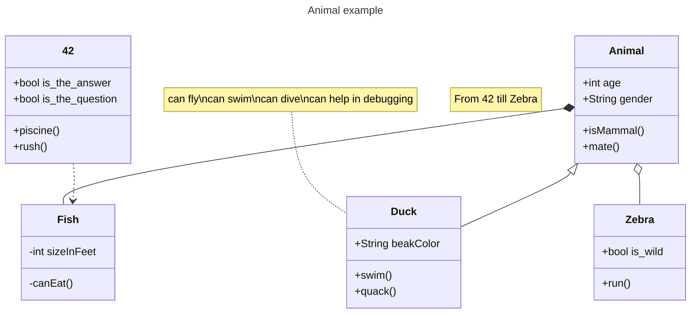
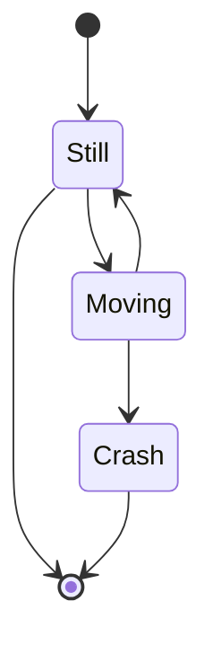
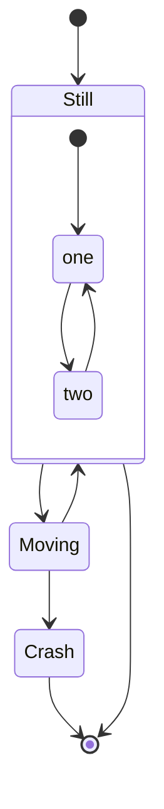
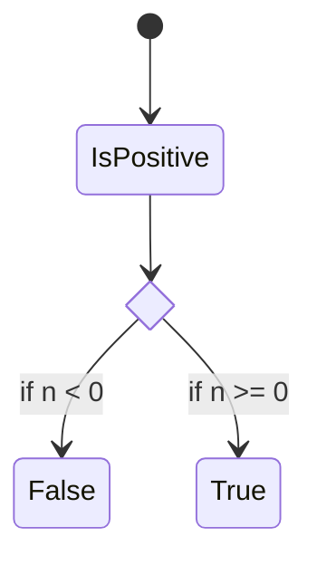
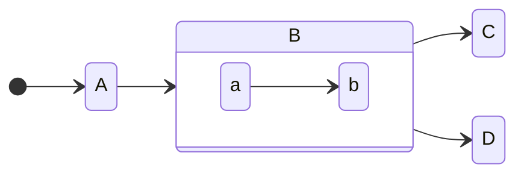
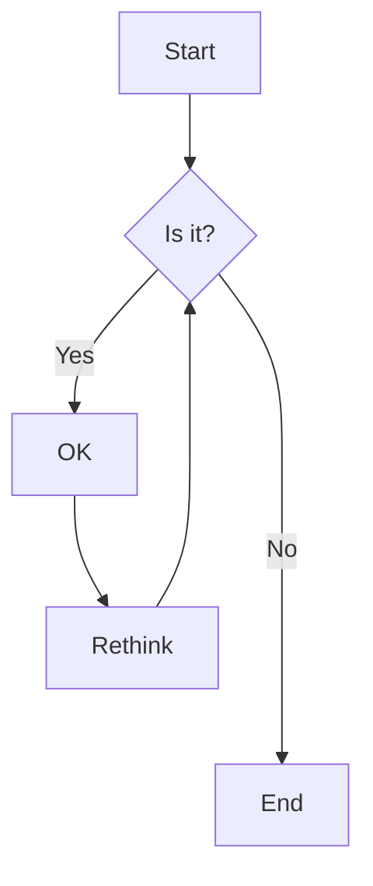
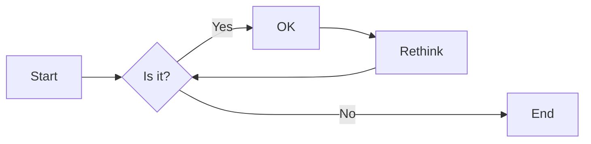
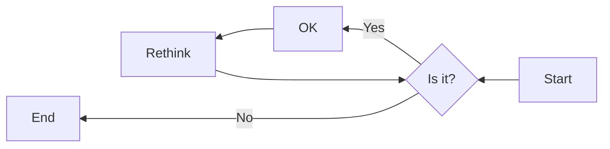
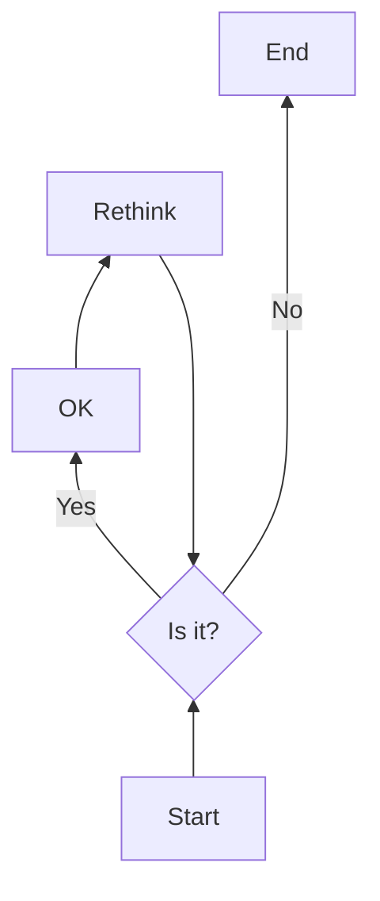

# Markdown Syntax

## Math

### [Latex](https://docs.github.com/en/get-started/writing-on-github/working-with-advanced-formatting/writing-mathematical-expressions)

Typesetting of complex mathematical formulas

Format:

- Inline: `$ a = bx $`: $ a = bx $
- Block:

  ```
  $$
  a = bx
  \\
  b = x^2
  \\
  x = \sqrt{b}
  $$
  ```

  $$
  a = bx
  \\
  b = x^2
  \\
  x = \sqrt{b}
  $$

  - also this should be working (not with integrated extension in vscode to preview markdown):

    ```math
    a = bx
    ```

## [Diagrams](https://docs.github.com/en/get-started/writing-on-github/working-with-advanced-formatting/creating-diagrams)

3 different syntaxes: mermaid, geoJSON and topoJSON, and ASCII STL.

### Mermaid

📚 [Mermaid Documentation](http://mermaid.js.org/intro/syntax-reference.html)

There are many different types of diagrams that can be created with mermaid. Here are some examples and demo : :link: [Mermaid Live Editor](https://mermaid-js.github.io/mermaid-live-editor/)

#### [Class Diagram](http://mermaid.js.org/syntax/classDiagram.html)

In software engineering, a class diagram in the Unified Modeling Language (UML) is a type of static structure diagram that describes the structure of a system by showing the system's classes, their attributes, operations (or methods), and the relationships among objects.



<details>
<summary>Code for class diagram</summary>

````

````
</details>

#### [State Diagram](http://mermaid.js.org/syntax/stateDiagram.html)

Diagram used in computer science and related fields to describe the behavior of systems. State diagrams require that the system described is composed of a finite number of states; sometimes, this is indeed the case, while at other times this is a reasonable abstraction



<details>
<summary> Details </summary>

##### Different Types

Check out the [documentation](http://mermaid.js.org/syntax/stateDiagram.html#state-diagram) for more details.

Below are some examples:

###### Standard

<details>
<summary>Code for standard state diagram</summary>

````

````
</details>

###### [Composite State Diagram](http://mermaid.js.org/syntax/stateDiagram.html#composite-state-diagram)



<details>
<summary>Code for composite state diagram</summary>

````

````
</details>

###### [Choice State Diagram](http://mermaid.js.org/syntax/stateDiagram.html#choice-state-diagram)


<details>
<summary>Code for choice state diagram</summary>

````

````
</details>

##### Directions



<details>
<summary>Code for direction state diagram</summary>

````

````

</details>

</details>

#### [Flowchart](http://mermaid.js.org/syntax/flowchart.html)

##### Different Styles

###### Standard

<details>
<summary>code for standard flowchart</summary>

````

````
</details>


###### [Orientation](http://mermaid.js.org/syntax/flowchart.html#orientation)

<details>
<summary>Orientation flowchart</summary>









</details>

<details>
<summary>Code for orientation flowchart</summary>

````


````
</details>

###### [Grouping of nodes](http://mermaid.js.org/syntax/flowchart.html#grouping-of-nodes)

<details>
<summary>Code for group flowchart</summary>

````
```mermaid
flowchart TD
    A[Start] --> B{Is it?}
    B -->|Yes| C[OK]
    C --> D[Rethink]
    D --> B
    B ---->|No| E[End]
    F[Start] -->|Yes| G{Is it?}
    G -->|Yes| H[OK]
    H --> I[Rethink]
    I --> G
    G ---->|No| E[End]
```
````

</details>

```mermaid
flowchart TD
    A[Start] --> B{Is it?}
    B -->|Yes| C[OK]
    C --> D[Rethink]
    D --> B
    B ---->|No| E[End]
    F[Start] -->|Yes| G{Is it?}
    G -->|Yes| H[OK]
    H --> I[Rethink]
    I --> G
    G ---->|No| E[End]
```

#### [Git Graph](http://mermaid.js.org/syntax/gitgraph.html)

```mermaid
    gitGraph LR:
       commit id: "ZERO"
       branch develop
       commit id:"A"
       checkout main
       commit id:"ONE"
       checkout develop
       commit id:"B"
       checkout main
       commit id:"TWO"
       cherry-pick id:"A"
       commit id:"THREE"
       checkout develop
       commit id:"C"
```

<details>
<summary> More details </summary>

More custom options in the documentation: [Git Graph](http://mermaid.js.org/syntax/gitgraph.html)

##### Orientation

```mermaid
    gitGraph TB:
       commit
       commit
       branch develop
       commit
       commit
       checkout main
       commit
       commit
       merge develop
       commit
       commit
```

<details>
<summary>Code for orientation git graph</summary>

````
```mermaid
    gitGraph TB:
       commit
       commit
       branch develop
       commit
       commit
       checkout main
       commit
       commit
       merge develop
       commit
       commit
```
````
</details>

</details>

#### Mindmap

<details>
<summary>Code mindmap</summary>

````
```mermaid
mindmap
  root((mindmap))
    Origins
      Long history
      Popularisation
        British popular psychology author Tony Buzan
    Research
      On effectiveness<br/>and features
      On Automatic creation
        Uses
            Creative techniques
            Strategic planning
            Argument mapping
    Tools
      Pen and paper
      Mermaid
```
````

</details>

```mermaid
mindmap
  root((mindmap))
    Origins
      Long history
      Popularisation
        British popular psychology author Tony Buzan
    Research
      On effectiveness<br/>and features
      On Automatic creation
        Uses
            Creative techniques
            Strategic planning
            Argument mapping
    Tools
      Pen and paper
      Mermaid
```

#### [Timeline](http://mermaid.js.org/syntax/timeline.html)

```mermaid
timeline
    title History of Social Media Platform
    2002 : LinkedIn
    2004 : Facebook
         : Google
    2005 : Youtube
    2006 : Twitter
```

<details>
<summary> More details </summary>

##### Different Styles

###### Standard

<details>
<summary>Code for standard timeline</summary>

````
```mermaid
timeline
    title History of Social Media Platform
    2002 : LinkedIn
    2004 : Facebook
         : Google
    2005 : Youtube
    2006 : Twitter
```
````

</details>


###### [Grouping of section/time periods](http://mermaid.js.org/syntax/timeline.html#grouping-of-time-periods-in-sections-ages)

<details>
<summary>Code for group timeline</summary>

````
```mermaid
timeline
    title Timeline of Industrial Revolution
    section 17th-20th century
        Industry 1.0 : Machinery, Water power, Steam <br>power
        Industry 2.0 : Electricity, Internal combustion engine, Mass production
        Industry 3.0 : Electronics, Computers, Automation
    section 21st century
        Industry 4.0 : Internet, Robotics, Internet of Things
        Industry 5.0 : Artificial intelligence, Big data,3D printing
```
````
</details>

```mermaid
timeline
    title Timeline of Industrial Revolution
    section 17th-20th century
        Industry 1.0 : Machinery, Water power, Steam <br>power
        Industry 2.0 : Electricity, Internal combustion engine, Mass production
        Industry 3.0 : Electronics, Computers, Automation
    section 21st century
        Industry 4.0 : Internet, Robotics, Internet of Things
        Industry 5.0 : Artificial intelligence, Big data,3D printing
```

##### Color Theme

###### Base Theme

<details>
<summary>Code for base theme timeline</summary>

````
```mermaid
%%{init: { 'logLevel': 'debug', 'theme': 'base' } }%%
    timeline
        title History of Social Media Platform
          2002 : LinkedIn
          2004 : Facebook : Google
          2005 : Youtube
          2006 : Twitter
          2007 : Tumblr
          2008 : Instagram
          2010 : Pinterest
```
````

</details>

```mermaid
%%{init: { 'logLevel': 'debug', 'theme': 'base' } }%%
    timeline
        title History of Social Media Platform
          2002 : LinkedIn
          2004 : Facebook : Google
          2005 : Youtube
          2006 : Twitter
          2007 : Tumblr
          2008 : Instagram
          2010 : Pinterest
```

###### [Custom Theme](http://mermaid.js.org/syntax/timeline.html#customizing-color-scheme)

<details>
<summary>Code for custom theme timeline</summary>

````
```mermaid
    %%{init: { 'logLevel': 'debug', 'theme': 'default' , 'themeVariables': {
              'cScale0': '#ff0000', 'cScaleLabel0': '#ffffff',
              'cScale1': '#00ff00',
              'cScale2': '#0000ff', 'cScaleLabel2': '#ffffff'
       } } }%%
       timeline
        title History of Social Media Platform
          2002 : LinkedIn
          2004 : Facebook : Google
          2005 : Youtube
          2006 : Twitter
          2007 : Tumblr
          2008 : Instagram
          2010 : Pinterest
```
````

</details>

```mermaid
%%{init: { 'logLevel': 'debug', 'theme': 'default' , 'themeVariables': {
          'cScale0': '#ff0000', 'cScaleLabel0': '#ffffff',
          'cScale1': '#00ff00',
          'cScale2': '#0000ff', 'cScaleLabel2': '#ffffff'
    } } }%%
    timeline
    title History of Social Media Platform
      2002 : LinkedIn
      2004 : Facebook : Google
      2005 : Youtube
      2006 : Twitter
      2007 : Tumblr
      2008 : Instagram
      2010 : Pinterest
```

</details>

#### [Sankey](http://mermaid.js.org/syntax/sankeyDiagram.html)

Visual flow of amount of data

```mermaid
---
config:
  sankey:
    showValues: true
---
sankey-beta

%% source,target,value
42 School, Sleep, 8
42 School, Code, 10
42 School, Eat, 2
42 School, Transport, 2
42 School, Brain, 20
```

<details>
<summary>Code for sankey</summary>

````
```mermaid
---
config:
  sankey:
    showValues: true
---
sankey-beta

%% source,target,value
42 School, Sleep, 8
42 School, Code, 10
42 School, Eat, 2
42 School, Transport, 2
42 School, Brain, 20
```
````

</details>

#### [Gantt](http://mermaid.js.org/syntax/gantt.html)

Illustrates a project schedule and the amount of time it would take for any one project to finish. Gantt charts illustrate number of days between the start and finish dates of the terminal elements and summary elements of a project.

```mermaid
gantt
    dateFormat  YYYY-MM-DD
    title       Adding GANTT diagram functionality to mermaid
    excludes    weekends
    %% (`excludes` accepts specific dates in YYYY-MM-DD format, days of the week ("sunday") or "weekends", but not the word "weekdays".)

    section A section
    Completed task            :done,    des1, 2014-01-06,2014-01-08
    Active task               :active,  des2, 2014-01-09, 3d
    Future task               :         des3, after des2, 5d
    Future task2              :         des4, after des3, 5d

    section Critical tasks
    Completed task in the critical line :crit, done, 2014-01-06,24h
    Implement parser and jison          :crit, done, after des1, 2d
    Create tests for parser             :crit, active, 3d
    Future task in critical line        :crit, 5d
    Create tests for renderer           :2d
    Add to mermaid                      :1d
    Functionality added                 :milestone, 2014-01-25, 0d

    section Documentation
    Describe gantt syntax               :active, a1, after des1, 3d
    Add gantt diagram to demo page      :after a1  , 20h
    Add another diagram to demo page    :doc1, after a1  , 48h

    section Last section
    Describe gantt syntax               :after doc1, 3d
    Add gantt diagram to demo page      :20h
    Add another diagram to demo page    :48h
```

<details>
<summary>Code for gantt</summary>

````
```mermaid
gantt
    dateFormat  YYYY-MM-DD
    title       Adding GANTT diagram functionality to mermaid
    excludes    weekends
    %% (`excludes` accepts specific dates in YYYY-MM-DD format, days of the week ("sunday") or "weekends", but not the word "weekdays".)

    section A section
    Completed task            :done,    des1, 2014-01-06,2014-01-08
    Active task               :active,  des2, 2014-01-09, 3d
    Future task               :         des3, after des2, 5d
    Future task2              :         des4, after des3, 5d

    section Critical tasks
    Completed task in the critical line :crit, done, 2014-01-06,24h
    Implement parser and jison          :crit, done, after des1, 2d
    Create tests for parser             :crit, active, 3d
    Future task in critical line        :crit, 5d
    Create tests for renderer           :2d
    Add to mermaid                      :1d
    Functionality added                 :milestone, 2014-01-25, 0d

    section Documentation
    Describe gantt syntax               :active, a1, after des1, 3d
    Add gantt diagram to demo page      :after a1  , 20h
    Add another diagram to demo page    :doc1, after a1  , 48h

    section Last section
    Describe gantt syntax               :after doc1, 3d
    Add gantt diagram to demo page      :20h
    Add another diagram to demo page    :48h
```
````
</details>

#### [Quadrant Diagram](http://mermaid.js.org/syntax/quadrantDiagram.html)

```mermaid
quadrantChart
    title Reach and engagement of campaigns
    x-axis Low Reach --> High Reach
    y-axis Low Engagement --> High Engagement
    quadrant-1 We should expand
    quadrant-2 Need to promote
    quadrant-3 Re-evaluate
    quadrant-4 May be improved
    Campaign A: [0.3, 0.6]
    Campaign B: [0.45, 0.23]
    Campaign C: [0.57, 0.69]
    Campaign D: [0.78, 0.34]
    Campaign E: [0.40, 0.34]
    Campaign F: [0.35, 0.78]
```

<details>
<summary>Code for quadrant diagram</summary>

````
```mermaid
quadrantChart
    title Reach and engagement of campaigns
    x-axis Low Reach --> High Reach
    y-axis Low Engagement --> High Engagement
    quadrant-1 We should expand
    quadrant-2 Need to promote
    quadrant-3 Re-evaluate
    quadrant-4 May be improved
    Campaign A: [0.3, 0.6]
    Campaign B: [0.45, 0.23]
    Campaign C: [0.57, 0.69]
    Campaign D: [0.78, 0.34]
    Campaign E: [0.40, 0.34]
    Campaign F: [0.35, 0.78]
```
````
</details>
