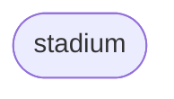

# Mermaid Syntax

## Flowchart

### Node Shapes (v11)

<table>
  <thead>
    <td colspan="4" style="text-align: center;"><a href="https://mermaid.js.org/syntax/flowchart.html#node-shapes">Mermaid Node Shapes</a></td>
  </thead>
  <tr>
    <td>


</td>
    <td>


</td>
<td>


</td>
<td>


</td>

  </tr>
  <tr>
    <td>



</td>
    <td>


</td>
<td>


</td>
<td>


</td>

  </tr>
  <tr>
    <td>


</td>
    <td>


</td>
<td>


</td>
<td>


</td>

  </tr>
  <tr>
    <td>


</td>
    <td>


</td>
<td>


</td>
<td>


</td>

  </tr>
  <tr>
    <td>


</td>
    <td>


</td>
<td>


</td>
<td>


</td>

  </tr>
  <tr>
    <td>

```mermaid
graph TD;
    A@{shape: hourglass, label: "hourglass"}
```

</td>
    <td>

```mermaid
graph TD;
    A@{shape: comment, label: "comment"}
```

</td>
<td>

```mermaid
graph TD;
    A@{shape: brace-r, label: "brace-r"}
```

</td>
<td>

```mermaid
graph TD;
    A@{shape: braces, label: "braces"}
```

</td>

  </tr>
  <tr>
    <td>

```mermaid
graph TD;
    A@{shape: bolt, label: "bolt"}
```

</td>
    <td>

```mermaid
graph TD;
    A@{shape: doc, label: "doc"}
```

</td>
<td>

```mermaid
graph TD;
    A@{shape: delay, label: "delay"}
```

</td>
<td>

```mermaid
graph TD;
    A@{shape: das, label: "das"}
```

</td>

  </tr>
  <tr>
    <td>

```mermaid
graph TD;
    A@{shape: lin-cyl, label: "lin-cyl"}
```

</td>
    <td>

```mermaid
graph TD;
    A@{shape: curv-trap, label: "curv-trap"}
```

</td>
<td>

```mermaid
graph TD;
    A@{shape: div-rect, label: "div-rect"}
```

</td>
<td>

```mermaid
graph TD;
    A@{shape: tri, label: "tri"}
```

</td>

  </tr>
  <tr>
    <td>

```mermaid
graph TD;
    A@{shape: win-pane, label: "win-pane"}
```

</td>
    <td>

```mermaid
graph TD;
    A@{shape: f-circ, label: "f-circ"}
```

</td>
<td>

```mermaid
graph TD;
    A@{shape: lin-doc, label: "lin-doc"}
```

</td>
<td>

```mermaid
graph TD;
    A@{shape: notch-pent, label: "notch-pent"}
```

</td>

  </tr>
  <tr>
    <td>

```mermaid
graph TD;
    A@{shape: flip-tri, label: "flip-tri"}
```

</td>
    <td>

```mermaid
graph TD;
    A@{shape: sl-rect, label: "sl-rect"}
```

</td>
<td>

```mermaid
graph TD;
    A@{shape: docs, label: "docs"}
```

</td>
<td>

```mermaid
graph TD;
    A@{shape: processes, label: "processes"}
```

</td>

  </tr>
  <tr>
    <td>

```mermaid
graph TD;
    A@{shape: flag, label: "flag"}
```

</td>
    <td>

```mermaid
graph TD;
    A@{shape: bow-rect, label: "bow-rect"}
```

</td>
<td>

```mermaid
graph TD;
    A@{shape: cross-circ, label: "cross-circ"}
```

</td>
<td>

```mermaid
graph TD;
    A@{shape: tag-doc, label: "tag-doc"}
```

</td>

  </tr>
  <tr>
    <td>

```mermaid
graph TD;
    A@{shape: tag-rect, label: "tag-rect"}
```

</td>

<td>

```mermaid
graph LR;
    A@{shape: anchor, label: "anchor"}
    A --> B[anchor]
```

</td>

<td colspan="2">
</td>

  </tr>
</table>

---

<table>
  <thead>
    <tr>
      <th colspan="2">Shape with interaction</th>
    </tr>
    <tr>
      <th>Description</th>
      <th>Code</th>
    </tr>
  </thead>
  <tbody>
    <tr>
      <td>
Link:

<table>
  <tr>
    <td rowspan="3">click</td>
    <td>node name</td>
    <td>mode</td>
    <td>source</td>
    <td>comment</td>
    <td>target</td>
  </tr>
  <tr>
    <td> <code>A</code></td>
    <td> <code>href</code></td>
    <td> <code>example.com</code></td>
    <td> <code>Open a link</code></td>
    <td>
      <code>_blank</code><br>
      <code>_self</code><br>
      <code>_parent</code><br>
      <code>_top</code>
  </td>
  <tr>
    <td> <code>A</code></td>
    <td> <code>call</code></td>
    <td> <code>functionName()</code></td>
    <td> <code>Call a function</code></td>
  </tr>
</table>

</td>
<td>

```mermaid
graph TD;
    A@{shape: rect, label: "rect"}

    click A href "https://mermaid.js.org/syntax/flowchart.html#node-shapes" "Open doc about rect" _blank
```

</td>

  </tbody>
</table>

---

<link rel="stylesheet" href="https://cdnjs.cloudflare.com/ajax/libs/font-awesome/7.0.0/css/all.min.css" integrity="sha512-DxV+EoADOkOygM4IR9yXP8Sb2qwgidEmeqAEmDKIOfPRQZOWbXCzLC6vjbZyy0vPisbH2SyW27+ddLVCN+OMzQ==" crossorigin="anonymous" referrerpolicy="no-referrer" />

<link
  href="https://cdnjs.cloudflare.com/ajax/libs/font-awesome/6.5.1/css/all.min.css"
  rel="stylesheet"
/>

<table>
  <thead>
    <tr>
      <th colspan="4">Special Shapes</th>
    </tr>
  </thead>
  <tbody>
    <tr>
      <td colspan="4" style="text-align: center;"><strong>Icons</strong></td>
    </tr>
    <tr>
      <td>

```mermaid
graph TD;
    A@{shape: icon, icon: "mdi:account", form: rounded, label: "Account", pos: t}
```

</td>
      <td>

```mermaid
graph TD;
    A@{icon: "mdi:cog", form: circle, label: "Settings", h: 200, pos: b}
```

</td>
      <td>

```mermaid
graph TD;
    A@{icon: "mdi:home", form: square, label: "default minHeight 48"}
```

</td>
      <td>

```mermaid
graph TD;
    A@{shape: icon, icon: "mdi:email"}
```

</td>
    </tr>
    <tr>
      <td colspan="4" style="text-align: center;"><a href="https://mermaid.js.org/syntax/flowchart.html#image-shape" target="_blank"><strong>Images</strong></a></td>
    </tr>
    <tr>
      <td>

```mermaid
graph TD;
    A@{img: "https://static.mermaidchart.dev/whiteboard/default-image-shape.svg", h: 200, w: 200, pos: "b"}
```

</td>
      <td>

```mermaid
graph TD;
    A@{img: "https://www.svgrepo.com/show/514351/polaroid.svg", label: "Url to image", h: 200, w: 200}
```

</td>
            <td>

```mermaid
graph TD;
    A@{img: "../Media/3D render of a penguin with colorful background + 42 Number in white, Social Preview.png", w: 50, h: 100, label: "Local image", pos: t}
```

</td>

<td>

```mermaid
graph TD;
    A@{img: "data:image/svg+xml;base64,PHN2ZyB4bWxucz0iaHR0cDovL3d3dy53My5vcmcvMjAwMC9zdmciIHdpZHRoPSIyNCIgaGVpZ2h0PSIyNCIgdmlld0JveD0iMCAwIDI0IDI0Ij48cGF0aCBmaWxsPSJjdXJyZW50Q29sb3IiIGQ9Ik0xMiw0YTgsOCwwLDAsMSw3Ljg5LDYuN0ExLjUzLDEuNTMsMCwwLDAsMjEuMzgsMTJoMGExLjUsMS41LDAsMCwwLDEuNDgtMS43NSwxMSwxMSwwLDAsMC0yMS43MiwwQTEuNSwxLjUsMCwwLDAsMi42MiwxMmgwYTEuNTMsMS41MywwLDAsMCwxLjQ5LTEuM0E4LDgsMCwwLDEsMTIsNFoiPjxhbmltYXRlVHJhbnNmb3JtIGF0dHJpYnV0ZU5hbWU9InRyYW5zZm9ybSIgZHVyPSIwLjc1cyIgcmVwZWF0Q291bnQ9ImluZGVmaW5pdGUiIHR5cGU9InJvdGF0ZSIgdmFsdWVzPSIwIDEyIDEyOzM2MCAxMiAxMiIvPjwvcGF0aD48L3N2Zz4=", h: 150, contraint: on, label: "svg data"}
```

</td>

</tr>
    <tr>
      <td colspan="4" style="text-align: center;"><strong>Icon Libraries</strong></td>
    </tr>
    <tr>
      <td>Font Awesome: <code>fa:fa-name</code></td>
      <td>Material Design Icons: <code>mdi:name</code></td>
      <td>Bootstrap Icons: <code>bi:name</code></td>
      <td> More...</td>
    </tr>
  </tbody>
</table>
