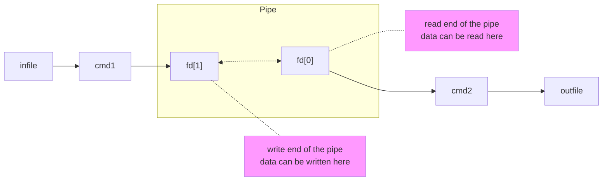

# Pipex

| Item | Description |
| --- | --- |
| Program name | **pipex** |
| Turn in files | `Makefile`, `*.h`, `*.c` |
| Makefile | `NAME`, `all`, `clean`, `fclean`, `re` |
| Arguments | `file1` `cmd1` `cmd2` `file2` |
| External functs. | - open, close, read, write, malloc, free, perror, strerror, access, dup, dup2, execve, exit, fork, pipe, unlink, wait, waitpid
||-  `ft_printf` and any equivalent you coded|
| Libft authorized | Yes |
| Description | This project is about handling pipes. |

Your program will be executed as follows:

```shell
./pipex file1 cmd1 cmd2 file2
```

It must take 4 arguments:
- `file1` and `file2` are file names.
- `cmd1` and `cmd2` are shell commands with their parameters.

It must behave exactly the same as the shell command below:

```shell
$> < file1 cmd1 | cmd2 > file2
```

Example:

```shell
$> ./pipex infile "ls -l" "wc -l" outfile
```

Should behave like: `< infile ls -l | wc -l > outfile`
  
```shell
$> ./pipex infile "grep a1" "wc -w" outfile
```

Should behave like: `< infile grep a1 | wc -w > outfile`

## Code

...

## Ressources

- 📖 [Article Pipex](https://csnotes.medium.com/pipex-tutorial-42-project-4469f5dd5901)

## Notions

### Functions

- `perror`: Prints a descriptive error message to stderr.
- `strerror`: Returns a pointer to a string that describes the error code passed.
- `access`: Checks whether the calling process can access the file pathname.
- `dup`: Creates a copy of the file descriptor oldfd.
- `dup2`: Makes newfd be the copy of oldfd, closing newfd first if necessary.
- `execve`: Replaces the current process image with a new process image.
- `exit`: Causes normal process termination.
- `fork`: Creates a new process by duplicating the existing process.
- `pipe`: Creates a pipe, a unidirectional data channel for interprocess communication.
- `unlink`: Deletes a name from the filesystem.
- `wait`: Makes the calling process wait until one of its child processes exits.
- `waitpid`: Waits for the process specified by pid to terminate.

```c
#include <stdio.h>
#include <string.h>
#include <unistd.h>
#include <sys/types.h>
#include <sys/wait.h>

void perror(const char *s);

char *strerror(int errnum);

int access(const char *pathname, int mode);

int dup(int oldfd);

int dup2(int oldfd, int newfd);

int execve(const char *filename, char *const argv[], char *const envp[]);

void exit(int status);

pid_t fork(void);

int pipe(int pipefd[2]);

int unlink(const char *pathname);

pid_t wait(int *status);

pid_t waitpid(pid_t pid, int *status, int options);
```
### PID

PID stands for **Process IDentifier**. 

In the context of operating systems like Unix, Linux, or Windows, a PID is a **unique number** that is **assigned to each process** when it is started. This number is used by the operating system to manage and track processes. 

For example, when you want to terminate a process, you would use its PID to specify which process to terminate.

## Understanding

