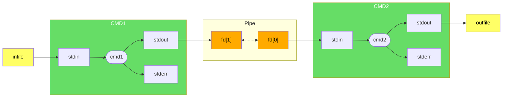
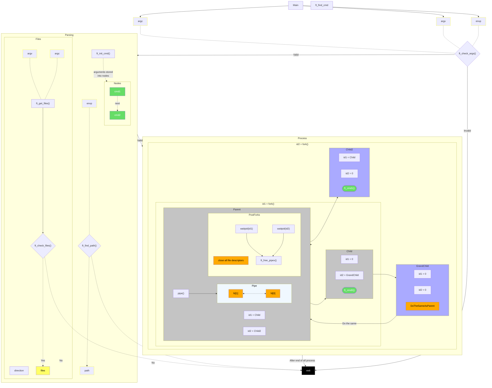
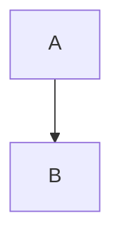
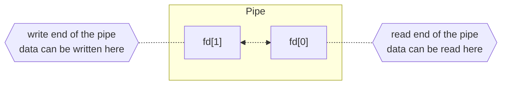
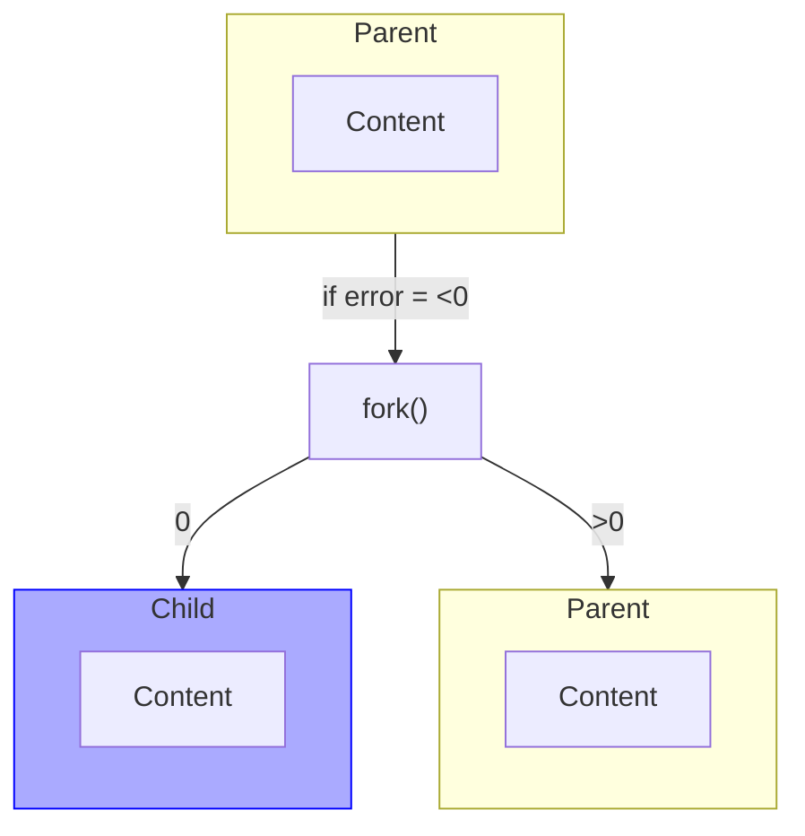
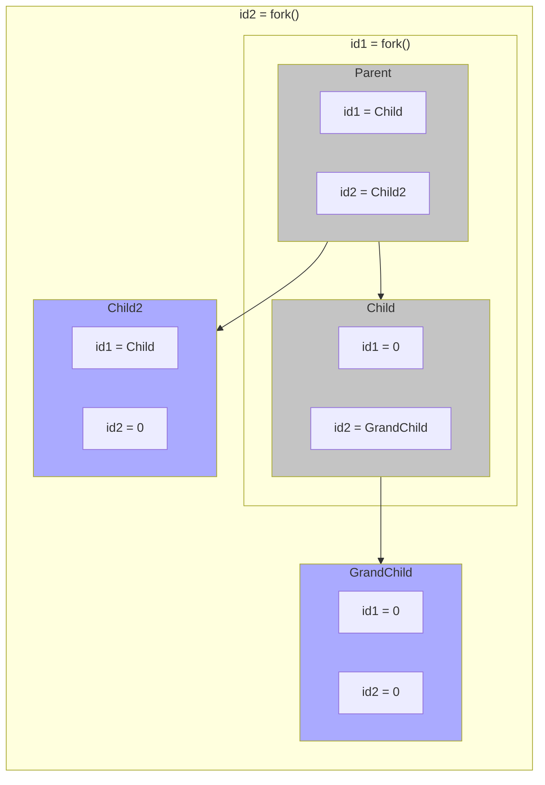
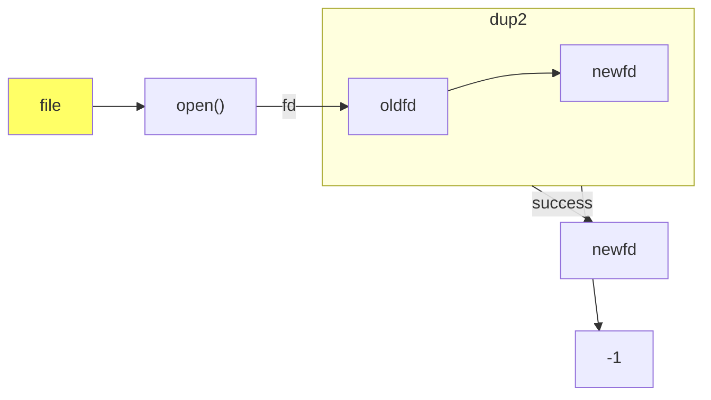
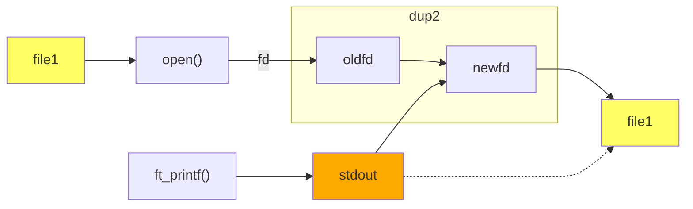
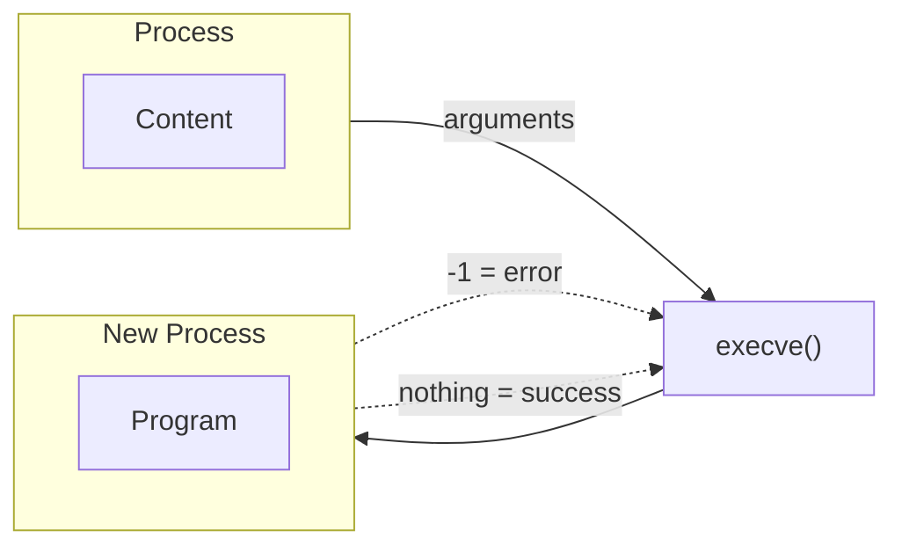
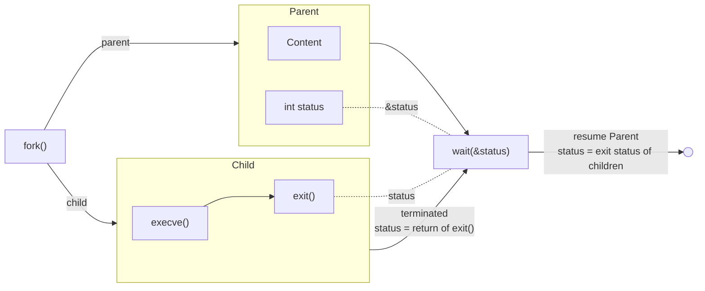

# Pipex

| Item | Description |
| --- | --- |
| Program name | **pipex** |
| Turn in files | `Makefile`, `*.h`, `*.c` |
| Makefile | `NAME`, `all`, `clean`, `fclean`, `re` |
| Arguments | `file1` `cmd1` `cmd2` `file2` |
| External functs. | - open, close, read, write, malloc, free, perror, strerror, access, dup, dup2, execve, exit, fork, pipe, unlink, wait, waitpid
||-  `ft_printf` and any equivalent you coded|
| Libft authorized | Yes |
| Description | This project is about handling pipes. |

Your program will be executed as follows:

```shell
./pipex file1 cmd1 cmd2 file2
```

It must take 4 arguments:
- `file1` and `file2` are file names.
- `cmd1` and `cmd2` are shell commands with their parameters.

It must behave exactly the same as the shell command below:

```shell
$> < file1 cmd1 | cmd2 > file2
```

Example:

```shell
$> ./pipex infile "ls -l" "wc -l" outfile
```

Should behave like: `< infile ls -l | wc -l > outfile`
  
```shell
$> ./pipex infile "grep a1" "wc -w" outfile
```

Should behave like: `< infile grep a1 | wc -w > outfile`

## Code

### Overview

#### Simplify


#### Mandatory



#### Bonus



### Structures

## Test and Debug

### Testeur
  
- 🔧 [Testeur](https://github.com/vfurmane/pipex-tester)

### Valgrind

```shell
valgrind --leak-check=full --show-leak-kinds=all --track-origins=yes --trace-children=yes --track-fds=yes --track-origins=yes ./pipex infile "grep a1" "wc -w" outfile
```

To display leak in a file:

```shell
--callgrind-out-file=callgrind.out
```

## Useful Ressources

- ⏯️ [Unix Process in C](https://www.youtube.com/playlist?list=PLfqABt5AS4FkW5mOn2Tn9ZZLLDwA3kZUY)

- 📖 [Article Pipex](https://csnotes.medium.com/pipex-tutorial-42-project-4469f5dd5901)

- 📑 [Pipeline](https://www.mbillaud.fr/notes/pipeline.html)
- 📑 [Pipes notion with visual representation](http://www.zeitoun.net/articles/communication-par-tuyau/start)
- 📑 [wait-waitpid](https://www.geeksforgeeks.org/wait-system-call-c/) and [man-wait-waitpid](http://manpagesfr.free.fr/man/man2/wait.2.html)

## 📚 Notions

### Functions

- `perror`: Prints a descriptive error message to stderr.
- `strerror`: Returns a pointer to a string that describes the error code passed.
- `exit`: Causes normal process termination.
- [`dup`](#dup): Creates a copy of the file descriptor oldfd.
- [`dup2`](#dup): Makes newfd be the copy of oldfd, closing newfd first if necessary.
- [`fork`](#fork): Creates a new process by duplicating the existing process.
- [`pipe`](#pipe): Creates a pipe, a unidirectional data channel for interprocess communication.
- [`access`](#access): Checks whether the calling process can access the file pathname.
- [`execve`](#execve): Replaces the current process image with a new process image.
- [`unlink`](#unlink): Deletes a name from the filesystem.
- [`wait`](#waitwaitpid): Makes the calling process wait until one of its child processes exits.
- [`waitpid`](#waitwaitpid): Waits for the process specified by pid to terminate.

```c
#include <stdio.h>
#include <string.h>
#include <unistd.h>
#include <sys/types.h>
#include <sys/wait.h>

void perror(const char *s);

char *strerror(int errnum);

int access(const char *pathname, int mode);

int dup(int oldfd);

int dup2(int oldfd, int newfd);

int execve(const char *filename, char *const argv[], char *const envp[]);

void exit(int status);

pid_t fork(void);

int pipe(int pipefd[2]);

int unlink(const char *pathname);

pid_t wait(int *status);

pid_t waitpid(pid_t pid, int *status, int options);
```
### PID

PID stands for **Process IDentifier**. 

In the context of operating systems like Unix, Linux, or Windows, a PID is a **unique number** that is **assigned to each process** when it is started. This number is used by the operating system to manage and track processes. 

For example, when you want to terminate a process, you would use its PID to specify which process to terminate.

## Understanding

### Pipe



On linux, you can check your fds currently open with the command `ls -la /proc/$$/fd` ( 0, 1 and 2 are by default assigned to stdin, stdout and stderr).

Parent and child sharing a pipe

When we use fork in any process, file descriptors remain open across child process and also parent process. If we call **fork after creating a pipe**, then the **parent and child can communicate via the pipe**.

<details>
<summary> Example </summary>

```c
#include <stdio.h>
#include <unistd.h>
#include <sys/types.h>
#include <string.h>

int main() 
{
   int fd[2];
   char str[] = "Hello, World!";
   char buffer[50];
   pid_t pid;

   if (pipe(fd) == -1) {
       fprintf(stderr,"Pipe failed");
       return 1;
   }

   pid = fork();

   if (pid < 0) {
       fprintf(stderr, "Fork failed");
       return 1;
   }

   if (pid > 0) { // Parent process
       // Close the unused end of the pipe
       close(fd[0]);

       // Write to the pipe
       write(fd[1], str, sizeof(str));

       // Close the write end of the pipe
       close(fd[1]);
   } else { // Child process
       // Close the unused end of the pipe
       close(fd[1]);

       // Read from the pipe
       read(fd[0], buffer, sizeof(buffer));

       // Close the read end of the pipe
       close(fd[0]);

       printf("Received string: %s\n", buffer);
   }

   return 0;
}
```

```shell
$> ./a.out
Received string: Hello, World!
```
</details>

### Fork



Fork system call is used for **creating a new process** in Linux, and Unix systems, which is called the child process, which **runs concurrently** with the process that makes the fork() call (parent process). After a new child process is created, **both processes will execute the next instruction following the fork() system call**.

Below are different values returned by fork() :
- **Negative Value**: The creation of a child process was **unsuccessful**.
- **0**: *Returned to* the newly created ***child** process*.
- **Positive value**: *Returned to **parent*** or caller. The value contains the **process ID** of the newly created child process.

Total Number of Processes = $2^n$, where $n$ is the number of fork system calls.
  - Exemple: $\ n = 3$ $\Rightarrow$ $2^3 = 8$ processes
    <details>
      <summary> Demo </summary>

      ```c
      #include <stdio.h>
      #include <sys/types.h>
      #include <unistd.h>
      int main()
      {
        fork();
        fork();
        fork();
        printf("hello\n");
        return 0;
      }
      ```

      ```shell
      hello
      hello
      hello
      hello
      hello
      hello
      hello
      hello
      ```
    </details>

Without wait() system call, the order of execution of the processes is **not guaranteed**. It is totally dependent upon the **scheduling algorithm** of the OS.

Both processes (parent and child) **have their own address space**. Child process is an exact copy of the parent process. Child process has **same program counter** as of parent process. Memory space of the child process is a **duplicate** of the parent process.

#### Multiple Fork

In case of multiple fork() system calls, the child process created by the first fork() system call, becomes the parent process for next fork() system call and so on.

Example with 2 fork() system calls:



### Dup

The **dup()** system call creates a copy of a file descriptor.

- It uses the lowest-numbered unused descriptor for the new descriptor.
- If the copy is successfully created, then the original and copy file descriptors may be used interchangeably.
- They both refer to the same open file description and thus share file offset and file status flags.

```c
/**
 * @param oldfd old file descriptor whose copy is to be created.
 * @return new file descriptor on success, -1 on error.
 */
int dup(int oldfd);
```

The **dup2()** system call is similar to **dup()** but the basic difference between them is that instead of using the lowest-numbered unused file descriptor, it **uses the descriptor number specified** by the user.

```c
/**
 * @param oldfd old file descriptor whose copy is to be created.
 * @param newfd new file descriptor to be used.
 * @return new file descriptor on success, -1 on error.
 */
int dup2(int oldfd, int newfd);
```

- If the descriptor `newfd` was previously open, it is silently closed before being reused.
- If `oldfd` is not a valid file descriptor, then the call fails, and `newfd` is not closed.
- If `oldfd` is a valid file descriptor, and `newfd` has the same value as `oldfd`, then `dup2()` does nothing, and returns `newfd`.

A tricky use of dup2() system call: As in dup2(), in place of newfd any file descriptor can be put. (for example, 0, 1, 2 for stdin, stdout, stderr respectively). So, if we want to **redirect the output of a program to a file**, we can use dup2() to redirect the output of the program to the file. Or the **output of a program can be redirected to another program** using dup2().



In this example the printf output is stdout, and stdout is link to file1 with dup2(). So printf will write inside file1. 
<details>
  <summary> Demo </summary>

  ```c
  #include <stdio.h>
  #include <unistd.h>
  #include <fcntl.h>

  int main()
  {
    int fd = open("file1", O_WRONLY | O_CREAT | O_TRUNC, 0644);
    dup2(fd, 1);
    close(fd);
    printf("hello\n");
    return 0;
  }
  ```
  ```shell
  $> ./a.out
  $> cat file1
  hello
  ```
</details>



### Access

The **access()** system call checks whether the calling process can access the file pathname. If pathname is a symbolic link, it is dereferenced.

```c
/**
 * @param pathname path to the file to be checked.
 * @param mode mode to be checked.
 * @return 0 on success, -1 on error.
 */
int access(const char *pathname, int mode);
```

<details>
  <summary> Example </summary>

  ```c
  #include <stdio.h>
  #include <unistd.h>
  #include <errno.h>
  #include <sys/types.h>
  #include <sys/stat.h>
  #include <fcntl.h>

  extern int errno;

  int main(int argc, const char *argv[]) {
      int fd = access("sample.txt", F_OK);
      if (fd == -1) {
          printf("Error Number: %d\n", errno);
          perror("Error Description:");
      } else {
          printf("No error\n");
      }
      return 0;
  }
  ```

  ```shell
  $> ./a.out
  Error Number: 2
  Error Description:: No such file or directory
  ```

  Note: `perror()` is used to print the error and `errno` is used to print the error code.

  Note:
  - In C programming, `extern` is a keyword that is used to declare a variable or function which is defined in another file or in other scope. It tells the compiler that the variable or function exists, even if the compiler hasn't yet seen its definition during the compiling process.

  - Here are a few key points about `extern`:

    - It is used to access the global variables from different files. These variables are declared in one file and can be used in other files using `extern`.
    - It can also be used to declare a function that is implemented in another file.
</details>

#### Mode

<table>
  <thead>
    <tr>
      <th>Flag</th>
      <th>Description</th>
    </tr>
   </thead>
   <tr>
      <td>F_OK</td>
      <td>Used to check for the existence of file.</td>
   </tr>
   <tr>
      <td>R_OK</td>
      <td>Used to check for read permission bit.</td>
   </tr>
   <tr>
      <td>W_OK</td>
      <td>Used to check for write permission bit.</td>
   </tr>
   <tr>
      <td>X_OK</td>
      <td>Used to check for execute permission bit.</td>
   </tr>
</table>

#### Error List

<table>
 <thead>
   <tr>
       <th>Error</th>
       <th>Description</th>
   </tr>
 </thead>
 <tbody>
  <tr>
    <td>EACCES</td>
    <td>The requested access would be denied to the file, or search permission is denied for one of the directories in the path prefix of pathname. (See also path_resolution(7).)</td>
  </tr>
  <tr>
      <td>ELOOP</td>
      <td>Too many symbolic links were encountered in resolving pathname.</td>
  </tr>
  <tr>
      <td>ENAMETOOLONG</td>
      <td>pathname is too long.</td>
  </tr>
  <tr>
      <td>ENOENT</td>
      <td>A component of pathname does not exist or is a dangling symbolic link.</td>
  </tr>
  <tr>
      <td>ENOTDIR</td>
      <td>A component used as a directory in pathname is not, in fact, a directory.</td>
  </tr>
  <tr>
      <td>EROFS</td>
      <td>Write permission was requested for a file on a read-only file system.</td>
  </tr>
  <tr>
      <td>EFAULT</td>
      <td>pathname points outside your accessible address space.</td>
  </tr>
  <tr>
      <td>EINVAL</td>
      <td>mode was incorrectly specified.</td>
  </tr>
  <tr>
      <td>EIO</td>
      <td>An I/O error occurred.</td>
  </tr>
  <tr>
      <td>ENOMEM</td>
      <td>Insufficient kernel memory was available.</td>
  </tr>
  <tr>
      <td>ETXTBSY</td>
      <td>Write access was requested to an executable which is being executed.</td>
  </tr>
 </tbody>
</table>


### Execve

The **`execve()`** system call is used to execute a binary executable or a script. It replaces the current process image with a new process image.

The argument vector and environment can be accessed by the new program's main function, when it is defined as:
```c
int main(int argc, char *argv[], char *envp[])
```
`envp` represents the environment variables (PATH, OS, ...).

`envp` is an array of pointers to strings, each of which is of the form `name=value`. The array of pointers must be terminated by a NULL pointer.

```c
/**
 * @param filename path to the executable file.
 * @param argv array of arguments passed to the executable.
 * @note The last element of argv must be NULL.
 * @param envp array of environment variables.
 * @note The last element of envp must be NULL.
 * @return -1 on error, nothing on success.
 */
int execve(const char *filename, char *const argv[], char *const envp[]);
```

<details>
<summary> Example </summary>

```c
#include <stdio.h>
#include <unistd.h>

int	main(int argc, char **argv, char **envp)
{
	(void)argc;
	(void)argv;

	char *arguments[] = {"ls", "-la", NULL};
	pid_t pid;
	if ((pid = fork()) ==-1)
		perror("fork error");
	else if (pid == 0) 
	{
		execve("/bin/ls", arguments, envp);
		printf("Return not expected. Must be an execve error.\n");
	}
}
```
</details>



### Unlink

`unlink` system call in Linux is used to **delete (remove) a file from the file system**. Once a file is unlinked, it is removed from the directory structure, and its data blocks are marked as available for reuse. However, if a process has the file open, the file’s data remains accessible until the last file descriptor is closed.
  
  ```c
  /**
   * @param pathname path to the file to be deleted.
   * @return 0 on success, -1 on error.
   */
  int unlink(const char *pathname);
  ```
    
  ```mermaid
  flowchart LR
    classDef file fill:#ff6;
    classDef cmd fill:#6d6;
    classDef note fill:#c4c4c4,stroke-width:0.5px;
    classDef filedescriptor fill:#fa0;
    file["file1"]:::file --> file_path["file1_path"]:::filedescriptor
    file_path --> unlink["unlink(file1_path)"]
    unlink -.-x |0 = success\nfile delete|file
    unlink -.-> |-1 = error\nfail to del file|file
  ```

### Wait/Waitpid

#### Wait
The **wait()** system call suspends execution of the calling process until one of its children terminates. 

Children process may terminate due to any of these :
- It calls exit();
- It returns (an int) from main
- It receives a signal (from the OS or another process) whose default action is to terminate.

Returns:
- If any process has more than one child processes, then after calling wait(), parent process has to be in wait state if no child terminates. 
- If only one child process is terminated, then return a wait() **returns process ID of the terminated child process**. 
- If more than one child processes are terminated than wait() reap any arbitrarily child and return a process ID of that child process. 
- When wait() returns they also define exit status (which tells our, a process why terminated) via pointer, If status are not NULL.
- If any process has no child process then wait() returns immediately “-1”.

NOTE: “This codes does not run in simple IDE because of environmental problem so use terminal for run the code” 

```c
#include <sys/types.h>
#include <sys/wait.h>

pid_t wait(int *status);

pid_t waitpid(pid_t pid, int *status, int options);
```



#### Status

Status information about the child reported by wait is more than just the exit status of the child, it also includes 

- normal/abnormal termination
- termination cause
- exit status

For find information about status, we use 
WIF….macros

<details>
  <summary> Example </summary>

  ```c
  // C program to demonstrate working of status
  // from wait.
  #include<stdio.h>
  #include<stdlib.h>
  #include<sys/wait.h>
  #include<unistd.h>

  void waitexample()
  {
    int stat;

    // This status 1 is reported by WEXITSTATUS
    if (fork() == 0)
      exit(1);
    else
      wait(&stat);
    if (WIFEXITED(stat))
      printf("Exit status: %d\n", WEXITSTATUS(stat));
    else if (WIFSIGNALED(stat))
      psignal(WTERMSIG(stat), "Exit signal");
  }

  // Driver code
  int main()
  {
    waitexample();
    return 0;
  }
  ```
  ```shell
  $> ./a.out
  Exit status: 1
  ```
</details>

##### WIF macros

- Si status n'est pas NULL, wait() et waitpid() enregistre les informations sur l'état dans l'entier int sur lequel il pointe. Cet entier est analysé avec les macros suivantes (qui prennent en argument l'entier lui-même, pas un pointeur sur lui, comme cela est fait dans `wait()` et `waitpid`()!) :

- `WIFEXITED`(status)
  -  renvoie vrai si le fils s'est terminé normalement, c'est-à-dire par un appel à exit(3) ou _exit(2), ou bien par un retour de main(). 
- `WEXITSTATUS`(status)
  -  renvoie le code de sortie du fils. Ce code est constitué par les 8 bits de poids faibles de l'argument status que le fils a fourni à exit(3) ou à _exit(2) ou l'argument d'une commande de retour dans main(). Cette macro ne peut être évaluée que si `WIFEXITED` a renvoyé vrai. 
- `WIFSTOPPED`(status)
  -  renvoie vrai si le fils a été arrêté par la délivrance d'un signal. Cette macro n'a de sens que si l'on a effectué l'appel avec l'option `WUNTRACED` ou lorsque l'appel est en cours de suivi (voir ptrace(2)). 
- `WSTOPSIG`(status)
  -  renvoie le numéro du signal qui a causé l'arrêt du fils. Cette macro ne peut être évaluée que si `WIFSTOPPED` renvoie vrai. 
- `WIFSIGNALED`(status)
  -  renvoie vrai si le fils s'est terminé à cause d'un signal. 
- `WTERMSIG`(status)
  -  renvoie le numéro du signal qui a causé la fin du fils. Cette macro ne peut être évaluée que si `WIFSIGNALED` a renvoyé vrai. 
- `WCOREDUMP`(status)
  -  renvoie vrai si le fils a créé un fichier core. Cette macro ne peut être évaluée que si `WIFSIGNALED` a renvoyé vrai. Cette macro n'est pas décrite par POSIX.1-2001 et n'est pas disponible sur certaines implémentations (par exemple AIX, SunOS). N'utilisez ceci qu'encadré par #ifdef `WCOREDUMP` ... #endif. 
- `WIFCONTINUED`(status)
  -  (depuis Linux 2.6.10) renvoie vrai si le processus fils a été relancé par la délivrance du signal `SIGCONT`.

<details>
  <summary> Example </summary>

  ```c
  // C program to demonstrate waitpid()
  #include<stdio.h>
  #include<stdlib.h>
  #include<sys/wait.h>
  #include<unistd.h>

  void waitexample()
  {
    int i, stat;
    pid_t pid[5];
    for (i=0; i<5; i++)
    {
      if ((pid[i] = fork()) == 0)
      {
        sleep(1);
        exit(100 + i);
      }
    }

    // Using waitpid() and printing exit status
    // of children.
    for (i=0; i<5; i++)
    {
      pid_t cpid = waitpid(pid[i], &stat, 0);
      if (WIFEXITED(stat))
        printf("Child %d terminated with status: %d\n",
          cpid, WEXITSTATUS(stat));
    }
  }

  // Driver code
  int main()
  {
    waitexample();
    return 0;
  }
  ```
  ```shell
  $> ./a.out
  Child 50 terminated with status: 100
  Child 51 terminated with status: 101
  Child 52 terminated with status: 102
  Child 53 terminated with status: 103
  Child 54 terminated with status: 104
  ```
</details>

#### Waitpid

if we want to reap any specific child process, we use waitpid() function
  
  ```c
  /**
   * @param pid process id of the child process to be reaped.
   * @param status pointer to an int where status information is stored.
   * @param options options to be used.
   * @return process id of the reaped child process on success, -1 on error.
   */
  pid_t waitpid(pid_t pid, int *status, int options);
  ```

by default waitpid() wait only for terminated child process, but we can change this behavior by using options.

- `WNOHANG`
  -  revenir immédiatement si aucun fils n'est achevé. 
- `WUNTRACED`
  -  revenir si un fils est bloqué (mais non suivi par ptrace(2)). L'état des fils suivis est fourni même sans cette option. traced 
- `WCONTINUED` (Depuis Linux 2.6.10)
  -  revenir si un fils bloqué a été relancé par la délivrance du signal `SIGCONT`. 

### Getpid/Getppid (Not in the project)

Getpid() is used to return the process ID of the calling process. 

Getppid() is used to return the process ID of the parent of the calling process.

```c
#include <sys/wait.h>
#include <unistd.h>

int main()
{
    pid_t c_pid = getpid();
    pid_t p_pid = getppid();

    printf("Child PID is %d\n", c_pid);
    printf("Parent PID is %d\n", p_pid);

    return 0;
}
```

```shell
$> ./a.out
Child PID is 1234
Parent PID is 1233
```

If the parent process has already exited when getppid() is called, then the child process is assigned a new parent process, also known as a zombie process.
