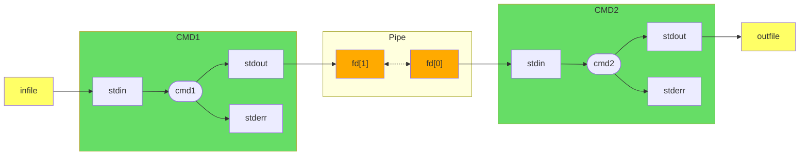
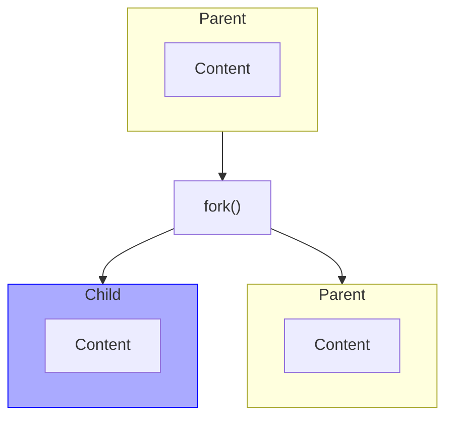
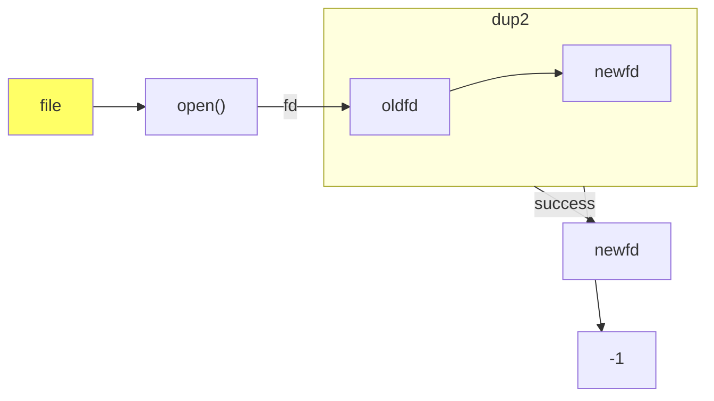
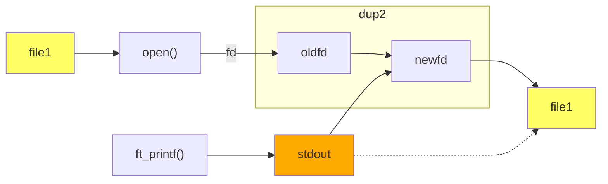

# Pipex

| Item | Description |
| --- | --- |
| Program name | **pipex** |
| Turn in files | `Makefile`, `*.h`, `*.c` |
| Makefile | `NAME`, `all`, `clean`, `fclean`, `re` |
| Arguments | `file1` `cmd1` `cmd2` `file2` |
| External functs. | - open, close, read, write, malloc, free, perror, strerror, access, dup, dup2, execve, exit, fork, pipe, unlink, wait, waitpid
||-  `ft_printf` and any equivalent you coded|
| Libft authorized | Yes |
| Description | This project is about handling pipes. |

Your program will be executed as follows:

```shell
./pipex file1 cmd1 cmd2 file2
```

It must take 4 arguments:
- `file1` and `file2` are file names.
- `cmd1` and `cmd2` are shell commands with their parameters.

It must behave exactly the same as the shell command below:

```shell
$> < file1 cmd1 | cmd2 > file2
```

Example:

```shell
$> ./pipex infile "ls -l" "wc -l" outfile
```

Should behave like: `< infile ls -l | wc -l > outfile`
  
```shell
$> ./pipex infile "grep a1" "wc -w" outfile
```

Should behave like: `< infile grep a1 | wc -w > outfile`

## Code

...

## Ressources

- 📖 [Article Pipex](https://csnotes.medium.com/pipex-tutorial-42-project-4469f5dd5901)

- 📑 [Pipeline](https://www.mbillaud.fr/notes/pipeline.html)
- 📑 [Pipes notion with visual representation](http://www.zeitoun.net/articles/communication-par-tuyau/start)

## Notions

### Functions

- `perror`: Prints a descriptive error message to stderr.
- `strerror`: Returns a pointer to a string that describes the error code passed.
- `access`: Checks whether the calling process can access the file pathname.
- `dup`: Creates a copy of the file descriptor oldfd.
- `dup2`: Makes newfd be the copy of oldfd, closing newfd first if necessary.
- `execve`: Replaces the current process image with a new process image.
- `exit`: Causes normal process termination.
- `fork`: Creates a new process by duplicating the existing process.
- `pipe`: Creates a pipe, a unidirectional data channel for interprocess communication.
- `unlink`: Deletes a name from the filesystem.
- `wait`: Makes the calling process wait until one of its child processes exits.
- `waitpid`: Waits for the process specified by pid to terminate.

```c
#include <stdio.h>
#include <string.h>
#include <unistd.h>
#include <sys/types.h>
#include <sys/wait.h>

void perror(const char *s);

char *strerror(int errnum);

int access(const char *pathname, int mode);

int dup(int oldfd);

int dup2(int oldfd, int newfd);

int execve(const char *filename, char *const argv[], char *const envp[]);

void exit(int status);

pid_t fork(void);

int pipe(int pipefd[2]);

int unlink(const char *pathname);

pid_t wait(int *status);

pid_t waitpid(pid_t pid, int *status, int options);
```
### PID

PID stands for **Process IDentifier**. 

In the context of operating systems like Unix, Linux, or Windows, a PID is a **unique number** that is **assigned to each process** when it is started. This number is used by the operating system to manage and track processes. 

For example, when you want to terminate a process, you would use its PID to specify which process to terminate.

## Understanding

### Pipe




On linux, you can check your fds currently open with the command `ls -la /proc/$$/fd` ( 0, 1 and 2 are by default assigned to stdin, stdout and stderr). 

### Fork



Fork system call is used for **creating a new process** in Linux, and Unix systems, which is called the child process, which **runs concurrently** with the process that makes the fork() call (parent process). After a new child process is created, **both processes will execute the next instruction following the fork() system call**.

Below are different values returned by fork() :
- Negative Value: The creation of a child process was unsuccessful.
- Zero: Returned to the newly created child process.
- Positive value: Returned to parent or caller. The value contains the process ID of the newly created child process.

Total Number of Processes = $2^n$, where $n$ is the number of fork system calls.
  - Exemple: $\ n = 3$ $\Rightarrow$ $2^3 = 8$ processes
    <details>
      <summary> Demo </summary>

      ```c
      #include <stdio.h>
      #include <sys/types.h>
      #include <unistd.h>
      int main()
      {
        fork();
        fork();
        fork();
        printf("hello\n");
        return 0;
      }
      ```
      ```c
      hello
      hello
      hello
      hello
      hello
      hello
      hello
      hello
      ```
    </details>

### Dup2

The **dup()** system call creates a copy of a file descriptor.

- It uses the lowest-numbered unused descriptor for the new descriptor.
- If the copy is successfully created, then the original and copy file descriptors may be used interchangeably.
- They both refer to the same open file description and thus share file offset and file status flags.

```c
/**
 * @param oldfd old file descriptor whose copy is to be created.
 * @return new file descriptor on success, -1 on error.
 */
int dup(int oldfd);
```

The **dup2()** system call is similar to **dup()** but the basic difference between them is that instead of using the lowest-numbered unused file descriptor, it **uses the descriptor number specified** by the user.

```c
/**
 * @param oldfd old file descriptor whose copy is to be created.
 * @param newfd new file descriptor to be used.
 * @return new file descriptor on success, -1 on error.
 */
int dup2(int oldfd, int newfd);
```

- If the descriptor `newfd` was previously open, it is silently closed before being reused.
- If `oldfd` is not a valid file descriptor, then the call fails, and `newfd` is not closed.
- If `oldfd` is a valid file descriptor, and `newfd` has the same value as `oldfd`, then `dup2()` does nothing, and returns `newfd`.

A tricky use of dup2() system call: As in dup2(), in place of newfd any file descriptor can be put. (for example, 0, 1, 2 for stdin, stdout, stderr respectively). So, if we want to **redirect the output of a program to a file**, we can use dup2() to redirect the output of the program to the file. Or the **output of a program can be redirected to another program** using dup2().



In this example the printf output is stdout, and stdout is link to file1 with dup2(). So printf will write inside file1. 
<details>
  <summary> Demo </summary>

  ```c
  #include <stdio.h>
  #include <unistd.h>
  #include <fcntl.h>

  int main()
  {
    int fd = open("file1", O_WRONLY | O_CREAT | O_TRUNC, 0644);
    dup2(fd, 1);
    close(fd);
    printf("hello\n");
    return 0;
  }
  ```
  ```shell
  $> ./a.out
  $> cat file1
  hello
  ```
</details>


