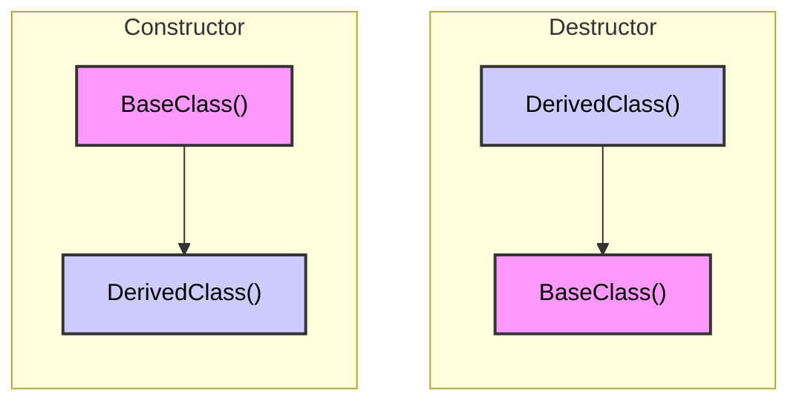

# Class

## Object-Oriented Programming (OOP)

In object-oriented programming (often abbreviated as OOP), the focus is on creating program-defined data types that contain both properties and a set of well-defined behaviors. The term “object” in OOP refers to the objects that we can instantiate from such types.

Help to manage complexity in large programs by grouping related data and functions together.

Modularity is achieved by creating classes that can be reused in other programs. This eliminates the need to rewrite the same code over and over again.

OOP concepts:
  - Encapsulation 
  - Inheritance 
  - Abstraction 
  - Polymorphism

## Class components

### Data Members

Data members are the data variables that are used to store the data. These data members can be of any data type.

### Member Functions

Member functions are the functions that are used to manipulate the data stored in the data members. These functions can be of any type.

### Access Specifiers

Access specifiers are used to define the access control for the members of the class. There are three types of access specifiers in C++:
  - Public: Members are accessible from outside the class.
  - Private: Members cannot be accessed (or viewed) from outside the class.
  - Protected: Members cannot be accessed from outside the class, however, they can be accessed in inherited classes.

### Constructors

Constructors are special member functions of a class that are used to initialize the objects of that class. Constructors are called when an object is created.

### Destructors

Destructors are special member functions of a class that are used to free the resources that have been allocated during the lifetime of the object.

### Operator Overloading

Operator overloading is a feature in C++ where an operator can be redefined to provide custom implementation.

### Inheritance

Inheritance is a feature in C++ where a class can inherit

### Polymorphism

Polymorphism is a feature in C++ where a function can have different forms.

### Abstraction

Abstraction is a feature in C++ where only the necessary details are shown to the user and the rest of the details are hidden.

### Others informations

#### Invariants

Invariants are conditions that are always true for a class. They are the rules that must be followed by the class.

#### This Pointer

The `this` pointer is a pointer that points to the object that invokes the member function.

## Defining a Class

A class is a blueprint for creating objects (a particular data structure), providing initial values for state (member variables or attributes), and implementations of behavior (member functions or methods).
  
```cpp
class NameOfClass {
  // constructor
  NameOfClass() {
    // code
  }
  // destructor
  ~NameOfClass() {
    // code
  }
  // access specifier
  public:
    // data members
    int dataMember1;
    int dataMember2;
    // member functions
    void memberFunction1() {
      // code
    }
    void memberFunction2() {
      // code
    }
};
```

Members variables and functions can be *defined in any order*.

If you don't use an access specifier, the members of the class are **private** by default.

## Member Functions

Member functions are the functions that are used to manipulate the data stored in the data members. These functions can be of any type.

```cpp
class MyClass {
  public:
    void myMethod() { // method
      cout << "Hello World!";
    }
};
```

Note:
- Prefer using `namespace` when you don't have data members in the class.

## Non-Member Functions or data

You can define with keyword `static` to make a member function or data a class member, not an object member.

You cant use `this` pointer in static / non member functions.

```cpp
class MyClass {
  public:
    static int my_static_variable; // static data member
    static void myStaticMethod() { // static member function
      cout << "Hello World!";
    }
};

int MyClass::my_static_variable = 0; // initialize static data member
```

## Pointers to Classes/Objects/Members

### Pointers to Members

#### Pointers to data members

Pointers to members are pointers that point to the members of a class.

```cpp
class MyClass {
  public:
    int x;
    void myMethod() {
      cout << "Hello World!";
    }
};

int main() {
  int MyClass::*ptr = &MyClass::x; // pointer to data member

  MyClass obj;
  obj.*ptr = 10; // access data member using pointer
}
```

- `int MyClass::*ptr` is a pointer to a data member of the class `MyClass`.
- `&MyClass::x` is the address of the data member `x` of the class `MyClass`.
- `obj.*ptr` is used to access the data member `x` of the object `obj` using the pointer `ptr`.
  - `obj.*ptr` is equivalent to `obj.x`.

#### Pointers to member functions

```cpp
class MyClass {
  public:
    void myMethod() {
      cout << "Hello World!";
    }
};

int main() {
  void (MyClass::*ptr)() = &MyClass::myMethod; // pointer to member function

  MyClass obj;
  (obj.*ptr)(); // access member function using pointer
}
```

- `void (MyClass::*ptr)()` is a pointer to a member function of the class `MyClass`.
- `&MyClass::myMethod` is the address of the member function `myMethod` of the class `MyClass`.
- `(obj.*ptr)()` is used to access the member function `myMethod` of the object `obj` using the pointer `ptr`.
  - `(obj.*ptr)()` is equivalent to `obj.myMethod()`.

## Access Specifiers / Visibility Modes

By default, all members of a class are private.

Access specifiers are used to define the access control for the members of the class. There are three types of access specifiers in C++:
  - Public: Members are accessible from outside the class.
  - Private: Members cannot be accessed (or viewed) from outside the class.
  - Protected: Members cannot be accessed from outside the class, however, they can be accessed in inherited classes.

```cpp
class MyClass {
  public: // public access specifier
    int x; // public data member
  private: // private access specifier
    int y; // private data member
  protected: // protected access specifier
    int z; // protected data member
};
```

### Getters and Setters

Getters and setters are used to access and modify the private data members of a class.

```cpp
class MyClass {
  private:
    int x;
  public:
    int getX() const { // getter
      return x;
    }
    void setX(int y) { // setter
      if (y > 0)
        x = y;
    }
};
```

## Constructors

Constructors are special member functions of a class that are used to initialize the objects of that class. Constructors are called when an object is created.

```cpp
class MyClass {
  public:
    MyClass() { // constructor
      cout << "Constructor called";
    }
};
```

### Default Constructor

A constructor that doesn't have any parameters is called a default constructor.

```cpp
class MyClass {
  public:
    MyClass() { // default constructor
      cout << "Constructor called";
    }
};
```

### Parameterized Constructor

A constructor that has parameters is called a parameterized constructor.

```cpp
class MyClass {
  public:
    int x;
    MyClass(int y) { // parameterized constructor
      x = y;
    }
};
```

### Copy Constructor

A copy constructor is a member function that initializes an object using another object of the same class.

```cpp
class MyClass {
  public:
    int x;
    MyClass(int y) { // parameterized constructor
      x = y;
    }
    MyClass(const MyClass &obj) { // copy constructor
      x = obj.x;
    }
};
```

### Constructor Overloading

Constructor overloading is a concept in C++ where there can be more than one constructor in a class with the same name but different parameters.

```cpp
class MyClass
{
  public:
    int x;
    MyClass()
    { // default constructor
      x = 0;
    }
    MyClass(int y)
    { // parameterized constructor
      x = y;
    }
};

int main()
{
  MyClass obj1; // default constructor
  MyClass obj2(10); // parameterized constructor
}
```

### Constructor Initialization Lists

Constructor initialization lists are used to initialize the data members of a class.

```cpp
class MyClass
{
  public:
    int x;
    int y;
    MyClass(int a, int b) : x(a), y(b) // constructor initialization list
    { 
      // code
    }
};
```

other way to initialize data members:

```cpp
class MyClass
{
  public:
    int x;
    int y;
    MyClass(int a, int b) // constructor
    {
      x = a;
      y = b;
    }
};
```

## Const Members

### Const Objects

A const object is an object that cannot be modified.

```cpp
class MyClass
{
  public:
    int x;
    MyClass(int y)
    {
      x = y;
    }
};

int main()
{
  const MyClass obj(10); // const object
  obj.x = 20; // error: cannot modify const object
}
```

### Const Member Functions

A **const member function** is a member function that guarantees it **will not modify the object or call any non-const member** functions (unless the member function is also declared as const).

```cpp
#include <iostream>

struct Date
{
    int year {};
    int month {};
    int day {};

    void print() const // now a const member function
    {
        std::cout << year << '/' << month << '/' << day;
    }
};

int main()
{
    const Date today { 2024, 04, 04 }; // const

    today.print();  // ok: const object can call const member function

    return 0;
}
```

A member function that does not (and will not ever) modify the state of the object **should be made const**, so that it can be called on both const and non-const objects.

## Compare Objects

To compare two objects of a class, you can overload the `==` operator.

```cpp
class MyClass
{
  public:
    int x;
    MyClass(int y)
    {
      x = y;
    }
    bool operator==(MyClass obj) // operator overloading
    {
      return x == obj.x;
    }
};

int main()
{
  MyClass obj1(10);
  MyClass obj2(10);
  if (obj1 == obj2) // compare objects
    cout << "Equal";
  else
    cout << "Not equal";
}
```

## Files Organization

Prefer to put your class definitions in a header file with the same name as the class. Trivial member functions (such as access functions, constructors with empty bodies, etc…) can be defined inside the class definition.

Prefer to define non-trivial member functions in a source file with the same name as the class

### Header Files

Header files contain the class declaration
  
```cpp
// MyClass.h
#ifndef MYCLASS_H
  #define MYCLASS_H

class MyClass {
  public:
    int x;
    MyClass(int y);
};

#endif
```

### Source Files

Source files contain the class definition

```cpp
// MyClass.cpp
#include "MyClass.h"

MyClass::MyClass(int y) {
  x = y;
}
```

### Main File

Main file contains the main function

```cpp
// main.cpp
#include <iostream>

#include "MyClass.h"

int main() {
  MyClass obj(10);
  std::cout << obj.x;
  return 0;
}
```

## Canonic Form (Coplien Form)

The canonic form of a class is a set of functions that are commonly defined for a class. These functions are:
  - Default constructor
  - Copy constructor
  - Copy assignment operator
  - Destructor

```cpp
class MyClass {
  public:
    MyClass(); // default constructor
    MyClass(const MyClass &obj); // copy constructor
    MyClass& operator=(const MyClass &obj); // copy assignment operator
    ~MyClass(); // destructor
};
```

## Inheritance

Inheritance is a feature in C++ where a class can inherit.

Child class (derived class) inherits from a parent class (base class). The child class can access all the public and protected members of the parent class.

```cpp
class BaseClass {
  public:
    void myMethod() {
      cout << "Hello World!";
    }
};

class DerivedClass : public BaseClass {
  public:
    void myOtherMethod() {
      cout << "Hello World!";
    }
};
```

### Construction

#### Order of Constructor and Destructor Calls



When an object of a derived class is created, the constructor of the base class is called first, followed by the constructor of the derived class (from top of the inheritance tree to the bottom). When an object of a derived class is destroyed, the destructor of the derived class is called first, followed by the destructor of the base class.

```cpp
class BaseClass {
  public:
    BaseClass() {
      cout << "Base constructor";
    }
    ~BaseClass() {
      cout << "Base destructor";
    }
};

class DerivedClass : public BaseClass {
  public:
    DerivedClass() {
      cout << "Derived constructor";
    }
    ~DerivedClass() {
      cout << "Derived destructor";
    }
};

int main() {
  DerivedClass obj; 
}
// Output:
// Base constructor 
// Derived constructor
// Derived destructor
// Base destructor
```

#### Initialization list of Derived Class

Since the base class constructor is called first, the derived class constructor can pass arguments to the base class constructor using the initialization list.

```cpp
class BaseClass {
  public:
    int base_x;
    BaseClass(int x) : base_x(x) {
      cout << "Base constructor";
    }
};

class DerivedClass : public BaseClass {
  public:
    int derived_x;
    DerivedClass(int x, int derived_input_x)
      : BaseClass{ x },
        derived_x{ derived_input_x }
    {
      cout << "Derived constructor";
    }
};

int main() {
  DerivedClass obj(10, 20);
}
// Output:
// Base constructor
// Derived constructor
```

Note: The value are public to make example more simple. In real case, prefer to use getter and setter with private value.

### Access Specifiers

By default, the access specifier for a base class is private. This means that the public and protected members of the base class are not accessible in the derived class.

In inheritance, the public members of the base class become public members of the derived class, the protected members of the base class become protected members of the derived class, and the private members of the base class are not accessible in the derived class (except through member functions of the base class).

```cpp
class Base
{
public:
    int m_public {}; // can be accessed by anybody
protected:
    int m_protected {}; // can be accessed by Base members, friends, and derived classes
private:
    int m_private {}; // can only be accessed by Base members and friends (but not derived classes)
};

class Derived: public Base
{
public:
    Derived()
    {
        m_public = 1; // allowed: can access public base members from derived class
        m_protected = 2; // allowed: can access protected base members from derived class
        m_private = 3; // not allowed: can not access private base members from derived class
    }
};

int main()
{
    Base base;
    base.m_public = 1; // allowed: can access public members from outside class
    base.m_protected = 2; // not allowed: can not access protected members from outside class
    base.m_private = 3; // not allowed: can not access private members from outside class

    return 0;
}
```

#### [Protected](https://www.learncpp.com/cpp-tutorial/inheritance-and-access-specifiers/)

With a protected attribute in a base class, derived classes can access that member directly. This means that if you later change anything about that protected attribute (the type, what the value means, etc…), you’ll probably need to change both the base class AND all of the derived classes.

Therefore, using the **protected access specifier** is most **useful** when you (or your team) are going to be the ones deriving from your own classes, and the **number of derived classes is reasonable**. That way, if you make a change to the implementation of the base class, and updates to the derived classes are necessary as a result, you can make the updates yourself (and have it not take forever, since the number of derived classes is limited).

Making your members private means the public and derived classes can’t directly make changes to the base class. This is good for insulating the public or derived classes from implementation changes, and for ensuring invariants are maintained properly. However, it also means your class may need a larger public (or protected) interface to support all of the functions that the public or derived classes need for operation, which has its own cost to build, test, and maintain.

In general, **it’s better to make your members private** if you can, and **only use protected** when derived classes are planned and the **cost to build and maintain an interface to those private members is too high**.

### Access Specifiers in Inheritance

Best practice is to **use `public` access specifier in inheritance**, unless you have a good reason to use `protected` or `private`.

#### Public Inheritance

| Access specifier in base class | Access specifier when inherited publicly |
| ------------------------------ | ---------------------------------------- |
| Public                         | Public                                   |
| Protected                      | Protected                                |
| Private                        | Inaccessible                             |

#### Protected Inheritance

| Access specifier in base class | Access specifier when inherited protectedly |
| ------------------------------ | ------------------------------------------- |
| Public                         | Protected                                   |
| Protected                      | Protected                                   |
| Private                        | Inaccessible                                |

#### Private Inheritance

| Access specifier in base class | Access specifier when inherited privately |
| ------------------------------ | ----------------------------------------- |
| Public                         | Private                                   |
| Protected                      | Private                                   |
| Private                        | Inaccessible                              |

#### Changing an inherited member’s access level

If you want to change the access specifier of a member function in the derived class, you can use the `using` keyword.
- `using` keyword is used to change the access specifier of a member function in the derived class.
  - change to `public` access specifier.

```cpp
class BaseClass {
  private:
    void myMethod() {
      cout << "Hello World!";
    }
};

class DerivedClass : public BaseClass {
  public:
    using BaseClass::myMethod; // change access specifier
};

int main() {
  DerivedClass obj;
  obj.myMethod(); // output: Hello World!
}
```

### Functions

#### Function Overriding

If you define a member function in the derived class that has the same name and signature as a member function in the base class, the member function in the derived class will override the member function in the base class.

```cpp
class BaseClass {
  public:
    void myMethod() {
      cout << "Hello World!";
    }
};

class DerivedClass : public BaseClass {
  public:
    void myMethod() {
      cout << "Hello Universe!";
    }
};

int main() {
  DerivedClass obj;
  obj.myMethod(); // output: Hello Universe!
}
```

#### Function Hiding

In C++, it is not possible to remove or restrict functionality from a base class other than by modifying the source code. However, in a derived class, it is possible to hide functionality that exists in the base class, so that it can not be accessed through the derived class. This can be done simply by changing the relevant access specifier.

```cpp
class BaseClass {
  public:
    void myMethod() {
      cout << "Hello World!";
    }
};

class DerivedClass : public BaseClass {
  private:
    using BaseClass::myMethod; // hide myMethod and myMethod possible overloads
};

int main() {
  DerivedClass obj;
  obj.myMethod(); // error: myMethod is private in DerivedClass
}
```

#### Function Delete

In C++11, you can use the `delete` keyword to delete a member function of a class.

```cpp
class BaseClass {
  public:
    void myMethod() {
      cout << "Hello World!";
    }
};

class DerivedClass : public BaseClass {
  public:
    void myMethod() = delete; // delete myMethod
};

int main() {
  DerivedClass obj;
  obj.myMethod(); // error: use of deleted function
}
```

### Types of Inheritance

#### Single Inheritance

Single inheritance is a type of inheritance where a class inherits from only one base class.

```cpp
class BaseClass {
  // code
};

class DerivedClass : public BaseClass {
  // code
};
```

#### Multiple Inheritance

Multiple inheritance is a type of inheritance where a class inherits from more than one base class.

```cpp
class BaseClass1 {
  // code
};

class BaseClass2 {
  // code
};

class DerivedClass : public BaseClass1, public BaseClass2 {
  // code
};
```

Best Practice:
  - Use only if alternative solutions are more complex.
  - Avoid multiple inheritance as it can lead to ambiguity and maintenance issues.
  - Prefer composition over multiple inheritance.

#### Mixin Inheritance

A mixin (also spelled “mix-in”) is a small class that can be inherited from in order to **add properties to a class**. The name mixin indicates that the class is intended to be mixed into other classes, **not instantiated on its own**.

```cpp
#include <string>

struct Point2D
{
	int x{};
	int y{};
};

class Box // mixin Box class
{
public:
	void setTopLeft(Point2D point) { m_topLeft = point; }
	void setBottomRight(Point2D point) { m_bottomRight = point; }
private:
	Point2D m_topLeft{};
	Point2D m_bottomRight{};
};

class Label // mixin Label class
{
public:
	void setText(const std::string_view str) { m_text = str; }
	void setFontSize(int fontSize) { m_fontSize = fontSize; }
private:
	std::string m_text{};
	int m_fontSize{};
};

class Tooltip // mixin Tooltip class
{
public:
	void setText(const std::string_view str) { m_text = str; }
private:
	std::string m_text{};
};

class Button : public Box, public Label, public Tooltip {}; // Button using three mixins

int main()
{
	Button button{};
	button.Box::setTopLeft({ 1, 1 });
	button.Box::setBottomRight({ 10, 10 });
	button.Label::setText("Submit");
	button.Label::setFontSize(6);
	button.Tooltip::setText("Submit the form to the server");
}
```
