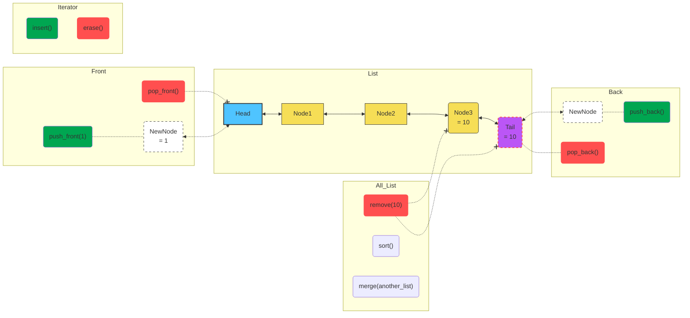
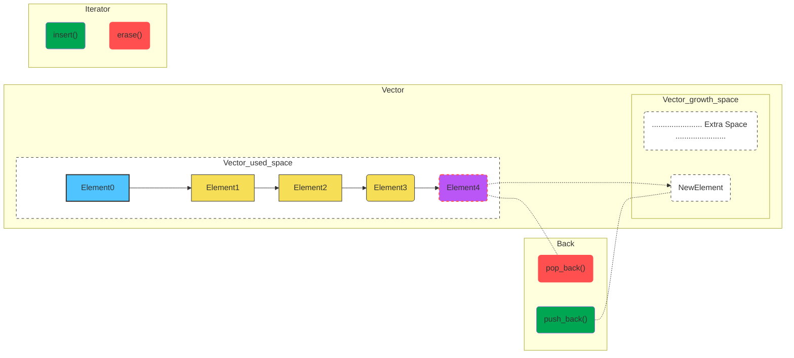
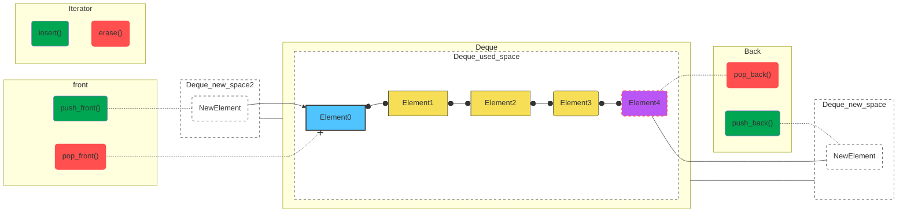
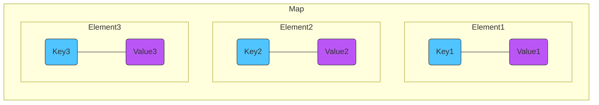
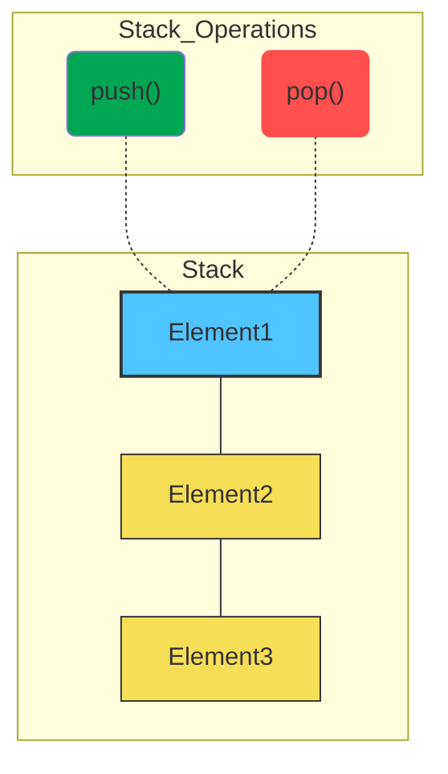

# [Containers](https://learn.microsoft.com/en-us/cpp/standard-library/stl-containers?view=msvc-170)

📚 [Documentation](https://cplusplus.com/reference/stl/?kw=stl)

A container is a holder object that stores a collection of other objects (its elements). They are implemented as class templates, which allows a great flexibility in the types supported as elements.

The container manages the storage space for its elements and provides member functions to access them, either directly or through iterators (reference objects with similar properties to pointers).

Containers replicate structures very commonly used in programming:
- dynamic arrays (**vector**), 
- queues (**queue**), 
- stacks (**stack**), 
- heaps (**priority_queue**), 
- linked lists (**list**), 
- trees (**set**), 
- associative arrays (**map**)...

<table>
    <tr>
        <th>Type</th>
        <th>Container</th>
        <th>Description</th>
    </tr>
    <tr>
        <td rowspan="3">Sequence Containers</td>
        <td><a href="./Containers.md#vector">std::vector</td>
        <td>Dynamic array that allows for fast access to elements and efficient additions/removals at the end.</td>
    </tr>
    <tr>
        <td><a href="./Containers.md#list">std::list</td>
        <td>Doubly-linked list that allows for efficient additions/removals at both ends.</td>
    </tr>
    <tr>
        <td><a href="./Containers.md#deque">std::deque</td>
        <td>Double-ended queue that allows for efficient additions/removals at both ends and fast access to elements.</td>
    </tr>
    <tr>
        <td rowspan="2">Associative Containers</td>
        <td><a href="./Containers.md#map">std::map</td>
        <td>Sorted associative container that contains key-value pairs with unique keys.</td>
    </tr>
    <tr>
        <td>std::set</td>
        <td>Sorted associative container that contains unique elements.</td>
    </tr>
    <tr>
        <td rowspan="2">Unordered Associative Containers</td>
        <td>std::unordered_map</td>
        <td>Unsorted associative container that contains key-value pairs with unique keys, implemented using hash table.</td>
    </tr>
    <tr>
        <td>std::unordered_set</td>
        <td>Unsorted associative container that contains unique elements, implemented using hash table.</td>
    </tr>
    <tr>
        <td rowspan="3">Container Adaptors</td>
        <td><a href="./Containers.md#stack">std::stack</td>
        <td>Adaptor for a container, which provides a LIFO (Last In First Out) data structure.</td>
    </tr>
    <tr>
        <td>std::queue</td>
        <td>Adaptor for a container, which provides a FIFO (First In First Out) data structure.</td>
    </tr>
    <tr>
        <td>std::priority_queue</td>
        <td>Adaptor for a container, which provides a priority queue where the element with the highest priority is always at the front.</td>
    </tr>
</table>

***

## STL Containers

The **Standard Template Library (STL)** is a set of C++ template classes to provide common programming data structures and functions such as lists, stacks, arrays, etc. It is a library of container classes, algorithms, and iterators.

## Sequence Containers

Sequence containers maintain the ordering of inserted elements that you specify.

<figure>
<table>
<tbody>
<tr><td colspan="2">Headers</td>
  <th><tt><a href="./Containers.md#vector">&lt;vector&gt;</a></tt></th>
  <th><tt><a href="./Containers.md#deque">&lt;deque&gt;</a></tt></th>
  <th><tt><a href="./Containers.md#list">&lt;list&gt;</a></tt></th></tr>
<tr><td colspan="2">Members</td>
  <th>vector</th><th>deque</th><th>list</th></tr>
  <tr><td rowspan="3"> </td><td><i>constructor</i></td><td>vector</td><td>deque</td><td>list</td></tr>
  <tr><td><i>destructor</i></td><td>~vector</td><td>~deque</td><td>~list</td></tr>
  <tr><td>operator=</td><td>operator=</td><td>operator=</td><td>operator=</td></tr>
<tr><td rowspan="4">iterators</td>
  <td>begin</td><td>begin</td><td>begin</td><td>begin</td></tr>
  <tr><td>end</td><td>end</td><td>end</td><td>end</td></tr>
  <tr><td>rbegin</td><td>rbegin</td><td>rbegin</td><td> </td></tr>
  <tr><td>rend</td><td>rend</td><td>rend</td><td> </td></tr>
<tr><td rowspan="6">capacity</td>
  <td>size</td><td>size</td><td>size</td><td>size</td></tr>
  <tr><td>max_size</td><td>max_size</td><td>max_size</td><td>max_size</td></tr>
  <tr><td>empty</td><td>empty</td><td>empty</td><td>empty</td></tr>
  <tr><td>resize</td><td>resize</td><td>resize</td><td>resize</td></tr>
  <tr><td>capacity</td><td>capacity</td><td> </td><td> </td></tr>
  <tr><td>reserve</td><td>reserve</td><td> </td><td> </td></tr>
<tr><td rowspan="4">element access</td>
  <td>front</td><td>front</td><td>front</td><td>front</td></tr>
  <tr><td>back</td><td>back</td><td>back</td><td>back</td></tr>
  <tr><td>operator[]</td><td>operator[]</td><td>operator[]</td><td> </td></tr>
  <tr><td>at</td><td>at</td><td>at</td><td> </td></tr>
<tr><td rowspan="9">modifiers</td>
  <td>assign</td><td>assign</td><td>assign</td><td>assign</td></tr>
  <tr><td>insert</td><td>insert</td><td>insert</td><td>insert</td></tr>
  <tr><td>erase</td><td>erase</td><td>erase</td><td>erase</td></tr>
  <tr><td>push_back</td><td>push_back</td><td>push_back</td><td>push_back</td></tr>
  <tr><td>pop_back</td><td>pop_back</td><td>pop_back</td><td>pop_back</td></tr>
  <tr><td>push_front</td><td> </td><td>push_front</td><td>push_front</td></tr>
  <tr><td>pop_front</td><td> </td><td>pop_front</td><td>pop_front</td></tr>
  <tr><td>clear</td><td>clear</td><td>clear</td><td>clear</td></tr>
  <tr><td>swap</td><td>swap</td><td>swap</td><td>swap</td></tr>
<tr><td rowspan="7">list operations</td>
  <td>splice</td><td> </td><td> </td><td>splice</td></tr>
  <tr><td>remove</td><td> </td><td> </td><td>remove</td></tr>
  <tr><td>remove_if</td><td> </td><td> </td><td>remove_if</td></tr>
  <tr><td>unique</td><td> </td><td> </td><td>unique</td></tr>
  <tr><td>merge</td><td> </td><td> </td><td>merge</td></tr>
  <tr><td>sort</td><td> </td><td> </td><td>sort</td></tr>
  <tr><td>reverse</td><td> </td><td> </td><td>reverse</td></tr>
<tr><td rowspan="2">observers</td>
  <td>get_allocator</td><td> </td><td>get_allocator</td><td>get_allocator</td></tr> 
</tbody>
</table>
  <figcaption>Sequence containers <strong>CPP98</strong> Table</figcaption>
</figure>

### [List](https://cplusplus.com/reference/list/list/)

[⚙️ Operations / Member Functions](https://cplusplus.com/reference/list/list/)

Lists are sequence containers that allow constant time insert and erase operations anywhere within the sequence, and iteration in both directions.

List containers are implemented as **doubly-linked lists**; Doubly linked lists can store each of the elements they contain in different and unrelated storage locations. The ordering is kept internally by the association to each element of a link to the element preceding it and a link to the element following it.



```cpp
#include <list>

int main()
{
  std::list<int> list;
  list.push_back(1);
  list.push_back(2);
  list.push_front(0);
  list.push_front(-1);
  return (0);
}
```

### Vector

[⚙️ Operations / Member Functions](https://cplusplus.com/reference/vector/vector/)

Vectors are **sequence containers** representing **arrays** that can **change in size**.

Just like arrays, vectors use contiguous storage locations for their elements, which means that their elements can also be accessed using offsets on regular pointers to its elements, and just as efficiently as in arrays. But unlike arrays, their **size can change dynamically**, with their storage being handled automatically by the container.

Internally, vectors use a dynamically allocated array to store their elements. This array may need to be reallocated in order to grow in size when new elements are inserted, which implies allocating a new array and moving all elements to it. This is a relatively expensive task in terms of processing time, and thus, vectors do not reallocate each time an element is added to the container.

Instead, vector containers may **allocate some extra storage to accommodate for possible growth**, and thus the container may have an actual capacity greater than the storage strictly needed to contain its elements (i.e., its size). Libraries can implement different strategies for growth to balance between memory usage and reallocations, but in any case, **reallocations should only happen at logarithmically growing intervals of size** so that the insertion of individual elements at the end of the vector can be provided with amortized constant time complexity (see push_back).

Sure, here are some pros and cons of using `std::vector` in C++:

**Pros:**

1. **Random Access:** `std::vector` provides constant time access to any element, similar to an array.
2. **Dynamic Size:** Unlike arrays, `std::vector` can resize itself automatically when an element is inserted or deleted.
3. **Memory Efficient:** `std::vector` is more memory efficient than containers like `std::list` and `std::deque` because it doesn't need to store any extra pointers for each element.
4. **Cache Friendliness:** Due to contiguous storage in memory, `std::vector` is more cache friendly than non-contiguous containers. This can result in better performance for operations that iterate over the elements.

**Cons:**

1. **Insertion/Deletion at the Beginning or Middle:** Inserting or deleting elements at positions other than the end of a `std::vector` is not efficient. It requires moving all elements after the insertion or deletion point, which can be costly for large vectors.
2. **Memory Reallocation:** When a `std::vector` needs to grow, it may need to reallocate its entire memory block. If the vector is large, this can be an expensive operation.
3. **Not Suitable for Large Elements:** If the elements are large, the cost of copying them during reallocation can be high. In such cases, `std::list` or `std::deque` might be a better choice.
4. **No Inbuilt Sort Functionality:** Unlike `std::set` or `std::map`, `std::vector` does not automatically maintain its elements in sorted order. If you need to keep elements sorted, you'll have to sort the vector manually after each insertion.



```cpp
#include <vector>

int main()
{
  std::vector<int> vector;
  vector.push_back(1);
  vector.push_back(2);
  vector.push_back(3);
  return (0);
}
```

### Deque

[⚙️ Operations / Member Functions](https://cplusplus.com/reference/deque/deque/)

deque (usually pronounced like "deck") is an irregular acronym of **double-ended queue**. Double-ended queues are sequence containers with **dynamic sizes** that can be **expanded or contracted on both ends (either its front or its back)**.

Specific libraries may implement deques in different ways, generally as some form of dynamic array. But in any case, they allow for the **individual elements** to be **accessed directly** through random access iterators, with storage handled automatically by expanding and contracting the container as needed.

Therefore, they provide a functionality **similar to vectors**, but with **efficient insertion and deletion of elements also at the beginning of the sequence**, and not only at its end. But, unlike vectors, deques are **not guaranteed to store all its elements in contiguous storage locations**: accessing elements in a deque by offsetting a pointer to another element causes undefined behavior.

Both vectors and deques provide a very similar interface and can be used for similar purposes, but internally both work in quite different ways: While vectors use a single array that needs to be occasionally reallocated for growth, the **elements of a deque** can be **scattered in different chunks of storage**, with the container keeping the necessary information internally to provide direct access to any of its elements in constant time and with a uniform sequential interface (through iterators). Therefore, **deques are a little more complex internally than vectors**, but this allows them to **grow more efficiently under certain circumstances**, especially with **very long sequences**, where reallocations become more expensive.

**Pros:**

1. **Insertion at Both Ends:** `std::deque` allows efficient insertion and deletion at both ends (front and back), unlike `std::vector` which only allows efficient insertion and deletion at the end.
2. **Random Access:** Like `std::vector`, `std::deque` provides constant time access to any element.
3. **Dynamic Size:** `std::deque` can resize itself automatically when an element is inserted or deleted, similar to `std::vector`.

**Cons:**

1. **Memory Overhead:** `std::deque` typically uses more memory than `std::vector` because it needs to maintain pointers to separate chunks of memory, unlike `std::vector` which uses a single contiguous block of memory.
2. **Slower Access than Vector:** While `std::deque` provides random access, it can be slower than `std::vector` for accessing elements because it may need to follow a pointer to a different chunk of memory.
3. **Non-contiguous Storage:** Unlike `std::vector`, `std::deque` does not store its elements in a contiguous block of memory. This can make it less cache friendly and slower for operations that iterate over the elements.
4. **No Inbuilt Sort Functionality:** Like `std::vector`, `std::deque` does not automatically maintain its elements in sorted order. If you need to keep elements sorted, you'll have to sort the deque manually after each insertion.



```cpp
#include <deque>

int main()
{
  std::deque<int> deque;
  deque.push_back(1);
  deque.push_back(2);
  deque.push_front(0);
  deque.push_front(-1);
  return (0);
}
```

## Associative Containers

Associative containers implement sorted data structures that can be quickly searched (O(log n) complexity).

### Map

[⚙️ Operations / Member Functions](https://cplusplus.com/reference/map/map/)

```cpp
std::map<key_type, value_type> map_name;
```

Maps are associative containers that store elements formed by a combination of a **key value** and a **mapped value**, following a **specific order**.

In a map, the key values are generally used to sort and uniquely identify the elements, while the mapped values store the content associated to this key. The **types of key and mapped value may differ**, and are grouped together in member type value_type, which is a pair type combining both:

```cpp
typedef pair<const Key, T> value_type;
```

Internally, the elements in a map are always **sorted by its key following a specific** strict weak **ordering criterion** indicated by its **internal comparison object** (of type Compare).

map containers are generally **slower than unordered_map** containers to access individual elements by their key, but they **allow the direct iteration on subsets based on their order**.

The **mapped values** in a map can be **accessed directly** by their corresponding **key** using the bracket operator ((operator[]).

Maps are typically implemented as **binary search trees**.

**Pros:**

1. **Key-Value Storage:** `std::map` stores elements as key-value pairs, which is useful for many applications.
2. **Automatic Sorting:** Elements in a `std::map` are automatically sorted by key, which can be very convenient.
3. **Unique Keys:** Each key in a `std::map` is unique. This can be useful for tasks like counting occurrences of elements.
4. **Logarithmic Time Complexity:** Operations like insertion, deletion, and search have logarithmic time complexity, making `std::map` efficient even for large amounts of data.

**Cons:**

1. **Memory Overhead:** `std::map` typically uses more memory than containers like `std::vector` or `std::array` because it needs to store both keys and values, and also additional information to maintain the tree structure.
2. **Slower Iteration:** Iterating over a `std::map` can be slower than iterating over a `std::vector` or `std::array` because the elements are not stored contiguously in memory.
3. **No Random Access:** Unlike `std::vector` or `std::array`, `std::map` does not provide a way to directly access an element by its index. You can only access elements by their keys.
4. **Single Direction Iteration:** Standard `std::map` only supports single direction iteration (i.e., you can't iterate in reverse). If you need bidirectional iteration, you would need to use `std::map`'s sibling, `std::multimap`.



```cpp
#include <map>

int main()
{
  std::map<std::string, int> map;
  map["Alice"] = 30;
  map["Bob"] = 40;
  map["Charlie"] = 50;
  std::cout << "Alice is " << map["Alice"] << " years old\n";
  return (0);
}
```

<!-- ! TODO: Set, (Unordered Map, Unordered Set, Multimap, Multiset) ... -->

## Container Adaptors

Container adaptors provide a different interface for sequential containers.

### Stack

[⚙️ Operations / Member Functions](https://cplusplus.com/reference/stack/stack/)

[📑 Code details](https://en.cppreference.com/w/cpp/header/stack)

```cpp
std::stack<value_type> stack_name;
```

Stacks are a type of **container adaptor**, specifically designed to operate in a **LIFO** context (last-in first-out), where **elements** are *inserted and extracted* **only from one end of the container**.

stacks are implemented as container adaptors, which are classes that use an **encapsulated object of a specific container class** as its **underlying container**, providing a specific set of member functions to access its elements. Elements are **pushed/popped** from the **"back"** of the specific container, which is known as the **top of the stack**.

The underlying container may be any of the standard container class templates or some other specifically designed container class. The container shall support the following operations:

-  empty
-  size
-  back
-  push_back
-  pop_back

The standard container classes vector, deque and list fulfill these requirements. By **default**, if no container class is specified for a particular stack class instantiation, the **standard container deque is used**.



## Iterators

An iterator is an object that is used to traverse a container. Iterators are used to access the elements of a container in a specific order.

```cpp
#include <list>

int main()
{
  std::list<int> list;
  list.push_back(1);
  list.push_back(2);
  list.push_back(3);

  for (std::list<int>::iterator it = list.begin(); it != list.end(); ++it)
  {
    std::cout << *it << "\n";
  }
  return (0);
}
```

### Custom Iterators

🔗 [Article - Writing custom iterators](https://internalpointers.com/post/writing-custom-iterators-modern-cpp)

You can create custom iterators for your own classes by defining the following types and member functions:

- **iterator**: A type that can be used to iterate over the elements of the container.
- **const_iterator**: A type that can be used to iterate over the elements of a const container.
- **begin()**: A member function that returns an iterator to the first element of the container.
- **end()**: A member function that returns an iterator to one past the last element of the container.

```cpp
#include <iostream>

template <typename T>
class MyContainer
{
public:
  MyContainer() : size_(10){this->data_[4] = 4;}
  class iterator
  {
  public:
    iterator(T *ptr) : ptr_(ptr) {}
    T &operator*() { return *ptr_; }
    iterator &operator++()
    {
      ++ptr_;
      return *this;
    }
    bool operator!=(const iterator &other) const { return ptr_ != other.ptr_; }

  private:
    T *ptr_;
  };

  iterator begin() { return iterator(data_); }
  iterator end() { return iterator(data_ + size_); }

private:

  T data_[10];
  int size_;
};

int main()
{
  MyContainer<int> container;
  for (MyContainer<int>::iterator it = container.begin(); it != container.end(); ++it)
  {
    std::cout << *it << " ";
  }
  std::cout << "\n";
  return (0);
}
// Output: 0 0 0 0 4 0 0 0 0 0
```

