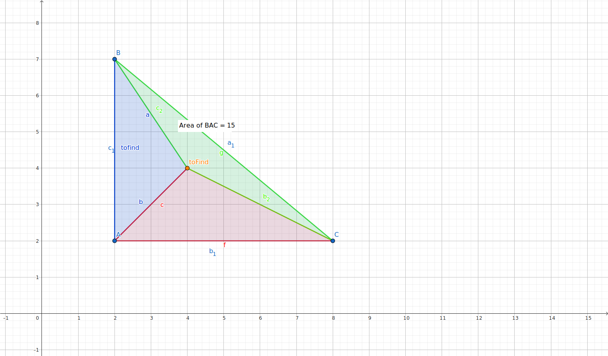

# CPP Exercices

## CPP 02

### [BSP](../../../Notes/binary_space_partitioning.md)

BSP conrespond to Binary Space Partitioning. It is a method used to divide a space into two parts.
In the context of video games, it is used to divide a map into two parts, to optimize the rendering of the map.

#### Exercice Problem

Find if a point is inside a triangle.

#### Exercice Solution

Possible way to solve (but this solutions **doesnt really use BSP**):

- Use the area of the triangle to determine if the point is inside the triangle.
  - Calculate the area of the triangle
  $$A = \left|\frac{x1\times (y2 - y3) + x2 \times (y3 - y1) + x3 \times (y1 - y2)}{2}\right| $$
  - Calculate the area of the three triangles formed by the point and the three points of the triangle
  - If the sum of the three areas is equal to the area of the triangle, the point is inside the triangle.
  - 🔗[Check whether a given point lies inside a triangle or not](https://www.geeksforgeeks.org/check-whether-a-given-point-lies-inside-a-triangle-or-not/)
  - 🔗[Area of a triangle](https://www.cuemath.com/geometry/area-of-triangle-in-coordinate-geometry/)

- Use the direction of the vectors to determine if the point is inside the triangle.
  - Calculate the vectors of the three sides of the triangle
  - Calculate the vectors between the point and the three points of the triangle
  - Calculate the cross product of the vectors of the sides of the triangle and the vectors between the point and the three points of the triangle
  - If the cross product of the three vectors is the same sign, the point is inside the triangle.
  - 🔗[Direction of a Point from a line segment](https://www.geeksforgeeks.org/direction-point-line-segment/)