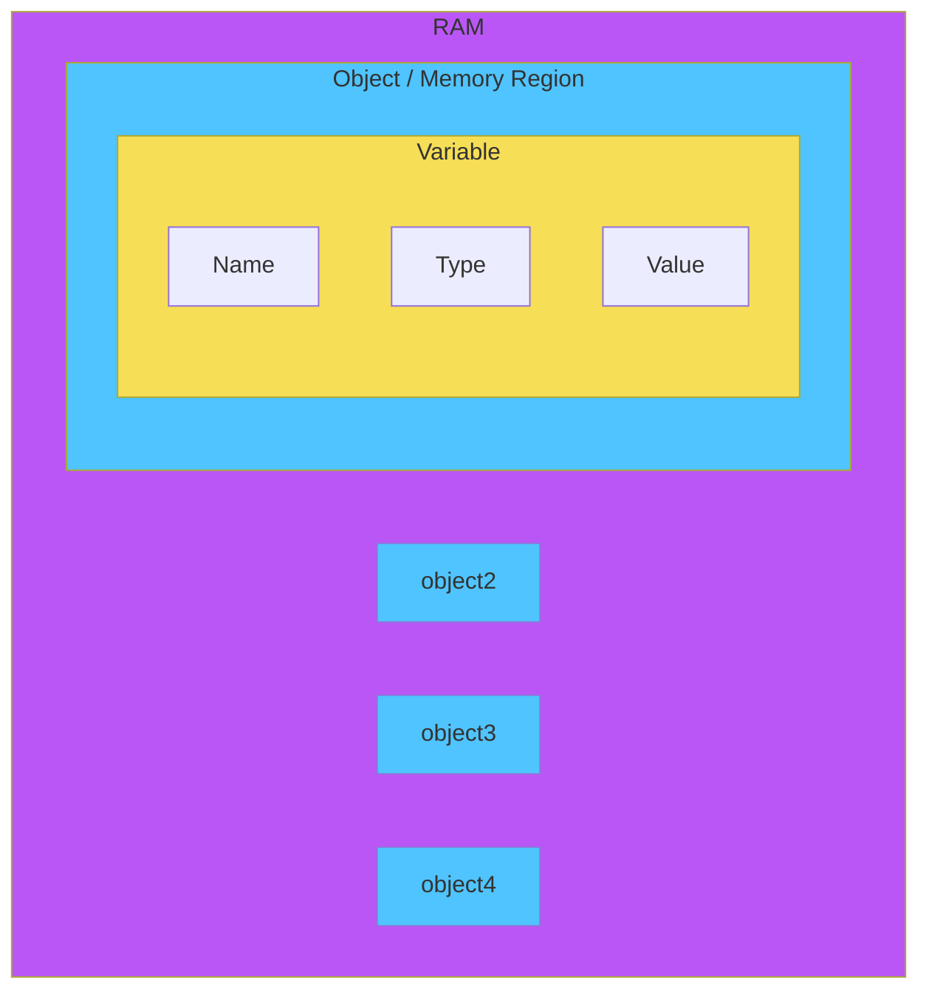

# C++ Modules

## Resources

* [🗃️ C++ Reference](https://en.cppreference.com/w/)
* [🧑‍🎓 C++ Tutorial - Website Course](https://www.learncpp.com/)

## Description

### History

- C was developed in 1972 by Dennis Ritchie at Bell Telephone laboratories.
- C++ (pronounced “see plus plus”) was developed by Bjarne Stroustrup at Bell Labs as an extension to C, starting in 1979. C++’s claim to fame results primarily from the fact that it is an object-oriented language.

### Usage

C++ excels in situations where high performance and precise control over memory and other resources is needed. Here are a few common types of applications that most likely would be written in C++:
-  Video games
-  Real-time systems (e.g. for transportation, manufacturing, etc…)
-  High-performance financial applications (e.g. high frequency trading)
-  Graphical applications and simulations
-  Productivity / office applications
-  Embedded software
-  Audio and video processing
-  Artificial intelligence and neural networks

### Compilation / Linking
Compiling:


Linking:


#### Compiler extensions

The C++ language is standardized by the International Organization for Standardization (ISO), and the standard is called the C++ Standard. However, many compilers provide extensions that go beyond the standard. These extensions can be useful, but they can also make your code less portable.

- To prevent the use of compiler-specific extensions, you can use the `-pedantic` flag when compiling your code. This flag tells the compiler to strictly adhere to the C++ Standard and to issue warnings when non-standard extensions are used.

```shell
g++ -pedantic -o myProgram myProgram.cpp
```

or
  
```shell
g++ -pedantic-errors -o myProgram myProgram.cpp
```

#### Warning flags

- `-Wall` flag: This flag tells the compiler to enable most warning messages.
- `-Wextra` flag: This flag tells the compiler to enable some extra warning messages.
- `-Werror` flag: This flag tells the compiler to treat all warnings as errors.
  - It's a good pratice to convert all warnings to errors, so that the code will not compile if there are any warnings.

```shell
g++ -Wall -Wextra -Werror -o myProgram myProgram.cpp
```

#### Standard flags

- `-std=value` flag: This flag tells the compiler to use the specified version of the C++ Standard.
  - Example:
  ```shell
  g++ -std=c++17 -o myProgram myProgram.cpp
  ```

| Version | Year | Major Features |
|---------|------|----------------|
| C++98   | 1998 | - Initial Standard<br>- Templates<br>- Exceptions<br>- Namespaces |
| C++03   | 2003 | - Minor bug fixes to C++98 |
| C++11   | 2011 | - Auto keyword<br>- Range-based for loops<br>- Lambda expressions<br>- Smart pointers |
| C++14   | 2014 | - Generic lambda expressions<br>- Binary literals<br>- Digit separators |
| C++17   | 2017 | - Inline variables<br>- Structured bindings<br>- If and switch with initializers |
| C++20   | 2020 | - Modules<br>- Coroutines<br>- Concepts<br>- Ranges |
| C++23   | 2023 | - Expected<br>- Contracts<br>- Networking TS<br>- Executors TS |

### Building

Building:

Because there are multiple steps involved, the term **building** is often used to refer to the full process of **converting source code files into an executable** that can be run. A specific executable produced as the result of building is sometimes called a **build**.

Command line:

```bash
g++ -o myProgram myProgram.cpp
```

#### Building configurations

- **Debug build**: This build is used during development. It includes debugging symbols and is not optimized. This build is typically slower and larger than a release build.
  - `-g` flag: This flag tells the compiler to include debugging information in the executable.
  - `-gdb` flag: This flag tells the compiler to include debugging information that is compatible with the GNU debugger (gdb).
  - `-O0` flag: This flag tells the compiler not to optimize the code.
  - Example:
  ```shell
  g++ -g -gdb -O0 -o myProgram myProgram.cpp
  ```
  or
  ```shell
  g++ -ggdb -o myProgram myProgram.cpp
  ```

- **Release build**: This build is used for distribution. It is optimized for speed and size, and does not include debugging symbols. This build is typically faster and smaller than a debug build.
  - `-O2` flag: This flag tells the compiler to optimize the code for speed.
  - `-DNDEBUG` flag: This flag tells the compiler to define the `NDEBUG` preprocessor macro, which can be used to conditionally compile code.
  - Example:
  ```shell
  g++ -O2 -DNDEBUG -o myProgram myProgram.cpp
  ```

## Introduction

- `statements`: A statement is a single line of code that performs a specific action. For example, `std::cout << "Hello, world!" << std::endl;` is a statement that outputs the text "Hello, world!" to the console.

- `expressions`: An expression is a combination of literals, variables, operators, and function calls that evaluates to a single value. For example, `2 + 3` is an expression that evaluates to `5`.

- `functions`: A function is a block of code that performs a specific task. Functions are used to organize code into manageable pieces, and to facilitate code reuse. For example, `std::cout << "Hello, world!" << std::endl;` is a function call that outputs the text "Hello, world!" to the console.

- `libraries`: A library is a collection of precompiled functions that can be used in your program. Libraries are used to provide functionality that is not built into the language itself. For example, the `iostream` library provides functionality for input and output.

### Comments

- Single-line comments: `//`
- Multi-line comments: `/* */`

### Objects and Variables



- `object`: An object is a region of memory with a type that stores a value. For example, `int x = 5;` creates an object named `x` that stores the value `5`.

- `variable`: A variable is a named object. For example, `int x = 5;` creates a variable named `x` that stores the value `5`.
  - `variable instantiation`: The process of creating a variable is called variable instantiation.
    - `declaration`: The process of introducing a new name in the program.
      ```cpp
      int x; // declares a variable named x of type int
      ```
      - multiple declarations can be done in a single line.
      ```cpp
      int x, y, z; // declares three variables named x, y, and z of type int
      ```
    - `definition`: The process of allocating storage for a variable and possibly initializing it.
      - assignement operator `=` is used to initialize a variable.
      ```cpp
      int x = 5; // defines a variable named x of type int and initializes it with the value 5
      ```
    - `initialization`: The process of giving a variable an initial value.

      | Initialization | Description |
      |----------------|-------------|
      | `int a;` | Default initialization (for built-in types, this means uninitialized) |
      | `int a = 5;` | Copy initialization |
      | `int a( 5 );` | Direct initialization |
      | `int a{ 5 };` | Direct list initialization (since C++11) |
      | `int a = { 5 };` | Copy list initialization (since C++11) |
      | `int a{};` | Value initialization (since C++11, `a` is initialized to `0`) |

  - `instance`: A variable that has been defined and initialized is called an instance of a variable.
  - `data type`: The type of data that a variable can store is called its data type.

### [IoStream](https://www.learncpp.com/cpp-tutorial/introduction-to-iostream-cout-cin-and-endl/)

Includes:

```cpp
#include <iostream>
```

The `iostream` library provides functionality for input and output. It contains two main classes: `std::istream` and `std::ostream`.

#### STD::COUT

`cout` means "character output". It is an object of the `ostream` class that represents the standard output stream. It is used to output data to the console.
  - It buffers the output, which means that the output is not immediately written to the console. Instead, it is stored in a **buffer** until the buffer is full or until the buffer is flushed.

```cpp
std::cout << "Hello, ";
std::cout << "world!";
// Output: Hello, world!
```

- `<<`: The `<<` operator is used to insert data into the output stream.
  - It is called the **insertion operator**.
  - It can be used multiple times in a single statement to insert multiple pieces of data into the output stream.

- `std::cerr`: The `std::cerr` object is an instance of the `std::ostream` class that is used for writing error messages to the console.
- `std::clog`: The `std::clog` object is an instance of the `std::ostream` class that is used for writing log messages to the console.

#### STD::ENDL

`endl` means "end line". It is a special value that represents a newline character. It is used to insert a newline character into the output stream and flush the stream.
  - It is equivalent to `'\n'` followed by `std::flush`.
    - `std::flush`: The `std::flush` manipulator is used to flush the output stream, which means that any buffered output is written to the console.
    - **best practice is to use `\n` instead of `std::endl`** to insert a newline character into the output stream, because `std::endl` flushes the stream, which can be inefficient (It’s more efficient to let the system flush itself periodically (which it has been designed to do efficiently)). As a result, **`std::endl` should only be used when you need to flush the stream**.
  - It is called a manipulator because it modifies the behavior of the output stream.

```cpp
std::cout << "Hello, " << std::endl;
std::cout << "world!";
// Output: Hello,
//         world!
```

#### STD::CIN

`cin` means "character input". It is an object of the `istream` class that represents the standard input stream. It is used to read data from the console.
  - `>>`: The `>>` operator is used to extract data from the input stream.
    - It is called the **extraction operator**.
    - It can be used multiple times in a single statement to extract multiple pieces of data from the input stream.

```cpp
int x{};
std::cin >> x;
std::cout << "You entered: " << x;
// Output: You entered: [value of x]
```

### Keywords

<table>
  <tr>
    <th>Type</th>
    <th>Keywords</th>
    <th>Description</th>
  </tr>
  <tr>
    <td rowspan="12" style="background: #00a651; color: white;">Control Flow</td>
    <td>if</td>
    <td>Used to execute a block of code if a condition is true</td>
  </tr>
  <tr>
    <td>else</td>
    <td>Used to execute a block of code if a condition is false</td>
  </tr>
  <tr>
    <td>switch</td>
    <td>Used to select one of many code blocks to be executed</td>
  </tr>
  <tr>
    <td>case</td>
    <td>Used to specify multiple code blocks in a switch statement</td>
  </tr>
  <tr>
    <td>default</td>
    <td>Used to specify a block of code to be executed if no case matches</td>
  </tr>
  <tr>
    <td>break</td>
    <td>Used to exit a loop or switch statement</td>
  </tr>
  <tr>
    <td>continue</td>
    <td>Used to skip the rest of the code inside a loop and start the next iteration</td>
  </tr>
  <tr>
    <td>goto</td>
    <td>Used to jump to a specific label</td>
  </tr>
  <tr>
    <td>return</td>
    <td>Used to exit a function and return a value</td>
  </tr>
  <tr>
    <td>co_await</td>
    <td>Used to suspend execution until the result of a coroutine is ready (since C++20)</td>
  </tr>
  <tr>
    <td>co_return</td>
    <td>Used to return a value from a coroutine (since C++20)</td>
  </tr>
  <tr>
    <td>co_yield</td>
    <td>Used to yield a value from a coroutine (since C++20)</td>
  </tr>
  <tr>
    <td rowspan="3" style="background-color: #685BC7; color: white;">Loops</td>
    <td>for</td>
    <td>Used to execute a block of code a specified number of times</td>
  </tr>
  <tr>
    <td>while</td>
    <td>Used to execute a block of code as long as a condition is true</td>
  </tr>
  <tr>
    <td>do</td>
    <td>Used to execute a block of code as long as a condition is true, but at least once</td>
  </tr>
  <tr>
    <td rowspan="15" style="background-color: #4fc4ff;">Type</td>
    <td>class</td>
    <td>Defines a class</td>
  </tr>
  <tr>
    <td>struct</td>
    <td>Defines a structure</td>
  </tr>
  <tr>
    <td>enum</td>
    <td>Declares an enumeration</td>
  </tr>
  <tr>
    <td>typedef</td>
    <td>Defines a type alias</td>
  </tr>
  <tr>
    <td>void</td>
    <td>Specifies that a function does not return a value</td>
  </tr>
  <tr>
    <td>bool</td>
    <td>Boolean type</td>
  </tr>
  <tr>
    <td>char</td>
    <td>Character type</td>
  </tr>
  <tr>
    <td>int</td>
    <td>Integer type</td>
  </tr>
  <tr>
  <tr>
    <td>short</td>
    <td>Short integer type</td>
  </tr>
    <td>long</td>
    <td>Long integer type</td>
  </tr>
  <tr>
    <td>signed</td>
    <td>Signed integer type</td>
  </tr>
  <tr>
    <td>unsigned</td>
    <td>Unsigned integer type</td>
  </tr>
  <tr>
    <td>float</td>
    <td>Single precision floating point type</td>
  </tr>
  <tr>
    <td>doubles</td>
    <td>Double precision floating point type</td>
  </tr>
  <tr>
  <tr>
    <td rowspan="4">Casts</td>
    <td>dynamic_cast</td>
    <td>Converts a pointer or reference to a base class to a pointer or reference to a derived class</td>
  </tr>
  <tr>
    <td>static_cast</td>
    <td>Converts a value from one type to another</td>
  </tr>
  <tr>
    <td>reinterpret_cast</td>
    <td>Converts a pointer or reference to one type to a pointer or reference to another type</td>
  </tr>
  <tr>
    <td>const_cast</td>
    <td>Removes the const qualifier from a variable</td>
  </tr>
    <td rowspan="4" style="background-color: #ee7220;">Bitwise</td>
    <td>bitand</td>
    <td>Bitwise AND operator</td>
  </tr>
  <tr>
    <td>bitor</td>
    <td>Bitwise OR operator</td>
  </tr>
  <tr>
    <td>compl</td>
    <td>Bitwise NOT operator</td>
  </tr>
  <tr>
    <td>xor</td>
    <td>Bitwise XOR operator</td>
  </tr>
  <tr>
    <td rowspan="9" style="background-color: #f6de56;">Logical</td>
    <td>and</td>
    <td>Logical AND operator</td>
  </tr>
  <tr>
    <td>and_eq</td>
    <td>Bitwise AND and assignment operator</td>
  </tr>
  <tr>
    <td>or</td>
    <td>Logical OR operator</td>
  </tr>
  <tr>
    <td>or_eq</td>
    <td>Bitwise OR and assignment operator</td>
  </tr>
  <tr>
    <td>not</td>
    <td>Logical NOT operator</td>
  </tr>
  <tr>
    <td>not_eq</td>
    <td>Not equal to operator</td>
  </tr>
  <tr>
    <td>xor_eq</td>
    <td>Bitwise XOR and assignment operator</td>
  </tr>
  <tr>
    <td>true</td>
    <td>Boolean true value</td>
  </tr>
  <tr>
    <td>false</td>
    <td>Boolean false value</td>
  </tr>
  <tr>
    <td rowspan="10" style="background-color: #bb56f6; color: white;">Classes</td>
    <td>class</td>
    <td>Defines a class</td>
  </tr>
  <tr>
    <td>struct</td>
    <td>Defines a structure</td>
  </tr>
  <tr>
    <td>public</td>
    <td>Specifies that members are accessible from outside the class</td>
  </tr>
  <tr>
    <td>private</td>
    <td>Specifies that members are accessible only from within the class</td>
  </tr>
  <tr>
    <td>protected</td>
    <td>Specifies that members are accessible from within the class and its derived classes</td>
  </tr>
  <tr>
    <td>friend</td>
    <td>Specifies that a function or class is a friend
  </tr>
  <tr>
    <td>virtual</td>
    <td>Specifies that a member function is virtual</td>
  </tr>
  <tr>
    <td>explicit</td>
    <td>Specifies that a constructor is explicit</td>
  </tr>
  <tr>
    <td>this</td>
    <td>Pointer to the current object</td>
  </tr>
  <tr>
    <td>operator</td>
    <td>Specifies an operator function</td>
  </tr>
  <tr>
    <td rowspan="8">Templates</td>
    <td>template</td>
    <td>Specifies that a function or class is a template</td>
  </tr>
  <tr>
    <td>typename</td>
    <td>Specifies that a dependent name is a type</td>
  </tr>
  <tr>
    <td>concept</td>
    <td>Specifies a concept (since C++20)</td>
  </tr>
  <tr>
    <td>requires</td>
    <td>Specifies a set of requirements for a template (since C++20)</td>
  </tr>
  <tr>
    <td>export</td>
    <td>Specifies that a template is exported (removed in C++20)</td>
  </tr>
  <tr>
    <td>typename</td>
    <td>Specifies that a dependent name is a type</td>
  </tr>
  <tr>
    <td>using</td>
    <td>Specifies that a template is an alias</td>
  </tr>
  <tr>
    <td>typedef</td>
    <td>Specifies that a template is a type alias</td>
  </tr>
  <tr>
    <td rowspan="2" style="background-color: #969696;">Storage</td>
    <td>auto</td>
    <td>Specifies that the type of the variable that is being declared will be automatically deduced from its initializer</td>
  </tr>
  <tr>
    <td>register</td>
    <td>Specifies that the variable is a register variable</td>
  </tr>
  <tr>
    <td rowspan="2">Memory</td>
    <td>new</td>
    <td>Allocates memory dynamically</td>
  </tr>
  <tr>
    <td>delete</td>
    <td>Deallocates memory dynamically</td>
  </tr>
  <tr>
    <td rowspan="2">Pointers</td>
    <td>nullptr</td>
    <td>Specifies that a pointer does not point to any memory location</td>
  </tr>
  <tr>
    <td>operator</td>
    <td>Specifies an operator function</td>
  </tr>
  <tr>
    <td rowspan="2">Modifiers</td>
    <td>const</td>
    <td>Declares an object as constant</td>
  </tr>
  <tr>
    <td>volatile</td>
    <td>Indicates that an object may be changed by something external to the program at any time</td>
  </tr>
  <tr>
    <td rowspan="2" style="background-color: #cc2222; color: white;">Exceptions</td>
    <td>try</td>
    <td>Specifies a block of code to be tested for errors</td>
  </tr>
  <tr>
    <td>catch</td>
    <td>Specifies a block of code to be executed if an error occurs in the try block</td>
  </tr>
  <tr>
    <td rowspan="2">Namespaces</td>
    <td>namespace</td>
    <td>Defines a namespace</td>
  </tr>
  <tr>
    <td>using</td>
    <td>Specifies that a namespace is to be used in the program</td>
  </tr>
  <tr>
    <td rowspan="2">Align</td>
    <td>alignas</td>
    <td>Specifies the alignment of a variable or class</td>
  </tr>
  <tr>
    <td>alignof</td>
    <td>Specifies the alignment of a type</td>
  </tr>
  <tr>
    <td rowspan="11" style="background-color: #2366e2; color: white;">Qualifiers</td>
    <td>const</td>
    <td>Declares an object as constant</td>
  </tr>
  <tr>
    <td>volatile</td>
    <td>Indicates that an object may be changed by something external to the program at any time</td>
  </tr>
  <tr>
    <td>mutable</td>
    <td>Specifies that a member of a class can be changed even if the object is const</td>
  </tr>
  <tr>
    <td>inline</td>
    <td>Specifies that a function is inline</td>
  </tr>
  <tr>
    <td>constexpr</td>
    <td>Specifies that a function or object is constant and can be evaluated at compile time (since C++11)</td>
  </tr>
  <tr>
    <td>consteval</td>
    <td>Specifies that a function is evaluated at compile time (since C++20)</td>
  </tr>
  <tr>
    <td>constinit</td>
    <td>Specifies that an object has static storage duration and is initialized only once (since C++20)</td>
  </tr>
  <tr>
    <td>thread_local</td>
    <td>Specifies that an object has thread storage duration</td>
  </tr>
  <tr>
    <td>static</td>
    <td>Specifies that an object has static storage duration</td>
  </tr>
  <tr>
    <td>extern</td>
    <td>Specifies that an object is defined elsewhere</td>
  </tr>
  <tr>
    <td>register</td>
    <td>Specifies that a variable is a register variable</td>
  </tr>
  <tr>
    <td rowspan="7">Other</td>
    <td>asm</td>
    <td>Specifies that a block of code is assembly code</td>
  </tr>
  <tr>
    <td>auto</td>
    <td>Specifies that the type of the variable that is being declared will be automatically deduced from its initializer</td>
  </tr>
  <tr>
    <td>decltype</td>
    <td>Specifies that the type of a variable is the type of an expression</td>
  </tr>
  <tr>
    <td>sizeof</td>
    <td>Specifies the size of a type or object</td>
  </tr>
  <tr>
    <td>static_assert</td>
    <td>Specifies a compile-time assertion</td>
  </tr>
  <tr>
    <td>typeid</td>
    <td>Specifies the type of an object</td>
  </tr>
  <tr>
    <td>union</td>
    <td>Defines a union</td>
  </tr>
</table>

## C++ Modules [0-4]

### Module 00

Objectives:
Namespaces, classes, member functions, stdio streams, initialization lists, static, const, and some other basic stuff

