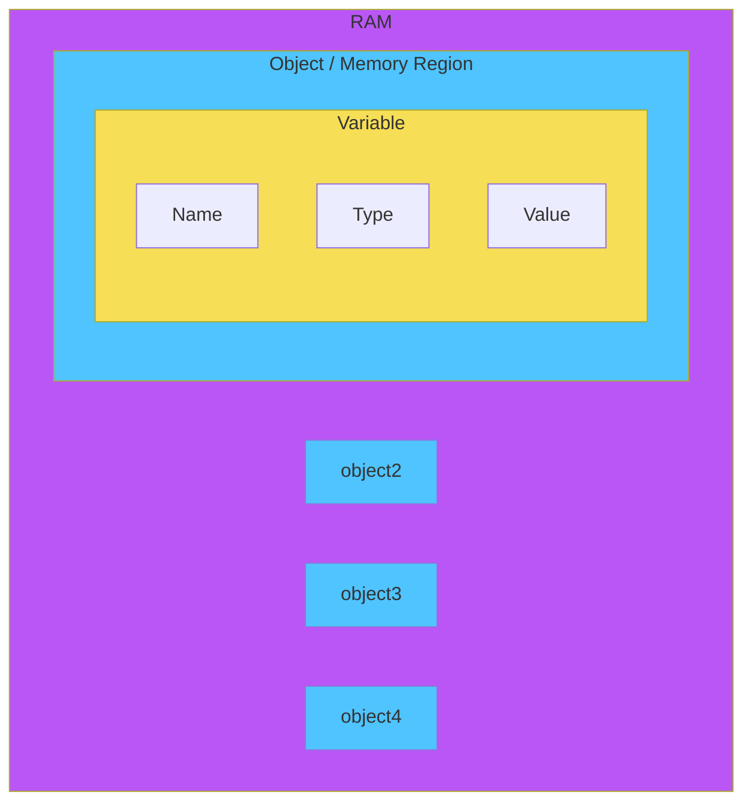
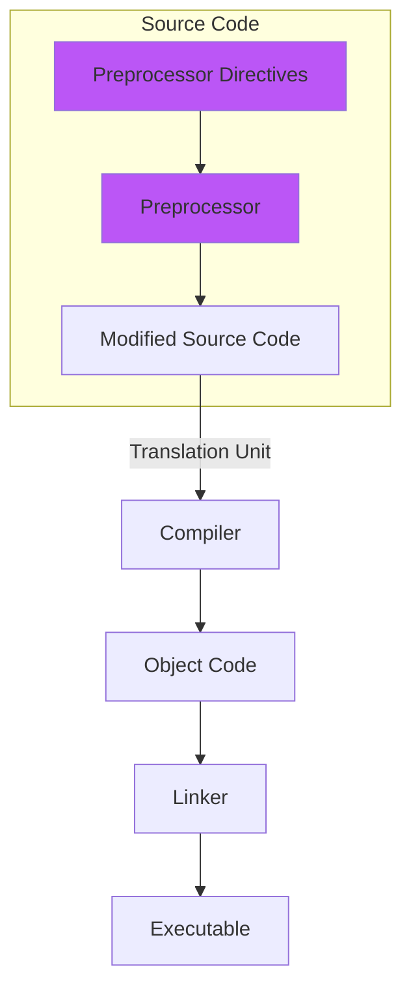
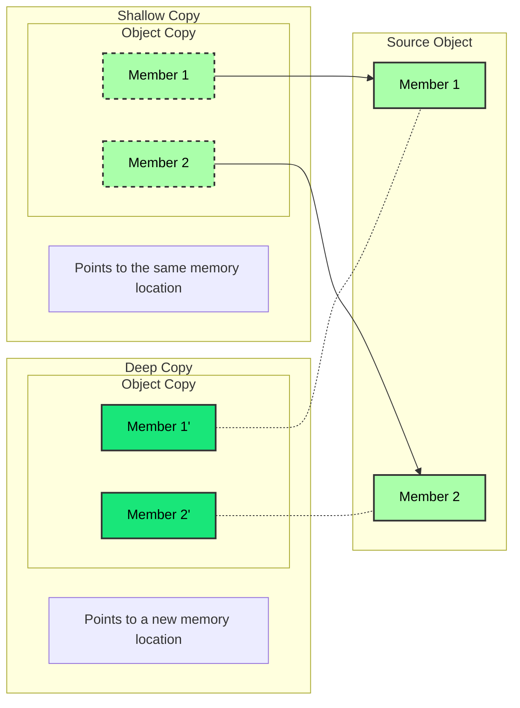

# C++ Modules

## Resources

* [📚 Cplusplus - Best Documentation](https://cplusplus.com/reference/)
* [🗃️ C++ Reference](https://en.cppreference.com/w/)
* [📚 List of Standard Library Headers](https://en.cppreference.com/w/cpp/header)
* [🧑‍🎓 C++ Tutorial - Website Course - LearnCPP](https://www.learncpp.com/)

### Styles Guides

* [📏 Google C++ Guide - Naming Convention](https://google.github.io/styleguide/cppguide.html)

### Notes

* [🗃️ Containers - STL](./Containers.md)
* [🕴️ Class](./Class.md)
* [🖋️ String](./String.md)

## Description
### Keywords

<table>
  <tr>
    <th>Type</th>
    <th>Keywords</th>
    <th>Description</th>
  </tr>
  <tr>
    <td rowspan="12" style="background: #00a651; color: white;">Control Flow</td>
    <td>if</td>
    <td>Used to execute a block of code if a condition is true</td>
  </tr>
  <tr>
    <td>else</td>
    <td>Used to execute a block of code if a condition is false</td>
  </tr>
  <tr>
    <td>switch</td>
    <td>Used to select one of many code blocks to be executed</td>
  </tr>
  <tr>
    <td>case</td>
    <td>Used to specify multiple code blocks in a switch statement</td>
  </tr>
  <tr>
    <td>default</td>
    <td>Used to specify a block of code to be executed if no case matches</td>
  </tr>
  <tr>
    <td>break</td>
    <td>Used to exit a loop or switch statement</td>
  </tr>
  <tr>
    <td>continue</td>
    <td>Used to skip the rest of the code inside a loop and start the next iteration</td>
  </tr>
  <tr>
    <td>goto</td>
    <td>Used to jump to a specific label</td>
  </tr>
  <tr>
    <td>return</td>
    <td>Used to exit a function and return a value</td>
  </tr>
  <tr>
    <td>co_await</td>
    <td>Used to suspend execution until the result of a coroutine is ready (since C++20)</td>
  </tr>
  <tr>
    <td>co_return</td>
    <td>Used to return a value from a coroutine (since C++20)</td>
  </tr>
  <tr>
    <td>co_yield</td>
    <td>Used to yield a value from a coroutine (since C++20)</td>
  </tr>
  <tr>
    <td rowspan="3" style="background-color: #685BC7; color: white;">Loops</td>
    <td>for</td>
    <td>Used to execute a block of code a specified number of times</td>
  </tr>
  <tr>
    <td>while</td>
    <td>Used to execute a block of code as long as a condition is true</td>
  </tr>
  <tr>
    <td>do</td>
    <td>Used to execute a block of code as long as a condition is true, but at least once</td>
  </tr>
  <tr>
    <td rowspan="17" style="background-color: #4fc4ff;"><a href="./README.md#data-types">Type</a></td>
    <td><a href="./Class.md">class</a></td>
    <td>Defines a class</td>
  </tr>
  <tr>
    <td>struct</td>
    <td>Defines a structure</td>
  </tr>
  <tr>
    <td>enum</td>
    <td>Declares an enumeration</td>
  </tr>
  <tr>
    <td>typedef</td>
    <td>Defines a type alias</td>
  </tr>
  <tr>
    <td>void</td>
    <td>Specifies that a function does not return a value</td>
  </tr>
  <tr>
    <td>bool</td>
    <td>Boolean type</td>
  </tr>
  <tr>
    <td>char</td>
    <td>Character type</td>
  </tr>
  <tr>
    <td><a href="./String.md#stdstring">std::string</a></td>
    <td><a href="./String.md#strings">String</a> type</td>
  </tr>
  <tr>
    <td><a href="./String.md#stdstring_view-c17">std::string_view</a></td>
    <td>String view type (since C++17)</td>
  </tr>
  <tr>
    <td>int</td>
    <td>Integer type</td>
  </tr>
  <tr>
  <tr>
    <td>short</td>
    <td>Short integer type</td>
  </tr>
    <td>long</td>
    <td>Long integer type</td>
  </tr>
  <tr>
    <td>signed</td>
    <td>Signed integer type</td>
  </tr>
  <tr>
    <td>unsigned</td>
    <td>Unsigned integer type</td>
  </tr>
  <tr>
    <td>float</td>
    <td>Single precision floating point type</td>
  </tr>
  <tr>
    <td>doubles</td>
    <td>Double precision floating point type</td>
  </tr>
  <tr>
  <tr>
    <td rowspan="4"><a href="./README.md#conversion--casting">Casts</a></td>
    <td><a href="./README.md#dynamic-cast">dynamic_cast</a></td>
    <td>Converts a pointer or reference to a base class to a pointer or reference to a derived class</td>
  </tr>
  <tr>
    <td><a href="./README.md#static-cast">static_cast</a></td>
    <td>Converts a value from one type to another</td>
  </tr>
  <tr>
    <td><a href="./README.md#reinterpret-cast">reinterpret_cast</a></td>
    <td>Converts a pointer or reference to one type to a pointer or reference to another type</td>
  </tr>
  <tr>
    <td><a href="./README.md#const-cast">const_cast</a></td>
    <td>Removes the const qualifier from a variable</td>
  </tr>
    <td rowspan="4" style="background-color: #ee7220;">Bitwise</td>
    <td>bitand</td>
    <td>Bitwise AND operator</td>
  </tr>
  <tr>
    <td>bitor</td>
    <td>Bitwise OR operator</td>
  </tr>
  <tr>
    <td>compl</td>
    <td>Bitwise NOT operator</td>
  </tr>
  <tr>
    <td>xor</td>
    <td>Bitwise XOR operator</td>
  </tr>
  <tr>
    <td rowspan="9" style="background-color: #f6de56;">Logical</td>
    <td>and</td>
    <td>Logical AND operator</td>
  </tr>
  <tr>
    <td>and_eq</td>
    <td>Bitwise AND and assignment operator</td>
  </tr>
  <tr>
    <td>or</td>
    <td>Logical OR operator</td>
  </tr>
  <tr>
    <td>or_eq</td>
    <td>Bitwise OR and assignment operator</td>
  </tr>
  <tr>
    <td>not</td>
    <td>Logical NOT operator</td>
  </tr>
  <tr>
    <td>not_eq</td>
    <td>Not equal to operator</td>
  </tr>
  <tr>
    <td>xor_eq</td>
    <td>Bitwise XOR and assignment operator</td>
  </tr>
  <tr>
    <td>true</td>
    <td>Boolean true value</td>
  </tr>
  <tr>
    <td>false</td>
    <td>Boolean false value</td>
  </tr>
  <tr>
    <td rowspan="10" style="background-color: #bb56f6; color: white;"><a href="./Class.md">Classes</a></td>
    <td>class</td>
    <td>Defines a class</td>
  </tr>
  <tr>
    <td>struct</td>
    <td>Defines a structure</td>
  </tr>
  <tr>
    <td>public</td>
    <td>Specifies that members are accessible from outside the class</td>
  </tr>
  <tr>
    <td>private</td>
    <td>Specifies that members are accessible only from within the class</td>
  </tr>
  <tr>
    <td><a href="./Class.md#protected">protected</td>
    <td>Specifies that members are accessible from within the class and its derived classes</td>
  </tr>
  <tr>
    <td>friend</td>
    <td>Specifies that a function or class is a friend
  </tr>
  <tr>
    <td><a href="./Class.md#virtual-inheritance">virtual</a></td>
    <td>Specifies that a member function is virtual</td>
  </tr>
  <tr>
    <td>explicit</td>
    <td>Specifies that a constructor is explicit</td>
  </tr>
  <tr>
    <td>this</td>
    <td>Pointer to the current object</td>
  </tr>
  <tr>
    <td>operator</td>
    <td>Specifies an operator function</td>
  </tr>
  <tr>
    <td rowspan="8"><a href="./README.md#templates">Templates</a></td>
    <td>template</td>
    <td>Specifies that a function or class is a template</td>
  </tr>
  <tr>
    <td><a href="./README.md#typename">typename</a></td>
    <td>Specifies that a dependent name is a type</td>
  </tr>
  <tr>
    <td>concept</td>
    <td>Specifies a concept (since C++20)</td>
  </tr>
  <tr>
    <td>requires</td>
    <td>Specifies a set of requirements for a template (since C++20)</td>
  </tr>
  <tr>
    <td>export</td>
    <td>Specifies that a template is exported (removed in C++20)</td>
  </tr>
  <tr>
    <td>typename</td>
    <td>Specifies that a dependent name is a type</td>
  </tr>
  <tr>
    <td>using</td>
    <td>Specifies that a template is an alias</td>
  </tr>
  <tr>
    <td>typedef</td>
    <td>Specifies that a template is a type alias</td>
  </tr>
  <tr>
    <td rowspan="2" style="background-color: #969696;">Storage</td>
    <td>auto</td>
    <td>Specifies that the type of the variable that is being declared will be automatically deduced from its initializer</td>
  </tr>
  <tr>
    <td>register</td>
    <td>Specifies that the variable is a register variable</td>
  </tr>
  <tr>
    <td rowspan="2"><a href="./README.md#memory-management">Memory</a></td>
    <td>new</td>
    <td>Allocates memory dynamically</td>
  </tr>
  <tr>
    <td>delete</td>
    <td>Deallocates memory dynamically</td>
  </tr>
  <tr>
    <td rowspan="2">Pointers</td>
    <td>nullptr</td>
    <td>Specifies that a pointer does not point to any memory location</td>
  </tr>
  <tr>
    <td>operator</td>
    <td>Specifies an operator function</td>
  </tr>
  <tr>
    <td rowspan="2">Modifiers</td>
    <td>const</td>
    <td>Declares an object as constant</td>
  </tr>
  <tr>
    <td>volatile</td>
    <td>Indicates that an object may be changed by something external to the program at any time</td>
  </tr>
  <tr>
    <td rowspan="3" style="background-color: #cc2222; color: white;"><a href="./README.md#exceptions">Exceptions</a></td>
    <td><a href="./README.md#try-catch-block">try</a></td>
    <td>Specifies a block of code to be tested for errors</td>
  </tr>
  <tr>
    <td><a href="./README.md#try-catch-block">catch</a></td>
    <td>Specifies a block of code to be executed if an error occurs in the try block</td>
  </tr>
  <tr>
    <td><a href="./README.md#throwing-exceptions">throw</a></td>
    <td>Throws an exception</td>
  </tr>
  <tr>
    <td rowspan="2"><a href="./README.md#namespaces">Namespaces</a></td>
    <td>namespace</td>
    <td>Defines a namespace</td>
  </tr>
  <tr>
    <td>using</td>
    <td>Specifies that a namespace is to be used in the program</td>
  </tr>
  <tr>
    <td rowspan="2">Align</td>
    <td>alignas</td>
    <td>Specifies the alignment of a variable or class</td>
  </tr>
  <tr>
    <td>alignof</td>
    <td>Specifies the alignment of a type</td>
  </tr>
  <tr>
    <td rowspan="11" style="background-color: #2366e2; color: white;">Qualifiers</td>
    <td><a href="./README.md#constants">const</a></td>
    <td>Declares an object as constant</td>
  </tr>
  <tr>
    <td>volatile</td>
    <td>Indicates that an object may be changed by something external to the program at any time</td>
  </tr>
  <tr>
    <td>mutable</td>
    <td>Specifies that a member of a class can be changed even if the object is const</td>
  </tr>
  <tr>
    <td>inline</td>
    <td>Specifies that a function is inline</td>
  </tr>
  <tr>
    <td><a href="./README.md#constexpr">constexpr<a></td>
    <td>Specifies that a function or object is constant and can be evaluated at compile time (since C++11)</td>
  </tr>
  <tr>
    <td>consteval</td>
    <td>Specifies that a function is evaluated at compile time (since C++20)</td>
  </tr>
  <tr>
    <td>constinit</td>
    <td>Specifies that an object has static storage duration and is initialized only once (since C++20)</td>
  </tr>
  <tr>
    <td>thread_local</td>
    <td>Specifies that an object has thread storage duration</td>
  </tr>
  <tr>
    <td>static</td>
    <td>Specifies that an object has static storage duration</td>
  </tr>
  <tr>
    <td>extern</td>
    <td>Specifies that an object is defined elsewhere</td>
  </tr>
  <tr>
    <td>register</td>
    <td>Specifies that a variable is a register variable</td>
  </tr>
  <tr>
    <td rowspan="7" style="background-color: #D7C4B7">Other</td>
    <td>asm</td>
    <td>Specifies that a block of code is assembly code</td>
  </tr>
  <tr>
    <td>auto</td>
    <td>Specifies that the type of the variable that is being declared will be automatically deduced from its initializer</td>
  </tr>
  <tr>
    <td>decltype</td>
    <td>Specifies that the type of a variable is the type of an expression</td>
  </tr>
  <tr>
    <td>sizeof</td>
    <td>Specifies the size of a type or object</td>
  </tr>
  <tr>
    <td>static_assert</td>
    <td>Specifies a compile-time assertion</td>
  </tr>
  <tr>
    <td>typeid</td>
    <td>Specifies the type of an object</td>
  </tr>
  <tr>
    <td>union</td>
    <td>Defines a union</td>
  </tr>
</table>

#### Special Keywords / Identifiers

<table>
  <th>Indentifier</th>
  <th>Description</th>
  <tr>
    <td>override</td>
    <td>Specifies that a function is intended to override a virtual function in a base class</td>
  </tr>
  <tr>
    <td>final</td>
    <td>Specifies that a class cannot be inherited from or that a virtual function cannot be overridden</td>
  </tr>
  <tr>
    <td>import</td>
    <td>Specifies that a module is imported (since C++20)</td>
  </tr>
  <tr>
    <td>module</td>
    <td>Specifies that a module is defined (since C++20)</td>
  </tr>
  <tr>
    <td><a href="./README.md#include-directive">include</a></td>
    <td>Preprocessor directive that includes a file</td>
  </tr>
</table>

### History

- C was developed in 1972 by Dennis Ritchie at Bell Telephone laboratories.
- C++ (pronounced “see plus plus”) was developed by Bjarne Stroustrup at Bell Labs as an extension to C, starting in 1979. C++’s claim to fame results primarily from the fact that it is an object-oriented language.

### Usage

C++ excels in situations where high performance and precise control over memory and other resources is needed. Here are a few common types of applications that most likely would be written in C++:
-  Video games
-  Real-time systems (e.g. for transportation, manufacturing, etc…)
-  High-performance financial applications (e.g. high frequency trading)
-  Graphical applications and simulations
-  Productivity / office applications
-  Embedded software
-  Audio and video processing
-  Artificial intelligence and neural networks

### Compilation / Linking
Compiling:


Linking:


#### Compiler extensions

The C++ language is standardized by the International Organization for Standardization (ISO), and the standard is called the C++ Standard. However, many compilers provide extensions that go beyond the standard. These extensions can be useful, but they can also make your code less portable.

- To prevent the use of compiler-specific extensions, you can use the `-pedantic` flag when compiling your code. This flag tells the compiler to strictly adhere to the C++ Standard and to issue warnings when non-standard extensions are used.

```shell
g++ -pedantic -o myProgram myProgram.cpp
```

or
  
```shell
g++ -pedantic-errors -o myProgram myProgram.cpp
```

#### Warning flags

- `-Wall` flag: This flag tells the compiler to enable most warning messages.
- `-Wextra` flag: This flag tells the compiler to enable some extra warning messages.
- `-Werror` flag: This flag tells the compiler to treat all warnings as errors.
  - It's a good pratice to convert all warnings to errors, so that the code will not compile if there are any warnings.

```shell
g++ -Wall -Wextra -Werror -o myProgram myProgram.cpp
```

#### Standard flags

- `-std=value` flag: This flag tells the compiler to use the specified version of the C++ Standard.
  - Example:
  ```shell
  g++ -std=c++17 -o myProgram myProgram.cpp
  ```

| Version | Year | Major Features |
|---------|------|----------------|
| C++98   | 1998 | - Initial Standard<br>- Templates<br>- Exceptions<br>- Namespaces |
| C++03   | 2003 | - Minor bug fixes to C++98 |
| C++11   | 2011 | - Auto keyword<br>- Range-based for loops<br>- Lambda expressions<br>- Smart pointers |
| C++14   | 2014 | - Generic lambda expressions<br>- Binary literals<br>- Digit separators |
| C++17   | 2017 | - Inline variables<br>- Structured bindings<br>- If and switch with initializers |
| C++20   | 2020 | - Modules<br>- Coroutines<br>- Concepts<br>- Ranges |
| C++23   | 2023 | - Expected<br>- Contracts<br>- Networking TS<br>- Executors TS |

### Building

Building:

Because there are multiple steps involved, the term **building** is often used to refer to the full process of **converting source code files into an executable** that can be run. A specific executable produced as the result of building is sometimes called a **build**.

Command line:

```bash
g++ -o myProgram myProgram.cpp
```

#### Building configurations

- **Debug build**: This build is used during development. It includes debugging symbols and is not optimized. This build is typically slower and larger than a release build.
  - `-g` flag: This flag tells the compiler to include debugging information in the executable.
  - `-gdb` flag: This flag tells the compiler to include debugging information that is compatible with the GNU debugger (gdb).
  - `-O0` flag: This flag tells the compiler not to optimize the code.
  - Example:
  ```shell
  g++ -g -gdb -O0 -o myProgram myProgram.cpp
  ```
  or
  ```shell
  g++ -ggdb -o myProgram myProgram.cpp
  ```

- **Release build**: This build is used for distribution. It is optimized for speed and size, and does not include debugging symbols. This build is typically faster and smaller than a debug build.
  - `-O2` flag: This flag tells the compiler to optimize the code for speed.
  - `-DNDEBUG` flag: This flag tells the compiler to define the `NDEBUG` preprocessor macro, which can be used to conditionally compile code.
  - Example:
  ```shell
  g++ -O2 -DNDEBUG -o myProgram myProgram.cpp
  ```

## Introduction

- `statements`: A statement is a single line of code that performs a specific action. For example, `std::cout << "Hello, world!" << std::endl;` is a statement that outputs the text "Hello, world!" to the console.

- `expressions`: An expression is a combination of literals, variables, operators, and function calls that evaluates to a single value. For example, `2 + 3` is an expression that evaluates to `5`.

- `functions`: A function is a block of code that performs a specific task. Functions are used to organize code into manageable pieces, and to facilitate code reuse. For example, `std::cout << "Hello, world!" << std::endl;` is a function call that outputs the text "Hello, world!" to the console.

- `libraries`: A library is a collection of precompiled functions that can be used in your program. Libraries are used to provide functionality that is not built into the language itself. For example, the `iostream` library provides functionality for input and output.

### Comments

- Single-line comments: `//`
- Multi-line comments: `/* */`

### Objects and Variables



- `object`: An object is a region of memory with a type that stores a value. For example, `int x = 5;` creates an object named `x` that stores the value `5`.

- `variable`: A variable is a named object. For example, `int x = 5;` creates a variable named `x` that stores the value `5`.
  - `variable instantiation`: The process of creating a variable is called variable instantiation.
    - `declaration`: The process of introducing a new name in the program.
      ```cpp
      int x; // declares a variable named x of type int
      ```
      - multiple declarations can be done in a single line.
      ```cpp
      int x, y, z; // declares three variables named x, y, and z of type int
      ```
    - `definition`: The process of allocating storage for a variable and possibly initializing it.
      - assignement operator `=` is used to initialize a variable.
      ```cpp
      int x = 5; // defines a variable named x of type int and initializes it with the value 5
      ```
    - `initialization`: The process of giving a variable an initial value.

      | Initialization | Description |
      |----------------|-------------|
      | `int a;` | Default initialization (for built-in types, this means uninitialized) |
      | `int a = 5;` | Copy initialization |
      | `int a( 5 );` | Direct initialization |
      | `int a{ 5 };` | Direct list initialization (since C++11) |
      | `int a = { 5 };` | Copy list initialization (since C++11) |
      | `int a{};` | Value initialization (since C++11, `a` is initialized to `0`) |

  - `instance`: A variable that has been defined and initialized is called an instance of a variable.
  - `data type`: The type of data that a variable can store is called its data type.

### [IoStream](https://www.learncpp.com/cpp-tutorial/introduction-to-iostream-cout-cin-and-endl/)

Includes:

```cpp
#include <iostream>
```

The `iostream` library provides functionality for input and output. It contains two main classes: `std::istream` and `std::ostream`.

#### STD::COUT

`cout` means "character output". It is an object of the `ostream` class that represents the standard output stream. It is used to output data to the console.
  - It buffers the output, which means that the output is not immediately written to the console. Instead, it is stored in a **buffer** until the buffer is full or until the buffer is flushed.

```cpp
std::cout << "Hello, ";
std::cout << "world!";
// Output: Hello, world!
```

- `<<`: The `<<` operator is used to insert data into the output stream.
  - It is called the **insertion operator**.
  - It can be used multiple times in a single statement to insert multiple pieces of data into the output stream.

- `std::cerr`: The `std::cerr` object is an instance of the `std::ostream` class that is used for writing error messages to the console.
- `std::clog`: The `std::clog` object is an instance of the `std::ostream` class that is used for writing log messages to the console.

#### STD::ENDL

`endl` means "end line". It is a special value that represents a newline character. It is used to insert a newline character into the output stream and flush the stream.
  - It is equivalent to `'\n'` followed by `std::flush`.
    - `std::flush`: The `std::flush` manipulator is used to flush the output stream, which means that any buffered output is written to the console.
    - **best practice is to use `\n` instead of `std::endl`** to insert a newline character into the output stream, because `std::endl` flushes the stream, which can be inefficient (It’s more efficient to let the system flush itself periodically (which it has been designed to do efficiently)). As a result, **`std::endl` should only be used when you need to flush the stream**.
  - It is called a manipulator because it modifies the behavior of the output stream.

```cpp
std::cout << "Hello, " << std::endl;
std::cout << "world!";
// Output: Hello,
//         world!
```

#### STD::CIN

`cin` means "character input". It is an object of the `istream` class that represents the standard input stream. It is used to read data from the console.
  - `>>`: The `>>` operator is used to extract data from the input stream.
    - It is called the **extraction operator**.
    - It can be used multiple times in a single statement to extract multiple pieces of data from the input stream.

```cpp
int x{};
std::cin >> x;
std::cout << "You entered: " << x;
// Output: You entered: [value of x]
```


### Literals

Literal is a fixed value that is written directly in the source code. For example, `5` is a literal integer value.

They are also called literal constants.

```cpp
#include <iostream>

int main()
{
	std::cout << 5 << "\n"; // 5 is a Literal Integer
	return (0);
}
```

### [Operators](https://www.learncpp.com/cpp-tutorial/introduction-to-literals-and-operators/)

Operators are symbols that perform operations on one or more operands. For example, `+` is an operator that performs addition on two operands.

4 Different arity of operators:

<table>
  <th>Arity</th>
  <th>Description</th>
  <th>Example</th>
  <tr>
    <td>Unary</td>
    <td>Operates on a single operand</td>
    <td><code>-5</code></td>
  </tr>
  <tr>
    <td>Binary</td>
    <td>Operates on two operands</td>
    <td><code>5 + 3</code></td>
  </tr>
  <tr>
    <td>Ternary</td>
    <td>Operates on three operands</td>
    <td><code>condition ? true_value : false_value</code></td>
  </tr>
  <tr>
    <td>Nullary</td>
    <td>Operates on no operands</td>
    <td><code>sizeof(int)</code></td>
</table>

### Expressions

An expression is a sequence of literals, variables, operators, and function calls that calculates a single value. The process of executing an expression is called **evaluation**, and the single value produced is called the **result** of the expression.

For example, `2 + 3` is an expression that evaluates to `5`.

```cpp
#include <iostream>

int main()
{
  std::cout << 2 + 3 << "\n"; // 2 + 3 is an expression that evaluates to 5
  return (0);
}
```

#### Different Types of Expressions

- **Expression Statement**: An expression followed by a semicolon is called an expression statement. For example, `2 + 3;` is an expression statement.
- **Compound Expression**: An expression that contains other expressions is called a compound expression. For example, `2 + (3 * 4);` is a compound expression.

### [Polymorphism](https://www.geeksforgeeks.org/cpp-polymorphism/)

The word “polymorphism” means having many forms. In simple words, we can define polymorphism as the ability of a message to be displayed in more than one form. A real-life example of polymorphism is a person who at the same time can have different characteristics. A man at the same time is a father, a husband, and an employee. So the same person exhibits different behavior in different situations. This is called polymorphism. Polymorphism is considered one of the important features of Object-Oriented Programming.

- **Compile-time Polymorphism**: Compile-time polymorphism is achieved by function overloading and operator overloading.

- **Run-time Polymorphism**: Run-time polymorphism is achieved by function overriding.

Polymorphism is the ability of a function to operate on different types of data. For example, the `+` operator is polymorphic because it can be used to add integers, floating-point numbers, and strings.

## Functions

A function is a block of code that performs a specific task. Functions are used to organize code into manageable pieces, and to facilitate code reuse.

```cpp
returnType functionName(parameters) // function header
{
  // function body
}
```

- `caller`: The code that calls a function is called the caller.
- `callee`: The code inside the function is called the callee.

### Function Return

- `return`: The `return` statement is used to return a value from a function. When a `return` statement is executed, the function stops executing and the value is returned to the caller.

```cpp
#include <iostream>

int add(int x, int y)
{
  return x + y;
}

int main()
{
  std::cout << add(2, 3) << "\n"; // Output: 5
  return (0);
}
```

- Return type specifies the type of value that the function returns. For example, `int` is the return type of the `add` function.
  - Good practice is to specify the return type of a function, even if it returns nothing. This makes the code easier to read and understand.
  - `void`: The `void` keyword is used to specify that a function does not return a value.
    - For example, `void printHello() { std::cout << "Hello!\n"; }` is a function that does not return a value.


### Don't Repeat Yourself (DRY)

**DRY**: The DRY principle states that code should not be repeated. Instead, it should be organized into functions that can be called multiple times.

If you need to do something more than once, consider how to modify your code to remove as much redundancy as possible. Variables can be used to store the results of calculations that need to be used more than once (so we don’t have to repeat the calculation). Functions can be used to define a sequence of statements we want to execute more than once. And loops (which we’ll cover in a later chapter) can be used to execute a statement more than once.

Like all best practices, DRY is meant to be a **guideline, not an absolute**.

Sometimes, it’s better to repeat code than to create a function that’s only used once. But in general, if you find yourself copying and pasting code, you should consider whether there’s a better way to structure your program.

### Unreferenced Parameters

If a parameter is not used in a function, the compiler will issue a warning.

In a function declaration, the parameter name can be omitted if the parameter is not used.

```cpp
void DoSomething(int x, int /*y*/)
{
  std::cout << x << "\n";
}
```

### Local Variables

A variable that is declared inside a function is called a local variable. Local variables are only accessible within the function in which they are declared.

```cpp
#include <iostream>

void printValue()
{
  int x = 5; // x is a local variable
  std::cout << x << "\n";
}

int main()
{
  printValue();
  return (0);
}
```

#### Variable Scope

The scope of a variable is the region of code in which the variable is accessible. The scope of a local variable is the function in which it is declared.

- `In scope`: A variable is in scope if it can be accessed at a particular point in the code.
- `Out of scope`: A variable is out of scope if it cannot be accessed at a particular point in the code.

The term “going out of scope” is typically applied to objects rather than identifiers. We say an object goes out of scope at the end of the scope (the end curly brace) in which the object was instantiated.

#### Defining Variables

Good pratice: Define as close to where they are used as possible.

```cpp
#include <iostream>

int main()
{
  int x = 5;                // x is defined here
  std::cout << x << "\n";   // x is used here
  return (0);
}
```

### Function arrays

Functions can be stored in arrays. This can be useful when you want to call a function based on an index or other criteria.

```cpp
#include <iostream>

int add(int x, int y)
{
  return x + y;
}

int subtract(int x, int y)
{
  return x - y;
}

int multiply(int x, int y)
{
  return x * y;
}

int divide(int x, int y)
{
  return x / y;
}

int main()
{
  int (*functionArray[])(int, int) = { add, subtract, multiply, divide };

  for (int i = 0; i < 4; ++i)
  {
    std::cout << functionArray[i](4, 2) << "\n";
  }

  return (0);
}
```

### Use Functions Effectively

- Groups of statements that appear more than once in a program should generally be made into a function. For example, if we’re reading input from the user multiple times in the same way, that’s a great candidate for a function. If we output something in the same way in multiple places, that’s also a great candidate for a function.
- Code that has a well-defined set of inputs and outputs is a good candidate for a function, (particularly if it is complicated). For example, if we have a list of items that we want to sort, the code to do the sorting would make a great function, even if it’s only done once. The input is the unsorted list, and the output is the sorted list. Another good prospective function would be code that simulates the roll of a 6-sided dice. Your current program might only use that in one place, but if you turn it into a function, it’s ready to be reused if you later extend your program or in a future program.
- A function should **generally perform one** (and only one) **task**.
- When a function becomes too long, too complicated, or hard to understand, it can be split into multiple sub-functions. This is called **refactoring**.

## Defining and Declaring

<table class="cpp-table">
  <tr>
    <th>Term</th>
    <th>Technical Meaning</th>
    <th>Examples</th>
  </tr>
  <tbody>
    <tr>
      <td>Declaration</td>
      <td>Tells compiler about an identifier and its associated type information.</td>
      <td>
        void foo(); // function forward declaration (no body)<br>
        void goo() {}; // function definition (has body)<br>
        int x; // variable definition
      </td>
    </tr>
    <tr>
      <td>Definition</td>
      <td>Implements a function or instantiates a variable.<br>Definitions are also declarations.</td>
      <td>
        void foo() { } // function definition (has body)<br>
        int x; // variable definition
      </td>
    </tr>
    <tr>
      <td>Pure declaration</td>
      <td>A declaration that isn’t a definition.</td>
      <td>void foo(); // function forward declaration (no body)</td>
    </tr>
    <tr>
      <td>Initialization</td>
      <td>Provides an initial value for a defined object.</td>
      <td>int x { 2 }; // 2 is the initializer</td>
    </tr>
  </tbody>
</table>

### Declaration

A declaration is a statement that introduces an identifier and describes its type. Declarations are used to tell the compiler about the existence of an identifier before it is used.

#### Forward Declaration

A forward declaration is a declaration that tells the compiler about the existence of an identifier without providing its definition. Forward declarations are used to break circular dependencies between functions and classes.

```cpp
void foo(); // forward declaration
```

### One Definition Rule (ODR)

The One Definition Rule (ODR) is a rule in the C++ language that states that an object or function can only have one definition in a program.

ODR has 3 parts:
1.  Within a file, each function, variable, type, or template can only have one definition. Definitions occurring in different scopes (e.g. local variables defined inside different functions, or functions defined inside different namespaces) do not violate this rule.
2. Within a program, each function or variable can only have one definition. This rule exists because programs can have more than one file.
3. Types, templates, inline functions, and inline variables are allowed to have duplicate definitions in different files, so long as each definition is identical.

## Scope

### Scope Regions

Area of source code where all declared identifiers are considered distinct from names declared in other scopes (much like the cities in our analogy). Two identifiers with the same name can be declared in separate scope regions without causing a naming conflict. However, within a given scope region, all identifiers must be unique, otherwise a naming collision will result.

### Namespace Scope

A namespace provides another type of scope region (called namespace scope) that allows you to declare names inside of it for the purpose of disambiguation. Any names declared inside the namespace won't be mistaken for identical names in other scopes.

Namespaces are often used to group related identifiers in a large project to help ensure they don't inadvertently collide with other identifiers. For example, if you put all your math functions in a namespace named math, then your math functions won't collide with identically named functions outside the math namespace.

## Namespaces

Namespaces are used to organize code into logical groups and to prevent naming conflicts. A namespace is a region of code in which identifiers have meaning. Namespaces are used to group related identifiers together.

```cpp
namespace math
{
  int add(int x, int y)
  {
    return x + y;
  }
}

int main()
{
  std::cout << math::add(2, 3) << "\n"; // Output: 5
  return (0);
}
```

### STD Namespace

The `std` namespace is a namespace that contains the standard library. The standard library is a collection of precompiled functions that provide functionality that is not built into the language itself.

```cpp
#include <iostream>

int main()
{
  std::cout << "Hello, world!\n"; // Use the std namespace to access the cout object
  return (0);
}
```

### Scope Resolution Operator (`::`)

The scope resolution operator `::` is used to access identifiers in a namespace. It is used to specify the namespace or class to which an identifier belongs.

```cpp
namespace::identifier
```

- Good practice:
  - Use explicit namespace prefixes to access identifiers defined in a namespace.
  - Avoid using the `using namespace std;` directive. Instead, use the scope resolution operator to access identifiers in the `std` namespace.

## [Preprocessor](https://www.learncpp.com/cpp-tutorial/introduction-to-the-preprocessor/)

The preprocessor is a program that processes the source code before it is compiled. It is used to perform tasks such as including header files, defining macros, and conditional compilation.



### Preprocessor Directives

Preprocessor directives are special commands that are used to tell the preprocessor to perform a specific task. Preprocessor directives begin with a `#` symbol.

#### Include Directive

The `#include` directive is used to include the contents of a file in the source code. The contents of the file are inserted into the source code at the location of the `#include` directive.

```cpp
#include <iostream>
```

- `<>`: The `<>` characters are used to include system header files. System header files are header files that are provided by the compiler.
- `""`: The `""` characters are used to include user-defined header files. User-defined header files are header files that are created by the user.

#### Define Directive

The `#define` directive is used to define a macro. A macro is a fragment of code that has been given a name. When the name is used, it is replaced by the contents of the macro.

```cpp
#define IDENTIFIER substitution
```

Example:

```cpp
#define PI 3.14159
```

##### Macro Substitution

When the preprocessor encounters a macro name in the source code, it replaces the macro name with the contents of the macro.

```cpp
#include <iostream>

#define PI 3.14159

int main()
{
  std::cout << PI << "\n"; // Output: 3.14159
  return (0);
}
```

##### Scope of Define Directive

Define are file-scoped, meaning that they are valid from the point at which they are defined until the end of the file.

#### Conditional Compilation

The `#if`, `#ifdef`, and `#ifndef` directives are used to conditionally compile code. Conditional compilation is used to include or exclude code based on certain conditions.

```cpp
#ifdef IDENTIFIER
  // code to include if IDENTIFIER is defined
#endif
```

### Header Files

Header files allow us to put declarations in one location and then import them wherever we need them. This can save a lot of typing in multi-file programs.

Extension: `.hpp` or `.h`

Header files consist of two parts:
- **Header guards**: Header guards are used to prevent the contents of a header file from being included more than once in a translation unit.
- **Content**: The content of the header file, which typically includes declarations for functions, classes, and other identifiers.

```cpp
#ifndef HEADER_NAME_HPP
  #define HEADER_NAME_HPP

// header file content

#endif
```

Good Practice: Source files should include their paired header file, help to ensure that the declarations in the header file match the definitions in the source file.

#### Header Guards (`#ifndef`, `#define`, `#endif`)

Header guards are used to prevent the contents of a header file from being included more than once in a translation unit. Header guards are typically implemented using `#ifndef`, `#define`, and `#endif` directives.

```cpp
#ifndef HEADER_NAME_HPP
  #define HEADER_NAME_HPP

// header file content

#endif
```

- `#ifndef`: The `#ifndef` directive checks if the identifier has not been defined.
- `#define`: The `#define` directive defines the identifier.
- `#endif`: The `#endif` directive ends the conditional compilation block.

##### Pragma Once

`#pragma once` is a non-standard preprocessor directive that is used to prevent the contents of a header file from being included more than once in a translation unit. `#pragma once` is supported by most modern compilers and is considered a better alternative to header guards.

```cpp
#pragma once

// header file content
```

## Debugging

### Flags

- `-g`: This flag tells the compiler to include debugging information in the executable.

- `D_DEBUG`: This flag tells the compiler to define the `_DEBUG` preprocessor macro, which can be used to conditionally compile code.

### Debugging Tools

- **Compiler Warnings**: Compiler warnings are messages that are issued by the compiler when it detects potential issues in the source code. Compiler warnings can help you identify and fix problems in your code.

- **Debugger**: A debugger is a tool that allows you to step through your code line by line, inspect variables, and set breakpoints. Debuggers are useful for finding and fixing bugs in your code.

- **Print Statements**: Print statements are statements that output information to the console. Print statements can help you understand the flow of your program and identify issues.

- **Static Analysis Tools**: Static analysis tools are tools that analyze your code without executing it. Static analysis tools can help you identify potential issues in your code.

### [Logger](https://www.learncpp.com/cpp-tutorial/more-debugging-tactics/)

A logger is a tool that is used to record information about the execution of a program. Loggers are useful for tracking the flow of a program and identifying issues.

```cpp
#include <iostream>
#include <plog/Log.h>

int main()
{
  plog::init(plog::debug, "Logfile.txt");
  LOGD << "Hello, world!";
  return (0);
}
```

```shell
g++ -o myProgram myProgram.cpp -lplog
```

```txt
[2019-03-10 15:00:00.000] DEBUG [main:2] Hello, world!
```

### Debugger

- **GDB**: The GNU Debugger (GDB) is a powerful debugger that is used to debug C and C++ programs. GDB allows you to step through your code line by line, inspect variables, and set breakpoints.

- **LLDB**: The LLDB debugger is a debugger that is used to debug C and C++ programs. LLDB is part of the LLVM project and is designed to be a replacement for GDB.

- **Visual Studio Debugger**: The Visual Studio Debugger is a debugger that is used to debug C++ programs in the Visual Studio IDE. The Visual Studio Debugger allows you to step through your code line by line, inspect variables, and set breakpoints.
  - 🔗 [How to setup a c/cpp project in VSCode + Setup Debug for multiple files](https://dev.to/talhabalaj/setup-visual-studio-code-for-multi-file-c-projects-1jpi)

#### Leak Detection

- **Valgrind**: Valgrind is a memory debugging tool that is used to detect memory leaks, memory errors, and other memory-related issues in C and C++ programs.

- **AddressSanitizer**: AddressSanitizer is a memory error detector that is used to detect memory errors in C and C++ programs. AddressSanitizer is part of the LLVM project and is designed to be a replacement for Valgrind.

## Data Types

### Fundamental Data Types

<table>
  <tr>
    <th>Types</th>
    <th>Category</th>
    <th>Meaning</th>
    <th>Example</th>
  </tr>
  <tbody>
  <tr>
    <td>
      float<br>
      double<br>
      long double
    </td>
    <td>Floating Point</td>
    <td>a number with a fractional part</td>
    <td>3.14159</td>
  </tr>
  <tr>
    <td>bool</td>
    <td>Integral (Boolean)</td>
    <td>true or false</td>
    <td>true</td>
  </tr>
  <tr>
    <td>
      char<br>
      wchar_t<br>
      char8_t (C++20)<br>
      char16_t (C++11)<br>
      char32_t (C++11)
    </td>
    <td>Integral (Character)</td>
    <td>a single character of text</td>
    <td>‘c’</td>
  </tr>
  <tr>
    <td>
      short int<br>
      int<br>
      long int<br>
      long long int (C++11)
    </td>
    <td>Integral (Integer)</td>
    <td>positive and negative whole numbers, including 0</td>
    <td>64</td>
  </tr>
  <tr>
    <td>std::nullptr_t (C++11)</td>
    <td>Null Pointer</td>
    <td>a null pointer</td>
    <td>nullptr</td>
  </tr>
  <tr>
    <td>void</td>
    <td>Void</td>
    <td>no type</td>
    <td>n/a</td>
  </tr>
</tbody>
</table>

### Conversion / Casting

- **Implicit Conversion**: Implicit conversion is a conversion that is performed automatically by the compiler. Implicit conversion is also known as coercion.
  - Example:
  ```cpp
  int x = 5;
  double y = x; // implicit conversion from int to double
  ```
- **Explicit Conversion**: Explicit conversion is a conversion that is performed by the programmer using a cast. Explicit conversion is also known as type casting.
  - Example:
  ```cpp
  double x = 5.5;
  int y = static_cast<int>(x); // explicit conversion from double to int
  ```
- **C-Style Cast**: The C-style cast is a type of cast that is used to perform both implicit and explicit conversions. The C-style cast is not recommended because it is not as safe as the other types of casts.
  - Example:
  ```cpp
  double x = 5.5;
  int y = (int)x; // C-style cast from double to int
  ```

#### C-Style Cast

##### Reinterpretation Cast

A conversion can be both implicit and explicit. The conversion can be reinterprated or simply casted.

```cpp
float x = 5.5;
void *y = &x; // implicit reinterpretation cast
void *z = (void*)&x; // explicit reinterpretation cast
```

- `void*`: A void pointer is a pointer that has no associated data type. A void pointer can point to any data type.

Good practice: Use explicit casts to make the code more readable and to make the conversion explicit. So that the *reader knows that the **conversion is intentional***.

##### Promotion / Demotion Cast

- A promotion cast is a cast that converts a value to a larger data type.
- A demotion cast is a cast that converts a value to a smaller data type.

```cpp
int x = 5;
double y = x; // implicit promotion cast
int z = (int)y; // explicit demotion cast
```

It is important to note that demotion casts can result in data loss. For example, when converting a `double` to an `int`, the fractional part of the `double` is truncated.

##### Type Qualifier Cast

A type qualifier cast is a cast that adds or removes a type qualifier. Type qualifiers include `const`, `volatile`, and `mutable`.

```cpp
int x = 5;
const int y = x; // implicit type qualifier cast
int z = (int)y; // explicit type qualifier cast
```

You should rarely need to use type qualifier casts, as the compiler will usually handle type qualifiers automatically.

##### Downcast / Upcast

- A downcast is a cast that converts a base class pointer to a derived class pointer.
- An upcast is a cast that converts a derived class pointer to a base class pointer.

```cpp
class Base
{
public:
  virtual void foo() {}
};

class Derived : public Base
{
public:
  void bar() {}
};

int main()
{
  Derived d;
  Base* b = &d; // implicit upcast
  Derived* d2 = (Derived*)b; // explicit downcast
  return (0);
}
```

#### Static Cast

```cpp
static_cast<new_type>(expression)
```

The `static_cast` operator is used to perform explicit conversions **between related types**. The `static_cast` operator is **safer than the C-style** cast because it performs additional checks to ensure that the conversion is valid.

```cpp
double x = 5.5;
int y = static_cast<int>(x); // explicit conversion from double to int
```

#### Dynamic Cast

```cpp
dynamic_cast<new_type>(expression)
```

The `dynamic_cast` operator is used to perform explicit conversions between **polymorphic types**. A polymorphic type is a type that has at least one virtual function. Take place at **runtime**.

Dynamic cast check the RTTI (Run-Time Type Information) to ensure that the conversion is valid.

```cpp
class Base
{
public:
  virtual void foo() {}
};

class Derived : public Base
{
public:
  void bar() {}
};

int main()
{
  Base* b = new Derived;
  Derived* d = dynamic_cast<Derived*>(b); // explicit downcast
  return (0);
}
```

In case of **failure**, it returns a **`nullptr` (cpp++11) or `NULL` (cpp++98)**. In case of a **reference**, it **throws a `std::bad_cast`** exception because references cannot be `nullptr` or `NULL`.

```cpp
try {
  Derived& d = dynamic_cast<Derived&>(*b); // explicit downcast
} catch (std::bad_cast& e) {
  std::cout << "Error: " << e.what() << "\n";
}
```

#### Reinterpret Cast

```cpp
reinterpret_cast<new_type>(expression)
```

The `reinterpret_cast` operator is used to perform explicit conversions between **unrelated types**. The `reinterpret_cast` operator is **unsafe** because it does not perform any checks to ensure that the conversion is valid.

```cpp
float x = 5.5;
void* y = reinterpret_cast<void*>(&x); // explicit reinterpretation cast
```

Common use cases for `reinterpret_cast` include converting between pointers and integers, and converting between pointers to different types.

#### Const Cast

```cpp
const_cast<new_type>(expression)
```

The `const_cast` operator is used to add or remove the `const` qualifier from a variable. The `const_cast` operator is used to perform explicit conversions between **const and non-const types**.

```cpp
const int x = 5;
int y = const_cast<int>(x); // explicit type qualifier cast
```

#### Typecast Operator

```cpp
operator new_type()
```

The typecast operator is a user-defined conversion operator that is used to define how a class is converted to another type.

```cpp
class MyClass
{
public:
  operator int() { return 5; } // typecast operator
};

int main()
{
  MyClass myClass;
  int x = myClass; // implicit typecast
  return (0);
}
```

### Literals


A literal is a fixed value that is written directly in the source code. For example, `5` is a literal integer value.

#### Literal Suffixes

<table>
  <tbody>
    <tr>
      <th>Data type</th>
      <th>Suffix</th>
      <th>Meaning</th>
      <th>Example</th>
    </tr>
    <tr>
      <td>integral</td>
      <td>u or U</td>
      <td>unsigned int</td>
      <td>10U</td>
    </tr>
    <tr>
      <td>integral</td>
      <td>l or L</td>
      <td>long</td>
      <td>10L</td>
    </tr>
    <tr>
      <td>integral</td>
      <td>ul, uL, Ul, UL, lu, lU, Lu, LU</td>
      <td>unsigned long</td>
      <td>10UL</td>
    </tr>
    <tr>
      <td>integral</td>
      <td>ll or LL</td>
      <td>long long</td>
      <td>10LL</td>
    </tr>
    <tr>
      <td>integral</td>
      <td>ull, uLL, Ull, ULL, llu, llU, LLu, LLU</td>
      <td>unsigned long long</td>
      <td>10ULL</td>
    </tr>
    <tr>
      <td>integral</td>
      <td>z or Z</td>
      <td>The signed version of std::size_t (C++23)</td>
      <td>10Z</td>
    </tr>
    <tr>
      <td>integral</td>
      <td>uz, uZ, Uz, UZ, zu, zU, Zu, ZU</td>
      <td>std::size_t (C++23)</td>
      <td>10UZ</td>
    </tr>
    <tr>
      <td>floating point</td>
      <td>f or F</td>
      <td>float</td>
      <td>10.0f</td>
    </tr>
    <tr>
      <td>floating point</td>
      <td>l or L</td>
      <td>long double</td>
      <td>10.0L</td>
    </tr>
    <tr>
      <td>string</td>
      <td>s</td>
      <td>std::string</td>
      <td>"hello"s</td>
    </tr>
    <tr>
      <td>string</td>
      <td>sv</td>
      <td>std::string_view</td>
      <td>"hello"sv</td>
    </tr>
  </tbody>
</table>

#### Avoid Magic Numbers

A magic number is a fixed value that is used directly in the source code. Magic numbers can make the code difficult to read and maintain. Instead of using magic numbers, it is better to use named constants.

```cpp
if (maxDay == 5) // magic number
{
  // code
}
```
```cpp
const int maxWorkDays = 5; // named constant
if (maxDay == maxWorkDays)
{
  // code
}
```

## Constants

A constant is a value that cannot be changed. Constants are used to represent fixed values in a program.

Constants are used to make code more readable and maintainable. Constants are also used to prevent accidental changes to values.

They also improve optimization by allowing the compiler to make certain assumptions about the code.

### Literal Constants

A literal constant is a fixed value that is written directly in the source code. **Not associated with an identifier**.
  - For example, `5` is a literal integer value.

### Named Constants

A named constant is a constant that is given a name. Named constants are used to represent fixed values in a program.

```cpp
const int x = 5;
```

### Positioning of Constants

#### With functions

1. `const` **before** a function: This is actually quite rare and not typically seen. If it's used, it would modify the **return type of the function** to be a constant type.

2. `const` **after** a function: This is used in member functions to specify that the function **will not modify any member variables** of the class (i.e., it will not change the state of the object). This is known as a const member function.

Here's an example:

```cpp
class MyClass {
    int value;

public:
    MyClass(int v) : value(v) {}

    int getValue() const { // This function won't modify any member variables
        return value;
    }

    void setValue(int v) { // This function can modify member variables
        value = v;
    }
};
```

In this example, `getValue` is a const member function, which means it can't modify any member variables of the class. `setValue`, on the other hand, is not a const member function, so it can modify member variables.

#### With pointers

When `const` is used with pointers, it can be a bit confusing. There are two ways to use `const` with pointers:

- `const int* ptr`: This means that the integer being pointed to is constant (i.e., the integer value cannot be changed through the pointer).
- `int* const ptr`: This means that the pointer itself is constant (i.e., the pointer cannot be changed to point to a different memory location).

```cpp
const int* ptr = &x; // x is a constant integer pointed to by ptr
int* const ptr = &x; // ptr is a constant pointer to an integer x
```

### Type Qualifiers

A type qualifier (sometimes called a qualifier for short) is a keyword that is applied to a type that modifies how that type behaves.

- `const`: The `const` keyword is used to declare a named constant. A named constant is a value that cannot be changed.

- `volatile`: The `volatile` keyword is used to indicate that a variable may be changed at any time. This rarely-used qualifier disables certain types of optimizations.

### Constexpr

When using `const`, our variables could end up as either a *compile-time const* or a *runtime const*, depending on whether the initializer is a constant expression or not. In some cases, it can be hard to tell whether a *const variable* is a *compile-time constant* (and thus usable in a constant expression) or a *runtime constant* (and thus not usable in a constant expression).

The `constexpr` keyword is used to declare a constant expression. A constant expression is an expression that can be evaluated at compile time.
  - Must be initialized with a constant expression.

```cpp
constexpr int x = 5;
```

<table class="cpp-table">
  <tbody>
    <tr>
      <th>Term</th>
      <th>Definition</th>
    </tr>
    <tr>
      <td>Compile-time constant</td>
      <td>An object whose value must be known at compile time (e.g. literals and constexpr variables).</td>
    </tr>
    <tr>
      <td>Constexpr</td>
      <td>Keyword that declares variables as compile-time constants (and functions that can be evaluated at compile-time). Informally, shorthand for “constant expression”.</td>
    </tr>
    <tr>
      <td>Constant expression</td>
      <td>An expression that contains only compile-time constants and operators/functions that support compile-time evaluation.</td>
    </tr>
    <tr>
      <td>Runtime expression</td>
      <td>An expression that is not a constant expression.</td>
    </tr>
    <tr>
      <td>Runtime constant</td>
      <td>An constant object that is not a compile-time constant.</td>
    </tr>
  </tbody>
</table>

## Numbers

### Binary

- **Base**: Binary is a base-2 number system, which means that it uses two symbols (0 and 1) to represent numbers.

- **Bit**: A bit is the smallest unit of data in a computer. A bit can have one of two values: 0 or 1.

- **Byte**: A byte is a group of 8 bits. A byte can represent 256 different values (0 to 255).

- **Nibble**: A nibble is a group of 4 bits.

#### Binary Literals

Before C++14, binary literals were not supported in C++. However,
using hexadecimal literals was a common workaround.

```cpp
int x = 0x4; // x is assigned the value 0000 0000 0000 0100
```

C++14 introduced the ability to specify binary literals using the `0b` prefix.

```cpp
int x = 0b100; // x is assigned the value 0000 0000 0000 0100
```

#### Outputting Binary Numbers

To output a number in binary format, you can use the `std::bitset` class.
  - The `std::bitset` class is a template class that represents a fixed-size sequence of bits.
  - <bits> header file is required.

```cpp
#include <iostream>

int main()
{
  int x = 4;
  std::cout << std::bitset<4>(x) << "\n"; // Output: 0100
  return (0);
}
```

### Digit Separators

C++14 introduced digit separators, which are used to separate groups of digits in a number. Digit separators are useful for making large numbers easier to read.

```cpp
int x = 1'000'000; // x is assigned the value 1,000,000
```

## Conditions

### Conditional Operator

The conditional operator `?:` is a **ternary operator** that is used to evaluate a condition and return a value based on the result of the condition.

Also known as **arythmetic if**.

```cpp
condition ? true_value : false_value
```

Best practice: 
  - Use the conditional operator when the condition is simple and the true and false values are simple expressions.
  - For readability, consider parenthesizing the condition if it contains any operators (other than the function call operator).
  - Avoid using the conditional operator when the condition is complex or the true and false values are complex expressions.

## Structures

A structure is a user-defined data type that is used to group related data together. A structure is a collection of variables (members) that are grouped together under a single name (the structure name).

Same as class but with default public access.

```cpp
struct Person
{
  std::string name;
  int age;
};

int main()
{
  Person person;
  person.name = "Alice";
  person.age = 30;
  return (0);
}
```

### Accessing Structure Members

The members of a structure can be accessed using the dot operator (`.`).

```cpp
Person person;
person.name = "Alice";
person.age = 30;
```

### Nested Structures

A structure can contain another structure as a member. This is known as a nested structure.

```cpp
struct Date
{
  int day;
  int month;
  int year;
};

struct Person
{
  std::string name;
  Date birthDate;
};

int main()
{
  Person person;
  person.name = "Alice";
  person.birthDate.day = 1;
  person.birthDate.month = 1;
  person.birthDate.year = 2000;
  return (0);
}
```

### Initialization

A structure can be initialized using an initializer list.

```cpp
Person person{"Alice", {1, 1, 2000}};
```

### Typedef

The `typedef` keyword is used to create an alias for a data type. The `typedef` keyword is used to define a new name for an existing data type.

```cpp
typedef int Number;
Number x = 5;
```

### Passing Structures to Functions

A structure can be passed to a function by value or by reference.

- By Value: When a structure is passed by value, a copy of the structure is passed to the function.
  - Good practice: Use this method when the structure is small and you don’t need to modify the structure.
  ```cpp
  void printPerson(Person person)
  {
    std::cout << "Name: " << person.name << "\n";
    std::cout << "Age: " << person.age << "\n";
  }
  ```

- By Reference: When a structure is passed by reference, a reference to the structure is passed to the function.
  - Good practice: Use this method when the structure is large or you need to modify the structure.
  ```cpp
  void printPerson(const Person& person)
  {
    std::cout << "Name: " << person.name << "\n";
    std::cout << "Age: " << person.age << "\n";
  }
  ```

### Size of Structures

Typically, the size of a struct is the sum of the size of all its members, but not always!

- **Padding**: The compiler may add padding between members to ensure that each member is aligned to a memory address that is a multiple of its size.

- **Alignment**: The alignment of a type is the number of bytes between consecutive memory addresses at which objects of that type can be allocated.

```cpp
#include <iostream>

struct Foo
{
    short a {};
    int b {};
    double c {};
};

int main()
{
    std::cout << "The size of short is " << sizeof(short) << " bytes\n"; // 2 bytes
    std::cout << "The size of int is " << sizeof(int) << " bytes\n"; // 4 bytes
    std::cout << "The size of double is " << sizeof(double) << " bytes\n"; // 8 bytes

    std::cout << "The size of Foo is " << sizeof(Foo) << " bytes\n"; // 16 bytes (2 + padding + 4 + padding + 8)

    return 0;
}
```

You can minimize padding by defining your members in decreasing order of size.

The C++ compiler is not allowed to reorder members, so this has to be done manually.

### Member selection

The member selection operator (`.`) is used to access the members of a structure.

#### By struct

The `struct` keyword can be used to access the members of a structure.

```cpp
Person person;
person.name = "Alice";
person.age = 30;
```

#### By Pointer

The member selection operator (`->`) is used to access the members of a structure through a pointer.

```cpp
Person person;

Person* pPerson = &person;
pPerson->name = "Alice";
pPerson->age = 30;
```

## Templates

A template is a feature of C++ that allows you to write generic code that can work with any data type. Templates are used to define functions and classes that can work with any data type.

### [Function Templates](https://www.learncpp.com/cpp-tutorial/function-templates/)

A function template is a function that is defined using a template. A function template allows you to write a single function that can work with any data type.

```cpp
template <typename T>
T add(T x, T y)
{
  return x + y;
}
```

- typename: The `typename` keyword is used to declare a type parameter in a function template. The `typename` keyword is used to specify that the type parameter is a type.
  - The `typename` keyword can be replaced with the `class` keyword.
- T: The `T` is a type parameter that represents a placeholder for a data type. The `T` can be replaced with any data type when the function is called.

Templates can work with types that didn’t even exist when the template was written. This helps make template code both flexible and future proof!

#### Using Function Templates

To use a function template, you need to specify the data type when calling the function.

```cpp
#include <iostream>

template <typename T>
T max(T x, T y)
{
    return (x < y) ? y : x;
}

int main()
{
    std::cout << max<int>(1, 2) << '\n'; // instantiates and calls function max<int>(int, int)

    return 0;
}
```

### Typename

The `typename` keyword is used in template programming to indicate that a name represents a type. This is necessary because in templates, many names are dependent on template parameters, and the compiler cannot always determine on its own whether a name represents a type or a value.

The `typename` keyword is used to declare a type parameter in a function template.

```cpp
template <typename T>
T max(T x, T y)
{
  return (x < y) ? y : x;
}
```

The `typename` keyword can be replaced with the `class` keyword.

```cpp
template <class T>
T max(T x, T y)
{
  return (x < y) ? y : x;
}
```

### Class Templates

A class template is a class that is defined using a template. A class template allows you to write a single class that can work with any data type.

```cpp
template <typename T>
class Pair
{
public:
  T first;
  T second;
};

int main()
{
  Pair<int> pair;
  pair.first = 1;
  pair.second = 2;
  return (0);
}
```

### Template Instantiation

When a function template is called with a specific data type, the compiler generates a new function from the template with the specified data type. This process is known as **instantiation** or **template instantiation**.

```cpp
template <typename T>
T max(T x, T y)
{
  return (x < y) ? y : x;
}

int main()
{
  int result = max<int>(1, 2); // instantiates and calls function max<int>(int, int)
  return (0);
}
```

### Default Template

A default template is a template that is defined with a default data type. A default template allows you to specify a default data type that will be used if no data type is specified.

```cpp
template <typename T = int>
class Pair
{
public:
  T first;
  T second;
};

int main()
{
  Pair<> pair; // T is int by default, unless specified otherwise
  pair.first = 1;
  pair.second = 2;
  return (0);
}
```

### Template Specialization

Template specialization is a feature of C++ that allows you to define a different implementation for a template for a specific data type. Template specialization is used to provide a custom implementation for a specific data type.

```cpp
template <typename T> // primary template
T max(T x, T y)
{
  return (x < y) ? y : x;
}

template <> // explicit specialization for const char*
const char* max<const char*>(const char* x, const char* y)
{
  return (std::strcmp(x, y) < 0) ? y : x;
}

int main()
{
  const char* result = max<const char*>("apple", "banana");
  return (0);
}
```

- **Primary Template**: The primary template is the original template that is defined without specialization.

- **Explicit Specialization**: An explicit specialization is a specialization that is defined explicitly by the programmer.

- **Partial Specialization**: A partial specialization is a specialization that is defined for a subset of the template parameters.

### Multiple Type Parameters

A template can have multiple type parameters.

```cpp
template <typename T, typename U>
T add(T x, U y)
{
  return x + y;
}
```

### Multiple File Templates

Templates that are needed in multiple files should be defined in a `header file`, and then `#included` wherever needed. 

This allows the compiler to see the full template definition and instantiate the template when needed.

### Naming Conventions

Use a single capital letter starting with T (e.g. `T`, `U`, `V`, etc…) to name type template parameters that are used in trivial or obvious ways.

If the type template parameter has a non-obvious usage or meaning, then a more descriptive name is warranted. (e.g. `Allocator` or `TAllocator`).

## Arrays

An array is a collection of elements of the same data type that are stored in contiguous memory locations. Arrays are used to store multiple values in a single variable.

There are two types of arrays in C++:
- **fixed-size arrays**: The size of the array is known at compile time.
- **dynamic arrays**: The size of the array is determined at runtime.

### Fixed-Size Arrays

A fixed-size array is an array whose size is known at compile time. The size of a fixed-size array is specified in square brackets `[]`.

```cpp
int arr[5] {};
```

We can use `std::array` to create a fixed-size array. (C++11)

```cpp
#include <array>

std::array<int, 5> arr {};
```

### Dynamic Arrays

A dynamic array is an array whose size is determined at runtime. Dynamic arrays are created using pointers and the `new` operator.

```cpp
int size = 5;
int* arr = new int[size];
```

To delete a dynamic array, use the `delete[]` operator.

```cpp
delete[] arr;
```

## Allocation and Deallocation

### Stack Allocation

Stack allocation is a method of allocating memory on the stack. Stack allocation is fast and efficient because it involves only a few instructions.

```cpp
int x = 5; // stack allocation
```

### Heap Allocation

Heap allocation is a method of allocating memory on the heap. Heap allocation is slower than stack allocation because it involves more instructions.

```cpp
int* x = new int(5); // heap allocation
```

### Deallocation

To deallocate memory that was allocated on the heap, use the `delete` operator.

```cpp
delete x;
```

We dont use c style `free` function to deallocate memory allocated with `new`. Because `free` does not call the destructor of the object.

## References

A reference is an alias for a variable. A reference is used to access the value of a variable indirectly.

Consider a reference as a **constant pointer** that is **automatically dereferenced** and **never null**.

### Reference Declaration

A reference is declared using the `&` operator.

```cpp
int x = 5;
int& y = x; // y is a reference to x
```

You **cant reassign a reference to another variable**.

### Passing by Reference

When a variable is passed by reference to a function, the function can modify the value of the variable.

```cpp
void increment(int& x)
{
  x++;
}

int main()
{
  int x = 5;
  increment(x);
  std::cout << x << "\n"; // Output: 6
  return (0);
}
```

### Return by Reference

A function can return a reference to a variable.

```cpp
int& get(int& x)
{
  return x;
}

int main()
{
  int x = 5;
  get(x) = 10;
  std::cout << x << "\n"; // Output: 10
  return (0);
}
```

## Streams

Streams are used to read and write data in C++. Streams are a sequence of bytes that represent a source or destination of data.

### File Streams

File streams are used to read and write data to and from files. File streams are used to read data from a file or write data to a file.

```cpp
#include <fstream>

int main()
{
  std::ofstream file("output.txt");
  file << "Hello, world!";
  file.close();
  return (0);
}
```

#### Input File Stream

An input file stream is used to read data from a file.

```cpp
#include <fstream>

int main()
{
  std::ifstream file("input.txt");
  int x;
  file >> x;
  std::cout << x << "\n";
  file.close();
  return (0);
}
```

#### Output File Stream

An output file stream is used to write data to a file.

```cpp
#include <fstream>

int main()
{
  std::ofstream file("output.txt");
  file << "Hello, world!";
  file.close();
  return (0);
}
```

### String Streams

String streams are used to read and write data to and from strings. String streams are used to read data from a string or write data to a string.

```cpp
#include <sstream>

int main()
{
  std::stringstream stream;
  stream << "Hello, world!";
  std::string str = stream.str();
  std::cout << str << "\n";
  return (0);
}
```

### Stream Manipulators

Stream manipulators are used to modify the behavior of a stream. Stream manipulators are used to set formatting options, such as the width of the output, the precision of floating-point numbers, and the alignment of the output.

```cpp
#include <iostream>

int main()
{
  std::cout << std::setw(10) << std::setfill('*') << 5 << "\n"; // Output: *******5
  return (0);
}
```

## Overloading

Function overloading is a feature of C++ that allows you to define multiple functions with the same name but different parameters. Function overloading is used to create functions that perform similar tasks but with different types or numbers of parameters.

### Function Overloading

Function overloading is a feature of C++ that allows you to define multiple functions with the same name but different parameters.

```cpp
int add(int x, int y)
{
  return x + y;
}

double add(double x, double y)
{
  return x + y;
}
```

### [Operator Overloading](https://www.ibm.com/docs/en/zos/3.1.0?topic=only-overloading-operators-c)

Operator overloading is a feature of C++ that allows you to define custom behavior for operators. Operator overloading is used to create custom operators that work with user-defined types.

```cpp
class Complex
{
public:
  double real;
  double imag;

  Complex operator+(const Complex& other)
  {
    Complex result;
    result.real = real + other.real;
    result.imag = imag + other.imag;
    return result;
  }
};
```

#### Overloading the Assignment Operator

The assignment operator `=` is used to assign a value to a variable. The assignment operator can be overloaded to define custom behavior for assigning values to objects.

```cpp
class Complex
{
public:
  double real;
  double imag;

  Complex& operator=(const Complex& other)
  {
    real = other.real;
    imag = other.imag;
    return *this;
  }
};
```

#### Overloading the << Operator

The `<<` operator is used to output data to a stream. The `<<` operator can be overloaded to define custom behavior for outputting objects to a stream.

```cpp
class Complex
{
public:
  double real;
  double imag;

  friend std::ostream& operator<<(std::ostream& os, const Complex& complex)
  {
    os << complex.real << " + " << complex.imag << "i";
    return os;
  }
};
```

Or:

```cpp
class Complex
{
public:
  double real;
  double imag;
};

std::ostream& operator<<(std::ostream& os, const Complex& complex)
{
  os << complex.real << " + " << complex.imag << "i";
  return os;
}
```

```cpp
Complex c{1, 2};

std::cout << c; // Output: 1 + 2i
```

#### Overloading incrementation/decrementation

##### Prefix Increment

The prefix increment operator `++` is used to increment a value before it is used.

```cpp
Complex& operator++()
{
  real++;
  imag++;
  return *this;
}
```

##### Postfix Increment

The postfix increment operator `++` is used to increment a value after it is used.

```cpp
Complex operator++(int)
{
  Complex temp = *this;
  real++;
  imag++;
  return temp;
}
```

## Copy



### Shallow Copy

A shallow copy is a copy of an object that copies the object’s members without copying the objects that the members point to. A shallow copy creates a new object that points to the same memory locations as the original object.

```cpp
class Person
{
public:
  std::string name;
  int age;
};

Person alice;
alice.name = "Alice";
alice.age = 30;

Person bob = alice; // shallow copy
```

### Deep Copy

A deep copy is a copy of an object that copies the object’s members and the objects that the members point to. A deep copy creates a new object that points to new memory locations.

```cpp
class Person
{
public:
  std::string name;
  int age;
};

Person alice;
alice.name = "Alice";
alice.age = 30;

Person bob;
bob.name = alice.name; // deep copy
bob.age = alice.age; // deep copy
```

## [Memory Management](https://www.programiz.com/cpp-programming/memory-management)

Memory management is the process of allocating and deallocating memory in a program. Memory management is an important aspect of programming because it can affect the performance and stability of a program.

### Array New and Delete

The `new[]` operator is used to allocate memory for an array of objects. The `delete[]` operator is used to deallocate memory that was allocated with the `new[]` operator.

```cpp
int* arr = new int[5];

delete[] arr;
```

## [Exceptions](https://www.learncpp.com/cpp-tutorial/the-need-for-exceptions/)

An exception is an object that is thrown when an error occurs in a program. Exceptions are used to handle errors and unexpected conditions in a program.

Include the `<exception>` header file (only the exception class) or `<stdexcept>` header file (all standard exceptions).

### Try-Catch Block

A try-catch block is used to catch exceptions that are thrown in a program. A try-catch block consists of a try block and one or more catch blocks.

```cpp
try
{
  // code that may throw an exception
  if (condition)
  {
    throw std::exception();
  }
}
catch (const std::exception& e)
{
  // code to handle the exception
}
```

### Catching Exceptions

A catch block is used to catch exceptions that are thrown in a program. A catch block consists of the `catch` keyword, followed by a parameter that specifies the type of exception to catch.

Exceptions of fundamental types can be caught by value, but exceptions of non-fundamental types should be caught by const reference to avoid making an unnecessary copy (and, in some cases, to prevent slicing).

#### Catching Exceptions in a Hierarchy

When catching exceptions in a hierarchy, the catch blocks should be ordered from the most derived exception to the most general exception.

#### Catching All Exceptions

- Functions can potentially throw exceptions of any data type (including program-defined data types), meaning there is an infinite number of possible exception types to catch
- If an exception is not caught, your program will terminate immediately (and the stack may not be unwound, so your program may not even clean up after itself properly).
- Adding explicit catch handlers for every possible type is tedious, especially for the ones that are expected to be reached only in exceptional cases!

```cpp
#include <iostream>

int main()
{
	try
	{
		throw 5; // throw an int exception
	}
	catch (double x)
	{
		std::cout << "We caught an exception of type double: " << x << '\n';
	}
	catch (...) // catch-all handler
	{
		std::cout << "We caught an exception of an undetermined type\n";
	}
}
```

```bash
We caught an exception of an undetermined type
```

Fortunately, C++ also provides us with a mechanism to catch all types of exceptions. This is known as a catch-all handler.

A catch block can be used to catch all exceptions.

```cpp
try
{
  if (condition)
  {
    throw std::exception();
  }
}
catch (...)
{
  std::cout << "An error occurred\n";
}
```

- `(...)` is called an ellipsis operator, and it is used to catch all exceptions.

The catch-all handler must be placed last in the catch block chain. This is to ensure that exceptions can be caught by exception handlers tailored to specific data types if those handlers exist.

Best Practice:
  - Avoid using the catch-all handler unless absolutely necessary.
  - If your program uses exceptions, consider using a catch-all handler in main, to help ensure orderly behavior when an unhandled exception occurs. Also consider disabling the catch-all handler for debug builds, to make it easier to identify how unhandled exceptions are occurring.

### Throwing Exceptions

An exception is thrown using the `throw` keyword.

```cpp
if (condition)
{
  throw std::exception();
}
```

#### Using Throw Statements

To use a throw statement, simply use the throw keyword, followed by a value of any data type you wish to use to signal that an error has occurred. Typically, this value will be an error code, a description of the problem, or a custom exception class.

Here are some examples:

```cpp
throw -1; // throw a literal integer value
throw ENUM_INVALID_INDEX; // throw an enum value
throw "Can not take square root of negative number"; // throw a literal C-style (const char*) string
throw dX; // throw a double variable that was previously defined
throw MyException("Fatal Error"); // Throw an object of class MyException
```

Each of these statements acts as a signal that some kind of problem that needs to be handled has occurred.

### Standard Exceptions

The C++ standard library provides a set of standard exceptions that can be used to handle common error conditions.

```cpp
try
{
  if (condition)
  {
    throw std::runtime_error("An error occurred");
  }
}
catch (const std::runtime_error& e)
{
  std::cout << e.what() << "\n";
}
```

### Custom Exceptions

You can create custom exceptions by subclassing the `std::exception` class.

```cpp
class MyException : public std::exception
{
public:
  const char* what() const throw()
  {
    return "My custom exception";
  }
};

try
{
  if (condition)
  {
    throw MyException();
  }
}
catch (const MyException& e)
{
  std::cout << e.what() << "\n";
}
```

- The `what()` method is a virtual method that is defined in the `std::exception` class. The `what()` method is used to return a description of the exception.

### Rethrowing Exceptions

An exception can be rethrown using the `throw` keyword without any arguments.

```cpp
try
{
  try
  {
    throw std::exception();
  }
  catch (const std::exception& e)
  {
    std::cout << "Caught an exception\n";
    throw; // rethrow the exception
  }
}
catch (const std::exception& e)
{
  std::cout << "Caught the rethrown exception\n";
}
```

```bash
Caught an exception
Caught the rethrown exception
```

### Exception Cases

#### Throwing Exceptions in Constructors

If an exception is thrown in a constructor, the object is not fully constructed, and the destructor is not called.

This can lead to resource leaks if the constructor allocates resources that need to be deallocated in the destructor.

To solve this problem:
- Make the allocation in a class member object that is constructed before the object in question. The destructor of the member object will be called if an exception is thrown in the constructor of the main object.
- Use smart pointers or RAII (Resource Acquisition Is Initialization) to manage resources. Smart pointers and RAII ensure that resources are deallocated when they are no longer needed.

```cpp
#include <iostream>

class Member
{
public:
	Member(){
		std::cerr << "Member allocated some resources\n";
	}
	~Member(){
		std::cerr << "Member cleaned up\n";
	}
};

class A
{
private:
	int m_x {};
	Member m_member;
public:
  A(int x) : m_x{x}{
		if (x <= 0)
			throw 1;
  }
  ~A(){
		std::cerr << "~A\n"; // should not be called
  }
};

int main()
{
	try{
		A a{0};
	}
	catch (int){
		std::cerr << "Oops\n";
	}
	return 0;
}
```

```bash
Member allocated some resources
Member cleaned up
Oops
```
