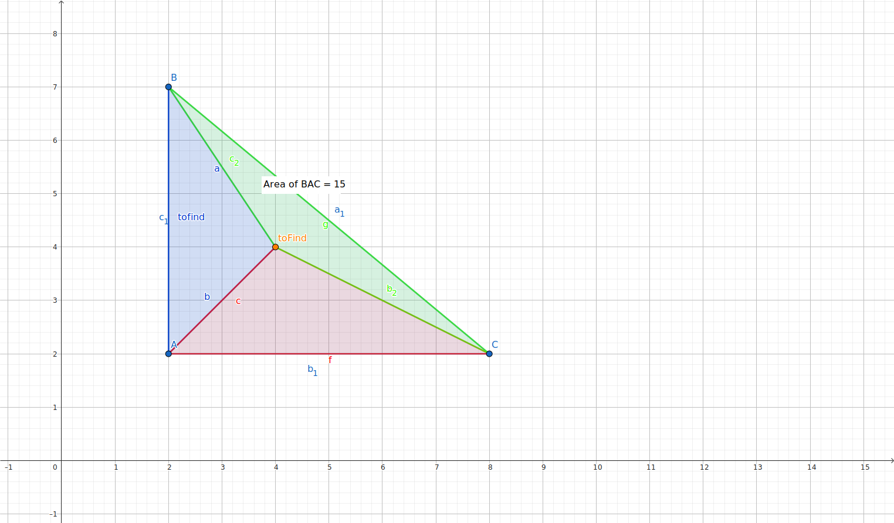

# CPP Exercices

## Checks during correction

- To quickly check for forbidden keywords, use `grep` with the following options:
  - `-r` (or `--recursive`) option to search through a directory and its subdirectories. 
  - To exclude binary files, use the `-I` option which tells `grep` to ignore binary files.

```bash
grep -rI "*alloc"
grep -rI "free"
grep -rI "*printf"
grep -rI "friend"
```

## CPP 02

### [Fixed Point](/Notes/computer_science.md#fixed%20point)

### [BSP](/Notes/binary_space_partitioning.md)

BSP conrespond to Binary Space Partitioning. It is a method used to divide a space into two parts.
In the context of video games, it is used to divide a map into two parts, to optimize the rendering of the map.

#### Exercice Problem



Find if a point is inside a triangle.

#### Exercice Solution

Possible way to solve (but this solutions **doesnt really use BSP**):

- Use the area of the triangle to determine if the point is inside the triangle.
  - Calculate the area of the triangle
  $$A = \left|\frac{x1\times (y2 - y3) + x2 \times (y3 - y1) + x3 \times (y1 - y2)}{2}\right| $$
  - Calculate the area of the three triangles formed by the point and the three points of the triangle
  - If the sum of the three areas is equal to the area of the triangle, the point is inside the triangle.
  - 🔗[Check whether a given point lies inside a triangle or not](https://www.geeksforgeeks.org/check-whether-a-given-point-lies-inside-a-triangle-or-not/)
  - 🔗[Area of a triangle](https://www.cuemath.com/geometry/area-of-triangle-in-coordinate-geometry/)

- Use the direction of the vectors to determine if the point is inside the triangle.
  - Calculate the vectors of the three sides of the triangle
  - Calculate the vectors between the point and the three points of the triangle
  - Calculate the cross product of the vectors of the sides of the triangle and the vectors between the point and the three points of the triangle
  - If the cross product of the three vectors is the same sign, the point is inside the triangle.
  - 🔗[Direction of a Point from a line segment](https://www.geeksforgeeks.org/direction-point-line-segment/)

## CPP 04

### [Materia](https://finalfantasy.fandom.com/wiki/Materia_(term))


Materia (マテリア) is a recurring term and set of items in the Final Fantasy series that is typically associated with stat boosts and abilities, or in some cases, is used as a plot device. Materia is typically crafted into the equipment of the users, and used for boosting their performance. It originates from Final Fantasy VII.


## CPP 06

### [Scalar Types](https://en.wikipedia.org/wiki/Scalar_type)

Scalar type: `int`, `float`, `double`, `char`, `bool`, ...

A scalar type is a general term used to describe a data type that can represent a **single value**. A primitive type is a specific type of scalar type that is built into the programming language and provides the most basic operations.

**Primitive types** are the building blocks of more complex data structures and include data types like integers, floating-point numbers, booleans, and strings, among others. They are often used to represent simple values such as numbers or characters and are generally considered the simplest and most basic data types.

In contrast, scalar types can include not only primitive types but also other data types like enumerated types or user-defined types that can represent single values.

In summary, all primitive types are scalar types, but not all scalar types are primitive types.

### Special values

Special values are values that have a special meaning in the context of a program. They are often used to represent exceptional or undefined conditions, such as errors or missing data. Some common examples of special values include:

- `nanf`: Not a number (float)
  - represents a value that is not a number in case of undefined operations
- `+inff`: Infinity (float)
- `-inff`: Negative infinity (float)

- `nan`: Not a number (double)
- `+inf`: Infinity (double)
- `-inf`: Negative infinity (double)

## CPP 09

### Merge Insertion Sort

https://github.com/decidedlyso/merge-insertion-sort/blob/master/README.md

