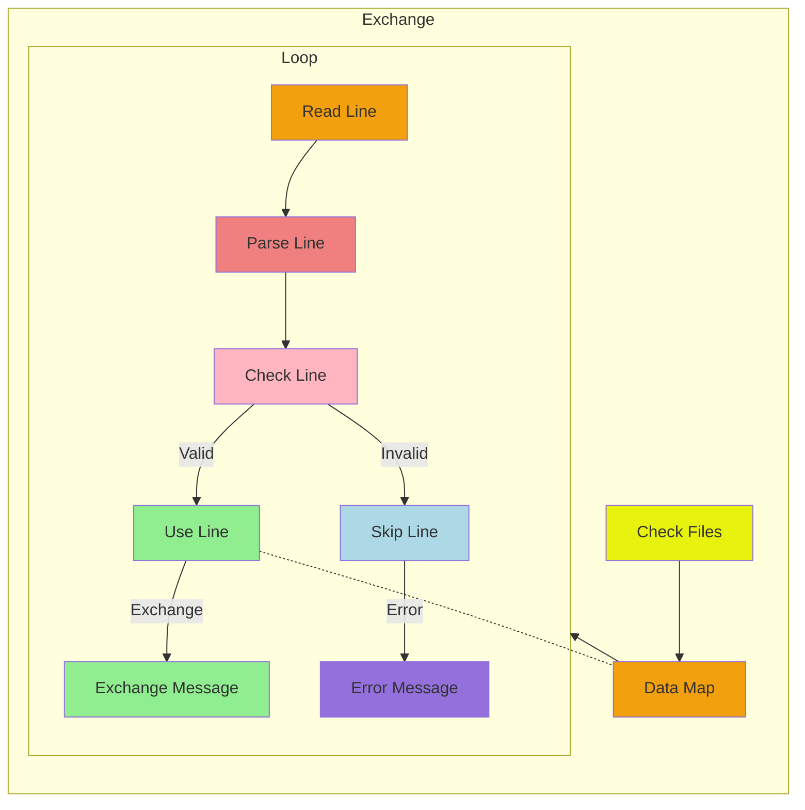
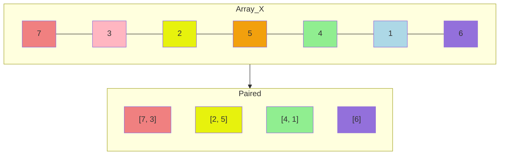
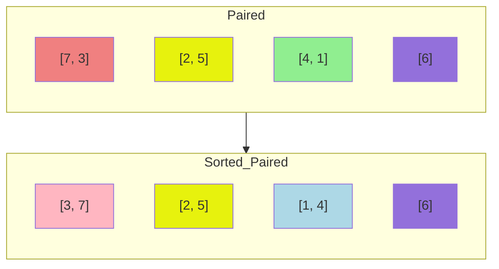
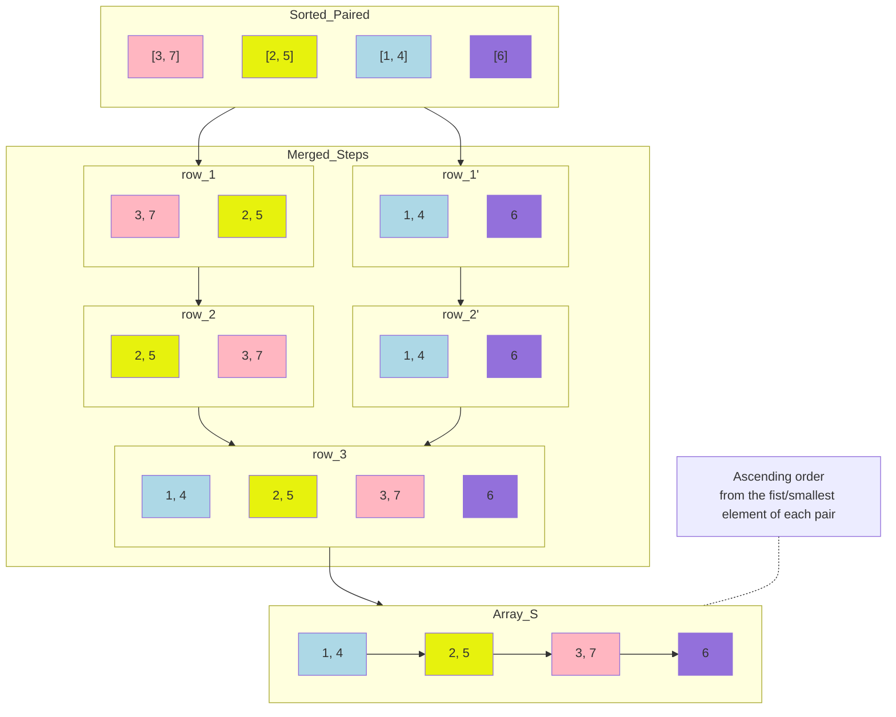

# CPP Exercices

## Checks during correction

- To quickly check for forbidden keywords, use `grep` with the following options:
  - `-r` (or `--recursive`) option to search through a directory and its subdirectories. 
  - To exclude binary files, use the `-I` option which tells `grep` to ignore binary files.

```bash
grep -rI "*alloc"
grep -rI "free"
grep -rI "*printf"
grep -rI "friend"
```

## CPP 02

### [Fixed Point](/Notes/computer_science.md#fixed%20point)

Fixed-point arithmetic is a method of representing numbers that allows for a fixed number of digits after the decimal point. This is in contrast to floating-point arithmetic, which allows for a variable number of digits after the decimal point.

Fixed-point arithmetic is often used in embedded systems and other applications where floating-point arithmetic is not available or is too slow. It is also used in some programming languages, such as C and C++, to represent fixed-point numbers.

### [BSP](/Notes/binary_space_partitioning.md)

BSP conrespond to Binary Space Partitioning. It is a method used to divide a space into two parts.
In the context of video games, it is used to divide a map into two parts, to optimize the rendering of the map.

#### Exercice Problem


Find if a point is inside a triangle.

#### Exercice Solution

Possible way to solve (but this solutions **doesnt really use BSP**):

- Use the area of the triangle to determine if the point is inside the triangle.
  - Calculate the area of the triangle
  $$A = \left|\frac{x1\times (y2 - y3) + x2 \times (y3 - y1) + x3 \times (y1 - y2)}{2}\right| $$
  - Calculate the area of the three triangles formed by the point and the three points of the triangle
  - If the sum of the three areas is equal to the area of the triangle, the point is inside the triangle.
  - 🔗[Check whether a given point lies inside a triangle or not](https://www.geeksforgeeks.org/check-whether-a-given-point-lies-inside-a-triangle-or-not/)
  - 🔗[Area of a triangle](https://www.cuemath.com/geometry/area-of-triangle-in-coordinate-geometry/)

- Use the direction of the vectors to determine if the point is inside the triangle.
  - Calculate the vectors of the three sides of the triangle
  - Calculate the vectors between the point and the three points of the triangle
  - Calculate the cross product of the vectors of the sides of the triangle and the vectors between the point and the three points of the triangle
  - If the cross product of the three vectors is the same sign, the point is inside the triangle.
  - 🔗[Direction of a Point from a line segment](https://www.geeksforgeeks.org/direction-point-line-segment/)

## CPP 04

### [Materia](https://finalfantasy.fandom.com/wiki/Materia_(term))


Materia (マテリア) is a recurring term and set of items in the Final Fantasy series that is typically associated with stat boosts and abilities, or in some cases, is used as a plot device. Materia is typically crafted into the equipment of the users, and used for boosting their performance. It originates from Final Fantasy VII.


## CPP 06

### [Scalar Types](https://en.wikipedia.org/wiki/Scalar_type)

Scalar type: `int`, `float`, `double`, `char`, `bool`, ...

A scalar type is a general term used to describe a data type that can represent a **single value**. A primitive type is a specific type of scalar type that is built into the programming language and provides the most basic operations.

**Primitive types** are the building blocks of more complex data structures and include data types like integers, floating-point numbers, booleans, and strings, among others. They are often used to represent simple values such as numbers or characters and are generally considered the simplest and most basic data types.

In contrast, scalar types can include not only primitive types but also other data types like enumerated types or user-defined types that can represent single values.

In summary, all primitive types are scalar types, but not all scalar types are primitive types.

### Special values

Special values are values that have a special meaning in the context of a program. They are often used to represent exceptional or undefined conditions, such as errors or missing data. Some common examples of special values include:

- `nanf`: Not a number (float)
  - represents a value that is not a number in case of undefined operations
- `+inff`: Infinity (float)
- `-inff`: Negative infinity (float)

- `nan`: Not a number (double)
- `+inf`: Infinity (double)
- `-inf`: Negative infinity (double)

## CPP 09

### Bitcoin Exchange



### Merge Insertion Sort

- [Github - MergeInsertion Sort with Ressources - in Clojure](https://github.com/decidedlyso/merge-insertion-sort/tree/master)
  - [Github - Same - in Python](https://github.com/PunkChameleon/ford-johnson-merge-insertion-sort)

- 📰 [Original Paper](https://doi.org/10.1080/00029890.1959.11989306) 
  - Ford, L. R.; Johnson, S. M. (1959). "A Tournament Problem". The American Mathematical Monthly. 66 (5): 387–389. doi:10.2307/2310397. JSTOR 2310397. [📖](https://Maybe_sci-hub_can_help_if_you_think_that_knowledge_should_be_free)

- [Jacobsthal number](https://en.wikipedia.org/wiki/Jacobsthal_number)
  <details>
    <summary>Definition</summary>

    - The Jacobsthal numbers form a sequence of integers that are defined by the recurrence relation:
      $$ J_0 = 0 $$
      $$ J_1 = 1 $$
      $$ J_n = J_{n-1} + 2 \times J_{n-2} $$

    - The first few Jacobsthal numbers are:
    ```math
    0, 1, 1, 3, 5, 11, 21, 43, 85, 171, 341, 683, 1365, 2731, 5461, 10923, 21845, 43691, 87381, 174763, 349525, 699051, 1398101, 2796203, 5592405, 11184811, 22369621, 44739243, 89478485, 178956971, 357913941, 715827883, 1431655765, 2863311531, 5726623061, 11453246123
    ```
    [Full list with details](https://oeis.org/A001045)

    ```cpp
    int jacobsthal(int n) {
      if (n == 0) return 0;
      if (n == 1) return 1;
      return jacobsthal(n - 1) + 2 * jacobsthal(n - 2);
    }
    ```
  </details>

#### [Ford-Johnson Algorithm](https://en.wikipedia.org/wiki/Merge-insertion_sort)

The Ford-Johnson algorithm is a sorting algorithm that combines the merge sort and insertion sort algorithms to achieve a faster sorting time. 

While not performing an optimal number of comparisons, it's still a reference and one of the best known comparison sorts when it comes to reducing the number of comparisons.

The algorithm works by dividing the input array into smaller subarrays and sorting them using insertion sort. The sorted subarrays are then merged together using the merge sort algorithm to produce the final sorted array.

##### Evolution

- In 1979, The Manacher algorithm was published, which is a variant of the Ford-Johnson algorithm. It uses a different approach to divide the input array into subarrays and sort them using insertion sort in a way that reduces the number of comparisons and for large arrays, it can be faster than the Ford-Johnson algorithm.

##### Steps

1. Divide the input array $ X $ of $ n $ elements into $ n/2 $ smaller subarrays of size $ 2 $, if odd number of elements, last element is left alone.



2. Sort each subarray (single comparison).



3. Create a new array $ S $ of size $ n/2 $ to store the sorted subarrays in ascending order (accordint to first of a pair). **Merge sort** is used to sort the subarrays.



4. Insert the sorted subarrays in $ S $ using the **Binary Insert sort** algorithm with the Jacobsthal set for the order of comparison.

```mermaid
graph TD
  classDef yellow fill:#e7f20d;
  classDef orange fill:#f2a00d;
  classDef lightcoral fill:LightCoral;
  classDef lightpink fill:LightPink;
  classDef lightgreen fill:LightGreen;
  classDef lightblue fill:LightBlue;
  classDef mediumpurple fill:MediumPurple;
  
  subgraph Array_S
    direction LR
    Sorted3'''''["1, 4"]:::lightblue
    Sorted1'''''["2, 5"]:::yellow
    Sorted2'''''["3, 7"]:::lightpink
    Sorted4'''''["6"]:::mediumpurple
    Sorted3''''' --> Sorted1''''' --> Sorted2''''' --> Sorted4'''''
  end
  Array_S --> Setup_Arrays
  subgraph Setup_Arrays
    direction LR
    subgraph node_1
      direction TB
      element_1["1"]:::lightblue
      element_4["4"]:::lightblue
    end
    subgraph node_2
      direction TB
      element_2["2"]:::yellow
      element_5["5"]:::yellow
    end
    subgraph node_3
      direction TB
      element_3["3"]:::lightpink
      element_7["7"]:::lightpink
    end
    subgraph node_4
      direction TB
      element_6["6"]:::mediumpurple
    end
    element_1 --- element_2 --- element_3
    element_4 -.- element_5 -.- element_7 -.- element_6
  end
  subgraph Init_BinInsertSort
    direction LR
    subgraph main_chain
      direction LR
      element_1'["1"]:::lightblue
      element_2'["2"]:::yellow
      element_3'["3"]:::lightpink
      element_1' --> element_2' --> element_3'
    end
    subgraph pending_chain
      direction LR
      element_4'["4"]:::lightblue
      element_5'["5"]:::yellow
      element_7'["7"]:::lightpink
      element_6'["6"]:::mediumpurple
      subgraph gp_jacob1
        direction TB
        element_4'
      end
      subgraph gp_jacob3
        direction LR
        element_6' --> element_7' --> element_5'
      end
      Note_BinInsertSort["Make group according to jacobsthal numbers (0, 1, 1, 3, 5, ...)\nand each group in inverted order from original pending chain"]
    end
    gp_jacob1 --> gp_jacob3
  end
  Setup_Arrays --> Init_BinInsertSort
  subgraph BinInsertSort
    direction LR
    subgraph main_chain'
      direction LR
      element_1''["1"]:::lightblue
      element_2''["2"]:::yellow
      element_3''["3"]:::lightpink
      element_1'' --> element_2'' --> element_3''
    end
    subgraph pending_chain'
      direction LR
      element_4''["4"]:::lightblue
      element_5''["5"]:::yellow
      element_7''["7"]:::lightpink
      element_6''["6"]:::mediumpurple
      subgraph gp_jacob1'
        direction TB
        element_4''
      end
      subgraph gp_jacob3'
        direction LR
        element_6'' --> element_7'' --> element_5''
      end
      gp_jacob1' --> gp_jacob3'
    end 
    function("Binary Search (find insert pos)\n + Insertion")
    element_4'' -.- function -.-> element_3''
  end
  Init_BinInsertSort --> BinInsertSort
  
  BinInsertSort --> Loop
  subgraph Loop
    direction TB
    next_group(("Select\nnext Group"))
    select(("Select\nnext Element"))
    binsearch(["Binary Search"])
    insert(["Insertion"])
    select --> binsearch
    binsearch -->|"position"| insert
    insert --> select
    select -.->|"Empty group"| next_group
  end
  Loop --> BinInsertSort_Last
  
  subgraph BinInsertSort_Last
    direction LR
    subgraph main_chain'''
      direction LR
      element_1'''["1"]:::lightblue
      element_2'''["2"]:::yellow
      element_3'''["3"]:::lightpink
      element_4'''["4"]:::lightblue
      element_6'''["6"]:::mediumpurple
      element_7'''["7"]:::lightpink
      element_1''' --> element_2''' --> element_3''' --> element_4''' --> element_6''' --> element_7'''
    end
    subgraph pending_chain'''
      direction LR
      subgraph gp_jacob3'''
        direction LR
        element_5'''["5"]:::yellow
      end
    end
    element_5''' -.-> element_4'''
  end
  BinInsertSort_Last --> Final_Array
  subgraph Final_Array
    direction LR
    element_1''''["1"]:::lightblue
    element_2''''["2"]:::yellow
    element_3''''["3"]:::lightpink
    element_4''''["4"]:::lightblue
    element_5''''["5"]:::yellow
    element_6''''["6"]:::mediumpurple
    element_7''''["7"]:::lightpink
    element_1'''' --> element_2'''' --> element_3'''' --> element_4'''' --> element_5'''' --> element_6'''' --> element_7''''
  end
```

