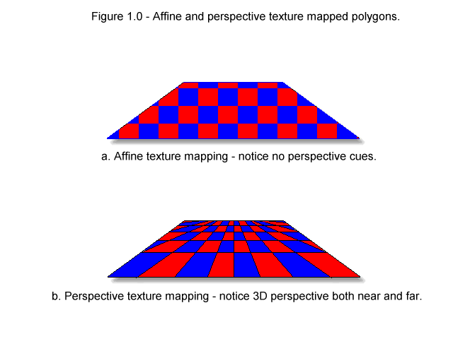

# 42_Cub3D

## Notions

### Not Watched yet

- https://youtu.be/uSzGdfdOoG8?t=133 - Matrix Math for code

### Raycasting

#### Description

Raycasting is a rendering technique used to create a 3D perspective in a 2D map. It is often used in video games to create the illusion of 3D environments, such as in the classic game Wolfenstein 3D. Raycasting works by casting rays from the player's point of view and calculating the distance to the nearest wall in each direction. These distances are then used to determine the height of the walls in the 2D map, creating the illusion of depth and perspective.

#### Articles

- [🔦 2D Visibility - Webpage with demos and maths](https://www.redblobgames.com/articles/visibility/)
- [🧊 Raycasting - How to do in C - Using Wolfenstein as Example](https://lodev.org/cgtutor/raycasting.html)

#### Videos

- [🎥 Raycasting - The Coding Train - JS](https://thecodingtrain.com/challenges/145-ray-casting-2d)
- [🎥 Rendering Raycasting - The Coding Train - JS](https://www.youtube.com/watch?v=vYgIKn7iDH8)

#### Video Game

Play this game to see the concept of raycasting in action.

- [🕹️ Wolfenstein Online](http://users.atw.hu/wolf3d/)

Controls / Keys

##### Movements

- Arrow keys (←↑↓→)
- Shift : run fast
- Alt : Slide with movements insted of turning

##### Actions

- Ctrl : fire (in Wolfenstein)
- Space : 
    - Open doors / hidden rooms (in Wolfenstein)
    - Activate elevators (in Wolfenstein)
- [1 - 4] number keys :
    - Change weapon (in Wolfenstein)
    - Change item (in Wolfenstein)

### FishEye

#### Description

Fisheye distortion is a type of optical distortion that occurs when a camera lens has a wide field of view. It causes straight lines to appear curved, and it can create a distorted, panoramic effect. Fisheye distortion is often used in photography and videography to create dramatic, wide-angle images, and it can also be used in computer graphics to create immersive, 3D environments.

[🔍 Fisheye Lens - Wikipedia](https://en.wikipedia.org/wiki/Fisheye_lens)

### Texture Mapping

##### Description

Texture mapping is a technique used to apply a texture to a 3D model. It is often used in computer graphics to create realistic-looking surfaces, such as wood, metal, or stone. Texture mapping works by mapping the texture coordinates of the 3D model to the texture image, so that the texture is applied to the model in the correct way.

[🧩 Texture Mapping - Wikipedia](https://en.wikipedia.org/wiki/Texture_mapping)

##### Affine Texture Mapping

An affine transformation means that it preserves quantities, thus as one image is mapped onto another and there is a one to one relationship, that is, no warping. In the realm of texture mapping, affine mapping usually means throwing away the 3D information all together and performing a simple 2D mapping.

[🔗 Affine Texture Mapping - Wikipedia](https://en.wikipedia.org/wiki/Affine_texture_mapping)

[🔗 Affine Texture Mapping - Detailled with schema - A.LaMothe](http://archive.gamedev.net/archive/reference/articles/article852.html)

## Code

### KeyHooks

### Raycasting

#### Description

Raycasting is a rendering technique used to create a 3D perspective in a 2D map. It is often used in video games to create the illusion of 3D environments, such as in the classic game Wolfenstein 3D. Raycasting works by casting rays from the player's point of view and calculating the distance to the nearest wall in each direction. These distances are then used to determine the height of the walls in the 2D map, creating the illusion of depth and perspective.

#### With a camera plane

[📐 Raycasting with detailled explanations - Lodev](https://lodev.org/cgtutor/raycasting.html)

The above representation illustrate how a ray travels in the 2D map / Grid. (Using [DDA](#dda-line-algorithm) like algorithm)
- `sideDistX` and `sideDistY` are initially the distance the ray has to travel from its start position to the first x-side and the first y-side. Later they will be incremented while steps are taken.
- `deltaDistX` and `deltaDistY` are the distance the ray has to travel to go from 1 x-side to the next x-side, or from 1 y-side to the next y-side.

$$ deltaDistX = \sqrt{1 + \frac{rayDirY * rayDirY}{rayDirX * rayDirX}} $$

$$ deltaDistY = \sqrt{1 + \frac{rayDirX * rayDirX}{rayDirY * rayDirY}} $$

Simplified to (in the context of the game where the map is a grid):

$$ deltaDistX = \left|{\frac{1}{rayDirX}}\right| $$

$$ deltaDistY = \left|{\frac{1}{rayDirY}}\right| $$

Initially, the `sideDistX` and `sideDistY` are the distance the ray has to travel from its start position to the first x-side and the first y-side. Later they will be incremented while steps are taken.

$$ sideDistX = \left|{\frac{mapX + 1 - posX}{rayDirX}}\right| $$

$$ sideDistY = \left|{\frac{mapY + 1 - posY}{rayDirY}}\right| $$

The distance to the next x-side or y-side is added to the `sideDistX` or `sideDistY`. When a `step` is taken in the x-direction, `sideDistX` is incremented by `deltaDistX`, and when a `step` is taken in the y-direction, `sideDistY` is incremented by `deltaDistY`.

$$ sideDistX += deltaDistX $$

$$ sideDistY += deltaDistY $$

Steps are taken in the map grid, and the distance to the next x-side or y-side is added to the `sideDistX` or `sideDistY`. When a `step` is taken in the x-direction, `sideDistX` is incremented by `deltaDistX`, and when a `step` is taken in the y-direction, `sideDistY` is incremented by deltaDistY.

$$ mapX += stepX $$

$$ mapY += stepY $$

Until:

$$ map[mapX][mapY]  == wall $$

The DDA algorithm is used to `step` through the map grid and find the first x-side and y-side that the ray hits. The distance to the next x-side or y-side is added to the `sideDistX` or `sideDistY`. When a `step` is taken in the x-direction, `sideDistX` is incremented by `deltaDistX`, and when a `step` is taken in the y-direction, `sideDistY` is incremented by `deltaDistY`.

##### Why use a camera plane?

<figure >
  
  <figcaption style="color: red">
    Red: Player view (fish eye)
  </figcaption>
  <figcaption style="color: green">
    Green: Plane/Camera view (no fish eye)
  </figcaption>
</figure>

Using the player distance will create a fish eye view, with a camera plane we can get a "normal view". It's even easier to calculate this perpendicular distance than the real distance, we don't even need to know the exact location where the wall was hit. 

This is because the camera plane is the plane that is perpendicular to the direction of the camera. It is the plane that the player sees when they look straight ahead. The distance to the camera plane is used to calculate the height of the walls in the 2D map.

##### Calculating the distance to the camera plane

The length of `sideDist` already almost equals `perpWallDist`. We just need to subtract `deltaDist` once from it, going one step back, because in the `DDA` steps above we went one step further to end up inside the wall.

Depending on whether the ray hit an X side or Y side, the formula is computed using sideDistX, or sideDistY.

If the ray hit a horizontal wall, the distance to the camera plane is calculated as follows:

$$ perpWallDist = sideDistX - deltaDistX $$

If the ray hit a vertical wall, the distance to the camera plane is calculated as follows:

$$ perpWallDist = sideDistY - deltaDistY $$

Detailed formula for Nord-South side hit

The points are defined as follows:

- **P**: Position of the player, (`posX`, `posY`) in the code.
- **H**: Hitpoint of the ray on the wall. Its y-position is known to be `mapY + (1 - stepY) / 2`.
- **yDist**: Matches `(mapY + (1 - stepY) / 2 - posY)`. This is the y-coordinate of the Euclidean distance vector, in world coordinates.
- **dir**: The main player looking direction, given by `dirX`,`dirY` in the code. The length of this vector is always exactly 1.
- **A**: Point of the camera plane closest to H, the point where `perpWallDist` intersects with camera plane.
- **B**: Point of X-axis through player closest to H, point where `yDist` crosses the world X-axis through the player.
- **C**: Point at player position + `rayDirX`.
- **D**: Point at player position + `rayDir`.
- **E**: This is point D with the `dir` vector subtracted, in other words, `E + dir = D`.

The actual derivation:

1. Triangles PBH and PCD have the same shape but different size, so same ratios of edges.
2. Given step 1, the triangles show that the ratio `yDist / rayDirY` is equal to the ratio `Euclidean / |rayDir|`, so now we can derive `perpWallDist = Euclidean / |rayDir|` instead.
3. Triangles AHP and EDP have the same shape but different size, so same ratios of edges. Length of edge ED, that is `|ED|`, equals length of `dir`, `|dir|`, which is 1. Similarly, `|DP|` equals `|rayDir|`.
4. Given step 3, the triangles show that the ratio `Euclidean / |rayDir| = perpWallDist / |dir| = perpWallDist / 1`.
5. Combining steps 4 and 2 shows that `perpWallDist = yDist / rayDirY`, where `yDist` is `mapY + (1 - stepY) / 2) - posY`.
6. In the code, `sideDistY - deltaDistY`, after the DDA steps, equals `(posY + (1 - stepY) / 2 - mapY) * deltaDistY` (given that `sideDistY` is computed from `posY` and `mapY`), so `yDist = (sideDistY - deltaDistY) / deltaDistY`.
7. Given that `deltaDistY = 1 / |rayDirY|`, step 6 gives that `yDist = (sideDistY - deltaDistY) * |rayDirY|`.
8. Combining steps 5 and 7 gives `perpWallDist = yDist / rayDirY = (sideDistY - deltaDistY) / |rayDirY| / rayDirY`.
9. Given how cases for signs of `sideDistY` and `deltaDistY` in the code are handled the absolute value doesn't matter, and equals `(sideDistY - deltaDistY)`, which is the formula used.

##### Calculating the height of the walls

The height of the walls is calculated using the distance to the camera plane and the height of the screen. The height of the walls is inversely proportional to the distance to the camera plane, so the closer the wall is to the camera, the taller it appears.

$$ lineHeight = \frac{screenHeight}{perpWallDist} $$

##### Moving the player

We check if the player is not colliding with a wall before moving the player.

$$ mapX = posX + dirX * moveSpeed $$

$$ mapY = posY + dirY * moveSpeed $$

If the player is not colliding with a wall, the player's position is updated.

$$ map[mapX][mapY] \neq WALL $$

The player is moved forward and backward by adding or subtracting the direction vector to the player's position.

$$ posX += dirX * moveSpeed $$

$$ posY += dirY * moveSpeed $$

The vectors (`dirX` et `dirY`) are normalized (length of the vector is 1) to ensure that the player moves at a constant speed, regardless of the direction they are facing.

##### Rotating the player and camera plane

The player is rotated by adding or subtracting the camera plane vector to the direction vector.

$$ dirX = oldDirX * cos(rotSpeed) - oldDirY * sin(rotSpeed) $$

$$ dirY = oldDirX * sin(rotSpeed) + oldDirY * cos(rotSpeed) $$

$$ planeX = oldPlaneX * cos(rotSpeed) - oldPlaneY * sin(rotSpeed) $$

$$ planeY = oldPlaneX * sin(rotSpeed) + oldPlaneY * cos(rotSpeed) $$

###### Rotation Matrix

We use the rotation matrix to rotate the direction vector and the camera plane vector. The rotation matrix is a 2x2 matrix that rotates a vector by a given angle. The rotation matrix is used to rotate the direction vector and the camera plane vector by the rotation speed.

###### Rotation Matrix Clockwise

$\theta$ is the angle of rotation - here the rotation speed

rotate left:

$$ \begin{bmatrix}
  x' \\
  y' \\
\end{bmatrix} = \begin{bmatrix}
  \cos\theta & -\sin\theta \\
  \sin\theta &  \cos\theta \\
\end{bmatrix}\begin{bmatrix}
  x \\
  y \\
\end{bmatrix}. $$

$$ x' = x \cos\theta - y \sin\theta $$

$$ y' = x \sin\theta + y \cos\theta $$

rotate right ($\theta = -\theta$ because the angle is negative in the clockwise direction formula):

$$ x' = x \cos(-\theta) - y \sin(-\theta) $$

$$ y' = x \sin(-\theta) + y \cos(-\theta) $$

[🔗 Rotation Matrix - Wikipedia](https://en.wikipedia.org/wiki/Rotation_matrix)

### Texture

#### Find the texture to use

The texture to use is determined by the side of the wall that was hit. The texture is selected based on the direction of the ray and the side of the wall that was hit.

If the ray hit a horizontal wall, the texture to use is determined by the y-coordinate of the hitpoint.

$$ wallX = posY + perpWallDist * rayDirY $$

If the ray hit a vertical wall, the texture to use is determined by the x-coordinate of the hitpoint.

$$ wallX = posX + perpWallDist * rayDirX $$

Now `wallX` is the exact coordinate in the map of where the wall was hit.

(Example: if `wallX` is 3.5 - integer part of `wallX` is the tile number, and the decimal part is the texture coordinate in the tile.)

Subtracting the integer part of `wallX` from `wallX` gives the x coord in the tile.

$$ wallX -= floor(wallX) $$

Scaling the x-coordinate of the wall hit to the width of the texture gives the x-coordinate of the texture.

$$ texX = wallX * texWidth $$

If the ray hit a vertical wall and the x-coordinate of the ray direction is positive, or if the ray hit a horizontal wall and the y-coordinate of the ray direction is negative, the x-coordinate of the texture is calculated as follows:

$$ texX = texWidth - texX - 1 $$

We do this to ensure that the texture is flipped correctly when the ray hits a wall.

Now that we know the x-coordinate of the texture, we know that this coordinate will remain the same, because we stay in the same vertical stripe of the screen. Now we need a loop in the y-direction to give each pixel of the vertical stripe the correct y-coordinate of the texture, called texY.

## Math

### Vector

[🔗 Vectors - MathIsFun](https://www.mathsisfun.com/algebra/vectors.html)

<table>
  <tr>
    <td>
      
    </td>
    <td>
      
    </td>
  </tr>
  <tr>
    <td>
      <ul>
        <li>
          <b>Magnitude</b> : The length of the line.

$\ |A| = \sqrt{{a_x}^2 + {a_y}^2} $
        </li>
        <li>
          <b>Direction</b> : The direction the line is pointing.
        </li>
      </ul>
    </td>
    <td>
      <ul>
        <li>
          <b>Notation</b> : The vector is often written in <b>bold</b> or with an arrow on top.
        </li>
      </ul>
    </td>
  </tr>
  <tr>
    <td>
      
    </td>
    <td>
      
    </td>
  </tr>
  <tr>
    <td>
      <ul>
        <li>
          <b>Cartesian Coordinates</b> :

$\ a = \begin{bmatrix} a_x \\ a_y \end{bmatrix} $
        </li>
      </ul>
    </td>
    <td>
      <ul>
        <li>
          <b>Polar Coordinates</b> :

$\ a = \begin{bmatrix} r \\ θ \end{bmatrix} $
        </li>
      </ul>
    </td>
  </tr>
  <tr>
    <td>
      
    </td>
    <td>
      
    </td>
  </tr>
  <tr>
    <td>
      <ul>
        <li>
          <b>Addition</b> : Adding two vectors.
        </li>
      </ul>
    </td>
    <td>
      <ul>
        <li>
          <b>Subtraction</b> : Subtracting two vectors.
        </li>
      </ul>
    </td>
  </tr>
  <tr>
    <td>
      

        
        
      

    </td>
    <td>
      
      
    </td>
  </tr>
  <tr>
    <td>
      <ul>
        <li>
          <b>Dot Product</b> : The dot product of two vectors is a scalar.
        </li>
      </ul>
    </td>
    <td>
      <ul>
        <li>
          <b>Cross Product</b> : The cross product of two vectors is a vector.
        </li>
      </ul>
    </td>
  </tr>
</table>

### Matrix

More infos / Refresher 

#### Description

In mathematics, a matrix is a rectangular array of numbers or other values, organized into rows and columns. Matrices are used to represent and manipulate data in various fields of mathematics, including linear algebra, numerical analysis, geometry, graph theory, statistics, and many others.

Here are some common uses of matrices:

- `Representation of linear systems of equations`: Matrices can be used to represent and solve systems of linear equations. Each row of the matrix represents an equation, and each column represents a variable.
- `Linear transformations`: Matrices can be used to represent linear transformations, such as rotations, scalings, and translations in space.
- `Representation of graphs`: Matrices can be used to represent graphs, where the elements of the matrix indicate the connections between the vertices of the graph.
- `Data analysis`: Matrices can be used to represent multidimensional data, such as images or time series, and to perform operations on this data, such as dimensionality reduction or classification.
- `Computer graphics`: Matrices are used to represent and manipulate 3D objects in computer graphics, such as transformations, projections, and lighting calculations.

In summary, matrices are a powerful and versatile tool in mathematics that can be used to represent and manipulate data in many different fields.

#### Calculation

- [🔗 Matrix - MathIsFun](https://www.mathsisfun.com/algebra/matrix-multiplying.html)
  - Matrix Scalar Multiplication :

  

  `2` in the above example is the **scalar**.
  - Matrix multiplication :

  
  

#### Determinant

- [🔗 Matrix Determinant - MathIsFun](https://www.mathsisfun.com/algebra/matrix-determinant.html)

It is a special number that can be calculated from the elements of a square matrix. It is used in various areas of mathematics and has many applications in science and engineering. The determinant can be reprensented as a function `det(A)` or `|A|` (not the same as absolute).

As a formula (remember the vertical bars `||` mean "determinant of")

$$
A =
\begin{vmatrix}
a & b \\
c & d
\end{vmatrix}
=
ad - bc
$$

$$
B =
\begin{vmatrix}
a & b & c \\
d & e & f \\
g & h & i
\end{vmatrix}
=
a \begin{vmatrix}
e & f \\
h & i
\end{vmatrix}
- b \begin{vmatrix}
d & f \\
g & i
\end{vmatrix}
+ c \begin{vmatrix}
d & e \\
g & h
\end{vmatrix}
= a(ei - fh) - b(di - fg) + c(dh - eg)
$$

To calculate higher order determinants, we can use the following formula:

$$
\begin{vmatrix}
a & b & c & d \\
e & f & g & h \\
i & j & k & l \\
m & n & o & p
\end{vmatrix}
= a \begin{vmatrix}
f & g & h \\
j & k & l \\
n & o & p
\end{vmatrix}
- b \begin{vmatrix}
e & g & h \\
i & k & l \\
m & o & p
\end{vmatrix}
+ c \begin{vmatrix}
e & f & h \\
i & j & l \\
m & n & p
\end{vmatrix}
- d \begin{vmatrix}
e & f & g \\
i & j & k \\
m & n & o
\end{vmatrix}
$$

  

This method of calculating determinants is called the **cofactor expansion** or **Laplace expansion**. Notice the alternating signs in front of each term. (+, -, +, -, ...)

##### Usages

The determinant of a matrix can be used to determine whether the matrix has an inverse, to solve systems of linear equations, and to calculate the volume of a parallelepiped in three-dimensional space, among other things.

In computer science and graphics, determinants are used in various applications, especially in 3D computer graphics, computer vision, and robotics. Here are some examples:

- `Transformation matrices`: Determinants are used to calculate the scale factor of a transformation matrix. In computer graphics, transformation matrices are used to transform objects in 3D space, such as scaling, rotation, and translation. The determinant of the transformation matrix can be used to determine whether the transformation preserves the orientation of the object or not.
- `Camera projection`: Determinants are used in camera projection matrices to map 3D points to 2D points on the screen. The projection matrix is used to transform the 3D coordinates of a point in the world to 2D coordinates on the screen. The determinant of the projection matrix can be used to determine whether the projection is invertible or not.
- `Collision detection`: Determinants are used in collision detection algorithms to determine whether two objects intersect or not. In 3D computer graphics, objects are often represented as meshes of triangles. The determinant of the matrix formed by the vertices of a triangle can be used to determine whether the triangle is degenerate or not, which is important in collision detection.
- `Robotics`: Determinants are used in robotics to calculate the kinematics and dynamics of robotic systems. The determinant of the Jacobian matrix can be used to determine whether a robotic system is singular or not, which is important in robot control.

In summary, determinants are an important tool in computer science and graphics, especially in 3D computer graphics, computer vision, and robotics. They are used in various applications, such as transformation matrices, camera projection, collision detection, and robotics.

### Intersection

#### Line-Line Intersection

Details

  
  

- [🔗 Line-Line Intersection / Segments - Wikipedia](https://en.wikipedia.org/wiki/Line%E2%80%93line_intersection)

In order to find the position of the intersection in respect to the line segments, we can define lines $L_1$ and $L_2$ in terms of [first degree Bézier](https://en.wikipedia.org/wiki/B%C3%A9zier_curve#Linear_curves) parameters:

$$
L_1 =   \begin{bmatrix}x_1     \\ y_1\end{bmatrix}
    + t \begin{bmatrix}x_2-x_1 \\ y_2-y_1\end{bmatrix},
\qquad
L_2 =   \begin{bmatrix}x_3     \\ y_3\end{bmatrix}
    + u \begin{bmatrix}x_4-x_3 \\ y_4-y_3\end{bmatrix}
$$

(where $t$ and $u$ are real numbers). The intersection point of the lines is found with one of the following values of $t$ or $u$, where

$$
t = \frac{(x_1 - x_3)(y_3-y_4)-(y_1-y_3)(x_3-x_4)}{(x_1-x_2)(y_3-y_4)-(y_1-y_2)(x_3-x_4)}
$$

and

$$
u = -\frac{(x_1 - x_2)(y_1-y_3)-(y_1-y_2)(x_1-x_3)}{(x_1-x_2)(y_3-y_4)-(y_1-y_2)(x_3-x_4)},
$$

with

$$
(P_x, P_y)= (x_1 + t (x_2-x_1), y_1 + t (y_2-y_1)) \quad \text{or} \quad (P_x, P_y) = (x_3 + u (x_4-x_3), y_3 + u (y_4-y_3))
$$

There will be an intersection if $0 \leq t \leq 1$ and $0 \leq u \leq 1$. The intersection point falls within the first line segment if $0 \leq t \leq 1$, and it falls within the second line segment if $0 \leq u \leq 1$. These inequalities can be tested without the need for division, allowing rapid determination of the existence of any line segment intersection before calculating its exact point.

#### In our case

We can use the following formula to find the intersection point of two line segments:

$$
t = \frac{(x_1 - x_3)(y_3-y_4)-(y_1-y_3)(x_3-x_4)}{(x_1-x_2)(y_3-y_4)-(y_1-y_2)(x_3-x_4)}
$$

$$
u = -\frac{(x_1 - x_2)(y_1-y_3)-(y_1-y_2)(x_1-x_3)}{(x_1-x_2)(y_3-y_4)-(y_1-y_2)(x_3-x_4)}
$$

$$
(P_x, P_y)= (x_1 + t (x_2-x_1), y_1 + t (y_2-y_1)) \quad \text{or} \quad (P_x, P_y) = (x_3 + u (x_4-x_3), y_3 + u (y_4-y_3))
$$

If you notice the denominator of the two formulas are the same, so we can calculate it once and use it for both formulas.

$$
denom = (x_1-x_2)(y_3-y_4)-(y_1-y_2)(x_3-x_4)
$$

If `denom` is equal to `0`, then the two lines are parallel and will never intersect.

now we can calculate `t` and `u`:

$$
t = \frac{(x_1 - x_3)(y_3-y_4)-(y_1-y_3)(x_3-x_4)}{denom}
$$

$$
u = -\frac{(x_1 - x_2)(y_1-y_3)-(y_1-y_2)(x_1-x_3)}{denom}
$$

We then check if $0 \leq t \leq 1$ and $u \geq 0$ (because we are looking for intersection on `t` segment and we dont care if it's not on the `u` associated segments). If both conditions are true, then the two line segments intersect, and the intersection point is given by: 

$$
(P_x, P_y)= (x_1 + t (x_2-x_1), y_1 + t (y_2-y_1))
$$

$$
P_x = x_1 + t (x_2-x_1)
$$

$$
P_y = y_1 + t (y_2-y_1)
$$

[🧮 Explanations](https://youtu.be/TOEi6T2mtHo?t=666)

### Shapes
📐 [Shapes in C](http://www.brackeen.com/vga/shapes.html#6)

#### Line

##### Bresenham's Line Algorithm

Algorithm to draw a line between two points. It is faster than the naive approach of calculating the slope and then drawing the line. The algorithm is based on the idea of determining the nearest pixel to the ideal line at each step.

The reason Bresenham's line drawing algorithm is faster is that it uses no float multiplication or division. Multiplication and division are slow on a computer, even on a computer with a math coprocessor.

###### Algorithm (slope between 0 and 1)

Use the slope to determine the next pixel to draw with a decision parameter.
  - The slope is the ratio of the change in the y-coordinates to the change in the x-coordinates.
  - The decision parameter is used to determine which pixel to draw next. It act as a threshold to determine if the next pixel is above or below the ideal line.

$$ slope = \frac{rise}{run} = \frac{Δy}{Δx} $$

$$ slope = \frac{y_2 - y_1}{x_2 - x_1} $$

The decision parameter is used to determine which pixel to draw next. The decision parameter is calculated as follows:

$$ P_k = 2Δy - Δx $$

If $P_k < 0$, the next pixel is $(x_k + 1, y_k)$ and $P_{k+1} = P_k + 2Δy$.

If $P_k \geq 0$, the next pixel is $(x_k + 1, y_k + 1)$ and $P_{k+1} = P_k + 2Δy - 2Δx$.

The algorithm starts at the first point and draws the line to the second point. At each step, it calculates the decision parameter and uses it to determine which pixel to draw next. The algorithm continues until it reaches the second point.

- [📏 Bresenham - Explained](https://digitalbunker.dev/bresenhams-line-algorithm/)
- [📏 Bresenham - Algo integer arithmetic - Wikipedia](https://en.wikipedia.org/wiki/Bresenham%27s_line_algorithm#Algorithm_for_integer_arithmetic)

##### DDA Line Algorithm

The Digital Differential Analyzer (DDA) algorithm is a method for drawing a line between two points. It is based on the idea of using the slope of the line to determine the next pixel to draw.

The algorithm is based on the idea of using the slope of the line to determine the next pixel to draw. The slope is the ratio of the change in the y-coordinates to the change in the x-coordinates. The algorithm uses the slope to determine the next pixel to draw at each step.

The algorithm starts at the first point and draws the line to the second point. At each step, it calculates the next pixel to draw based on the slope of the line. The algorithm continues until it reaches the second point.

$$ slope = \frac{y_{end} - y_{start}}{x_{end} - x_{start}} $$

If $\ 0 \leq slope \leq 1 $, the algorithm increments the y-coordinate by 1 and the x-coordinate by the inverse of the slope at each step.

$$ x_{k+1} = x_k + 1 $$
$$ y_{k+1} = y_k + slope $$

If $\  slope \geq 1 $, the algorithm increments the y-coordinate by 1 and the x-coordinate by the inverse of the slope at each step.

$$ x_{k+1} = x_k + \frac{1}{slope} $$
$$ y_{k+1} = y_k + 1 $$

Similar calculations are carried out to determine pixel positions along a line with negative slope.

The DDA algorithm is simple and easy to implement, but it is not as fast as Bresenham's line drawing algorithm. The reason is that the DDA algorithm uses floating-point arithmetic to calculate the next pixel to draw, which is slower than integer arithmetic.

- [📏 DDA - Algorithm - Wiki](https://en.wikipedia.org/wiki/Digital_differential_analyzer_(graphics_algorithm))