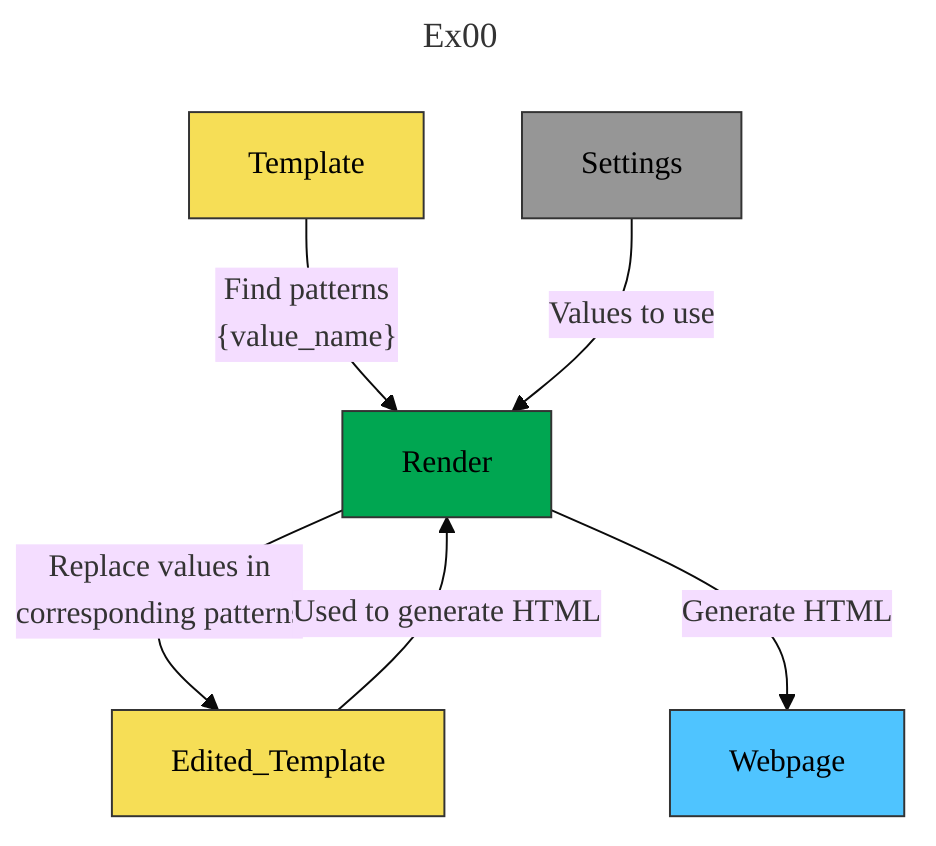

# Piscine Django

<link href="https://fonts.googleapis.com/css2?family=Architects+Daughter&display=swap" rel="stylesheet">

## Ex00

```mermaid
---
title: "Ex00"
config:
  look: default
  fontFamily: Architects Daughter, sans-sherif
  theme: base
---
flowchart
  classDef template fill:#f6de56, color:#000, stroke:#333, stroke-width:1px;
  classDef settings fill:#969696, color:#000, stroke:#333, stroke-width:1px;
  classDef render fill:#00a651, color:#000, stroke:#333, stroke-width:1px;
  classDef webpage fill:#4fc4ff, color:#000, stroke:#333, stroke-width:1px;

  Template:::template --> |"Find patterns<br>{value_name}"| Render:::render
  Settings:::settings --> |"Values to use"| Render
  Render --> |"Replace values in<br>corresponding patterns"| Edited_Template:::template
  Edited_Template --> |"Used to generate HTML"| Render
  Render --> |"Generate HTML"| Webpage:::webpage
```