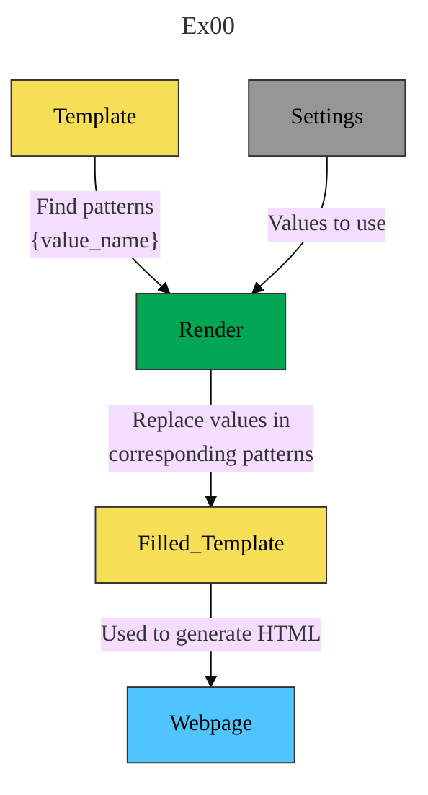

# Django

## 📚 Resources

### Django

* 🧑‍🎓 [W3Schools - Django Introduction Course with exercice](https://www.w3schools.com/django/index.php)
* 📚 [Django Documentation](https://docs.djangoproject.com/en/)

### 🐍 Python

* 🤔 [Python Quick Recap](https://learnxinyminutes.com/docs/python/)
* 📏 [Python Style Guide](https://peps.python.org/pep-0008/)

### 🌐 HTML

* 📚 [HTML Element Reference](https://www.w3schools.com/tags/default.asp)

## 📝 Notes

### [Module 00 - Initiations - HTML, CSS, JavaScript integration](https://projects.intra.42.fr/projects/django-0-initiation)

#### Ex00

[`bit.ly`](https://en.wikipedia.org/wiki/Bitly) - Shorten URLs and measure their performance

#### Ex02

[`form`](https://www.w3schools.com/html/html_forms.asp) - HTML `<form>` Tag

#### Ex03

[`progress`](https://www.w3schools.com/tags/tag_progress.asp) - HTML `<progress>` Tag

#### Ex05

🛡️ [HTML Validator - W3 org](https://validator.w3.org/)

[What is `DOCTYPE`](https://www.geeksforgeeks.org/what-is-the-meaning-of-doctype-in-html/)

### [Module 00 - Starting - Python](https://projects.intra.42.fr/projects/django-0-starting)

#### Ex07

⚛️ [Periodic Table](https://ptable.com/#Properties)

🧪[Properties of Elements](https://chem.libretexts.org/Bookshelves/General_Chemistry/Map%3A_Chemistry_-_The_Central_Science_(Brown_et_al.)/07%3A_Periodic_Properties_of_the_Elements/7.06%3A_Metals_Nonmetals_and_Metalloids)

### [Module 00 - OOB - Object Oriented Basics](https://projects.intra.42.fr/projects/django-0-oob)

#### Ex00

[`*args and **kwargs`](https://www.freecodecamp.org/news/args-and-kwargs-in-python/) - Variable number of arguments and keyword arguments

## Ex00

- **🚧 [Regex Testing Ground](https://regex101.com/)**

- [W3School - Regular Expressions](https://www.w3schools.com/python/python_regex.asp)

- 📚 [Python Docs - Regular Expressions](https://docs.python.org/3/library/re.html)