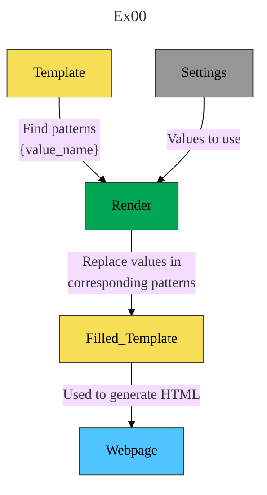
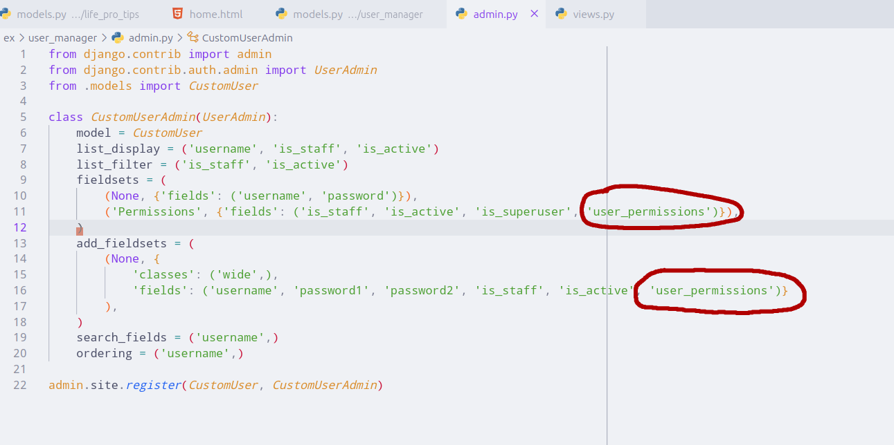
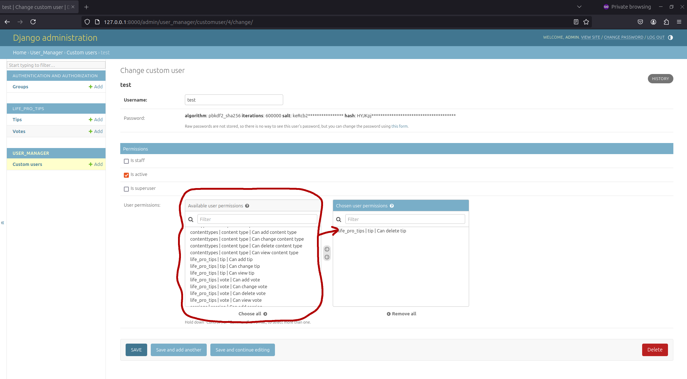
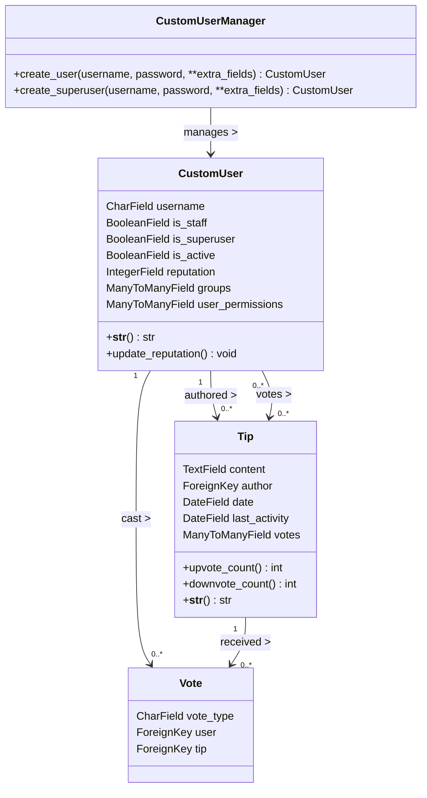

# Django

## 📚 Resources

### Django

* 🧑‍🎓 [W3Schools - Django Introduction Course with exercice](https://www.w3schools.com/django/index.php)
* 📚 [Django Documentation](https://docs.djangoproject.com/en/)

### 🐍 Python

* 🤔 [Python Quick Recap](https://learnxinyminutes.com/docs/python/)
* 📏 [Python Style Guide](https://peps.python.org/pep-0008/)

### 🌐 HTML

* 📚 [HTML Element Reference](https://www.w3schools.com/tags/default.asp)

### 🛠️ Tools

- 🚧 [Regex Testing Ground](https://regex101.com/)

## ⚙️ Commands

### Python Environment

```bash
# Create a virtual environment
python3 -m venv .venv
```

```bash
# Activate the virtual environment
source .venv/bin/activate
```

```bash
# Install the required packages
pip install -r requirements.txt
```

```bash
# Deactivate the virtual environment
deactivate
```

### Django

```bash
# Create a new Django project
django-admin startproject mysite
```

```bash
# Create a new Django app
python manage.py startapp myapp
```

```bash
# Run the Django server
python manage.py runserver
```

```bash
# Create a new migration
python manage.py makemigrations
```

```bash
# Apply the migrations
python manage.py migrate
```

```bash
# Create a superuser
python manage.py createsuperuser
```

```bash
# Run the Django shell
python manage.py shell
``` 

```bash
# Load data from a fixture
## a fixture is a file containing the serialized data of one or more Django models
python manage.py loaddata mydata.json
```

## 📝 Notes

### [Module 00 - Initiations - HTML, CSS, JavaScript integration](https://projects.intra.42.fr/projects/django-0-initiation)

#### Ex00

[`bit.ly`](https://en.wikipedia.org/wiki/Bitly) - Shorten URLs and measure their performance

#### Ex02

[`form`](https://www.w3schools.com/html/html_forms.asp) - HTML `<form>` Tag

#### Ex03

[`progress`](https://www.w3schools.com/tags/tag_progress.asp) - HTML `<progress>` Tag

#### Ex05

🛡️ [HTML Validator - W3 org](https://validator.w3.org/)

[What is `DOCTYPE`](https://www.geeksforgeeks.org/what-is-the-meaning-of-doctype-in-html/)

### [Module 00 - Starting - Python](https://projects.intra.42.fr/projects/django-0-starting)

#### Ex07

⚛️ [Periodic Table](https://ptable.com/#Properties)

🧪[Properties of Elements](https://chem.libretexts.org/Bookshelves/General_Chemistry/Map%3A_Chemistry_-_The_Central_Science_(Brown_et_al.)/07%3A_Periodic_Properties_of_the_Elements/7.06%3A_Metals_Nonmetals_and_Metalloids)

### [Module 00 - OOB - Object Oriented Basics](https://projects.intra.42.fr/projects/django-0-oob)

#### Ex00

[`*args and **kwargs`](https://www.freecodecamp.org/news/args-and-kwargs-in-python/) - Variable number of arguments and keyword arguments

<details>
<summary>📝 Diagram</summary>



</details>

- [W3School - Regular Expressions](https://www.w3schools.com/python/python_regex.asp)

- 📚 [Python Docs - Regular Expressions](https://docs.python.org/3/library/re.html)

### [Module 01 - Lib - Libraries](https://projects.intra.42.fr/projects/django-1-lib)


#### Ex00 - Geohashing

- [Geohashing - Wiki](https://en.wikipedia.org/wiki/Geohashing)


#### Ex01 - Pip

- [Pip - Wiki](https://en.wikipedia.org/wiki/Pip_(package_manager))
- [path - Module Docs](https://path.readthedocs.io/en/latest/api.html#path.Path)

#### Ex02 - Requests

- [Requests - Docs](https://requests.readthedocs.io/en/stable/)
- [Dewiki](https://pypi.org/project/dewiki/)

- [Wikipedia API - Docs](https://www.mediawiki.org/wiki/API:Main_page)
- [Wikipedia API - Sandbox](https://en.wikipedia.org/wiki/Special:ApiSandbox)
- [HTTP Status Codes](https://developer.mozilla.org/en-US/docs/Web/HTTP/Status)

#### Ex03 - Scraping

- [BeautifulSoup - Docs](https://www.crummy.com/software/BeautifulSoup/bs4/doc/)
- [BeautifulSoup - pip](https://pypi.org/project/beautifulsoup4/)

#### Ex04 - Environment

- [venv script - Medium](https://makwanadhruv.medium.com/automating-virtual-environments-bash-script-magic-for-python-developers-3a06df1777a6)
- [venv - Docs](https://docs.python.org/3/library/venv.html)

#### Ex05 - Django

- [W3Schools - Django - Create project](https://www.w3schools.com/django/django_create_project.php)
- [Django - Setup](https://docs.djangoproject.com/en/5.1/intro/tutorial01/)

Localhost *Hello World* that should work: http://localhost:8000/helloworld

### [Module 01 - Django - Basics](https://projects.intra.42.fr/projects/django-1-base-django)

Template Tags:
- [Django - Templates Tag](https://docs.djangoproject.com/en/5.1/ref/templates/builtins/)

Custom Template Tags/Filters:
- [Django - Custom Template Tags and Filters](https://docs.djangoproject.com/en/5.1/howto/custom-template-tags/)

Static files:
- [Django - Static Files](https://docs.djangoproject.com/en/5.1/howto/static-files/)
- [Django - Load static](https://docs.djangoproject.com/en/5.1/ref/templates/builtins/#static)

Favicon:
- [Django - Favicon](https://learndjango.com/tutorials/django-favicon-tutorial)

Forms:
- [Django - Forms](https://docs.djangoproject.com/en/5.1/topics/forms/)

Logging:
- [Django - Logging](https://docs.djangoproject.com/en/5.1/topics/logging/)
- [Python - Formatter](https://docs.python.org/3/library/logging.html#formatter-objects)

### [Module 02 - Django - SQL](https://projects.intra.42.fr/projects/django-2-sql)


Links to demonstrate the exercises *(only if adminer and postgresql running)*:
- [Adminer](http://localhost:8080/?pgsql=postgresql&username=djangouser&db=djangotraining)

Django Models:

- [Django - Models](https://docs.djangoproject.com/en/5.1/topics/db/models/)
- [Django - Model Field Reference](https://docs.djangoproject.com/en/5.1/ref/models/fields/)
- [Django - QuerySet](https://docs.djangoproject.com/en/5.1/ref/models/querysets/)
- [Django - Making queries](https://docs.djangoproject.com/en/5.1/topics/db/queries/#making-queries)
- [Django - Retrieving Objects](https://docs.djangoproject.com/en/5.1/topics/db/queries/#retrieving-objects)
- [Django - Form ChoiceField](https://docs.djangoproject.com/en/5.1/ref/forms/fields/#choicefield)
- [Django - get_or_create](https://docs.djangoproject.com/en/5.1/ref/models/querysets/#get-or-create)
- [Django - Time at creation](https://docs.djangoproject.com/en/5.1/ref/models/fields/#datefield)
- [Django - Date Widget](https://docs.djangoproject.com/en/5.1/ref/forms/widgets/#django.forms.SelectDateWidget)

Psycopg:
- [Psycopg - Docs](https://www.psycopg.org/docs/)
- [Psycopg - Connection](https://www.psycopg.org/docs/usage.html#making-a-connection)
- [Psycopg - Cursor](https://www.psycopg.org/docs/cursor.html)
- [Psycopg - Error Handling](https://www.psycopg.org/docs/errors.html)
- [Psycopg - Passing parameters to SQL queries](https://www.psycopg.org/docs/usage.html#passing-parameters-to-sql-queries)
- [Pyscopg - copy from](https://www.psycopg.org/docs/cursor.html#cursor.copy_from)

SQL:
- [PostgreSQL - Data Types](https://www.postgresql.org/docs/17/datatype.html)
- [PostgreSQL - Connection parameters](https://www.postgresql.org/docs/current/libpq-connect.html#LIBPQ-PARAMKEYWORDS)
- [PostgreSQL - SQL Syntax](https://www.postgresql.org/docs/current/sql.html)
- [SQL - W3Schools](https://www.w3schools.com/sql/default.asp)
- [PostgreSQL - Current Date](https://www.postgresql.org/docs/current/functions-datetime.html#FUNCTIONS-DATETIME-CURRENT)
- [PostgreSQL - Foreign Key](https://www.postgresql.org/docs/current/ddl-constraints.html#DDL-CONSTRAINTS-FK)

### [Module 03 - Sessions](https://projects.intra.42.fr/projects/django-3-sessions)

- [Django - Sessions](https://docs.djangoproject.com/en/4.2/topics/http/sessions/)
- [Django - Middleware](https://docs.djangoproject.com/en/4.2/topics/http/middleware/)
- [Django - Authentication](https://docs.djangoproject.com/en/4.2/topics/auth/)
- [Django - User - Model](https://docs.djangoproject.com/en/4.2/ref/contrib/auth/#django.contrib.auth.models.User)
- [Django - Custom User - Model](https://docs.djangoproject.com/en/4.2/topics/auth/customizing/#substituting-a-custom-user-model)
- [Django - ModelForm](https://docs.djangoproject.com/en/4.2/topics/forms/modelforms/)
- [Django - Permissions](https://docs.djangoproject.com/en/4.2/topics/auth/default/#permissions-and-authorization)
- [Blog - Django - Permissions Usages](https://www.honeybadger.io/blog/django-permissions/)
- [Django - Groups](https://docs.djangoproject.com/en/4.2/topics/auth/default/#groups)
- [Django - Custom commands](https://docs.djangoproject.com/en/5.1/howto/custom-management-commands/)

<details>
<summary> Django - Permissions </summary>

Admin Custom User:


Admin Panel - Custom User permissions:


</details>

- [Django - Http - Decorators](https://docs.djangoproject.com/en/4.2/topics/http/decorators/)

<table>
  <tr>
    <th>Decorator</th>
    <th>Description</th>
    <th>Example</th>
  </tr>
  <tr>
    <td><code>@login_required</code></td>
    <td>Ensures that the user is logged in before accessing the view.</td>
    <td>
      <pre><code class="python">
from django.contrib.auth.decorators import login_required

@login_required
def my_view(request):
    return HttpResponse("Hello, World!")
      </code></pre>
    </td>
  </tr>
  <tr>
    <td><code>@permission_required</code></td>
    <td>Checks if the user has a specific permission before accessing the view.</td>
    <td>
      <pre><code class="python">
from django.contrib.auth.decorators import permission_required

@permission_required('app_label.permission_code')
def my_view(request):
    return HttpResponse("Hello, World!")
      </code></pre>
    </td>
  </tr>
  <tr>
    <td><code>@user_passes_test</code></td>
    <td>Allows access to the view only if the user passes a given test.</td>
    <td>
      <pre><code class="python">
from django.contrib.auth.decorators import user_passes_test

def check_user(user):
    return user.is_superuser

@user_passes_test(check_user)
def my_view(request):
    return HttpResponse("Hello, World!")
      </code></pre>
    </td>
  </tr>
  <tr>
    <td><code>@require_http_methods</code></td>
    <td>Restricts access to the view to specific HTTP methods.</td>
    <td>
      <pre><code class="python">
from django.views.decorators.http import require_http_methods

@require_http_methods(["GET", "POST"])
def my_view(request):
    return HttpResponse("Hello, World!")
      </code></pre>
    </td>
  </tr>
  <tr>
    <td><code>@csrf_exempt</code></td>
    <td>Exempts the view from CSRF verification.</td>
    <td>
      <pre><code class="python">
from django.views.decorators.csrf import csrf_exempt

@csrf_exempt
def my_view(request):
    return HttpResponse("Hello, World!")
      </code></pre>
    </td>
  </tr>
  <tr>
    <td><code>@cache_page</code></td>
    <td>Caches the view's response for a specified amount of time.</td>
    <td>
      <pre><code class="python">
from django.views.decorators.cache import cache_page

@cache_page(60 * 15)
def my_view(request):
    return HttpResponse("Hello, World!")
      </code></pre>
    </td>
  </tr>
</table>

Bootstrap:
- [Bootstrap - Components](https://getbootstrap.com/docs/5.1/components)
- [Bootstrap - Navbar](https://getbootstrap.com/docs/5.1/components/navbar/)
- [Bootstrap - Authentication](https://getbootstrap.com/docs/5.1/examples/sign-in/)
- [Bootstrap - Forms](https://getbootstrap.com/docs/5.1/forms/overview/)

<details>
<summary>📝 Exercice UML Diagram</summary>



</details>

### [Module 03 - Advanced Django](https://projects.intra.42.fr/projects/django-3-advanced)

- [Django - Base vs Generic Views](https://docs.djangoproject.com/en/4.2/ref/class-based-views/#base-vs-generic-views)
- [Django - Class Based Views](https://docs.djangoproject.com/en/4.2/topics/class-based-views/)
- [Django - FormView](https://docs.djangoproject.com/en/4.2/ref/class-based-views/generic-editing/#formview)
  - [GeeksforGeeks - Django FormView](https://www.geeksforgeeks.org/formview-class-based-views-django/)
 