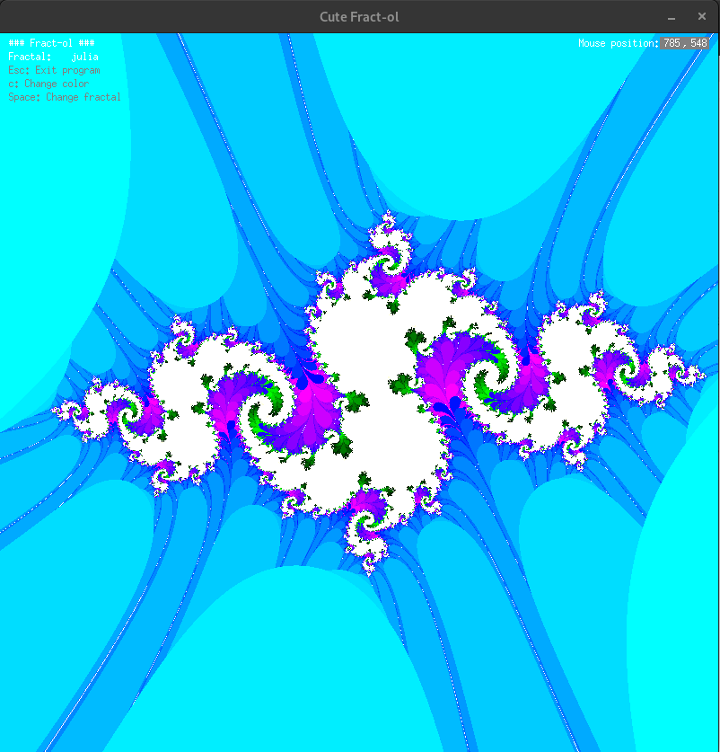
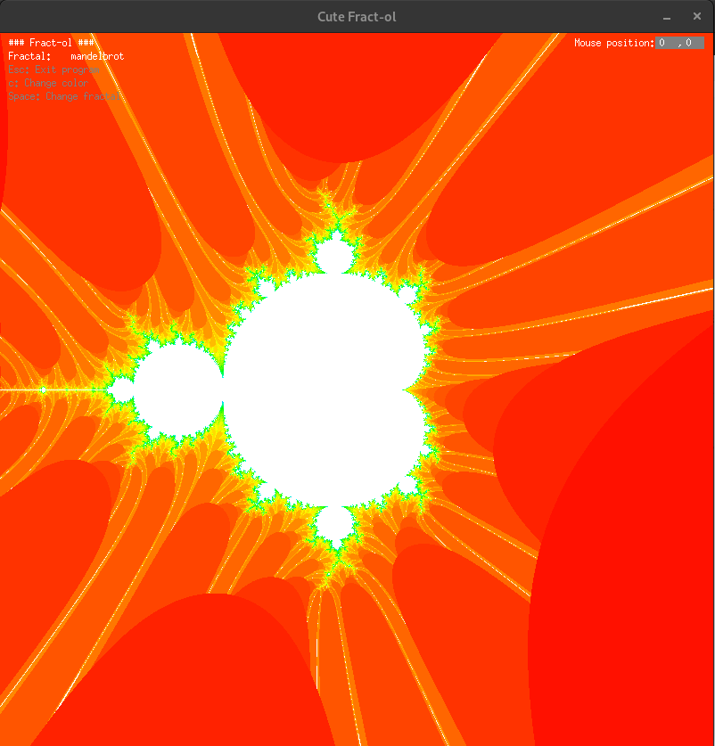
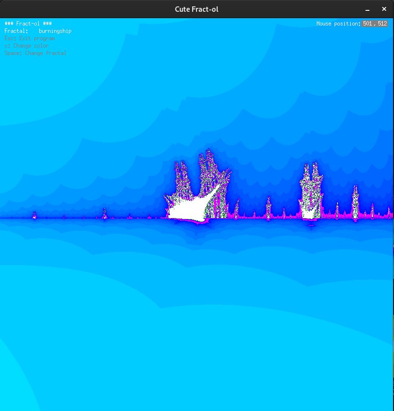
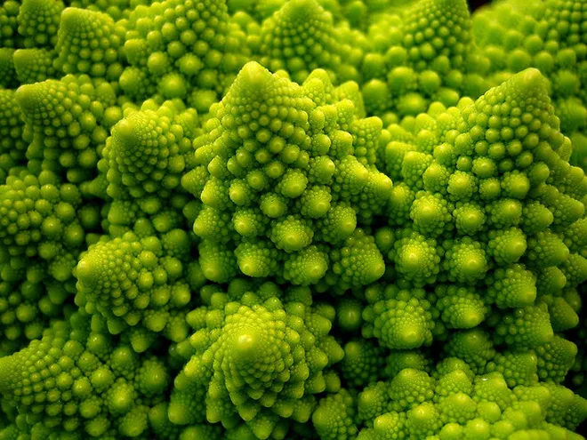

<header align="center">

# Fract-ol

[<kbd> <br> Code for Fractol <br> </kbd>](./fractol/)

<div align="center" style=" display: flex;">





</div>

</header>

The term fractal was first used by mathematician Benoit Mandelbrot in 1974.

He based it on the Latin word fractus which means "broken" or "fractured".

A fractal is an abstract mathematical object, like a curve or a surface, which pattern
remains the same at every scale.

Various natural phenomena – like the romanesco cabbage – have some fractal features.



⏯️ [**FRACTALES Videos presentation**](https://youtu.be/wUlVFYJIUNA)

⏯️ [How to make Julia FRACTALES](https://youtu.be/fAsaSkmbF5s)

⏯️ [How to make Mandelbrot FRACTALES](https://thecodingtrain.com/challenges/21-mandelbrot-set-with-p5js)

## Requirements

- Use the school graphical library: the `MiniLibX`
  - Includes basic necessary tools to open a window, create images
and deal with keyboard and mouse events
- Use the mathematical notion of **complex numbers**, to take a peek at the concept of **optimization** in computer graphics and practice **event handling**

## Julia and Mandelbrot Sets

:1234: [Live Preview + Explanation](https://www.dynamicmath.xyz/mandelbrot-julia/) | 🧮 [Math in details](https://en.wikipedia.org/wiki/Julia_set)

[](https://www.youtube.com/watch?v=R1gpm7WsNhg)

[](https://www.youtube.com/watch?v=-V8HnG9XB2g)

➿ [Explanation with great creation a fractal step by step ⬆️ ⬆️](https://www.karlsims.com/julia.html)

### Mandelbrot Set $\ Z_{n+1} = {Z_{n}}^2 + {Z_0} $

Mandelbrot set is generated by iterating a simple function on the points of the complex plane. The points that produce a cycle (the same value over and over again) fall in the set, whereas the points that diverge (give ever-growing values) lie outside it.

The **initial value** of  **$\ Z$ is always 0**, and the **constant  c** is determined by the **coordinates of the point in the complex plane** being considered.

$\ Z = Z^2 + c $

$\ Z_{n+1} = {Z_{n}}^2 + {Z_0} $

The **set iterate from $\ n = 0$** to $\ n_{MaxIteration}$ and does not diverge out of the bounded in absolute value.

$\ c $ is a complexe number : $\ c = a + bi$, $\ a$ reel part and $\ bi$ imaginary part. that complexe number is determined with **coordinates in the complex plane**.

$\ Z = (a + bi)^2 + c$

$\ Z = a^2 + 2abi + b^2i^2 + c$ Taking into account: $\ i^2 = -1$

$\ Z = a^2 + 2abi - b^2 + c$

For code purpose:

$\ aa = a^2 - b^2$

$\ bb = 2 * a * b$

$\ Z = aa + bb + c$

To adjust: c = scale + offset

$\ a = aa + c_x$ with $\ c_x = (x - \frac{WIDTH}{2.0}) + \frac{4.0}{HEIGHT}$

$\ b = bb + c_y$ with $\ c_y = (y - \frac{HEIGHT}{2.0}) + \frac{4.0}{WIDTH}$

If magnitude $\ Z = a + b$ diverge out of bound (> 4), the set diverge else it converge. Display the set accordingly.

```c
int ft_mandelbrot_set(double x, double y, int max_iterations)
{
 double scaled_x;
 double scaled_y;
 double real;
 double imaginary;
 double a;
 double b;
 int  count;

 scaled_x = (x - WIDTH / 2) * 4 / WIDTH;
 scaled_y = (y - HEIGHT / 2) * 4 / HEIGHT;
 a = 0;
 b = 0;
 count = 0;
 while (count < max_iterations)
 {
  real = (a * a) - (b * b);
  imaginary = 2 * a * b;
  a = real + scaled_x;
  b = imaginary + scaled_y;
  if (b + a > 4)
   return (count);
  count++;
 }
 return (count);
}
```

To center content/ offset with $\ c$ :

- x and y are the pixel coordinates in the display. WIDTH and HEIGHT are the dimensions of your display area. The `(x - WIDTH / 2.0)` and `(y - HEIGHT / 2.0)` parts **shift the coordinate system so that the center** of your display corresponds to (0, 0) in the complex plane.
- The multiplication by `4.0 / WIDTH` and `4.0 / HEIGHT` **scales the coordinates** so that you are looking at a region that **spans -2 to 2** (both in real and imaginary parts) in the complex plane. This scaling factor of 4.0 is somewhat arbitrary and **can be adjusted based on your preferences to zoom in or out** of the Mandelbrot set.

[Mandelbrot - Complexe Analysis](https://complex-analysis.com/content/mandelbrot_set.html)

Mandelbrot -> contains julia sets

The key difference between the Mandelbrot set and the Julia set is that
the **Mandelbrot set uses the coordinates of the point in the complex plane**
to determine if the point is in the set, while the **Julia set uses a constant value for all the points in the set**.


### [Julia Set](https://thecodingtrain.com/challenges/22-julia-set)$\ Z_{n + 1} = Z_n + c$

$\ Z = a + bi$ where **a** and **b** => represent x and y axis.

$\ Z$ is repeatedly updated using:  $\ Z = Z^2 + c$  where $\ c$ is another complex number that gives a specific Julia set. So $\ c$ is a **fixed complex number** = a **constant**.

After numerous iterations, if the **magnitude** of $\ Z$ is less than **2** we say that pixel is in the Julia set and color it accordingly. Performing this calculation for a whole grid of pixels gives a fractal image.

```c
static int ft_julia_set(double x, double y, int max_iterations)
{
 double real;
 double imaginary;
 double a;
 double b;
 int  count;

 a = (x - WIDTH / 2) * 4 / WIDTH;
 b = (y - HEIGHT / 2) * 4 / HEIGHT;
 count = 0;
 while (count < max_iterations)
 {
  real = (a * a) - (b * b);
  imaginary = 2 * a * b;
  a = real + c_real;
  b = imaginary + c_imaginary;
  if (b + a > 2)
   return (count);
  count++;
 }
 return (count);
}
```

[julia set - complexe analysis](https://complex-analysis.com/content/julia_set.html)


### [Burning Ship](https://en.wikipedia.org/wiki/Burning_Ship_fractal)

The difference between this calculation and that for the Mandelbrot set is that the real and imaginary components are set to their respective absolute values before squaring at each iteration.

<details>
  <summary>Code for burning ship</summary>

```c
static int ft_burningship_set(
 double x,
 double y,
 t_fractol *fractol,
 int count)
{
 double scaled_x;
 double real;
 double imaginary;
 double a;
 double b;

 scaled_x = fractol->fra.x + (x - WIDTH / 2) * fractol->fra.zoom / WIDTH;
 fractol->fra.param_storage = fractol->fra.y
  + (y - HEIGHT / 2) * fractol->fra.zoom / HEIGHT;
 a = 0;
 b = 0;
 count = 0;
 while (count < fractol->fra.max_iterations)
 {
  real = (a * a) - (b * b);
  imaginary = 2 * a * b;
  a = fabs(real + scaled_x);
  b = fabs(imaginary + fractol->fra.param_storage);
  if (b + a > 4)
   return (count);
  count++;
 }
 return (count);
}

/**
 * * Draw mandelbrot fractal
 * @param: fractol
*/
void ft_burningship(t_fractol *fractol)
{
 double x;
 double y;
 int  iter;

 iter = 0;
 x = 0;
 while (x < WIDTH)
 {
  y = 0;
  while (y < HEIGHT)
  {
   iter = ft_burningship_set(x, y, fractol, iter);
   if (iter == fractol->fra.max_iterations)
    fractol->fra.fractal_data[(int)(x + y * WIDTH)]
     = fractol->col.color_array[fractol->col.color_number - 1];
   else
    fractol->fra.fractal_data[(int)(x + y * WIDTH)]
     = fractol->col.color_array[ft_colormode(iter, fractol)];
   y++;
  }
  x++;
 }
}
```

</details>


### Ideas for other (escaped time) fractales

- [Newton fractal](https://en.wikipedia.org/wiki/Newton_fractal)


- [Lyapunov fractal](https://en.wikipedia.org/wiki/Lyapunov_fractal)


### Math

#### Complexe Number

🔗 [Details](https://brilliant.org/wiki/complex-numbers/)


A complex number is a number that can be written in the form $\ a+bi$, where **a** and **b** are **real numbers** and **i** is the **imaginary unit** defined by $\ i^2=−1 $.

The set of complex numbers, denoted by $\mathbb{C}$ , includes the set of real numbers $\mathbb{R}$ and the set of pure imaginary numbers.

Based on the nature of the real part and imaginary part, any complex number can be classified into four types:

- imaginary number
- zero complex number
- purely imaginary number
- purely real number.

For $\ Z=a+ib$, the following four cases arise:

1. If $\ a = 0$ and $\ b \neq 0$, then $\ Z$ is an imaginary number.
2. If $\ a = 0$ and $\ b = 0$, then $\ Z$ is a zero complex number.
3. If $\ a \neq 0$ and $\ b = 0$, then $\ Z$ is a purely real number.
4. If $\ a \neq 0$ and $\ b \neq 0$, then $\ Z$ is a complex number.

**Every real number is a complex number, but every complex number is not necessarily a real number.**

The set of all complex numbers is denoted by $\ Z ∈ \mathbb{C} $. The set of all imaginary numbers is denoted as $\ Z ∈ \mathbb{C−R} $.

#### Magnitude


The magnitude of a number (also called its absolute value) is its distance from zero, so

- the magnitude of 6 is 6
- the magnitude of −6 is also 6

The magnitude of a vector is its length (ignoring direction).

For a complex number $\ Z = a + bi$, we define the magnitude, $\ |Z|$, as
follows:

$\ |Z| = \sqrt{a^2 + b^2} $

## Coloring

🔗 [Coloring/Plotting Algorithm](https://en.wikipedia.org/wiki/Plotting_algorithms_for_the_Mandelbrot_set#Coloring_algorithms)

### [Escape Time](https://en.wikipedia.org/wiki/Plotting_algorithms_for_the_Mandelbrot_set#Escape_time_algorithm)

The simplest algorithm for generating a representation of the Mandelbrot set is known as the "escape time" algorithm. A repeating calculation is performed for each x, y point in the plot area and based on the behavior of that calculation, a color is chosen for that pixel.

Color based on escape of iterations loop within bound $\R$ of the circle of radius ($\ |Z| < 2$ for exemple with mandelbrot)

### [Normalize Iterations Count Algorithm](https://linas.org/art-gallery/escape/escape.html)

The escape time algorithm is popular for its simplicity. However, it creates bands of color, which, as a type of aliasing, can detract from an image's aesthetic value. This can be improved using an algorithm known as "normalized iteration count", which provides a smooth transition of colors between iterations. The algorithm associates a real number ν \nu with each value of z by using the connection of the iteration number with the potential function.

...

