# Inception


## Description

The aim of this project is to introduce you to the world of system and network administration, offering you a global vision of a network architecture. You will learn how to install a complete web server, using a deployment technology like Docker. You will discover the basics of system and network administration, as well as the essential concepts of security.

## Guide

[Useful links](https://github.com/jotavare/42-resources?tab=readme-ov-file#inception)

[Github Inception - Waltergcc](https://github.com/waltergcc/42-inception)

## Tools

<ul>
  <li><svg xmlns="http://www.w3.org/2000/svg" x="0px" y="0px" width="20" height="20" viewBox="0 0 45 45">
<path fill="#2395ec" d="M47.527,19.847c-0.13-0.102-1.345-1.007-3.908-1.007c-0.677,0.003-1.352,0.06-2.019,0.171 c-0.496-3.354-3.219-4.93-3.345-5.003l-0.688-0.392l-0.453,0.644c-0.567,0.866-1.068,1.76-1.311,2.763 c-0.459,1.915-0.18,3.713,0.806,5.25C35.417,22.928,33.386,22.986,33,23H1.582c-0.826,0.001-1.496,0.66-1.501,1.474 c-0.037,2.733,0.353,5.553,1.306,8.119c1.089,2.818,2.71,4.894,4.818,6.164C8.567,40.184,12.405,41,16.756,41 c1.965,0.006,3.927-0.169,5.859-0.524c2.686-0.487,5.271-1.413,7.647-2.74c1.958-1.119,3.72-2.542,5.219-4.215 c2.505-2.798,3.997-5.913,5.107-8.682c0.149,0,0.298,0,0.442,0c2.743,0,4.429-1.083,5.359-1.99 c0.618-0.579,1.101-1.284,1.414-2.065L48,20.216L47.527,19.847z"></path><path fill="#2395ec" d="M8,22H5c-0.552,0-1-0.448-1-1v-3c0-0.552,0.448-1,1-1h3c0.552,0,1,0.448,1,1v3 C9,21.552,8.552,22,8,22z"></path><path fill="#2395ec" d="M14,22h-3c-0.552,0-1-0.448-1-1v-3c0-0.552,0.448-1,1-1h3c0.552,0,1,0.448,1,1v3 C15,21.552,14.552,22,14,22z"></path><path fill="#2395ec" d="M20,22h-3c-0.552,0-1-0.448-1-1v-3c0-0.552,0.448-1,1-1h3c0.552,0,1,0.448,1,1v3 C21,21.552,20.552,22,20,22z"></path><path fill="#2395ec" d="M26,22h-3c-0.552,0-1-0.448-1-1v-3c0-0.552,0.448-1,1-1h3c0.552,0,1,0.448,1,1v3 C27,21.552,26.552,22,26,22z"></path><path fill="#2395ec" d="M14,16h-3c-0.552,0-1-0.448-1-1v-3c0-0.552,0.448-1,1-1h3c0.552,0,1,0.448,1,1v3 C15,15.552,14.552,16,14,16z"></path><path fill="#2395ec" d="M20,16h-3c-0.552,0-1-0.448-1-1v-3c0-0.552,0.448-1,1-1h3c0.552,0,1,0.448,1,1v3 C21,15.552,20.552,16,20,16z"></path><path fill="#2395ec" d="M26,16h-3c-0.552,0-1-0.448-1-1v-3c0-0.552,0.448-1,1-1h3c0.552,0,1,0.448,1,1v3 C27,15.552,26.552,16,26,16z"></path><path fill="#2395ec" d="M26,10h-3c-0.552,0-1-0.448-1-1V6c0-0.552,0.448-1,1-1h3c0.552,0,1,0.448,1,1v3 C27,9.552,26.552,10,26,10z"></path><path fill="#2395ec" d="M32,22h-3c-0.552,0-1-0.448-1-1v-3c0-0.552,0.448-1,1-1h3c0.552,0,1,0.448,1,1v3 C33,21.552,32.552,22,32,22z"></path>
</svg><a href="./docker.md"> Docker and Docker-Compose</a>
  </li>
  <li><svg xmlns="http://www.w3.org/2000/svg" x="0px" y="0px" width="20" height="20" viewBox="0 0 45 45">
<polygon fill="#43a047" points="43,35.112 43,13.336 24,2.447 5,13.336 5,35.112 24,46"></polygon><path fill="#fff" d="M32.5,13c-1.381,0-2.5,1.119-2.5,2.5v11.276L18.984,14.453l-0.131-0.152 C17.609,12.938,16.187,13,15.5,13c-1.381,0-2.5,1.119-2.5,2.5v17c0,1.381,1.119,2.5,2.5,2.5s2.5-1.119,2.5-2.5V21.141 l11.278,12.627l0.11,0.142C30.62,35.133,32.295,35,32.5,35c1.381,0,2.5-1.119,2.5-2.5v-17C35,14.119,33.881,13,32.5,13z"></path>
</svg><a href="./nginx.md"> Nginx</a>
  </li>
  <li><svg xmlns="http://www.w3.org/2000/svg" x="0px" y="0px" width="20" height="20" viewBox="0 0 48 48">
<path fill="#006064" d="M47.776,8.156c-0.13-0.107-0.296-0.163-0.465-0.156c-0.463,0-1.062,0.314-1.385,0.483l-0.128,0.065 c-0.541,0.262-1.13,0.41-1.73,0.435c-0.615,0.02-1.146,0.056-1.836,0.128c-4.091,0.421-5.916,3.556-7.674,6.589 c-0.957,1.65-1.946,3.363-3.301,4.672c-0.28,0.272-0.578,0.525-0.892,0.758c-1.402,1.042-3.163,1.787-4.533,2.314 c-1.319,0.504-2.759,0.957-4.15,1.396c-1.275,0.401-2.478,0.781-3.584,1.191c-0.499,0.185-0.923,0.327-1.298,0.452 c-1.008,0.327-1.735,0.578-2.797,1.309c-0.414,0.283-0.83,0.589-1.111,0.818c-0.843,0.673-1.589,1.459-2.217,2.335 c-0.54,0.809-1.164,1.558-1.862,2.235c-0.224,0.219-0.622,0.327-1.218,0.327C6.899,33.509,4.984,33,3.699,33 C1.987,33,0.208,33.627,0,34c0,0,2.911,1.894,3.014,1.996c-0.111,0.164-1.818,2.503-2.002,3.011 c2.494,0.063,3.956-0.306,5.356-0.983c0.406-0.196,0.818-0.398,1.309-0.605c0.818-0.355,1.699-0.921,2.633-1.52 c1.222-0.797,2.501-1.615,3.741-2.01c1.019-0.311,2.081-0.46,3.147-0.442c1.309,0,2.687,0.175,4.016,0.345 c0.99,0.128,2.78,0.148,3.786,0.208c0.269,0.016,1.84,0.034,2.946,0.027C26.758,36.642,25,39,25,39s6,0,8.548-5.781 c0.034-0.067,0.063-0.136,0.096-0.203c1.58-0.377,5.63-2.513,6.706-8.405c0.504-1.712,0.874-3.412,1.2-4.909 c0.389-1.8,0.725-3.343,1.109-3.942c0.604-0.939,1.525-1.574,2.417-2.191c0.121-0.083,0.244-0.164,0.363-0.252 c1.121-0.787,2.235-1.695,2.481-3.389V9.889C48.098,8.626,47.948,8.303,47.776,8.156z"></path>
</svg><a href="./mariadb.md"> MariaDB</a>
  </li>
  <li><svg xmlns="http://www.w3.org/2000/svg" x="0px" y="0px" width="20" height="20" viewBox="0 0 48 48">
<path fill="#fff" d="M24 4.050000000000001A19.95 19.95 0 1 0 24 43.95A19.95 19.95 0 1 0 24 4.050000000000001Z"></path><path fill="#01579b" d="M8.001,24c0,6.336,3.68,11.806,9.018,14.4L9.385,17.488C8.498,19.479,8.001,21.676,8.001,24z M34.804,23.194c0-1.977-1.063-3.35-1.67-4.412c-0.813-1.329-1.576-2.437-1.576-3.752c0-1.465,1.471-2.84,3.041-2.84 c0.071,0,0.135,0.006,0.206,0.008C31.961,9.584,28.168,8,24.001,8c-5.389,0-10.153,2.666-13.052,6.749 c0.228,0.074,0.307,0.039,0.611,0.039c1.669,0,4.264-0.2,4.264-0.2c0.86-0.057,0.965,1.212,0.099,1.316c0,0-0.864,0.105-1.828,0.152 l5.931,17.778l3.5-10.501l-2.603-7.248c-0.861-0.046-1.679-0.152-1.679-0.152c-0.862-0.056-0.762-1.375,0.098-1.316 c0,0,2.648,0.2,4.217,0.2c1.675,0,4.264-0.2,4.264-0.2c0.861-0.057,0.965,1.212,0.104,1.316c0,0-0.87,0.105-1.832,0.152l5.891,17.61 l1.599-5.326C34.399,26.289,34.804,24.569,34.804,23.194z M24.281,25.396l-4.8,13.952c1.436,0.426,2.95,0.652,4.52,0.652 c1.861,0,3.649-0.324,5.316-0.907c-0.04-0.071-0.085-0.143-0.118-0.22L24.281,25.396z M38.043,16.318 c0.071,0.51,0.108,1.059,0.108,1.645c0,1.628-0.306,3.451-1.219,5.737l-4.885,14.135C36.805,35.063,40,29.902,40,24 C40,21.219,39.289,18.604,38.043,16.318z"></path><path fill="#01579b" d="M4,24c0,11.024,8.97,20,19.999,20C35.03,44,44,35.024,44,24S35.03,4,24,4S4,12.976,4,24z M5.995,24 c0-9.924,8.074-17.999,18.004-17.999S42.005,14.076,42.005,24S33.929,42.001,24,42.001C14.072,42.001,5.995,33.924,5.995,24z"></path>
</svg><a href="./wordpress.md"> Wordpress</a>
  </li>
  <li>🔐 <a href="./tls.md">TLS - Transport Layer Security</a></li>
  <li>📜 <a href="./php.md">PHP</a></li>
</ul>

## Structure of the project

### Launch Structure

<!-- Work with markdown preview extension (not sure with github) -->
<link
  href="https://cdnjs.cloudflare.com/ajax/libs/font-awesome/6.5.1/css/all.min.css"
  rel="stylesheet"
/>

```mermaid
graph TD
  direction TB
  classDef black fill:#000,stroke:#333,stroke-width:1px;
  classDef white fill:#fff,stroke:#333,stroke-width:1px;
  classDef lightblue fill:#99f,stroke:#333,stroke-width:1px;
  classDef lightgreen fill:#9f9,stroke:#333,stroke-width:1px;
  classDef lightred fill:#f99,stroke:#333,stroke-width:1px;
  classDef lightyellow fill:#ff9,stroke:#333,stroke-width:1px;
  classDef lightorange fill:#f90,stroke:#333,stroke-width:1px;
  classDef lightpurple fill:#f0f,stroke:#333,stroke-width:1px;
  classDef lightcyan fill:#9ff,stroke:#333,stroke-width:1px;
  classDef lightpink fill:#f9f,stroke:#333,stroke-width:1px;
  classDef lightbrown fill:#963,stroke:#333,stroke-width:1px;
  classDef lightgrey fill:#999,stroke:#333,stroke-width:1px;
  classDef lightblack fill:#000,stroke:#333,stroke-width:1px;
  classDef lightwhite fill:#fff,stroke:#333,stroke-width:1px;
  classDef lightviolet fill:#9f9,stroke:#333,stroke-width:1px;


  Makefile -->|Launch/Setup| Docker-compose[fab:fa-docker Docker Compose]
  Docker-compose -->|Image| Dockerfile-Mariadb[fab:fa-docker Dockerfile Mariadb]
  Docker-compose -->|Image| Dockerfile-Wordpress[fab:fa-docker Dockerfile Wordpress]
  Docker-compose -->|Image| Dockerfile-Nginx[fab:fa-docker Dockerfile Nginx]
  Dockerfile-Mariadb -->|Config| MariaDB[fa:fa-database MariaDB]
  Dockerfile-Wordpress -->|Config| Wordpress[fab:fa-wordpress Wordpress]
  Dockerfile-Nginx -->|Config| Nginx[fa:fa-globe Nginx]
```



### Environment

```mermaid
%%{ init: { 'flowchart': { 'curve': 'step' } } }%%
graph TD
  direction TB
  classDef black fill:#000,stroke:#333,stroke-width:1px;
  classDef white fill:#fff,stroke:#333,stroke-width:1px;
  classDef white_border fill:#fff,stroke:#333,stroke-width:1px, stroke-dasharray: 5, 5;
  classDef green fill:#0f0,stroke:#333,stroke-width:1px;
  classDef lightblue fill:#99f,stroke:#333,stroke-width:1px,color:#fff;
  classDef lightgreen fill:#9f9,stroke:#333,stroke-width:1px;
  classDef lightred fill:#f99,stroke:#333,stroke-width:1px;
  classDef lightyellow fill:#ff9,stroke:#333,stroke-width:1px;
  classDef lightorange fill:#f90,stroke:#333,stroke-width:1px;
  classDef lightpurple fill:#f0f,stroke:#333,stroke-width:1px;
  classDef lightcyan fill:#9ff,stroke:#333,stroke-width:1px;
  classDef lightpink fill:#f9f,stroke:#333,stroke-width:1px;
  classDef lightbrown fill:#963,stroke:#333,stroke-width:1px;
  classDef lightgrey fill:#999,stroke:#333,stroke-width:1px;
  classDef lightblack fill:#000,stroke:#333,stroke-width:1px;
  classDef lightwhite fill:#fff,stroke:#333,stroke-width:1px;

  Project:::white_border
  subgraph Project
    direction LR
    WorldWideWeb <-->|"`*443*`"| Nginx
    WorldWideWeb((fa:fa-globe World Wide\nWeb)):::lightgreen

    subgraph Computer_Host["fas:fa-computer Computer Host"]
      direction TB
      Docker_Network:::lightblue

      subgraph Docker_Network["fas:fa-network-wired Docker Network"]
        direction LR
        MariaDB("fa:fa-database MariaDB\nContainer")
        Wordpress("fab:fa-wordpress Wordpress + PHP\nContainer")
        Nginx("fa:fa-server Nginx + TLS\nContainer")
        MariaDB <-->|"`*3306*`"| Wordpress <-->|"`*9000*`"| Nginx
      end

    Volume_MariaDB[("fas:fa-hdd MariaDB\nVolume\n\n/home/login/data/...")]:::lightorange
    Volume_Wordpress[("fas:fa-hdd Wordpress\nVolume\n\n/home/login/data/...")]:::lightorange
    MariaDB <-.-> Volume_MariaDB
    Wordpress <-.-> Volume_Wordpress
    Nginx <-.-> Volume_Wordpress
    end
  end

  linkStyle 0 stroke:lightgreen,stroke-width:2px;
  linkStyle 1,2 stroke:lightcyan,stroke-width:2px;
```



## Ignore the credentials

It is important to **never** commit your credentials to a repository. To avoid this, you can use a `.gitignore` file to ignore the files containing your credentials.

```bash
git rm --cached -r secrets/ # Stop tracking secrets files
git add .gitignore
git commit -m "Ignore secrets files but keep them in the repository as template"
git push
```

🔗 [Env details and good practices](https://platform.sh/blog/we-need-to-talk-about-the-env/)

Same goes for the `.env` file, which is used to store environment variables.

```bash
echo ".env" >> .gitignore
git add .gitignore
git commit -m "Ignore .env file"
git push
```

## [Hosts file](https://en.wikipedia.org/wiki/Hosts_(file))

The hosts file is a computer file used by an operating system to map hostnames to IP addresses. The hosts file is a plain text file and is conventionally named `hosts`. It acts as a **local DNS service**, resolving hostnames to IP addresses.

In Unix-like operating systems, the hosts file is located at `/etc/hosts`.

```bash
sudo nano /etc/hosts
```

Notes: This file can be used to **block** or **redirect** websites. It is an **attack vector for malware**.

## Bonus

### [Portainer](https://docs.portainer.io/start/install-ce/server/docker/linux)

Portainer is a **lightweight management UI** which allows you to easily manage your Docker host or Swarm cluster.

Portainer hides the complexity of managing containers behind an easy-to-use UI. By removing the need to use the CLI, write YAML or understand manifests, Portainer makes deploying apps and troubleshooting problems so easy that anyone can do it.

Portainer consists of two elements: the Portainer Server and the Portainer Agent. Both run as lightweight containers on your existing containerized infrastructure. The Portainer Agent should be deployed to each node in your cluster and configured to report back to the Portainer Server container.

A single Portainer Server will accept connections from any number of Portainer Agents, providing the **ability to manage multiple clusters from one centralized interface**. To do this, the Portainer Server container requires data persistence. The Portainer Agents are stateless, with data being shipped back to the Portainer Server container.


- Dashboard when container run : https://localhost:9443