# Docker


## What is Docker?

Docker is a platform for developing, shipping, and running applications in containers. **Containers** allow a developer to **package up an application** with all of the parts it needs, such as **libraries and other dependencies**, and ship it all out as one package. By doing so, thanks to the container, the developer can rest assured that the application will run on any other Linux machine regardless of any customized settings that machine might have that could differ from the machine used for writing and testing the code.

### Docker vs Virtual Machines

- Virtual machines (VMs) are an abstraction of physical hardware turning one server into many servers. The hypervisor allows multiple VMs to run on a single machine. Each VM includes a full copy of an operating system, the application, necessary binaries, and libraries - taking up tens of GBs. VMs can also be slow to boot.

- Containers take a different approach, by leveraging the low-level mechanics of the host operating system. Containers are lightweight and fast to boot. Containers share the host OS kernel and are isolated in user space. They can also be run on any computer and any infrastructure.

[🎬 Docker Guide (Portainer as example) - Chris Titus Tech](https://christitus.com/docker-guide/)

[🧑‍🎓 Docker Official Guides](https://docs.docker.com/guides/)

### [Docker Architecture](https://docs.docker.com/guides/docker-overview/#docker-architecture)

Docker uses a client-server architecture. The Docker client talks to the Docker daemon, which does the heavy lifting of building, running, and distributing your Docker containers. The Docker client and daemon can run on the same system, or you can connect a Docker client to a remote Docker daemon.


## Install Docker

🔗 [Official Docker - Install on Debian](https://docs.docker.com/engine/install/debian/#install-using-the-repository)

## Docker Commands

### Containers Commands

<table border="1">
  <thead>
    <tr>
      <th>Command</th>
      <th>Description</th>
      <th>Example</th>
    </tr>
  </thead>
  <tbody>
    <tr>
      <td>docker run</td>
      <td>Run a command in a new container</td>
      <td><code>docker run [OPTIONS] IMAGE [COMMAND] [ARG...]</code></td>
    </tr>
    <tr>
      <td>docker start</td>
      <td>Start one or more stopped containers</td>
      <td><code>docker start [OPTIONS] CONTAINER [CONTAINER...]</code></td>
    </tr>
    <tr>
      <td>docker stop</td>
      <td>Stop one or more running containers</td>
      <td><code>docker stop [OPTIONS] CONTAINER [CONTAINER...]</code></td>
    </tr>
    <tr>
      <td>docker exec</td>
      <td>Run a command in a running container</td>
      <td><code>docker exec [OPTIONS] CONTAINER COMMAND [ARG...]</code></td>
    </tr>
    <tr>
      <td>docker logs</td>
      <td>Fetch the logs of a container</td>
      <td><code>docker logs [OPTIONS] CONTAINER</code></td>
    </tr>
    <tr>
      <td>docker inspect</td>
      <td>Return low-level information on Docker objects</td>
      <td><code>docker inspect [OPTIONS] NAME|ID [NAME|ID...]</code></td>
    </tr>
    <tr>
      <td>docker cp</td>
      <td>Copy files/folders between a container and the local filesystem</td>
      <td><code>docker cp [OPTIONS] CONTAINER:SRC_PATH DEST_PATH</code></td>
    </tr>
    <tr>
      <td>docker rm</td>
      <td>Remove one or more containers</td>
      <td><code>docker rm [OPTIONS] CONTAINER [CONTAINER...]</code></td>
    </tr>
    <tr>
      <td>docker ps</td>
      <td>List running containers</td>
      <td><code>docker ps [OPTIONS]</code></td>
    </tr>
    <tr>
      <td>docker ps -a</td>
      <td>List all containers, including stopped ones</td>
      <td><code>docker ps -a [OPTIONS]</code></td>
    </tr>
  </tbody>
</table>

#### Docker Run Commands

Few usefull ways to run a container:

<table border="1">
  <thead>
    <tr>
      <th>Flag</th>
      <th>Description</th>
      <th>Example</th>
    </tr>
  </thead>
  <tbody>
    <tr>
      <td>-d, --detach</td>
      <td>Run container in background and print container ID</td>
      <td><code>docker run -d [CONTAINER]</code></td>
    </tr>
    <tr>
      <td>--name</td>
      <td>Assign a name to the container</td>
      <td><code>docker run --name [NAME] [CONTAINER]</code></td>
    </tr>
    <tr>
      <td>-p, --publish</td>
      <td>Publish a container's port(s) to the host</td>
      <td><code>docker run -p [HOSTPORT]:[CONTAINERPORT] [CONTAINER]</code></td>
    </tr>
    <tr>
      <td>-v, --volume</td>
      <td>Bind mount a volume (preferred way to persist data)</td>
      <td><code>docker run -v /host/path:/container/path [CONTAINER]</code></td>
    </tr>
    <tr>
      <td>--rm</td>
      <td>Automatically remove the container when it exits</td>
      <td><code>docker run --rm [CONTAINER]</code></td>
    </tr>
    <tr>
      <td>-e, --env</td>
      <td>Set environment variables</td>
      <td><code>docker run -e VAR=value [CONTAINER]</code></td>
    </tr>
    <tr>
      <td>--restart</td>
      <td>Restart policy to apply when a container exits</td>
      <td><code>docker run --restart=always [CONTAINER]</code></td>
    <tr>
      <td>--entrypoint</td>
      <td>Overwrite the default ENTRYPOINT of the image</td>
      <td><code>docker run --entrypoint /bin/bash [CONTAINER]</code></td>
    </tr>
    <tr>
      <td>--network</td>
      <td>Connect a container to a network</td>
      <td><code>docker run --network=host [CONTAINER]</code></td>
    </tr>
    <tr>
      <td>-it</td>
      <td>Allocate a pseudo-TTY connected to the container’s stdin; creating an interactive bash shell in the container</td>
      <td><code>docker run -it [CONTAINER] /bin/bash</code></td>
    </tr>
  </tbody>
</table>

#### Docker Image Commands

<table border="1">
  <thead>
    <tr>
      <th>Command</th>
      <th>Description</th>
      <th>Example</th>
    </tr>
  </thead>
  <tbody>
    <tr>
      <td>docker build</td>
      <td>Build an image from a Dockerfile</td>
      <td><code>docker build [OPTIONS] PATH | URL | -</code></td>
    </tr>
    <tr>
      <td>docker pull</td>
      <td>Pull an image or a repository from a registry</td>
      <td><code>docker pull [OPTIONS] NAME[:TAG|@DIGEST]</code></td>
    </tr>
    <tr>
      <td>docker push</td>
      <td>Push an image or a repository to a registry</td>
      <td><code>docker push [OPTIONS] NAME[:TAG]</code></td>
    </tr>
    <tr>
      <td>docker save</td>
      <td>Save one or more images to a tar archive</td>
      <td><code>docker save [OPTIONS] IMAGE [IMAGE...]</code></td>
    </tr>
    <tr>
      <td>docker load</td>
      <td>Load an image from a tar archive or STDIN</td>
      <td><code>docker load [OPTIONS]</code></td>
    </tr>
    <tr>
      <td>docker tag</td>
      <td>Create a tag TARGET_IMAGE that refers to SOURCE_IMAGE</td>
      <td><code>docker tag SOURCE_IMAGE[:TAG] TARGET_IMAGE[:TAG]</code></td>
    </tr>
    <tr>
      <td>docker images</td>
      <td>List images</td>
      <td><code>docker images [OPTIONS] [REPOSITORY[:TAG]]</code></td>
    </tr>
    <tr>
      <td>docker rmi</td>
      <td>Remove one or more images</td>
      <td><code>docker rmi [OPTIONS] IMAGE [IMAGE...]</code></td>
    </tr>
    <tr>
      <td>docker prune</td>
      <td>Remove all unused images not just dangling ones</td>
      <td><code>docker image prune [OPTIONS]</code></td>
    </tr>
  </tbody>
</table>

## Docker Containers

### What is a Docker Container?

A container is a standard unit of software that packages up code and all its dependencies so the application runs quickly and reliably from one computing environment to another. A Docker container image is a **lightweight**, **standalone**, **executable package of software** that includes everything needed to run a piece of software, including the code, a runtime, libraries, environment variables, and config files.

### Docker Container Lifecycle

```mermaid
graph LR
  classDef black fill:#000,stroke:#333,stroke-width:1px;
  classDef white fill:#fff,stroke:#333,stroke-width:1px;
  classDef white_border fill:#fff,stroke:#333,stroke-width:1px, stroke-dasharray: 5, 5;
  classDef green fill:#0f0,stroke:#333,stroke-width:1px;
  classDef lightblue fill:#99f,stroke:#333,stroke-width:1px,color:#fff;
  classDef lightgreen fill:#9f9,stroke:#333,stroke-width:1px;
  classDef lightred fill:#f99,stroke:#333,stroke-width:1px;
  classDef lightyellow fill:#ff9,stroke:#333,stroke-width:1px;
  classDef lightorange fill:#f90,stroke:#333,stroke-width:1px;
  classDef lightpurple fill:#a7f,stroke:#333,stroke-width:1px;
  classDef lightcyan fill:#9ff,stroke:#333,stroke-width:1px;
  classDef lightpink fill:#f9f,stroke:#333,stroke-width:1px;
  classDef lightbrown fill:#963,stroke:#333,stroke-width:1px;
  classDef lightgrey fill:#999,stroke:#333,stroke-width:1px;
  classDef lightblack fill:#000,stroke:#333,stroke-width:1px;
  classDef lightwhite fill:#fff,stroke:#333,stroke-width:1px;

  create[Create]:::lightgreen;
  start[Start]:::lightblue;
  run[Run]:::lightpurple;
  pause[Pause]:::lightyellow;
  unpause[Unpause]:::lightyellow;
  stop[Stop]:::lightred;
  restart[Restart]:::lightcyan;
  kill[Kill]:::lightorange;
  delete[Delete]:::lightgrey;
  create --> start;
  start --> run;
  run --> pause;
  pause <--> unpause;
  unpause --> stop;
  stop --> restart;
  restart --> kill;
  kill --> delete;
  restart --> start;
```



## Dockerfile

### What is a Dockerfile?

A Dockerfile is a text document that contains all the commands a user could call on the command line to assemble an image. Using `docker build`, users can create an automated build that executes several command-line instructions in succession.


```dockerfile
# Dockerfile
FROM ubuntu:20.04
RUN apt-get update && apt-get install -y curl
CMD ["curl", "https://www.google.com"]
```

### Dockerfile Instructions

<table border="1">
  <thead>
    <tr>
      <th>Instruction</th>
      <th>Description</th>
      <th>Prototype/Example</th>
    </tr>
  </thead>
  <tbody>
    <tr>
      <td>FROM</td>
      <td>Set the base image for the subsequent instructions</td>
      <td><code>FROM ubuntu:20.04</code></td>
    </tr>
    <tr>
      <td>WORKDIR</td>
      <td>Set the working directory for any RUN, CMD, ENTRYPOINT, COPY, and ADD instructions that follow it in the Dockerfile</td>
      <td><code>WORKDIR /app</code></td>
    </tr>
    <tr>
      <td>RUN</td>
      <td>Execute any commands in a new layer on top of the current image and commit the results</td>
      <td><code>RUN apt-get update && apt-get install -y curl</code></td>
    </tr>
    <tr>
      <td>CMD</td>
      <td>Provide defaults for an executing container</td>
      <td><code>CMD ["curl", "https://www.google.com"]</code></td>
    </tr>
    <tr>
      <td>EXPOSE</td>
      <td>Informs Docker that the container listens on the specified network ports at runtime</td>
      <td><code>EXPOSE 8080</code></td>
    </tr>
    <tr>
      <td>ENV</td>
      <td>Set the environment variables</td>
      <td><code>ENV MY_VAR=my_value</code></td>
    </tr>
    <tr>
      <td>ADD</td>
      <td>Copy new files, directories, or remote file URLs from <src> and add them to the filesystem of the image at the path <dest></td>
      <td><code>ADD app.jar /app</code></td>
    </tr>
    <tr>
      <td>COPY</td>
      <td>Copy new files or directories from <src> and add them to the filesystem of the image at the path <dest></td>
      <td><code>COPY app.jar /app</code></td>
    </tr>
    <tr>
      <td>ENTRYPOINT</td>
      <td>Allows you to configure a container that will run as an executable</td>
      <td><code>ENTRYPOINT ["java", "-jar", "app.jar"]</code></td>
    </tr>
    <tr>
      <td>VOLUME</td>
      <td>Creates a mount point with the specified name and marks it as holding externally mounted volumes from native host or other containers</td>
      <td><code>VOLUME /data</code></td>
    </tr>
    <tr>
      <td>USER</td>
      <td>Set the user name or UID to use when running the image</td>
      <td><code>USER myuser</code></td>
    </tr>
    <tr>
      <td>HEALTHCHECK</td>
      <td>Tells Docker how to test a container to check that it is still working</td>
      <td><code>HEALTHCHECK --interval=5m --timeout=3s CMD curl -f http://localhost/ || exit 1</code></td>
    </tr>
    <tr>
      <td>ARG</td>
      <td>Defines a variable that users can pass at build-time to the builder with the docker build command using the --build-arg <varname>=<value> flag</td>
      <td><code>ARG MY_ARG=default_value</code></td>
    </tr>
    <tr>
      <td>ONBUILD</td>
      <td>Adds a trigger instruction to the image that will be executed at a later time, when the image is used as the base for another build</td>
      <td><code>ONBUILD COPY . /app</code></td>
    </tr>
    <tr>
      <td>STOPSIGNAL</td>
      <td>Sets the system call signal that will be sent to the container to exit</td>
      <td><code>STOPSIGNAL SIGTERM</code></td>
    </tr>
    <tr>
      <td>LABEL</td>
      <td>Apply key-value metadata to your images, containers, or daemons</td>
      <td><code>LABEL version="1.0"</code></td>
    </tr>
    <tr>
      <td>SHELL</td>
      <td>Allows the default shell used for the shell form of commands to be overridden</td>
      <td><code>SHELL ["/bin/bash", "-c"]</code></td>
    </tr>
  </tbody>
</table>

📚 [Dockerfile Reference](https://docs.docker.com/engine/reference/builder/)

#### Entry Point vs Command

- `ENTRYPOINT` specifies a command that will always be executed when the container starts.
- `CMD` specifies arguments that will be fed to the `ENTRYPOINT`.

```dockerfile
# Dockerfile
FROM ubuntu:lts
ENTRYPOINT ["echo", "Hello"]
CMD ["World"]
```

```bash
docker run my-image
# Output: Hello World
```

```bash
docker run my-image John
# Output: Hello John
```

### Dockerfile Best Practices

- Use `.dockerignore` file to exclude files and directories from the context.
- Use multi-stage builds to reduce the size of the final image.
- Use `COPY` instead of `ADD` to copy files and directories.
- Use `LABEL` to add metadata to the image.
- Use `HEALTHCHECK` to check the health of the container.
- Use `ENTRYPOINT` to configure a container that will run as an executable.
- Use `ENV` to set the environment variables.
- Use `ARG` to pass build-time variables.
- Use `VOLUME` to create a mount point with the specified name.
- Use `USER` to set the user name or UID to use when running the image.
- Use `WORKDIR` to set the working directory for any RUN, CMD, ENTRYPOINT, COPY, and ADD instructions that follow it in the Dockerfile.

## Docker Image

### [What is a Docker Image ?](https://docs.docker.com/guides/docker-concepts/the-basics/what-is-an-image/)

🎬 [What is an image - Docker](https://www.youtube.com/watch?v=NyvT9REqLe4)

A Docker image is a file, comprised of multiple layers, used to execute code in a Docker container. An image is essentially built from the instructions for a complete and executable version of an application, which relies on the host OS kernel.

### Finding an Image

[Docker Hub](https://hub.docker.com/search?image_filter=official) is the default registry where you can find images. You can also find images on other registries like GitHub Container Registry, Amazon Elastic Container Registry, Google Container Registry, and more.

<table>
  <thead>
    <tr>
      <th>GUI</th>
      <th>CLI</th>
    </tr>
  </thead>
  <tbody>
    <tr>
      <td>
        <a href="https://hub.docker.com/">Docker Hub</a>
      </td>
      <td>
        <code>docker search &lt;image&gt;</code>
      </td>
    </tr>
  </tbody>
</table>

### Docker Registry

A Docker registry is a **storage and content delivery system** for **named Docker images**. You can use a registry to **save and share Docker images**. The default registry is Docker Hub, but you can also use other registries like GitHub Container Registry, Amazon Elastic Container Registry, Google Container Registry, and more. It's like a **Git for Docker images**.

Registry contains **repositories** which contain **images**.

```mermaid
graph LR
  classDef black fill:#000,stroke:#333,stroke-width:1px;
  classDef white fill:#fff,stroke:#333,stroke-width:1px;
  classDef white_border fill:#fff,stroke:#333,stroke-width:1px, stroke-dasharray: 5, 5;
  classDef green fill:#0f0,stroke:#333,stroke-width:1px;
  classDef lightblue fill:#99f,stroke:#333,stroke-width:1px,color:#fff;
  classDef lightgreen fill:#9f9,stroke:#333,stroke-width:1px;
  classDef lightred fill:#f99,stroke:#333,stroke-width:1px;
  classDef lightyellow fill:#ff9,stroke:#333,stroke-width:1px;
  classDef lightorange fill:#f90,stroke:#333,stroke-width:1px;
  classDef lightpurple fill:#a7f,stroke:#333,stroke-width:1px;
  classDef lightcyan fill:#9ff,stroke:#333,stroke-width:1px;
  classDef lightpink fill:#f9f,stroke:#333,stroke-width:1px;
  classDef lightbrown fill:#963,stroke:#333,stroke-width:1px;
  classDef lightgrey fill:#999,stroke:#333,stroke-width:1px;
  classDef lightblack fill:#000,stroke:#333,stroke-width:1px;
  classDef lightwhite fill:#fff,stroke:#333,stroke-width:1px;

  registry[Registry]:::lightgreen;
  repository[Repository]:::lightblue;
  repository2[Repository]:::lightblue;
  image[Image:v1]:::lightpurple;
  image2[Image:v2]:::lightpurple;
  image3[Image]:::lightpurple;
  subgraph registry
    subgraph repository
      direction TB
      image
      image2
    end
    subgraph repository2
      direction TB
      image3
    end
  end
```



Add a tag to an image:

```bash
docker tag my-image my-registry/my-image:latest
```

Push an image to a registry:

```bash
docker push my-registry/my-image:latest
```

### Build an Image

Building an image is done with the `docker build` command. The `docker build` command builds an image from a Dockerfile and a context. A build’s context is the set of files located in the specified PATH or URL. The build process can refer to any of the files in the context. For example, your build can use a `COPY` instruction to reference a file in the context.

```bash
docker build -t my-image .
```

🔗 [Build Best Pratices](https://docs.docker.com/build/building/best-practices/)
  - Use multi-stage builds
  - Don’t install unnecessary packages
  - Decouple applications
  - Minimize the number of layers
  - Sort multi-line arguments
  - Leverage build cache
  - Remove build dependencies
  - Use .dockerignore

Table of build options and their descriptions:

<table border="1">
  <thead>
    <tr>
      <th>Option</th>
      <th>Description</th>
      <th>Prototype</th>
    </tr>
  </thead>
  <tbody>
    <tr>
      <td>-t, --tag</td>
      <td>Name and optionally a tag in the 'name:tag' format
        <li><code>name</code> - Name of the image</li>
        <li><code>tag</code> - Tag of the image (default is <code>latest</code>)</li>
      </td>
      <td><code>docker build -t &lt;name&gt;:&lt;tag&gt;</code></td>
    </tr>
    <tr>
      <td>-f, --file</td>
      <td>Name of the Dockerfile (Default is 'PATH/Dockerfile')</td>
      <td><code>docker build -f &lt;path/to/Dockerfile&gt;</code></td>
    </tr>
    <tr>
      <td>--build-arg</td>
      <td>Set build-time variables</td>
      <td><code>docker build --build-arg &lt;key&gt;=&lt;value&gt;</code></td>
    </tr>
    <tr>
      <td>--cache-from</td>
      <td>Images to consider as cache sources</td>
      <td><code>docker build --cache-from &lt;image&gt;</code></td>
    </tr>
    <tr>
      <td>--label</td>
      <td>Set metadata for an image</td>
      <td><code>docker build --label &lt;key&gt;=&lt;value&gt;</code></td>
    </tr>
    <tr>
      <td>--no-cache</td>
      <td>Do not use cache when building the image</td>
      <td><code>docker build --no-cache</code></td>
    </tr>
    <tr>
      <td>--progress</td>
      <td>Set type of progress output (auto, plain, tty). Use plain to show container output</td>
      <td><code>docker build --progress=&lt;type&gt;</code></td>
    </tr>
    <tr>
      <td>--pull</td>
      <td>Always attempt to pull a newer version of the image</td>
      <td><code>docker build --pull</code></td>
    </tr>
    <tr>
      <td>--quiet, -q</td>
      <td>Suppress the build output and print image ID</td>
      <td><code>docker build --quiet</code></td>
    </tr>
    <tr>
      <td>--rm</td>
      <td>Remove intermediate containers after a successful build</td>
      <td><code>docker build --rm</code></td>
    </tr>
    <tr>
      <td>--squash</td>
      <td>Squash newly built layers into a single new layer</td>
      <td><code>docker build --squash</code></td>
    </tr>
    <tr>
      <td>--target</td>
      <td>Set the target build stage to build</td>
      <td><code>docker build --target &lt;target_name&gt;</code></td>
    </tr>
  </tbody>
</table>

#### [Docker ignore file](https://docs.docker.com/build/building/context/#dockerignore-files)

The `.dockerignore` file works just like a `.gitignore` file. It tells Docker which files to ignore when building an image. This can be useful when you have files in your directory that you don't want to include in the image.

```dockerfile
# .dockerignore
node_modules
npm-debug.log
```

#### [Docker export binaries](https://docs.docker.com/build/guide/export/)

You can use Docker to build your application to standalone binaries? Sometimes, you don’t want to package and distribute your application as a Docker image. Use Docker to build your application, and use exporters to save the output to disk.

The default output format for docker build is a container image. That image is automatically loaded to your local image store, where you can run a container from that image, or push it to a registry. Under the hood, this uses the default exporter, called the docker exporter.

To export your build results as files instead, you can use the **local exporter**. The local exporter saves the filesystem of the build container to the specified directory on the host machine.

```bash
# docker build --output=<output-path> --target=<target-name> <context-path>
docker build --output=. --target=client .
```

### Docker layers

Docker images are made up of multiple layers. **Each layer** represents an **instruction in the image’s Dockerfile**. Layers are stacked on top of each other to form a base for a container’s root filesystem.


#### Docker cache

Docker uses a cache to **speed up the build process**. When you build an image, Docker will cache the layers that are built. If a layer of an image is unchanged, then the builder picks it up from the build cache. If a layer has changed since the last build, that layer, and all layers that follow, must be rebuilt.


It's important to understand how the cache works so you can take advantage of it to speed up your builds.

Example of a Dockerfile that takes advantage of the cache:

- 

  - Change the order of the instructions so that downloading and installing dependencies occur before the source code is copied over to the container. In that way, the **builder can reuse the "dependencies" layer from the cache**, **even when you make changes to your source code**.

  - Go uses two files, called go.mod and go.sum, to track dependencies for a project. These files are to Go, what package.json and package-lock.json are to JavaScript.

##### Disable cache

Sometimes you may want to disable the cache to force Docker to rebuild all the layers. You can do this by using the `--no-cache` option.

```bash
docker build --no-cache -t my-image .
```

### Docker Multi-Stage Builds

Multi-stage builds are a feature of Dockerfiles that allow you to use multiple `FROM` statements in a single Dockerfile. This feature allows you to build an image in multiple stages, where each stage can be used to build a different part of the final image.

#### Add Stages

Each stage in a multi-stage build is defined by a `FROM` statement. You can add as many stages as you need to build your image.

```dockerfile
# Dockerfile
  # syntax=docker/dockerfile:1
  FROM golang:1.21-alpine
  WORKDIR /src
  COPY go.mod go.sum .
  RUN go mod download
  COPY . .
  RUN go build -o /bin/client ./cmd/client
  RUN go build -o /bin/server ./cmd/server
+
+ FROM scratch
+ COPY --from=0 /bin/client /bin/server /bin/
  ENTRYPOINT [ "/bin/server" ]
```
- The *first stage* uses the `golang:1.21-alpine` image to build the Go application.
- The *second stage* uses the `scratch` image, which is an empty image, to create a minimal image that only contains the compiled Go application. This image is much smaller than the first stage image because it doesn't include the Go runtime or any other dependencies.
  - ~450MB -> ~15MB

#### Parallelism

Docker can build multiple stages in parallel, which can speed up the build process. You can use `FROM image AS stage_name` to name a stage and then reference it with `COPY --from=stage_name`.

```dockerfile
  # syntax=docker/dockerfile:1
- FROM golang:1.21-alpine
+ FROM golang:1.21-alpine AS base
  WORKDIR /src
  COPY go.mod go.sum .
  RUN go mod download
  COPY . .
+
+ FROM base AS build-client
  RUN go build -o /bin/client ./cmd/client
+
+ FROM base AS build-server
  RUN go build -o /bin/server ./cmd/server

  FROM scratch
- COPY --from=0 /bin/client /bin/server /bin/
+ COPY --from=build-client /bin/client /bin/
+ COPY --from=build-server /bin/server /bin/
  ENTRYPOINT [ "/bin/server" ]
```

- The `base` stage is used to download dependencies and copy the source code.
- The `build-client` and `build-server` stages are used to build the client and server binaries. These stages run in parallel, which can speed up the build process.
- The `scratch` stage is used to create the final image that only contains the compiled binaries.

### Docker target

The `--target` option allows you to specify a build stage to build. This can be useful when you only want to build a specific stage of a multi-stage build.

This way, you can skip building unwanted stage/program that doesnt need to be rebuild.

```dockerfile
  # syntax=docker/dockerfile:1
  FROM golang:1.21-alpine AS base
  WORKDIR /src
  COPY go.mod go.sum .
  RUN go mod download
  COPY . .

  FROM base AS build-client
  RUN go build -o /bin/client ./cmd/client

  FROM base AS build-server
  RUN go build -o /bin/server ./cmd/server

- FROM scratch
- COPY --from=build-client /bin/client /bin/
- COPY --from=build-server /bin/server /bin/
- ENTRYPOINT [ "/bin/server" ]

+ FROM scratch AS client
+ COPY --from=build-client /bin/client /bin/
+ ENTRYPOINT [ "/bin/client" ]

+ FROM scratch AS server
+ COPY --from=build-server /bin/server /bin/
+ ENTRYPOINT [ "/bin/server" ]
```

Then you can build the `client` and `server` stages separately:

```bash
docker build --tag=buildme-client --target=client .
docker build --tag=buildme-server --target=server .
docker images "buildme*" # List the images (client, server)
```

### [Docker arguments](https://docs.docker.com/reference/dockerfile/#arg)

The `--build-arg` option allows you to pass build-time variables to the builder. This can be useful when you want to customize the build process based on different environments.

```dockerfile
# syntax=docker/dockerfile:1
ARG VERSION=latest
FROM golang:${VERSION}-alpine AS base

...
```

- The `ARG` instruction defines a build-time variable called `VERSION` with a default value of `latest`.

```bash
docker build --build-arg VERSION=1.21 -t my-image .
```

- The `--build-arg` option is used to pass the `VERSION` variable to the builder.

### Docker mount

The `--mount` option allows you to mount a volume to a container. This can be useful when you want to share files between the host and the container.

There are different types of mounts:
- `type=bind` - Bind mount: Mount a file or directory from the host into the container
- `type=volume` - Volume mount : Mount a volume into the container
- `type=tmpfs` - Tmpfs mount : Mount a tmpfs (temporary filesystem) into the container
- `type=cache` - Cache mount : Cache files between builds
- `type=secret` - Secret mount : Mount a secret into the container

#### Cache mount

```bash
--mount=type=cache,target=<path>
```

The `cache` mount type allows you to cache files between builds. This can be useful when you want to cache dependencies or other files that don't change often.

```dockerfile
# syntax=docker/dockerfile:1
FROM golang:1.21-alpine AS base
WORKDIR /src
COPY go.mod go.sum .
RUN --mount=type=cache,target=/go/pkg/mod/ \
  go mod download -x # -x flag to print the module download details
COPY . .

FROM base AS build-client
RUN --mount=type=cache,target=/go/pkg/mod/ \
    go build -o /bin/client ./cmd/client

FROM base AS build-server
RUN --mount=type=cache,target=/go/pkg/mod/ \
    go build -o /bin/server ./cmd/server

FROM scratch AS client
COPY --from=build-client /bin/client /bin/
ENTRYPOINT [ "/bin/client" ]

FROM scratch AS server
COPY --from=build-server /bin/server /bin/
ENTRYPOINT [ "/bin/server" ]
```

##### Remove cache

Before you rebuild the image, clear your build cache. This ensures that you're starting from a clean slate, making it easier to see exactly what the build is doing.

```bash
docker builder prune -af
```

- `-a` - Remove all build cache
- `-f` - Do not prompt for confirmation

## [Docker Storage](https://docs.docker.com/storage/)

Docker provides different storage options for containers. You can use volumes, bind mounts, or tmpfs mounts to store data in containers.


-  Volumes are stored in a part of the host filesystem which is managed by Docker (/var/lib/docker/volumes/ on Linux). Non-Docker processes should not modify this part of the filesystem. Volumes are the best way to persist data in Docker.

-  Bind mounts may be stored anywhere on the host system. They may even be important system files or directories. Non-Docker processes on the Docker host or a Docker container can modify them at any time.

-  tmpfs mounts are stored in the host system's memory only, and are never written to the host system's filesystem.

### [Volumes](https://docs.docker.com/storage/volumes/)

## [Docker Secrets](https://docs.docker.com/tags/secrets/)

Docker secrets are a secure way to store sensitive information such as passwords, API keys, and other secrets. Secrets are stored in a Docker swarm and are only accessible to the services that need them.

## PID 1

🔗 [PID 1 - Why do you need an init process inside your Docker container (PID 1)](https://daveiscoding.hashnode.dev/why-do-you-need-an-init-process-inside-your-docker-container-pid-1)

🔗 [PID 1 - Docker processes container](https://cloud.theodo.com/en/blog/docker-processes-container)

The PID 1 process is the first process that runs in a container. It is responsible for reaping zombie processes, handling signals, and starting and stopping processes in the container. If the PID 1 process exits, the container will stop.

When you run a container, Docker runs the command you specify as the PID 1 process. If you don't specify a command, Docker will use the default command specified in the Dockerfile.

# Docker Compose

## What is Docker Compose?

Docker Compose is a tool for defining and running multi-container Docker applications.

Compose simplifies the control of your entire application stack, making it easy to manage **services**, **networks**, and **volumes** in a single, comprehensible YAML configuration file. Then, with a single command, you create and start all the services from your configuration file.

Compose is great for development, testing, and staging environments, as well as CI workflows.

Tools like **Compose Watch** can be used to automatically rebuild and restart your services when changes are detected in your source code. This can speed up your development workflow and make it easier to test changes.

## [Compose File](https://docs.docker.com/compose/compose-file/)

Compose uses a YAML file to configure your application's services. The `docker-compose.yml` or `compose.yaml` file defines the services, networks, and volumes for your application.

```yaml
name: myapp

services:
  web:
    build: .
    ports:
      - "5000:5000"
    volumes:
      - .:/code
    depends_on:
      - db
  db:
    image: postgres
```

### Compose File Structure

The Compose file can be divided into differents top level sections:
- [**name**](https://docs.docker.com/compose/compose-file/04-version-and-name/#name-top-level-element): Define the name of your application.
- [**services**](https://docs.docker.com/compose/compose-file/05-services/): Define the services that make up your application. This is the **core of your Compose file**.
- [**networks**](https://docs.docker.com/compose/compose-file/06-networks/): Define the networks that your services will connect to.
- [**volumes**](https://docs.docker.com/compose/compose-file/07-volumes/): Define the volumes that your services will use.
- [**configs**](https://docs.docker.com/compose/compose-file/08-configs/): Define the configs that your services will use.
- [**secrets**](https://docs.docker.com/compose/compose-file/09-secrets/): Define the secrets that your services will use.

```yaml
name: myapp

include:
  # External Compose file (.yml or .yaml)

services:
  service1:
    # Configuration options
  service2:
    # Configuration options

networks:
  network1:
    # Configuration options
  network2:
    # Configuration options

volumes:
  volume1:
    # Configuration options
  volume2:
    # Configuration options

configs:
  config1:
    # Configuration options
  config2:
    # Configuration options

secrets:
  secret1:
    # Configuration options
  secret2:
    # Configuration options
```

#### Services

The `services` section defines the services that make up your application. Each service is defined by a name and configuration options/attributes.

```yaml
services:
  web:
    # Configuration options/attributes
  db:
    # Configuration options/attributes
```

##### Service Configuration Options

🗃️ [Official References of Service Attributes](https://docs.docker.com/compose/compose-file/05-services/#attributes)

<table border="1">
    <tr>
        <th>Attributes</th>
        <th>Descriptions</th>
        <th>Examples</th>
    </tr>
    <tr>
        <td><a href="https://docs.docker.com/compose/compose-file/build/"><strong>build</strong></a></td>
        <td>Build the service from a Dockerfile</td>
        <td><code>build: .</code></td>
    </tr>
    <tr>
        <td>image</td>
        <td>Use an existing image for the service</td>
        <td><code>image: alpine:latest</code></td>
    </tr>
    <tr>
        <td>command</td>
        <td>Override the default command</td>
        <td><code>command: python app.py</code></td>
    </tr>
    <tr>
        <td>environment</td>
        <td>Set environment variables</td>
        <td><code>environment: - DEBUG=1</code></td>
    </tr>
    <tr>
        <td>ports</td>
        <td>Expose ports</td>
        <td><code>ports: - "3000:3000"</code></td>
    </tr>
    <tr>
        <td>volumes</td>
        <td>Mount volumes</td>
        <td><code>volumes: - /var/lib/data</code></td>
    </tr>
    <tr>
        <td>depends_on</td>
        <td>Specify dependencies</td>
        <td><code>depends_on: - db</code></td>
    </tr>
    <tr>
        <td>networks</td>
        <td>Connect to networks</td>
        <td><code>networks: - frontend</code></td>
    </tr>
    <tr>
        <td>restart</td>
        <td>Restart policy</td>
        <td><code>restart: always</code></td>
    </tr>
    <tr>
        <td>logging</td>
        <td>Logging options</td>
        <td><code>logging: - driver: syslog</code></td>
    </tr>
    <tr>
        <td>labels</td>
        <td>Labels</td>
        <td><code>labels: - "com.example.description=Accounting webapp"</code></td>
    </tr>
    <tr>
        <td>entrypoint</td>
        <td>Override the default entrypoint</td>
        <td><code>entrypoint: /code/entrypoint.sh</code></td>
    </tr>
    <tr>
        <td>healthcheck</td>
        <td>Healthcheck options</td>
        <td><code>healthcheck: test: ["CMD", "curl", "-f", "http://localhost"]</code></td>
    </tr>
    <tr>
        <td>stop_grace_period</td>
        <td>Stop grace period</td>
        <td><code>stop_grace_period: 1m30s</code></td>
    </tr>
    <tr>
        <td>stop_signal</td>
        <td>Stop signal</td>
        <td><code>stop_signal: SIGTERM</code></td>
    </tr>
    <tr>
        <td>...</td>
        <td>...</td>
        <td>...</td>
</table>

#### Secrets

🔑 [How to use secret with Compose](https://docs.docker.com/compose/use-secrets/)

A secret is any piece of data, such as a password, certificate, or API key, that shouldn’t be transmitted over a network or stored unencrypted in a Dockerfile or in your application’s source code.

Docker Compose provides a way for you to use secrets without having to use environment variables to store information. If you’re injecting passwords and API keys as environment variables, you risk unintentional information exposure. Services can only access secrets when explicitly granted by a secrets attribute within the services top-level element.

```yaml
services:
  db:
    image: postgres
    environment:
      POSTGRES_PASSWORD_FILE: /run/secrets/my_secret
    secrets:
      - mysecret
  
  wordpress:
    image: wordpress
    environment:
      WORDPRESS_DB_PASSWORD_FILE: /run/secrets/my_secret
    secrets:
      - mysecret

secrets:
  mysecret:
    file: ./mysecret.txt
```

You can use the `docker secret` command to manage secrets in a Docker swarm. It's also possible to use secrets during the build process of a Docker image.

## Compose Watch

🔭 [How to Use Watch](https://docs.docker.com/compose/file-watch/)

The watch attribute automatically updates and previews your running Compose services as you edit and save your code. For many projects, this enables a hands-off development workflow once Compose is running, as **services automatically update themselves when you save your work**.

`watch` attribute defines a list of rules that control file changes and how they trigger service updates. Each rule is a dictionary with the following keys:
- `action`: The action to take when a change is detected. The value can be one of the following:
  - `sync`: **Sync the service**. Ideal for services that support hot reload.
  - `rebuild`: **Rebuild the service**.
  - `sync+restart`: **Restart the service**. Ideal when config files change and the service needs to be restarted (without the need to rebuild), nginx.conf for example.
- `path`: The path to watch for changes.

To use the `watch` attribute, add `watch` sections to at least one service in your Compose file.

```yaml
services:
  web:
    build: .
    ports:
      - "8000:5000"
    develop:
      watch:
        - action: sync
          path: .
          target: /code
  redis:
    image: "redis:alpine"
```

- `develop` attribute is used for development purposes.
- `target` (with sync action): The path in the service where the changes are applied.

Then run `docker compose up` with the `--watch` flag or `docker compose watch` to start the watch process.

```bash
docker compose watch
```

# [Docker Network](https://docs.docker.com/network/)

## What is a Docker Network?

A Docker network is a virtual network that allows containers to communicate with each other and with other networks. Docker networks are used to isolate containers, control traffic between containers, and connect containers to external networks.

## [Networking in Compose](https://docs.docker.com/compose/networking/)

Compose allows you to define networks that your services will connect to. This can be useful when you want to isolate services from each other or when you want to connect services to external networks.

```yaml
services:
  proxy:
    build: ./proxy
    networks:
      - frontend
  app:
    build: ./app
    networks:
      - frontend
      - backend
  db:
    image: postgres
    networks:
      - backend

networks:
  frontend:
    # Use a custom driver
    driver: custom-driver-1
  backend:
    # Use a custom driver which takes special options
    driver: custom-driver-2
    driver_opts:
      foo: "1"
      bar: "2"
```

### Network Configuration Options

🗃️ [Official References of Network Attributes](https://docs.docker.com/compose/compose-file/06-networks/#attributes)

<table border="1">
    <tr>
        <th>Attributes</th>
        <th>Descriptions</th>
        <th>Examples</th>
    </tr>
    <tr>
        <td><a href="https://docs.docker.com/network/drivers/">driver</a></td>
        <td>Specify the network driver</td>
        <td><code>driver: bridge</code></td>
    </tr>
    <tr>
        <td>external</td>
        <td>Use an existing network</td>
        <td><code>external: true</code></td>
    </tr>
    <tr>
        <td>attachable</td>
        <td>Allow service to connect to the network</td>
        <td><code>attachable: true</code></td>
    </tr>
    <tr>
        <td>name</td>
        <td>Specify the network name</td>
        <td><code>name: mynetwork</code></td>
    </tr>
    <tr>
        <td>driver_opts</td>
        <td>Driver options</td>
        <td><code>driver_opts: foo: bar</code></td>
    </tr>
    <tr>
        <td>ipam</td>
        <td>IP Address Management</td>
        <td><code>ipam:
  config:
    - subnet: 172.28.0.0/16
      ip_range: 172.28.5.0/24
      gateway: 172.28.5.254
      aux_addresses:
      host1: 172.28.1.5
      host2: 172.28.1.6
      host3: 172.28.1.7</code></td>
    </tr>
    <tr>
        <td>internal</td>
        <td>Restrict external access</td>
        <td><code>internal: true</code></td>
    </tr>
    <tr>
        <td>labels</td>
        <td>Labels</td>
        <td><code>labels:
  - com.example.description: "App network"</code></td>
    </tr>
    <tr>
        <td>...</td>
        <td>...</td>
        <td>...</td>
    </tr>
</table>

## Debugging in Docker

### [Docker Logs](https://docs.docker.com/engine/reference/commandline/logs/)

The `docker logs` command allows you to view the logs of a container. You can use this command to view the output of a container, including any errors or warnings that may have occurred.

```bash
docker logs my-container
```

### [Docker Exec](https://docs.docker.com/engine/reference/commandline/exec/)

The `docker exec` command allows you to run a command in a running container. You can use this command to debug a container by running commands inside it.

```bash
docker exec -it my-container sh
```

### [Docker Inspect](https://docs.docker.com/engine/reference/commandline/inspect/)

The `docker inspect` command allows you to view detailed information about a container, image, network, or volume. You can use this command to get information about a container, such as its IP address, environment variables, and labels.

```bash
docker inspect my-container
```