# Docker


## What is Docker?

Docker is a platform for developing, shipping, and running applications in containers. **Containers** allow a developer to **package up an application** with all of the parts it needs, such as **libraries and other dependencies**, and ship it all out as one package. By doing so, thanks to the container, the developer can rest assured that the application will run on any other Linux machine regardless of any customized settings that machine might have that could differ from the machine used for writing and testing the code.

### Docker vs Virtual Machines

- Virtual machines (VMs) are an abstraction of physical hardware turning one server into many servers. The hypervisor allows multiple VMs to run on a single machine. Each VM includes a full copy of an operating system, the application, necessary binaries, and libraries - taking up tens of GBs. VMs can also be slow to boot.

- Containers take a different approach, by leveraging the low-level mechanics of the host operating system. Containers are lightweight and fast to boot. Containers share the host OS kernel and are isolated in user space. They can also be run on any computer and any infrastructure.

[🎬 Docker Guide (Portainer as example) - Chris Titus Tech](https://christitus.com/docker-guide/)

### [Docker Architecture](https://docs.docker.com/guides/docker-overview/#docker-architecture)

Docker uses a client-server architecture. The Docker client talks to the Docker daemon, which does the heavy lifting of building, running, and distributing your Docker containers. The Docker client and daemon can run on the same system, or you can connect a Docker client to a remote Docker daemon.


## Install Docker

🔗 [Official Docker - Install on Debian](https://docs.docker.com/engine/install/debian/#install-using-the-repository)

## Docker Commands

### Containers Commands

<table border="1">
  <thead>
    <tr>
      <th>Command</th>
      <th>Description</th>
      <th>Example</th>
    </tr>
  </thead>
  <tbody>
    <tr>
      <td>docker run</td>
      <td>Run a command in a new container</td>
      <td><code>docker run [OPTIONS] IMAGE [COMMAND] [ARG...]</code></td>
    </tr>
    <tr>
      <td>docker start</td>
      <td>Start one or more stopped containers</td>
      <td><code>docker start [OPTIONS] CONTAINER [CONTAINER...]</code></td>
    </tr>
    <tr>
      <td>docker stop</td>
      <td>Stop one or more running containers</td>
      <td><code>docker stop [OPTIONS] CONTAINER [CONTAINER...]</code></td>
    </tr>
    <tr>
      <td>docker exec</td>
      <td>Run a command in a running container</td>
      <td><code>docker exec [OPTIONS] CONTAINER COMMAND [ARG...]</code></td>
    </tr>
    <tr>
      <td>docker logs</td>
      <td>Fetch the logs of a container</td>
      <td><code>docker logs [OPTIONS] CONTAINER</code></td>
    </tr>
    <tr>
      <td>docker inspect</td>
      <td>Return low-level information on Docker objects</td>
      <td><code>docker inspect [OPTIONS] NAME|ID [NAME|ID...]</code></td>
    </tr>
    <tr>
      <td>docker cp</td>
      <td>Copy files/folders between a container and the local filesystem</td>
      <td><code>docker cp [OPTIONS] CONTAINER:SRC_PATH DEST_PATH</code></td>
    </tr>
    <tr>
      <td>docker rm</td>
      <td>Remove one or more containers</td>
      <td><code>docker rm [OPTIONS] CONTAINER [CONTAINER...]</code></td>
    </tr>
    <tr>
      <td>docker ps</td>
      <td>List running containers</td>
      <td><code>docker ps [OPTIONS]</code></td>
    </tr>
    <tr>
      <td>docker ps -a</td>
      <td>List all containers, including stopped ones</td>
      <td><code>docker ps -a [OPTIONS]</code></td>
    </tr>
  </tbody>
</table>

#### Docker Run Commands

Few usefull ways to run a container:

<table border="1">
  <thead>
    <tr>
      <th>Flag</th>
      <th>Description</th>
      <th>Example</th>
    </tr>
  </thead>
  <tbody>
    <tr>
      <td>-d, --detach</td>
      <td>Run container in background and print container ID</td>
      <td><code>docker run -d [CONTAINER]</code></td>
    </tr>
    <tr>
      <td>--name</td>
      <td>Assign a name to the container</td>
      <td><code>docker run --name [NAME] [CONTAINER]</code></td>
    </tr>
    <tr>
      <td>-p, --publish</td>
      <td>Publish a container's port(s) to the host</td>
      <td><code>docker run -p [HOSTPORT]:[CONTAINERPORT] [CONTAINER]</code></td>
    </tr>
    <tr>
      <td>-v, --volume</td>
      <td>Bind mount a volume (preferred way to persist data)</td>
      <td><code>docker run -v /host/path:/container/path [CONTAINER]</code></td>
    </tr>
    <tr>
      <td>--rm</td>
      <td>Automatically remove the container when it exits</td>
      <td><code>docker run --rm [CONTAINER]</code></td>
    </tr>
    <tr>
      <td>-e, --env</td>
      <td>Set environment variables</td>
      <td><code>docker run -e VAR=value [CONTAINER]</code></td>
    </tr>
    <tr>
      <td>--restart</td>
      <td>Restart policy to apply when a container exits</td>
      <td><code>docker run --restart=always [CONTAINER]</code></td>
    <tr>
      <td>--entrypoint</td>
      <td>Overwrite the default ENTRYPOINT of the image</td>
      <td><code>docker run --entrypoint /bin/bash [CONTAINER]</code></td>
    </tr>
    <tr>
      <td>--network</td>
      <td>Connect a container to a network</td>
      <td><code>docker run --network=host [CONTAINER]</code></td>
    </tr>
    <tr>
      <td>-it</td>
      <td>Allocate a pseudo-TTY connected to the container’s stdin; creating an interactive bash shell in the container</td>
      <td><code>docker run -it [CONTAINER] /bin/bash</code></td>
    </tr>
  </tbody>
</table>

#### Docker Image Commands

<table border="1">
  <thead>
    <tr>
      <th>Command</th>
      <th>Description</th>
      <th>Example</th>
    </tr>
  </thead>
  <tbody>
    <tr>
      <td>docker build</td>
      <td>Build an image from a Dockerfile</td>
      <td><code>docker build [OPTIONS] PATH | URL | -</code></td>
    </tr>
    <tr>
      <td>docker pull</td>
      <td>Pull an image or a repository from a registry</td>
      <td><code>docker pull [OPTIONS] NAME[:TAG|@DIGEST]</code></td>
    </tr>
    <tr>
      <td>docker push</td>
      <td>Push an image or a repository to a registry</td>
      <td><code>docker push [OPTIONS] NAME[:TAG]</code></td>
    </tr>
    <tr>
      <td>docker save</td>
      <td>Save one or more images to a tar archive</td>
      <td><code>docker save [OPTIONS] IMAGE [IMAGE...]</code></td>
    </tr>
    <tr>
      <td>docker load</td>
      <td>Load an image from a tar archive or STDIN</td>
      <td><code>docker load [OPTIONS]</code></td>
    </tr>
    <tr>
      <td>docker tag</td>
      <td>Create a tag TARGET_IMAGE that refers to SOURCE_IMAGE</td>
      <td><code>docker tag SOURCE_IMAGE[:TAG] TARGET_IMAGE[:TAG]</code></td>
    </tr>
    <tr>
      <td>docker images</td>
      <td>List images</td>
      <td><code>docker images [OPTIONS] [REPOSITORY[:TAG]]</code></td>
    </tr>
    <tr>
      <td>docker rmi</td>
      <td>Remove one or more images</td>
      <td><code>docker rmi [OPTIONS] IMAGE [IMAGE...]</code></td>
    </tr>
    <tr>
      <td>docker prune</td>
      <td>Remove all unused images not just dangling ones</td>
      <td><code>docker image prune [OPTIONS]</code></td>
    </tr>
  </tbody>
</table>

## Docker Containers

### What is a Docker Container?

A container is a standard unit of software that packages up code and all its dependencies so the application runs quickly and reliably from one computing environment to another. A Docker container image is a **lightweight**, **standalone**, **executable package of software** that includes everything needed to run a piece of software, including the code, a runtime, libraries, environment variables, and config files.

### Docker Container Lifecycle

```mermaid
graph LR
  classDef black fill:#000,stroke:#333,stroke-width:1px;
  classDef white fill:#fff,stroke:#333,stroke-width:1px;
  classDef white_border fill:#fff,stroke:#333,stroke-width:1px, stroke-dasharray: 5, 5;
  classDef green fill:#0f0,stroke:#333,stroke-width:1px;
  classDef lightblue fill:#99f,stroke:#333,stroke-width:1px,color:#fff;
  classDef lightgreen fill:#9f9,stroke:#333,stroke-width:1px;
  classDef lightred fill:#f99,stroke:#333,stroke-width:1px;
  classDef lightyellow fill:#ff9,stroke:#333,stroke-width:1px;
  classDef lightorange fill:#f90,stroke:#333,stroke-width:1px;
  classDef lightpurple fill:#a7f,stroke:#333,stroke-width:1px;
  classDef lightcyan fill:#9ff,stroke:#333,stroke-width:1px;
  classDef lightpink fill:#f9f,stroke:#333,stroke-width:1px;
  classDef lightbrown fill:#963,stroke:#333,stroke-width:1px;
  classDef lightgrey fill:#999,stroke:#333,stroke-width:1px;
  classDef lightblack fill:#000,stroke:#333,stroke-width:1px;
  classDef lightwhite fill:#fff,stroke:#333,stroke-width:1px;

  create[Create]:::lightgreen;
  start[Start]:::lightblue;
  run[Run]:::lightpurple;
  pause[Pause]:::lightyellow;
  unpause[Unpause]:::lightyellow;
  stop[Stop]:::lightred;
  restart[Restart]:::lightcyan;
  kill[Kill]:::lightorange;
  delete[Delete]:::lightgrey;
  create --> start;
  start --> run;
  run --> pause;
  pause <--> unpause;
  unpause --> stop;
  stop --> restart;
  restart --> kill;
  kill --> delete;
  restart --> start;
```



## Dockerfile

### What is a Dockerfile?

A Dockerfile is a text document that contains all the commands a user could call on the command line to assemble an image. Using `docker build`, users can create an automated build that executes several command-line instructions in succession.


```dockerfile
# Dockerfile
FROM ubuntu:20.04
RUN apt-get update && apt-get install -y curl
CMD ["curl", "https://www.google.com"]
```

### Dockerfile Instructions

<table border="1">
  <thead>
    <tr>
      <th>Instruction</th>
      <th>Description</th>
      <th>Prototype/Example</th>
    </tr>
  </thead>
  <tbody>
    <tr>
      <td>FROM</td>
      <td>Set the base image for the subsequent instructions</td>
      <td><code>FROM ubuntu:20.04</code></td>
    </tr>
    <tr>
      <td>WORKDIR</td>
      <td>Set the working directory for any RUN, CMD, ENTRYPOINT, COPY, and ADD instructions that follow it in the Dockerfile</td>
      <td><code>WORKDIR /app</code></td>
    </tr>
    <tr>
      <td>RUN</td>
      <td>Execute any commands in a new layer on top of the current image and commit the results</td>
      <td><code>RUN apt-get update && apt-get install -y curl</code></td>
    </tr>
    <tr>
      <td>CMD</td>
      <td>Provide defaults for an executing container</td>
      <td><code>CMD ["curl", "https://www.google.com"]</code></td>
    </tr>
    <tr>
      <td>EXPOSE</td>
      <td>Informs Docker that the container listens on the specified network ports at runtime</td>
      <td><code>EXPOSE 8080</code></td>
    </tr>
    <tr>
      <td>ENV</td>
      <td>Set the environment variables</td>
      <td><code>ENV MY_VAR=my_value</code></td>
    </tr>
    <tr>
      <td>ADD</td>
      <td>Copy new files, directories, or remote file URLs from <src> and add them to the filesystem of the image at the path <dest></td>
      <td><code>ADD app.jar /app</code></td>
    </tr>
    <tr>
      <td>COPY</td>
      <td>Copy new files or directories from <src> and add them to the filesystem of the image at the path <dest></td>
      <td><code>COPY app.jar /app</code></td>
    </tr>
    <tr>
      <td>ENTRYPOINT</td>
      <td>Allows you to configure a container that will run as an executable</td>
      <td><code>ENTRYPOINT ["java", "-jar", "app.jar"]</code></td>
    </tr>
    <tr>
      <td>VOLUME</td>
      <td>Creates a mount point with the specified name and marks it as holding externally mounted volumes from native host or other containers</td>
      <td><code>VOLUME /data</code></td>
    </tr>
    <tr>
      <td>USER</td>
      <td>Set the user name or UID to use when running the image</td>
      <td><code>USER myuser</code></td>
    </tr>
    <tr>
      <td>HEALTHCHECK</td>
      <td>Tells Docker how to test a container to check that it is still working</td>
      <td><code>HEALTHCHECK --interval=5m --timeout=3s CMD curl -f http://localhost/ || exit 1</code></td>
    </tr>
    <tr>
      <td>ARG</td>
      <td>Defines a variable that users can pass at build-time to the builder with the docker build command using the --build-arg <varname>=<value> flag</td>
      <td><code>ARG MY_ARG=default_value</code></td>
    </tr>
    <tr>
      <td>ONBUILD</td>
      <td>Adds a trigger instruction to the image that will be executed at a later time, when the image is used as the base for another build</td>
      <td><code>ONBUILD COPY . /app</code></td>
    </tr>
    <tr>
      <td>STOPSIGNAL</td>
      <td>Sets the system call signal that will be sent to the container to exit</td>
      <td><code>STOPSIGNAL SIGTERM</code></td>
    </tr>
    <tr>
      <td>LABEL</td>
      <td>Apply key-value metadata to your images, containers, or daemons</td>
      <td><code>LABEL version="1.0"</code></td>
    </tr>
    <tr>
      <td>SHELL</td>
      <td>Allows the default shell used for the shell form of commands to be overridden</td>
      <td><code>SHELL ["/bin/bash", "-c"]</code></td>
    </tr>
  </tbody>
</table>

📚 [Dockerfile Reference](https://docs.docker.com/engine/reference/builder/)

#### Entry Point vs Command

- `ENTRYPOINT` specifies a command that will always be executed when the container starts.
- `CMD` specifies arguments that will be fed to the `ENTRYPOINT`.

```dockerfile
# Dockerfile
FROM ubuntu:lts
ENTRYPOINT ["echo", "Hello"]
CMD ["World"]
```

```bash
docker run my-image
# Output: Hello World
```

```bash
docker run my-image John
# Output: Hello John
```

### Dockerfile Best Practices

- Use `.dockerignore` file to exclude files and directories from the context.
- Use multi-stage builds to reduce the size of the final image.
- Use `COPY` instead of `ADD` to copy files and directories.
- Use `LABEL` to add metadata to the image.
- Use `HEALTHCHECK` to check the health of the container.
- Use `ENTRYPOINT` to configure a container that will run as an executable.
- Use `ENV` to set the environment variables.
- Use `ARG` to pass build-time variables.
- Use `VOLUME` to create a mount point with the specified name.
- Use `USER` to set the user name or UID to use when running the image.
- Use `WORKDIR` to set the working directory for any RUN, CMD, ENTRYPOINT, COPY, and ADD instructions that follow it in the Dockerfile.

## Docker Image

### [What is a Docker Image ?](https://docs.docker.com/guides/docker-concepts/the-basics/what-is-an-image/)

🎬 [What is an image - Docker](https://www.youtube.com/watch?v=NyvT9REqLe4)

A Docker image is a file, comprised of multiple layers, used to execute code in a Docker container. An image is essentially built from the instructions for a complete and executable version of an application, which relies on the host OS kernel.

### Finding an Image

[Docker Hub](https://hub.docker.com/search?image_filter=official) is the default registry where you can find images. You can also find images on other registries like GitHub Container Registry, Amazon Elastic Container Registry, Google Container Registry, and more.

<table>
  <thead>
    <tr>
      <th>GUI</th>
      <th>CLI</th>
    </tr>
  </thead>
  <tbody>
    <tr>
      <td>
        <a href="https://hub.docker.com/">Docker Hub</a>
      </td>
      <td>
        <code>docker search &lt;image&gt;</code>
      </td>
    </tr>
  </tbody>
</table>

### Docker Registry

A Docker registry is a **storage and content delivery system** for **named Docker images**. You can use a registry to **save and share Docker images**. The default registry is Docker Hub, but you can also use other registries like GitHub Container Registry, Amazon Elastic Container Registry, Google Container Registry, and more. It's like a **Git for Docker images**.

Registry contains **repositories** which contain **images**.

```mermaid
graph LR
  classDef black fill:#000,stroke:#333,stroke-width:1px;
  classDef white fill:#fff,stroke:#333,stroke-width:1px;
  classDef white_border fill:#fff,stroke:#333,stroke-width:1px, stroke-dasharray: 5, 5;
  classDef green fill:#0f0,stroke:#333,stroke-width:1px;
  classDef lightblue fill:#99f,stroke:#333,stroke-width:1px,color:#fff;
  classDef lightgreen fill:#9f9,stroke:#333,stroke-width:1px;
  classDef lightred fill:#f99,stroke:#333,stroke-width:1px;
  classDef lightyellow fill:#ff9,stroke:#333,stroke-width:1px;
  classDef lightorange fill:#f90,stroke:#333,stroke-width:1px;
  classDef lightpurple fill:#a7f,stroke:#333,stroke-width:1px;
  classDef lightcyan fill:#9ff,stroke:#333,stroke-width:1px;
  classDef lightpink fill:#f9f,stroke:#333,stroke-width:1px;
  classDef lightbrown fill:#963,stroke:#333,stroke-width:1px;
  classDef lightgrey fill:#999,stroke:#333,stroke-width:1px;
  classDef lightblack fill:#000,stroke:#333,stroke-width:1px;
  classDef lightwhite fill:#fff,stroke:#333,stroke-width:1px;

  registry[Registry]:::lightgreen;
  repository[Repository]:::lightblue;
  repository2[Repository]:::lightblue;
  image[Image:v1]:::lightpurple;
  image2[Image:v2]:::lightpurple;
  image3[Image]:::lightpurple;
  subgraph registry
    subgraph repository
      direction TB
      image
      image2
    end
    subgraph repository2
      direction TB
      image3
    end
  end
```



Add a tag to an image:

```bash
docker tag my-image my-registry/my-image:latest
```

Push an image to a registry:

```bash
docker push my-registry/my-image:latest
```

### Build an Image

Building an image is done with the `docker build` command. The `docker build` command builds an image from a Dockerfile and a context. A build’s context is the set of files located in the specified PATH or URL. The build process can refer to any of the files in the context. For example, your build can use a `COPY` instruction to reference a file in the context.

```bash
docker build -t my-image .
```

🔗 [Build Best Pratices](https://docs.docker.com/build/building/best-practices/)
  - Use multi-stage builds
  - Don’t install unnecessary packages
  - Decouple applications
  - Minimize the number of layers
  - Sort multi-line arguments
  - Leverage build cache
  - Remove build dependencies
  - Use .dockerignore

Table of build options and their descriptions:

<table border="1">
  <thead>
    <tr>
      <th>Option</th>
      <th>Description</th>
      <th>Prototype</th>
    </tr>
  </thead>
  <tbody>
    <tr>
      <td>-t, --tag</td>
      <td>Name and optionally a tag in the 'name:tag' format
        <li><code>name</code> - Name of the image</li>
        <li><code>tag</code> - Tag of the image (default is <code>latest</code>)</li>
      </td>
      <td><code>docker build -t &lt;name&gt;:&lt;tag&gt;</code></td>
    </tr>
    <tr>
      <td>-f, --file</td>
      <td>Name of the Dockerfile (Default is 'PATH/Dockerfile')</td>
      <td><code>docker build -f &lt;path/to/Dockerfile&gt;</code></td>
    </tr>
    <tr>
      <td>--build-arg</td>
      <td>Set build-time variables</td>
      <td><code>docker build --build-arg &lt;key&gt;=&lt;value&gt;</code></td>
    </tr>
    <tr>
      <td>--cache-from</td>
      <td>Images to consider as cache sources</td>
      <td><code>docker build --cache-from &lt;image&gt;</code></td>
    </tr>
    <tr>
      <td>--label</td>
      <td>Set metadata for an image</td>
      <td><code>docker build --label &lt;key&gt;=&lt;value&gt;</code></td>
    </tr>
    <tr>
      <td>--no-cache</td>
      <td>Do not use cache when building the image</td>
      <td><code>docker build --no-cache</code></td>
    </tr>
    <tr>
      <td>--progress</td>
      <td>Set type of progress output (auto, plain, tty). Use plain to show container output</td>
      <td><code>docker build --progress=&lt;type&gt;</code></td>
    </tr>
    <tr>
      <td>--pull</td>
      <td>Always attempt to pull a newer version of the image</td>
      <td><code>docker build --pull</code></td>
    </tr>
    <tr>
      <td>--quiet, -q</td>
      <td>Suppress the build output and print image ID</td>
      <td><code>docker build --quiet</code></td>
    </tr>
    <tr>
      <td>--rm</td>
      <td>Remove intermediate containers after a successful build</td>
      <td><code>docker build --rm</code></td>
    </tr>
    <tr>
      <td>--squash</td>
      <td>Squash newly built layers into a single new layer</td>
      <td><code>docker build --squash</code></td>
    </tr>
    <tr>
      <td>--target</td>
      <td>Set the target build stage to build</td>
      <td><code>docker build --target &lt;target_name&gt;</code></td>
    </tr>
  </tbody>
</table>

#### [Docker ignore file](https://docs.docker.com/build/building/context/#dockerignore-files)

The `.dockerignore` file works just like a `.gitignore` file. It tells Docker which files to ignore when building an image. This can be useful when you have files in your directory that you don't want to include in the image.

```dockerfile
# .dockerignore
node_modules
npm-debug.log
```

## PID 1

🔗 [PID 1 - Why do you need an init process inside your Docker container (PID 1)](https://daveiscoding.hashnode.dev/why-do-you-need-an-init-process-inside-your-docker-container-pid-1)

🔗 [PID 1 - Docker processes container](https://cloud.theodo.com/en/blog/docker-processes-container)
