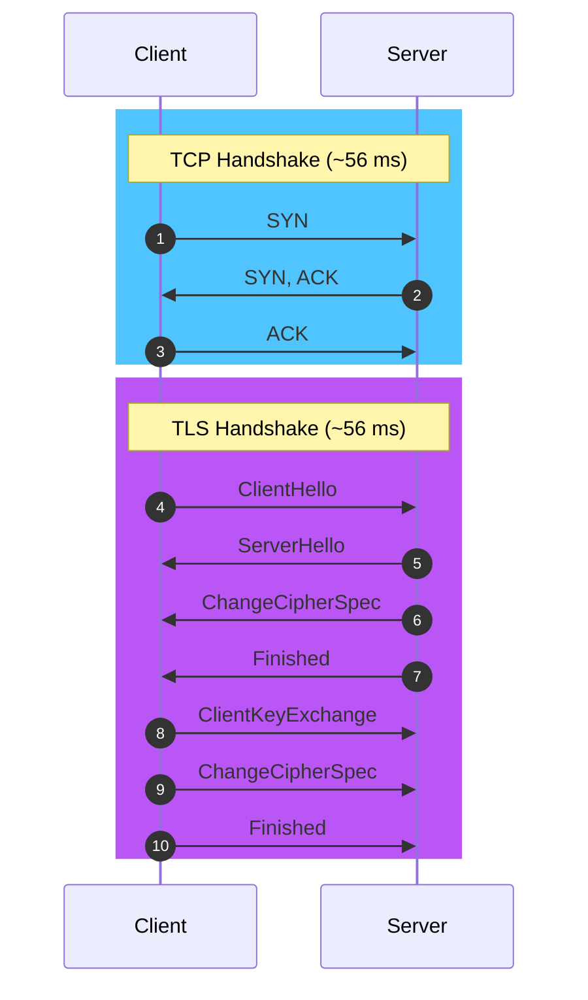
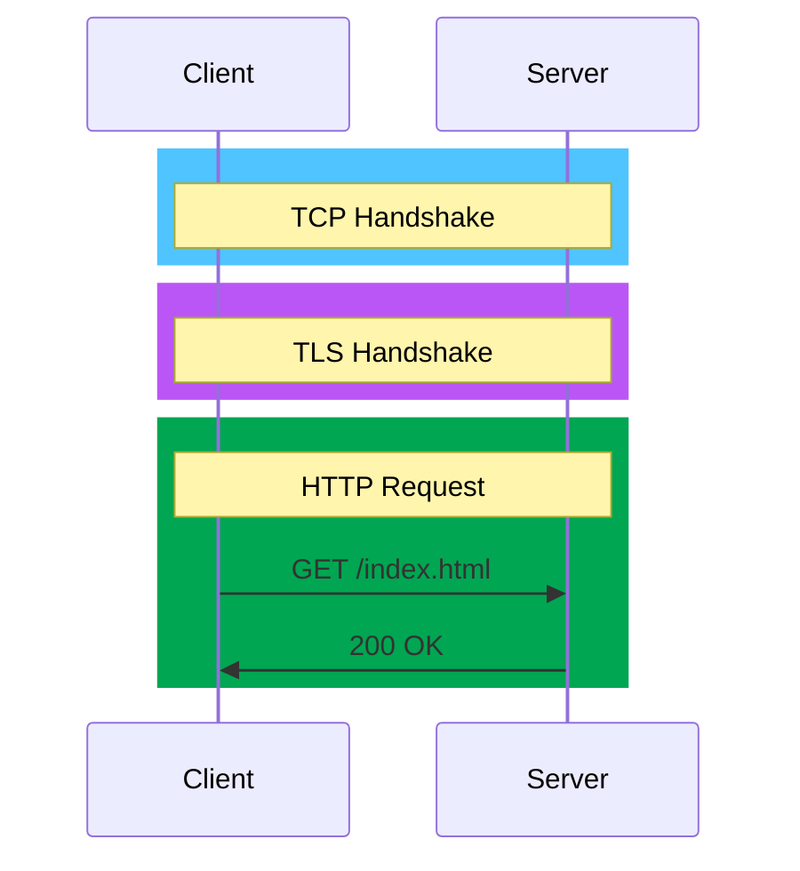

# TLS

📚 [Transport Layer Security - High Performance Browser Networking - History and More |  O'Reilly](https://hpbn.co/transport-layer-security-tls/)

## What is TLS?

**TLS (Transport Layer Security)** is a **cryptographic protocol** that provides secure communication over a computer network. It is the **successor to SSL (Secure Sockets Layer)** and is used to secure communication between web servers and clients. TLS encrypts data transmitted over the network to prevent eavesdropping and tampering.

TLS is **widely used to secure web traffic**, such as **HTTPS connections** between web browsers and servers. It is also used to secure other **network protocols**, such as email, instant messaging, and virtual private networks (VPNs).

## How does TLS work ?

TLS works by establishing a secure connection between a client and a server. The process involves several steps:

- *Handshake*: The client and server exchange messages to negotiate the parameters of the secure connection, such as the encryption algorithm and cryptographic keys.

- *Key exchange*: The client and server agree on a shared secret key that will be used to encrypt and decrypt data.

- **Encryption**: Data transmitted between the client and server is encrypted using the shared secret key.

- **Authentication**: The client and server verify each other's identity to ensure that they are communicating with the intended party.

- **Data integrity**: TLS ensures that data transmitted between the client and server is not altered or tampered with during transmission.

### [TLS Handshake](https://hpbn.co/transport-layer-security-tls/#tls-handshake)


This diagram shows the **TCP handshake** and **TLS handshake** between a client and server. The TCP handshake establishes a connection between the client and server, while the TLS handshake negotiates the parameters of the secure connection.

This two round-trip handshake process can take around **168 milliseconds** to complete, depending on the network latency and server configuration. This **latency can impact the performance** of web applications, especially for mobile users on slow networks.

To reduce the latency of the TLS handshake, **TLS session resumption** can be used to reuse the parameters of a previous TLS session. This can reduce the number of round trips required to establish a secure connection and improve the performance of web applications. Another optimization is **TLS False Start**, which allows the client to start sending encrypted data before the handshake is complete.

#### [TLS Session Resumption](https://hpbn.co/transport-layer-security-tls/#tls-session-resumption)

The extra latency and computational costs of the full TLS handshake impose a **serious performance penalty** on all applications that require secure communication. To help mitigate some of the costs, TLS provides a mechanism to **resume or share the same negotiated secret key data** between multiple connections. This mechanism is called **session resumption**.



This session resumption handshake can take around **112 milliseconds** to complete, which is **56 milliseconds faster** than the full TLS handshake. This can help reduce the latency of secure connections and improve the performance of web applications.

However, one of the **practical limitations** of the Session Identifiers mechanism is the **requirement for the server to create and maintain a session cache for every client**. This can be a significant burden for high-traffic servers, especially when the session cache needs to be shared across multiple server instances.

### HTTPS

**HTTPS (Hypertext Transfer Protocol Secure)** is a protocol that **uses TLS to secure communication** between web browsers and servers. It encrypts data transmitted over the network to prevent eavesdropping and tampering.

HTTPS is widely used to secure web traffic, such as online banking, e-commerce, and social media. It is indicated by a padlock icon in the browser's address bar and the `https://` prefix in the URL.



TLS / HTTPS use the port **443** for communication.

## Why is TLS important?

TLS is important for several reasons:
- **Privacy**: TLS encrypts data transmitted over the network, preventing eavesdropping and unauthorized access to sensitive information.
- **Integrity**: TLS ensures that data transmitted between the client and server is not altered or tampered with during transmission.
- **Authentication**: TLS verifies the identity of the client and server, preventing

## How to enable TLS?

To enable TLS on a web server, you need to obtain an **SSL/TLS certificate** from a **certificate authority (CA)**. The certificate contains the public key of the server and is used to establish a secure connection with clients.

You can obtain an SSL/TLS certificate from a CA such as **Let's Encrypt**, which provides free certificates for securing websites. Once you have obtained a certificate, you can install it on your web server and configure it to use TLS for secure communication.

### [Let's Encrypt](https://letsencrypt.org/)

**Let's Encrypt** is a free, automated, and open certificate authority that provides SSL/TLS certificates for securing websites. It is supported by major web browsers and operating systems and is widely used to enable HTTPS on websites.

To obtain a certificate from Let's Encrypt, you can use the **Certbot** tool, which automates the process of obtaining and installing certificates on your web server. Certbot supports popular web servers such as Apache and Nginx and provides step-by-step instructions for enabling HTTPS on your website.

### [Manual Configuration](https://devopscube.com/create-self-signed-certificates-openssl/)

If you prefer to configure TLS manually, you can generate a self-signed certificate using the **OpenSSL** command-line tool. This certificate can be used to secure communication between clients and servers, but it is not trusted by web browsers and operating systems.


- CSR (Certificate Signing Request) is a message sent from an applicant to a certificate authority in order to apply for a digital identity certificate.
- CA (Certificate Authority) is a trusted entity that issues digital certificates to end entities, such as web servers.

```bash
openssl req -x509 -nodes -out /etc/nginx/ssl/inception.crt -keyout /etc/nginx/ssl/inception.key -subj "/C=FR/ST=IDF/L=Paris/O=42/OU=42/CN=login.42.fr/UID=login"
```

- `req`: PKCS#10 certificate request and certificate generating utility.
- `-x509`: Output a self-signed certificate instead of a certificate request.
- `-nodes`: Do not encrypt the private key.
- `-out`: Output file for the certificate.
- `-keyout`: Output file for the private key.
- `-subj`: Subject of the certificate.
  - `/C=FR`: Country.
  - `/ST=IDF`: State.
  - `/L=Paris`: Location.
  - `/O=42`: Organization.
  - `/OU=42`: Organizational Unit.
  - `/CN=login.42.fr`: Common Name.
  - `/UID=login`: User ID.

Once you have generated a self-signed certificate, you can install it on your web server and configure it to use TLS for secure communication.

### [Chain of Trust and Certificate Authorities](https://hpbn.co/transport-layer-security-tls/#chain-of-trust-and-certificate-authorities)

The **chain of trust** is a fundamental concept in TLS that establishes a hierarchy of trust between certificate authorities (CAs) and end entities. The chain of trust ensures that the public key of a server can be trusted by clients, even if they have never communicated before.

The chain of trust works as follows:
- A **root CA** is a trusted entity that issues certificates to intermediate CAs.
- An **intermediate CA** is a CA that issues certificates to end entities, such as web servers.
- An **end entity** is a server that uses a certificate to establish a secure connection with clients.

When a client connects to a server using TLS, the server sends its certificate to the client. The client then verifies the certificate by checking the following:
- The certificate is signed by a trusted root CA.
- The certificate has not expired.
- The certificate is issued for the domain name of the server.

```mermaid
graph LR
  classDef black fill:#000,stroke:#333,stroke-width:1px;
  classDef white fill:#fff,stroke:#333,stroke-width:1px;
  classDef white_border fill:#fff,stroke:#333,stroke-width:1px, stroke-dasharray: 5, 5;
  classDef green fill:#0f0,stroke:#333,stroke-width:1px;
  classDef lightblue fill:#99f,stroke:#333,stroke-width:1px,color:#fff;
  classDef lightgreen fill:#9f9,stroke:#333,stroke-width:1px;
  classDef lightred fill:#f99,stroke:#333,stroke-width:1px;
  classDef lightyellow fill:#ff9,stroke:#333,stroke-width:1px;
  classDef lightorange fill:#f90,stroke:#333,stroke-width:1px;
  classDef lightpurple fill:#a7f,stroke:#333,stroke-width:1px;
  classDef lightcyan fill:#9ff,stroke:#333,stroke-width:1px;
  classDef lightpink fill:#f9f,stroke:#333,stroke-width:1px;
  classDef lightbrown fill:#963,stroke:#333,stroke-width:1px;
  classDef lightgrey fill:#999,stroke:#333,stroke-width:1px;

  Site_Certificate[Site Certificate]:::lightblue
  subgraph Site_Certificate
    direction LR
    subgraph Owner
      direction LR
      Owner_Name[Owner Name]:::lightyellow
      Owner_Public_Key[Owner Public Key]:::lightyellow
    end
    subgraph Issuer
      direction LR
      Issuer_Name["Issuer (CA) Name"]:::lightred
      Issuer_Signature[Issuer Signature]:::lightred
    end
  end
  
  Site_Certificate --> |"issuer"| Intermediate_CA
  Intermediate_CA --> |"verifies"| Site_Certificate
  Intermediate_CA[Intermediate CA]:::lightgreen
  subgraph Intermediate_CA
    direction LR
    subgraph Owner_Intermediate
      direction LR
      Owner_Name2[Owner Name]:::lightred
      Owner_Public_Key2[Owner Public Key]:::lightred
    end
    subgraph Issuer_Intermediate
      direction LR
      Issuer_Name2["Issuer (CA) Name"]:::lightcyan
      Issuer_Signature2[Issuer Signature]:::lightcyan
    end
  end

  Intermediate_CA --> |"issuer"| Root_CA
  Root_CA --> |"verifies"| Intermediate_CA
  Root_CA[Root CA]:::lightorange
  subgraph Root_CA
    direction TB
    Root_Name3[Root Name]:::lightcyan
    Root_Public_Key3[Root Public Key]:::lightcyan
    Root_Signature3[Root Signature]:::lightcyan
    Root_Public_Key3 --> |"verifies"| Root_Signature3
  end
```


