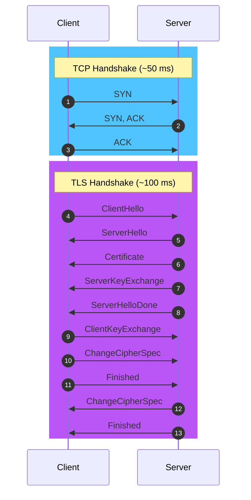
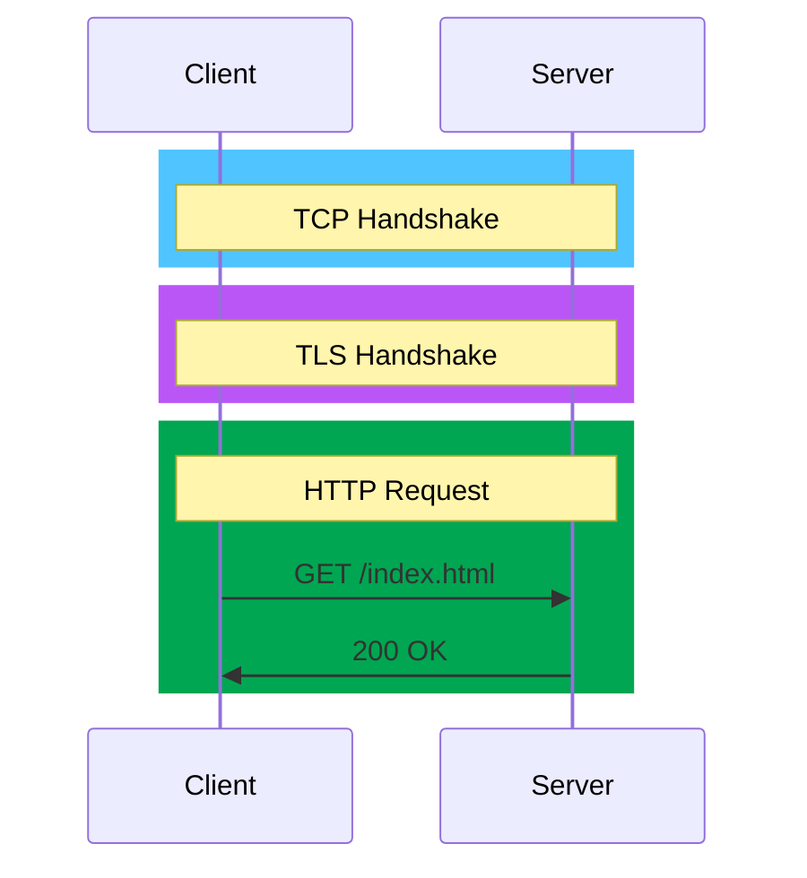

# TLS

📚 [Transport Layer Security - High Performance Browser Networking  |  O'Reilly](https://hpbn.co/transport-layer-security-tls/)

## What is TLS?

**TLS (Transport Layer Security)** is a **cryptographic protocol** that provides secure communication over a computer network. It is the **successor to SSL (Secure Sockets Layer)** and is used to secure communication between web servers and clients. TLS encrypts data transmitted over the network to prevent eavesdropping and tampering.

TLS is **widely used to secure web traffic**, such as **HTTPS connections** between web browsers and servers. It is also used to secure other **network protocols**, such as email, instant messaging, and virtual private networks (VPNs).

## How does TLS work ?

TLS works by establishing a secure connection between a client and a server. The process involves several steps:

- *Handshake*: The client and server exchange messages to negotiate the parameters of the secure connection, such as the encryption algorithm and cryptographic keys.

- *Key exchange*: The client and server agree on a shared secret key that will be used to encrypt and decrypt data.

- **Encryption**: Data transmitted between the client and server is encrypted using the shared secret key.

- **Authentication**: The client and server verify each other's identity to ensure that they are communicating with the intended party.

- **Data integrity**: TLS ensures that data transmitted between the client and server is not altered or tampered with during transmission.

### HTTPS

**HTTPS (Hypertext Transfer Protocol Secure)** is a protocol that uses TLS to secure communication between web browsers and servers. It encrypts data transmitted over the network to prevent eavesdropping and tampering.

HTTPS is widely used to secure web traffic, such as online banking, e-commerce, and social media. It is indicated by a padlock icon in the browser's address bar and the `https://` prefix in the URL.

## Why is TLS important?

TLS is important for several reasons:
- **Privacy**: TLS encrypts data transmitted over the network, preventing eavesdropping and unauthorized access to sensitive information.
- **Integrity**: TLS ensures that data transmitted between the client and server is not altered or tampered with during transmission.
- **Authentication**: TLS verifies the identity of the client and server, preventing

## How to enable TLS?