# Matcha

Build a dating website that allows users to connect with each other based on their preferences.

## Prototype

- [Figma File](https://www.figma.com/design/HPbcGX4Up5q0bAYn1L3rYL/Prototype-FrontEnd?m=auto&t=znMiwrHMEtThhbJX-6)

## Features

```mermaid
graph TD
  subgraph Safety
    UserBlocking[User blocking 🚫]
    UserReporting[User reporting 🛡️]

    subgraph Authentication
      UserAuthentication[User authentication 🔒]
    end

  end

  subgraph Profile
    UserProfile[User profile 📝]
    UserPreferences[User preferences ⚙️]

    subgraph Location
      UserGeolocation[User geolocation 📍]
    end

    subgraph Popularity
      UserPopularity[User popularity 🌟]
    end

  end

  subgraph Search
    UserSearch[User search 🔍]
  end

  subgraph Communication
    UserChat[User chat 💬]
    UserNotifications[User notifications 🔔]
  end

  subgraph History
    UserHistory[User history 📜]
  end

  subgraph Matching
    UserMatching[User matching ❤️]
  end

  Safety --> Profile
  Safety --> Communication
  Profile --> Search
  Search --> History
  Matching --> History
  Profile --> Matching

  Matching --> Communication
  Communication --> History

```



- Frontend: React, Material-UI
- Backend: Node.js, Express, Socket.IO

## Packages

### CORS (Cross-Origin Resource Sharing)

CORS is a node.js package for providing a Connect/Express middleware that can be used to enable CORS with various options.

#### How does CORS work?

CORS is a security feature implemented in browsers that restricts websites from making requests to a different domain than the one that served the website. This is to prevent malicious websites from making requests to other websites on behalf of the user. CORS works by adding an `Origin` header to the request that specifies the domain that the request is coming from. The server then checks this header and decides whether to allow the request or not.

## Express

Express is a minimal and flexible Node.js web application framework that provides a robust set of features for web and mobile applications.

### Resources

- [Express](https://expressjs.com/)
- [MDN Web Docs - Express](https://developer.mozilla.org/en-US/docs/Learn/Server-side/Express_Nodejs/Introduction)

- [Github of Express.js - Sessions](https://github.com/expressjs/session#readme)

### Middleware

Middleware functions are functions that have access to the request object (`req`), the response object (`res`), and the next middleware function in the application's request-response cycle. The next middleware function is commonly denoted by a variable named `next`.

## Security

- [MDN Web Docs - Headers - Authorization](https://developer.mozilla.org/en-US/docs/Web/HTTP/Headers/Authorization)

### Forms

- [Express-validator](https://express-validator.github.io/docs/)

#### CSRF (Cross-Site Request Forgery)

- [MDN Web Docs - CSRF](https://developer.mozilla.org/en-US/docs/Web/Security/CSRF)
- [OWASP - CSRF](https://owasp.org/www-community/attacks/csrf)
- [OWASP - CSRF Prevention Cheat Sheet](https://cheatsheetseries.owasp.org/cheatsheets/Cross-Site_Request_Forgery_Prevention_Cheat_Sheet.html)
- [NPM CRSF](https://www.npmjs.com/package/csrf)

### [JWT (JSON Web Token)](https://jwt.io/)

- [EN - DigitalOcean - NodeJS ExpressJS JWT](https://www.digitalocean.com/community/tutorials/nodejs-jwt-expressjs)
  - [FR - Openclassrooms - Middleware JWT](https://openclassrooms.com/fr/courses/6390246-passez-au-full-stack-avec-node-js-express-et-mongodb/6466605-configurez-le-middleware-dauthentification)

```bash
npm install jsonwebtoken
```

```javascript
const jwt = require("jsonwebtoken");
```

#### How to create a token

1. The token secret
2. The piece of data to hash in the token
3. The token expiration time

##### The token secret

The token secret is a long random string used to encrypt and decrypt the data. It should be **kept secret and never shared** with anyone.

```javascript
// Create a secret key
> require('crypto').randomBytes(64).toString('hex')
// Example: '09f26e402586e2faa8da4c98a35f1b20d6b033c6097befa8be3486a829587fe2f90a832bd3ff9d42710a4da095a2ce285b009f0c3730cd9b8e1af3eb84df6611'
```

You can store the secret in a `.env` file or a secret file.

```bash
TOKEN_SECRET=09f26e402586e2faa8da4c98a35f1b20d6b033c6097befa8be3486a829587fe2f90a832bd3ff9d42710a4da095a2ce285b009f0c3730cd9b8e1af3eb84df6611
```

##### The piece of data to hash in the token

The data to hash in the token is the user's ID. It can be the user's email, username, or any other unique identifier. The data should be **unique and never change**.

You can also add additional data to the token if needed.

```javascript
// Get secret from .env
require("dotenv").config();

// Create a token
const token = jwt.sign({ id: user.id }, process.env.TOKEN_SECRET, {
  expiresIn: "1h",
});
```

##### The token expiration time

The token expiration time is the time after which the token is no longer valid. It should be **short enough to prevent misuse** but **long enough to allow the user to use the application**.

#### Authenticate a token

A common way to authenticate a token is to use a middleware function that checks the token in the request headers.

```javascript
// Middleware function
const jwt = require('jsonwebtoken');

function authenticateToken(req, res, next) {
  const authHeader = req.headers['authorization']
  const token = authHeader && authHeader.split(' ')[1]

  if (token == null) return res.sendStatus(401)

  jwt.verify(token, process.env.TOKEN_SECRET as string, (err: any, user: any) => {
    console.log(err)

    if (err) return res.sendStatus(403)

    req.user = user

    next()
  })
}
```

Example of a request with a token:

```http
GET /users/me HTTP/1.1
Authorization: Bearer JWT_ACCESS_TOKEN
```

Example of route with the middleware:

```javascript
app.get("/users/me", authenticateToken, (req, res) => {
  res.json(req.user);
});
```

#### Handling client-side

- [MDN Web Docs - Cookies](https://developer.mozilla.org/en-US/docs/Web/HTTP/Cookies)

After receiving the token from the server, you can store it in a cookie or local storage. The cookie is more secure because it is sent with every request. Local storage is more vulnerable to XSS attacks.

**HTTP-only** cookies are more secure because they are not accessible via JavaScript.
