# Matcha

Build a dating website that allows users to connect with each other based on their preferences.

## Prototype

- [Figma File](https://www.figma.com/design/HPbcGX4Up5q0bAYn1L3rYL/Prototype-FrontEnd?m=auto&t=znMiwrHMEtThhbJX-6)

## Features

```mermaid
graph TD
  subgraph Safety
    UserBlocking[User blocking 🚫]
    UserReporting[User reporting 🛡️]

    subgraph Authentication
      UserAuthentication[User authentication 🔒]
    end

  end

  subgraph Profile
    UserProfile[User profile 📝]
    UserPreferences[User preferences ⚙️]

    subgraph Location
      UserGeolocation[User geolocation 📍]
    end

    subgraph Popularity
      UserPopularity[User popularity 🌟]
    end

  end

  subgraph Search
    UserSearch[User search 🔍]
  end

  subgraph Communication
    UserChat[User chat 💬]
    UserNotifications[User notifications 🔔]
  end

  subgraph History
    UserHistory[User history 📜]
  end

  subgraph Matching
    UserMatching[User matching ❤️]
  end

  Safety --> Profile
  Safety --> Communication
  Profile --> Search
  Search --> History
  Matching --> History
  Profile --> Matching

  Matching --> Communication
  Communication --> History

```

- Frontend: React, Material-UI
- Backend: Node.js, Express, Socket.IO