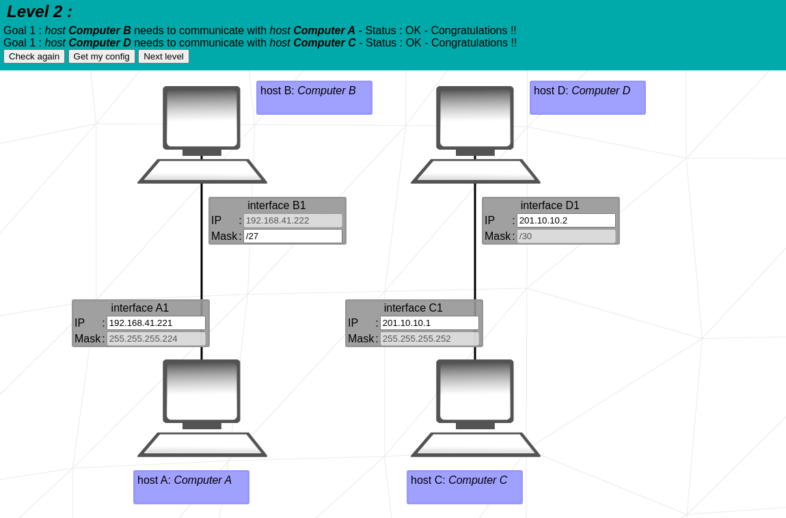

# NetPratice

🧮 [CDIR Table](./README.md#cidr-notation)

🎨 [FigJam NetPractice (exercice explain + cidr calc)](https://www.figma.com/file/hBp3cgllz8ZR9EcHTHkA25/NetWork---NetPractice?type=whiteboard&t=ks6nBoWMuCtlolsg-1)

## Guide

📔 [NetPractice Notions Guide - Medium](https://medium.com/@imyzf/netpractice-2d2b39b6cf0a)

## Ressources

### Training

- [Practice SubNetworking IPv4](https://subnetipv4.com/)

### Videos

- [Subnetting - NetworKing](https://youtu.be/Ct4PU6CyvTQ?feature=shared)
- [Subnetting Calculations Playlist - Practical networking](https://youtu.be/BWZ-MHIhqjM?feature=shared)
- [Default Gateway - PowerCert Animated Videos](https://youtu.be/pCcJFdYNamc?feature=shared)

### Articles

- [TCP/IP addressing and subnetting - Microsoft](https://learn.microsoft.com/en-us/troubleshoot/windows-client/networking/tcpip-addressing-and-subnetting)
- [TCP/IP in MAAS context - Refresher about network and internet - with lots of articles links](https://discourse.maas.io/t/tcp-ip-primer/5806)
- [Computer Network - Scaler](https://www.scaler.com/topics/computer-network/)
- [What is the network layer? - Cloudflare](https://www.cloudflare.com/learning/network-layer/)

## Exercices

<table>
  <thead>
    <th>Exercices</th>
    <th>Problems</th>
    <th>Solutions</th>
  </thead>
  <tbody>
    <tr>
        <td>1</td>
        <td>
          

            
Problem 1

            
          

        </td>
        <td>
          

            
Solution 1

            
          

        </td>
    </tr>
    <tr>
        <td>2</td>
        <td>
          

            
Problem 2

            
          

        </td>
        <td>
          

            
Solution 2

            
          

        </td>
    </tr>
    <tr>
        <td>3</td>
        <td>
          

            
Problem 3

            
          

        </td>
        <td>
          

            
Solution 3

            
          

        </td>
    </tr>
    <tr>
        <td>4</td>
        <td>
          

            
Problem 4

            
          

        </td>
        <td>
          

            
Solution 4

            
          

        </td>
    </tr>
    <tr>
        <td>5</td>
        <td>
          

            
Problem 5

            
          

        </td>
        <td>
          

            
Solution 5

            
          

        </td>
    </tr>
    <tr>
        <td>6</td>
        <td>
          

            
Problem 6

            
          

        </td>
        <td>
          

            
Solution 6

            
          

        </td>
    </tr>
    <tr>
        <td>7</td>
        <td>
          

            
Problem 7

            
          

        </td>
        <td>
          

            
Solution 7

            
          

        </td>
    </tr>
    <tr>
        <td>8</td>
        <td>
          

            
Problem 8

            
          

        </td>
        <td>
          

            
Solution 8

            
          

        </td>
    </tr>
    <tr>
        <td>9</td>
        <td>
          

            
Problem 9

            
          

        </td>
        <td>
          

            
Solution 9

            
          

        </td>
    </tr>
    <tr>
        <td>10</td>
        <td>
          

            
Problem 10

            
          

        </td>
        <td>
          

            
Solution 10 - Not Opti

            
          

          

            
Training 10 - Good

            
          

        </td>
    </tr>
  </tbody>
</table>

## TCP/IP

### What is TCP/IP?

TCP/IP stands for **Transmission Control Protocol/Internet Protocol** and is a suite of communication protocols that makes data exchange between two devices possible. TCP/IP specifies how data should be *packetized, addressed, transmitted, routed, and received* on a network by providing end-to-end communication

TCP/IP started as one of many internet protocols created by **DARPA** (the Defense Advanced Research Projects Agency in the United States) in the **1970s**. The TCP/IP model was later adopted as the standard protocol for ARPAnet, the modern internet's predecessor. TCP/IP is now the **international standard for internet communication**.

### TCP/IP Model

The TCP/IP model consists of 4 layers, i.e., the application layer, transport layer, network layer, and data link layer. Each layer is responsible for a particular task strictly according to the protocols.

TCP specifies how applications will establish communication channels across a network. It also controls how a message is split into multiple data packets, sent over the internet, and reassembled in order at the destination address. IP specifies how each packet should be addressed and routed to ensure that it arrives at its destination. To identify where the message should be forwarded, each gateway computer on the network verifies this IP address.

*Highlights*:
  -  The TCP/IP model allows communication over long distances between two devices.
  -  TCP handles the flow of data and also handles errors in data transmission, while IP provides a unique address to each device in the network.

#### How does TCP/IP work?

Whenever we send things like a simple text message, a file, or a video message over the internet, the TCP/IP model *divides the **data** into **packets**, according to four-layered architecture*. The data goes in order from the sender's side, and on the receiver's side, it follows the reverse order and is finally reassembled.

TCP/IP is based on the **client-server communication model**, which means that a user of a first computer (the client) sends a service request to a second network computer or web hosting provider(server), such as forwarding a Web page. TCP/IP also uses **point-to-point communication**, which means that data is sent from one host computer to another within a defined network border. In TCP/IP model, each client request is unique and unrelated to previous ones. Hence, it is called **stateless**, and being stateless allows network channels to be used indefinitely.

Because the entire process is **standardized**, the TCP/IP model works. Without standardization, communication would go haywire, and fast internet service relies on efficiency. The TCP/IP model provides both efficiency and standardization.

#### Layers of TCP/IP

The TCP/IP model consists of four layers, each of which is responsible for a specific task. The four layers are:

1. **Application Layer**: This layer performs the functions of the top three layers of the OSI model, i.e., the **Application, Presentation, and Session** Layer. It is responsible for **node-to-node communication and controls user-interface specifications**. Its protocols include HTTP, Post Office Protocol 3, Simple Mail Transfer Protocol, and File Transfer Protocol. At the application layer, the payload is the actual application data. Some of the protocols of the application layer are described below.
    -  **HTTP**: It stands for Hypertext transfer protocol. This protocol enables us to access data via the internet. It sends data in plain text, audio, and video formats. It's called a hypertext transfer protocol because it's efficient enough to use in a hypertext environment where there are rapid jumps from one document to another.
    -  **TELNET**: It establishes a connection between the local and remote computers in such a way that the local computer seems to be a remote terminal.
    -  **SMTP**: The Simple Mail Transfer Protocol (SMTP) is the TCP/IP protocol that handles e-mail. The data is sent to another e-mail address using this protocol.
    -  **FTP**: The FTP (File Transfer Protocol) is a standard internet protocol for transferring data from one computer to another.

2. **Host-to-Host/Transport Layer**: This layer is similar to the OSI model's **Transport layer**. It **specifies how much data** should be sent, when, and where **at what rate**. The message from the application layer is built upon this layer. This layer ensures that data units are supplied in a timely and error-free manner. Through error control, flow control, and segmentation or de-segmentation, the transport layer **helps to control the link's reliability**. The two important protocols present in this layer are:
    -  **[Transmission Control Protocol (TCP)](https://en.wikipedia.org/wiki/Transmission_Control_Protocol)**: It is known for offering **error-free** and reliable communication between end systems. It does **data segmentation and sequencing**. It also features an acknowledgment feature and uses a **flow control method to govern data flow**. It is a very effective protocol, but it has a lot of overhead because of these features. Increased overhead translates to higher costs. TCP uses **three-way handshaking to establish and acknowledge the connection between the two devices**.
    
    
    -  **[User Datagram Protocol (UDP)](https://en.wikipedia.org/wiki/User_Datagram_Protocol)**: UDP doesn't have any of TCP properties. If your application does not require dependable transmission, one must use this protocol because it is relatively cost-effective. UDP is a **connectionless protocol**, so it **does not provide assurance of data delivery**.
    

3. **Internet Layer**: This layer is also known as the **network layer**. The Internet layer's primary function is to **send packets** from the **source** or computer to their **destination**, regardless of their route. The Internet layer or Network Layer provides a functional and procedural means for **sending variable-length data** sequences between nodes **across multiple networks**. Message delivery at the Internet layer does not guarantee reliable network layer protocol. The main protocols lie in the layer are:
    -  **IP**: The Internet Protocol (IP) is in charge of sending packets from a source host to a destination host based on the IP addresses in the packet headers. There are two variations of IP IPv6 and IPv4.
    
    
    -  **ARP**: Address Resolution Protocol (ARP) is a protocol for resolving conflicts between computers. Its task is to determine a host's hardware address from an IP address. ARP's primary function is to convert 32-bit addresses to 48-bit addresses and vice versa. ARP is necessary because IP addresses in IP version 4 (IPv4) are 32 bits long, but MAC addresses are 48 bits long.
        - In case of IPv6, ARP is replaced by **NDP (Neighbor Discovery Protocol)**. NDP is a protocol in the Internet Protocol Suite used with Internet Protocol Version 6 (IPv6). It operates in the Link Layer of the Internet model. It mainly replaces ARP (Address Resolution Protocol), ICMP Router Discovery, and ICMP Redirect used in IPv4.

4. **Network Access/Link Layer**: This layer specifies the physical transmission of data over the network. This layer handles data transmission between two adjacent devices on the same network. It also determines how bits should be optically signaled by hardware devices that interface directly with a network media such as coaxial, optical, fiber, or twisted-pair cables.
    - **[Ethernet](https://cot-cn.cougarnet.uh.edu/docs/compnet/012-ethernet.html)**: Ethernet is a protocol that controls how data is transmitted over a LAN. It is the most widely used LAN technology. Ethernet is a frame-based technology that uses a **CSMA/CD (Carrier Sense Multiple Access with Collision Detection)** access method. It is a **connectionless protocol** that operates at the **Data Link Layer** of the OSI model. Ethernet is a **physical and data link layer technology** for local area networks (LANs).
      - The Ethernet frame includes a preamble and FSD (frame sequence delimiter) so that the receiving network interfaces can detect the starting bit of the data part of the frame, i.e., the packet of one and zero bits. The trailing FCS (frame check sequence) verifies frame’s integrity. Ethernet protocol defines the frame format.
    <figure>
      
      <figcaption>Frame: Preamble, Frame Sequence Delimiter (FSD), Data (Ethernet packet), Frame Check Sequence (FCS).</figcaption>
    </figure>
    <table>
      <thead>
        <tr>
          <th>EtherType</th>
          <th>Protocol</th>
        </tr>
      </thead>
      <tbody>
        <tr>
          <td>0x0800</td>
          <td>Internet Protocol v4 (IPv4)</td>
        </tr>
        <tr>
          <td>0x0806</td>
          <td>Address Resolution Protocol (ARP)</td>
        </tr>
        <tr>
          <td>0x86DD</td>
          <td>Internet Protocol v6 (IPv6)</td>
        </tr>
        <tr>
          <td>0x8100</td>
          <td>VLAN-tagged frame (IEEE 802.1Q)</td>
        </tr>
        <tr>
          <td>0x88CC</td>
          <td>Link Layer Discovery Protocol (LLDP)</td>
        </tr>
      </tbody>
    </table>

## IP Addressing

### IP Forwading

IP forwarding is a process used to determine the next hop for a packet to reach its destination. It is a routing process that is used to send packets from one network to another network. IP forwarding is a process that is used to determine the next hop for a packet to reach its destination. It is a routing process that is used to send packets from one network to another network.

### IP Address

For a TCP/IP **wide area network (WAN)** to work efficiently as a collection of networks, the routers that pass packets of data between networks **don't know the exact location of a host** for which a packet of information is destined. **Routers only know** what network the host is a member of and use information stored in their route table to determine how to get the packet to the **destination host's network**. After the packet is delivered to the destination's network, the packet is delivered to the appropriate host.

For this process to work, an IP address has **two parts**. The first part of an IP address is used as a **network address**, the last part as a **host address**. If you take the example 192.168.123.132 and divide it into these two parts, you get 192.168.123. Network .132 Host or 192.168.123.0 - network address. 0.0.0.132 - host address.

#### IPv4

IP**v4** is the **fourth version** of the Internet Protocol (IP). It is the most widely used version of the Internet Protocol. IPv4 is a **connectionless protocol** used in packet-switched networks. It operates at the network layer of the OSI model. IPv4 provides an addressing capability of approximately **4.3 billion addresses**. The size of an IPv4 address is **32 bits**.

##### Different type of addressing

- **Unicast**: A unicast address identifies a single network interface. The packets sent to a unicast address are delivered to the interface identified by the address.
- **Broadcast**: A broadcast address is an address that allows information to be sent to all interfaces on a given network segment. A broadcast address can be used to send a message to all devices on a network.
- **Multicast**: A multicast address is an address that identifies a group of devices. The packets sent to a multicast address are delivered to all devices that are members of the multicast group.

Note:
  - Last number can't be `0 or 255` in a network address for a host ip address. 0 is used for network address and 255 is used for broadcast address.

##### Classful Addressing

IPv4 addresses are divided into five classes: A, B, C, D, and E. Each class has a different range of IP addresses. The first three classes (A, B, and C) are used for unicast addresses, while the last two classes (D and E) are used for multicast and experimental purposes, respectively.

## [Subnetting](https://www.cloudflare.com/learning/network-layer/what-is-a-subnet/)

### What is Subnetting?

Subnetting is the process of dividing a large network into smaller networks called subnets. Subnetting allows network administrators to create smaller networks within a larger network. This helps to reduce network congestion and improve network performance. Subnetting allows a business to expand its network without requiring a new network number from its Internet service provider. Subnetting also helps to improve network security by isolating different parts of the network from each other.

### How does Subnetting work?

The size of a subnet is determined by the network technology used and the connection needs. Within the restrictions of the address space available for its usage, each organization is responsible for determining the number and size of the subnets it generates.

Subnetting is done by borrowing bits from the host portion of an IP address. The number of bits borrowed determines the number of subnets that can be created. The number of bits borrowed also determines the number of hosts that can be assigned to each subnet.

### Benefits of Subnetting

Subnetting offers several benefits, including:

- **Improved network performance**: Subnetting helps to reduce network congestion by dividing a large network into smaller subnets. This helps to improve network performance by reducing the amount of traffic on each subnet.

- **Enhanced network security**: Subnetting helps to improve network security by isolating different parts of the network from each other. This helps to prevent unauthorized access to sensitive data and resources.

- **Simplified network management**: Subnetting helps to simplify network management by allowing network administrators to manage each subnet independently. This makes it easier to troubleshoot network issues and make changes to the network configuration.

- **Scalability**: Subnetting allows a business to expand its network without requiring a new network number from its Internet service provider. This makes it easier to add new devices and users to the network as the business grows.

### Subnetting Process

The subnetting process involves the following steps:

1. **Determine the number of subnets required**: The first step in the subnetting process is to determine the number of subnets required. This will depend on the size of the network and the number of devices that need to be connected to the network.

2. **Determine the number of bits to borrow**: The next step is to determine the number of bits to borrow from the host portion of the IP address. This will depend on the number of subnets required and the number of devices that need to be connected to each subnet.

3. **Calculate the subnet mask**: Once the number of bits to borrow has been determined, the next step is to calculate the subnet mask. The subnet mask is used to divide the IP address into network and host portions.

4. **Assign IP addresses to each subnet**: The final step in the subnetting process is to assign IP addresses to each subnet. This will involve assigning a network address to each subnet and then assigning host addresses to the devices connected to each subnet.

### [Subnet Mask](https://www.ipxo.com/blog/what-is-subnet-mask/)

A subnet mask is a 32-bit number that is used to divide an IP address into network and host portions. The subnet mask is used to determine which part of an IP address is the network address and which part is the host address. The subnet mask is represented in decimal format, with each octet separated by a period.

<table>
  <thead>
    <tr>
      <th>Class</th>
      <th>1st Octet of IP Address</th>
      <th>Default Subnet Mask</th>
      <th>Network/Host</th>
      <th>Number of Networks</th>
      <th>Maximum Nodes in a Network</th>
    </tr>
  </thead>
  <tbody>
    <tr>
      <td>A</td>
      <td>1-126</td>
      <td>255.0.0.0</td>
      <td>N.H.H.H</td>
      <td>126</td>
      <td>16,777,214</td>
    </tr>
    <tr>
      <td>B</td>
      <td>128-191</td>
      <td>255.255.0.0</td>
      <td>N.N.H.H</td>
      <td>16,384</td>
      <td>65,534</td>
    </tr>
    <tr>
      <td>C</td>
      <td>192-223</td>
      <td>255.255.255.0</td>
      <td>N.N.N.H</td>
      <td>2,097,152</td>
      <td>254</td>
    </tr>
    <tr>
      <td>D</td>
      <td>224-239</td>
      <td></td>
      <td></td>
      <td></td>
      <td></td>
    </tr>
    <tr>
      <td>E</td>
      <td>240-255</td>
      <td></td>
      <td></td>
      <td></td>
      <td></td>
    </tr>
  </tbody>
</table>

How to find subnet mask from IP address?

To find a subnet mask from an IP address, a subnet mask must be provided. It can be expressed in a standard way (255.255.255.0) or in CIDR notation (f.e. /24).

### [CIDR](https://www.ipxo.com/blog/what-is-cidr/)

CIDR stands for **Classless Inter-Domain Routing**. CIDR is a method used to create unique identifiers for networks and individual devices. CIDR notation is a **compact representation of an IP address and its associated subnet mask**. CIDR notation is used to specify the number of bits in an IP address that are used for the network portion of the address.

#### Uses of CIDR

CIDR is used to:
  -  **Reduce the size of routing tables**: CIDR allows network administrators to create smaller routing tables by aggregating multiple IP addresses into a single routing entry.
  -  **Improve network performance**: CIDR helps to reduce network congestion by dividing a large network into smaller subnets. This helps to improve network performance by reducing the amount of traffic on each subnet.
  -  **Enhance network security**: CIDR helps to improve network security by isolating different parts of the network from each other. This helps to prevent unauthorized access to sensitive data and resources.

#### How CIDR works?

The basis of CIDR is **variable-length subnet masking (VLSM)**. This numerical masking sequence allows network administrators to break down an IP address space into subnets of various sizes. Each subnet has a different host count and a limited number of IP addresses.

A CIDR IP address may look something like this: *123.45.67.89* **/12**. This IP address contains two groups of numbers:

-  **Network prefix**(`123.45.67.89`): The binary configuration of a network address   
-  **Suffix** (`/12`): The indication of how many bits are in the entire CIDR address

IPv4 addresses are 32-bits long, and while the first 12 bits represent network addresses, the remaining 20 bits represent the available host addresses. It’s worth mentioning that every network, by default, has only one subnet containing all host addresses.

The figure below represent classfull IP address:

To store subnet information **classful IP address** needs a **routing table with a separate entry for each subnet**. This is where CIDR comes in. **CIDR** allows network administrators to create a **single routing table entry for multiple subnets**. This is done by aggregating multiple IP addresses into a single routing entry.

CDIR is **like having 32 classes** of IP addresses (in IPv4), each with a different number of bits for the network and host portions. This allows for a more flexible and efficient use of IP addresses.

#### CIDR Notation

📑 [Interactive IP address and CIDR range visualizer](https://cidr.xyz/)

| CIDR | Subnet Mask (Decimal) | Subnet Mask (Binary) | Available | Available(pow 2) |
|------|-----------------------|----------------------|---------------------|------------------------|
| **/32**  | 255.255.255.**255**       | 11111111.11111111.11111111.11111111 | 1 | $2^0$ |
| /31  | 255.255.255.**254**       | 11111111.11111111.11111111.11111110 | 2 | $2^1$ |
| /30  | 255.255.255.**252**       | 11111111.11111111.11111111.11111100 | 4 | $2^2$ |
| /29  | 255.255.255.**248**       | 11111111.11111111.11111111.11111000 | 8 | $2^3$ |
| /28  | 255.255.255.**240**       | 11111111.11111111.11111111.11110000 | 16 | $2^4$ |
| /27  | 255.255.255.**224**       | 11111111.11111111.11111111.11100000 | 32 | $2^5$ |
| /26  | 255.255.255.**192**       | 11111111.11111111.11111111.11000000 | 64 | $2^6$ |
| /25  | 255.255.255.**128**       | 11111111.11111111.11111111.10000000 | 128 | $2^7$ |
| **/24**  | 255.255.255.**0**         | 11111111.11111111.11111111.00000000 | 256 | $2^8$ |
| /23  | 255.255.254.0         | 11111111.11111111.11111110.00000000 | 512 | $2^9$ |
| /22  | 255.255.252.0         | 11111111.11111111.11111100.00000000 | 1024 | $2^{10}$ |
| /21  | 255.255.248.0         | 11111111.11111111.11111000.00000000 | 2048 | $2^{11}$ |
| /20  | 255.255.240.0         | 11111111.11111111.11110000.00000000 | 4096 | $2^{12}$ |
| /19  | 255.255.224.0         | 11111111.11111111.11100000.00000000 | 8192 | $2^{13}$ |
| /18  | 255.255.192.0         | 11111111.11111111.11000000.00000000 | 16384 | $2^{14}$ |
| /17  | 255.255.128.0         | 11111111.11111111.10000000.00000000 | 32768 | $2^{15}$ |
| **/16**  | 255.255.0.0           | 11111111.11111111.00000000.00000000 | 65536 | $2^{16}$ |
| /15  | 255.254.0.0           | 11111111.11111110.00000000.00000000 | 131072 | $2^{17}$ |
| /14  | 255.252.0.0           | 11111111.11111100.00000000.00000000 | 262144 | $2^{18}$ |
| /13  | 255.248.0.0           | 11111111.11111000.00000000.00000000 | 524288 | $2^{19}$ |
| /12  | 255.240.0.0           | 11111111.11110000.00000000.00000000 | 1048576 | $2^{20}$ |
| /11  | 255.224.0.0           | 11111111.11100000.00000000.00000000 | 2097152 | $2^{21}$ |
| /10  | 255.192.0.0           | 11111111.11000000.00000000.00000000 | 4194304 | $2^{22}$ |
| /9   | 255.128.0.0           | 11111111.10000000.00000000.00000000 | 8388608 | $2^{23}$ |
| **/8**   | 255.0.0.0             | 11111111.00000000.00000000.00000000 | 16777216 | $2^{24}$ |
| /7   | 254.0.0.0             | 11111110.00000000.00000000.00000000 | 33554432 | $2^{25}$ |
| /6   | 252.0.0.0             | 11111100.00000000.00000000.00000000 | 67108864 | $2^{26}$ |
| /5   | 248.0.0.0             | 11111000.00000000.00000000.00000000 | 134217728 | $2^{27}$ |
| /4   | 240.0.0.0             | 11110000.00000000.00000000.00000000 | 268435456 | $2^{28}$ |
| /3   | 224.0.0.0             | 11100000.00000000.00000000.00000000 | 536870912 | $2^{29}$ |
| /2   | 192.0.0.0             | 11000000.00000000.00000000.00000000 | 1073741824 | $2^{30}$ |
| /1   | 128.0.0.0             | 10000000.00000000.00000000.00000000 | 2147483648 | $2^{31}$ |
| **/0**  | 0.0.0.0               | 00000000.00000000.00000000.00000000 | 4294967296 | $2^{32}$ |

Please note that the number of available addresses is theoretical. In practice, the **first and last addresses of each subnet** are **reserved for network address and broadcast address respectively**, so the actual number of usable addresses is two less than the number listed for **CIDR <= 30**.

#### CIDR Sheet Cheat

#### What's CIDR blocks ?

CIDR blocks represent groups of IP addresses that have the same network prefixes and number of bits. Combining CIDR blocks that share a network prefix into a larger routing network is called supernetting, the single most important trait of CIDR.

IP addresses with an identical address prefix in their binary notation and the same number of bits are always a part of the same CIDR block. What separates large blocks from smaller ones is the length of the prefix. A short prefix indicates more addresses that make up a bigger block, while the longer prefix indicates a smaller block with fewer IP addresses. 

The Internet Assigned Numbers Authority (IANA) takes care of the assignment of the larger blocks to Regional Internet Registries (RIRs). In turn, RIRs create smaller blocks to assign them to Local Internet Registries (LIRs). These blocks of IP addresses are then further divided into individual addresses dedicated to end-users. 

The internet service provider (ISP) is in charge of assigning blocks to an end-user for their private network. That said, organizations and individuals using multiple ISPs may obtain provider-independent blocks directly from RIRs or LIRs.

## Routing

### What is Routing?

Routing is the process of selecting a path for traffic in a network or between or across multiple networks. The process of routing involves **forwarding data packets between various nodes in a network**. The routing process is performed by a device called a router, which is responsible for determining the best path for data packets to travel from the source to the destination.

### How does Routing work?

Routing works by using a routing table to determine the best path for data packets to travel from the source to the destination. The routing table contains information about the network topology, including the available paths and the cost of each path. The router uses this information to determine the best path for data packets to travel.

The routing process involves several steps:

1. **Packet Forwarding**: The router receives a data packet from a source device and examines the destination IP address in the packet header.

2. **Routing Table Lookup**: The router looks up the destination IP address in its routing table to determine the best path for the data packet to travel.

3. **Next-Hop Selection**: The router selects the next-hop router based on the routing table lookup and forwards the data packet to the next-hop router.

4. **Packet Forwarding**: The next-hop router receives the data packet and repeats the routing process to determine the best path for the data packet to travel.

5. **Destination Reachability**: The data packet is forwarded from router to router until it reaches the destination device.

### Types of Routing

There are several types of routing, including:

- **Static Routing**: Static routing is a routing method in which network administrators manually configure the routing table with specific routes. Static routing is simple to configure but does not adapt to changes in the network topology.

- **Dynamic Routing**: Dynamic routing is a routing method in which routers exchange routing information with each other to automatically update the routing table. Dynamic routing adapts to changes in the network topology and is more scalable than static routing.

- **Distance Vector Routing**: Distance vector routing is a routing algorithm that calculates the best path for data packets based on the distance to the destination. Distance vector routing uses the Bellman-Ford algorithm to determine the best path.

- **Link-State Routing**: Link-state routing is a routing algorithm that calculates the best path for data packets based on the state of the links in the network. Link-state routing uses the Dijkstra algorithm to determine the best path.

- **Hybrid Routing**: Hybrid routing is a combination of static and dynamic routing. Hybrid routing uses static routes for specific routes and dynamic routing for all other routes.

### Router

A router is a networking device that forwards data packets between computer networks. Routers perform the routing process, which involves selecting the best path for data packets to travel from the source to the destination. Routers use routing tables to determine the best path for data packets to travel.

Routers are used to connect multiple networks together and enable communication between devices on different networks. Routers are commonly used in home and business networks to connect devices to the internet and other networks. 

#### Routes

A route is a path that data packets take from the source to the destination. Routes are determined by routers using routing tables, which contain information about the available paths and the cost of each path. Routers use routing tables to select the best path for data packets to travel.

Routes can be classified into two types:

- **Direct Route**: A direct route is a route that connects two devices on the same network. Data packets can travel directly between devices on the same network without passing through a router.

- **Indirect Route**: An indirect route is a route that connects two devices on different networks. Data packets must pass through a router to travel between devices on different networks.

##### Routes containt

- **Destination Network**: The destination network is the network address of the destination device.
  - The route of `default` or `0.0.0.0/0`, is the route that takes effect when no other route is available for an IP destination address. The default route will use the next-hop address to send the packets on their way without giving a specific destination. The default route will match any network.

- **Next-Hop Router**: The next-hop router is the router that data packets must pass through to reach the destination device.

- **Interface**: The interface is the network interface on the router that data packets must pass through to reach the destination device.

- **Metric**: The metric is a value that represents the cost of the route. The router uses the metric to determine the best path for data packets to travel.

## Switch

A switch is a device that connects devices within the same network, usually a LAN network (which is a Local Area Network), and forwards data packets to and from those devices, unlike a router, a switch only sends the data to the devices it is intended for (which may be another switch, a router, or a user's computer).

## Gateway

A gateway is a networking device that connects two networks together. Gateways are used to enable communication between devices on different networks. Gateways are commonly used in home and business networks to connect devices to the internet and other networks.

A gateway can be a router, a switch, or a computer.

## [Interface](https://www.digitalocean.com/community/tutorials/an-introduction-to-networking-terminology-interfaces-and-protocols#interfaces)

### What is an Interface?

An interface is a connection point between two devices or systems. In networking, an interface is a network connection that allows devices to communicate with each other. An interface can be physical, such as an Ethernet port, or virtual, such as a loopback interface.

Typically, your server will have one configurable network interface for each Ethernet or wireless internet card you have.

In addition, it will define a virtual network interface called the “loopback” or localhost interface. This is used as an interface to connect applications and processes on a single computer to other applications and processes. You can see this referenced as the “lo” interface in many tools.

Many times, administrators configure one interface to service traffic to the internet and another interface for a LAN or private network.

In datacenters with private networking enabled, your VPS will have two networking interfaces. The “eth0” interface will be configured to handle traffic from the internet, while the “eth1” interface will operate to communicate with a private network.

## Ports

### What is a Port?

A port is just like a physical docking point which is used to connect the external device to the computer. A Port can also be considered as a programmatic docking point by which information transmits from a program to the computer or over the Internet.
  -  **In a computer** network, a Port is a **logical address that is assigned to each application** on the computer that utilizes the internet for communication.
      -  Port is an address of a `16-bit` unsigned integer number that ranges from `0 to 65535`.
      -  The primary application of a port number is to **transmit the data between a Computer Network and an Application**.
      -  Port is just a unique number assigned to every application of a computer.
      -  However, the operating system can automatically assign a port number to the application running on the computer.
      -  Port allows the computer to differentiate between all coming traffic such as email going to different ports and web pages going to different ports.
  -  After seeing what is the port number now let us see different ranges of port numbers.
      -  The ports `0 to 1023` are called **well-known ports or system ports**, these ports are especially associated with particular services.
      -  The ports from `1024 to 49151` are called **registered ports** and this range port can be registered with the Internet Assigned Numbers Authority for a specific use.
      -  The ports from `49152 to 65535` are unassigned ports, called **dynamic or ephemeral ports**, and can be utilized for any type of service.

#### Common Ports

<table>
  <thead>
    <tr>
      <th>Port Number</th>
      <th>Process Name</th>
      <th>Protocol Used</th>
      <th>Description</th>
    </tr>
  </thead>
  <tbody>
    <tr>
      <td>20 & 21</td>
      <td>FTP</td>
      <td>TCP</td>
      <td>File Transfer Protocol (Data & Control)</td>
    </tr>
    <tr>
      <td>22</td>
      <td>SSH</td>
      <td>TCP & UDP</td>
      <td>Secure Shell</td>
    </tr>
    <tr>
      <td>23</td>
      <td>TELNET</td>
      <td>TCP</td>
      <td>Telnet protocol</td>
    </tr>
    <tr>
      <td>25</td>
      <td>SMTP</td>
      <td>TCP</td>
      <td>Simple Mail Transfer Protocol</td>
    </tr>
    <tr>
      <td>53</td>
      <td>DNS</td>
      <td>TCP & UDP</td>
      <td>Domain Name System</td>
    </tr>
    <tr>
      <td>80</td>
      <td>HTTP</td>
      <td>TCP</td>
      <td>Hypertext Transfer Protocol</td>
    </tr>
    <tr>
      <td>110</td>
      <td>POP3</td>
      <td>TCP</td>
      <td>Post Office Protocol version 3</td>
    </tr>
    <tr>
      <td>143</td>
      <td>IMAP</td>
      <td>TCP</td>
      <td>Internet Message Access Protocol</td>
    </tr>
    <tr>
      <td>443</td>
      <td>HTTPS</td>
      <td>TCP & UDP</td>
      <td>HTTP Secure</td>
    </tr>
  </tbody>
</table>
