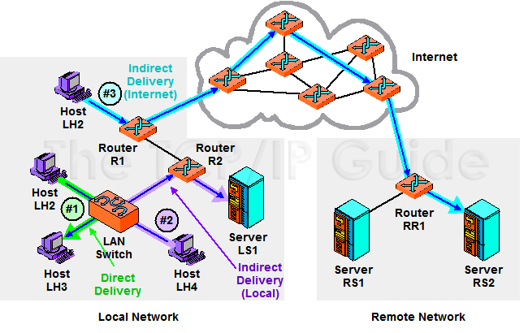

# NetPratice

## Ressources

- [TCP/IP addressing and subnetting - Microsoft](https://learn.microsoft.com/en-us/troubleshoot/windows-client/networking/tcpip-addressing-and-subnetting)
- [TCP/IP in MAAS context - Refresher about network and internet - with lots of articles links](https://discourse.maas.io/t/tcp-ip-primer/5806)
- [TCP/IP protocol suite](https://www.scaler.com/topics/computer-network/tcp-ip-protocol-suite/)

## TCP/IP

### What is TCP/IP?

TCP/IP stands for **Transmission Control Protocol/Internet Protocol** and is a suite of communication protocols that makes data exchange between two devices possible. TCP/IP specifies how data should be *packetized, addressed, transmitted, routed, and received* on a network by providing end-to-end communication

TCP/IP started as one of many internet protocols created by **DARPA** (the Defense Advanced Research Projects Agency in the United States) in the **1970s**. The TCP/IP model was later adopted as the standard protocol for ARPAnet, the modern internet's predecessor. TCP/IP is now the **international standard for internet communication**.

### TCP/IP Model

The TCP/IP model consists of 4 layers, i.e., the application layer, transport layer, network layer, and data link layer. Each layer is responsible for a particular task strictly according to the protocols.

TCP specifies how applications will establish communication channels across a network. It also controls how a message is split into multiple data packets, sent over the internet, and reassembled in order at the destination address. IP specifies how each packet should be addressed and routed to ensure that it arrives at its destination. To identify where the message should be forwarded, each gateway computer on the network verifies this IP address.

*Highlights*:
  -  The TCP/IP model allows communication over long distances between two devices.
  -  TCP handles the flow of data and also handles errors in data transmission, while IP provides a unique address to each device in the network.

#### How does TCP/IP work?

Whenever we send things like a simple text message, a file, or a video message over the internet, the TCP/IP model *divides the **data** into **packets**, according to four-layered architecture*. The data goes in order from the sender's side, and on the receiver's side, it follows the reverse order and is finally reassembled.

TCP/IP is based on the **client-server communication model**, which means that a user of a first computer (the client) sends a service request to a second network computer or web hosting provider(server), such as forwarding a Web page. TCP/IP also uses **point-to-point communication**, which means that data is sent from one host computer to another within a defined network border. In TCP/IP model, each client request is unique and unrelated to previous ones. Hence, it is called **stateless**, and being stateless allows network channels to be used indefinitely.

Because the entire process is **standardized**, the TCP/IP model works. Without standardization, communication would go haywire, and fast internet service relies on efficiency. The TCP/IP model provides both efficiency and standardization.

#### Layers of TCP/IP

The TCP/IP model consists of four layers, each of which is responsible for a specific task. The four layers are:

1. **Application Layer**: This layer performs the functions of the top three layers of the OSI model, i.e., the **Application, Presentation, and Session** Layer. It is responsible for **node-to-node communication and controls user-interface specifications**. Its protocols include HTTP, Post Office Protocol 3, Simple Mail Transfer Protocol, and File Transfer Protocol. At the application layer, the payload is the actual application data. Some of the protocols of the application layer are described below.
    -  **HTTP**: It stands for Hypertext transfer protocol. This protocol enables us to access data via the internet. It sends data in plain text, audio, and video formats. It's called a hypertext transfer protocol because it's efficient enough to use in a hypertext environment where there are rapid jumps from one document to another.
    -  **TELNET**: It establishes a connection between the local and remote computers in such a way that the local computer seems to be a remote terminal.
    -  **SMTP**: The Simple Mail Transfer Protocol (SMTP) is the TCP/IP protocol that handles e-mail. The data is sent to another e-mail address using this protocol.
    -  **FTP**: The FTP (File Transfer Protocol) is a standard internet protocol for transferring data from one computer to another.

2. **Host-to-Host/Transport Layer**: This layer is similar to the OSI model's **Transport layer**. It **specifies how much data** should be sent, when, and where **at what rate**. The message from the application layer is built upon this layer. This layer ensures that data units are supplied in a timely and error-free manner. Through error control, flow control, and segmentation or de-segmentation, the transport layer **helps to control the link's reliability**. The two important protocols present in this layer are:
    -  **[Transmission Control Protocol (TCP)](https://en.wikipedia.org/wiki/Transmission_Control_Protocol)**: It is known for offering **error-free** and reliable communication between end systems. It does **data segmentation and sequencing**. It also features an acknowledgment feature and uses a **flow control method to govern data flow**. It is a very effective protocol, but it has a lot of overhead because of these features. Increased overhead translates to higher costs. TCP uses **three-way handshaking to establish and acknowledge the connection between the two devices**.
    
    
    -  **[User Datagram Protocol (UDP)](https://en.wikipedia.org/wiki/User_Datagram_Protocol)**: UDP doesn't have any of TCP properties. If your application does not require dependable transmission, one must use this protocol because it is relatively cost-effective. UDP is a **connectionless protocol**, so it **does not provide assurance of data delivery**.
    

3. **Internet Layer**: This layer is also known as the **network layer**. The Internet layer's primary function is to **send packets** from the **source** or computer to their **destination**, regardless of their route. The Internet layer or Network Layer provides a functional and procedural means for **sending variable-length data** sequences between nodes **across multiple networks**. Message delivery at the Internet layer does not guarantee reliable network layer protocol. The main protocols lie in the layer are:
    -  **IP**: The Internet Protocol (IP) is in charge of sending packets from a source host to a destination host based on the IP addresses in the packet headers. There are two variations of IP IPv6 and IPv4.
    
    
    -  **ARP**: Address Resolution Protocol (ARP) is a protocol for resolving conflicts between computers. Its task is to determine a host's hardware address from an IP address. ARP's primary function is to convert 32-bit addresses to 48-bit addresses and vice versa. ARP is necessary because IP addresses in IP version 4 (IPv4) are 32 bits long, but MAC addresses are 48 bits long.
        - In case of IPv6, ARP is replaced by **NDP (Neighbor Discovery Protocol)**. NDP is a protocol in the Internet Protocol Suite used with Internet Protocol Version 6 (IPv6). It operates in the Link Layer of the Internet model. It mainly replaces ARP (Address Resolution Protocol), ICMP Router Discovery, and ICMP Redirect used in IPv4.

4. Network Access Layer/Link Layer

Network access or Link layer specifies the physical transmission of data over the network. This layer handles data transmission between two adjacent devices on the same network. It also determines how bits should be optically signaled by hardware devices that interface directly with a network media such as coaxial, optical, fiber, or twisted-pair cables.

Highlights:

  -  Application Layer is responsible for node-to-node communication and controls user-interface specifications. HTTP, SMTP, TELNET, etc., are some of its essential protocols.
  -  Host-To-Host Layer specifies how much data should be sent, when, and where at what rate. TCP and UDP are two significant protocols of this Layer.
  -  The Internet layer's primary function is to send packets from the source or computer to their destination, regardless of their route. IP and ARP are two significant protocols of this layer.
    Network Acess Layer handles data transmission between two adjacent devices on the same network.

### IP Addressing

#### IP Forwading

IP forwarding is a process used to determine the next hop for a packet to reach its destination. It is a routing process that is used to send packets from one network to another network. IP forwarding is a process that is used to determine the next hop for a packet to reach its destination. It is a routing process that is used to send packets from one network to another network.

