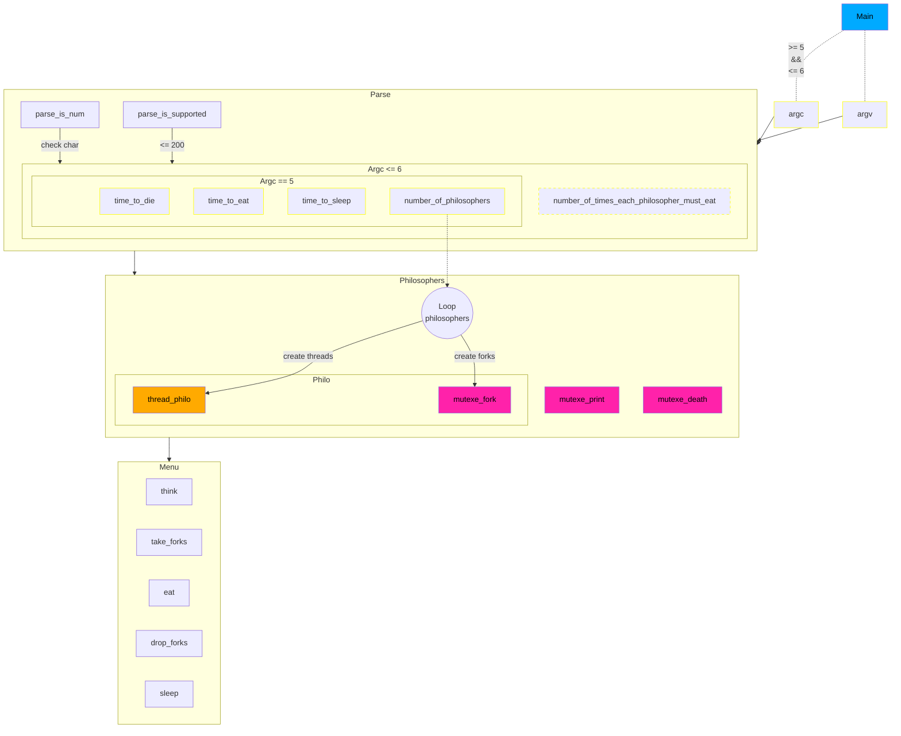
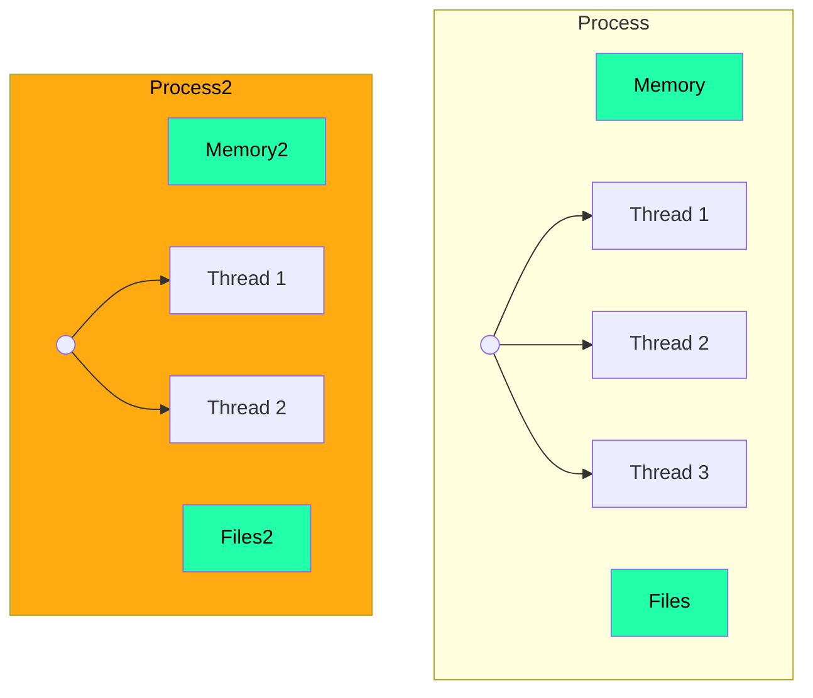

# Philosophers

## Description

<table>
<thead>
  <tr>
    <th>Item</th>
    <th colspan="2">Description</th>
  </tr>
</thead>
<tbody>
  <tr>
    <td>Program name</td>
    <td colspan="2"><strong>philo</strong></td>
  </tr>
  <tr>
    <td>Turn in files</td>
    <td colspan="2"><code>Makefile</code>, <code>*.h</code>, <code>*.c</code>, <strong>in dir <code>philo/</code></strong></td>
  </tr>
  <tr>
    <td>Makefile</td>
    <td colspan="2"><code>NAME</code>, <code>all</code>, <code>clean</code>, <code>fclean</code>, <code>re</code></td>
  </tr>
  <tr>
    <td rowspan="5">Arguments</td>
    <td>number_of_philosophers</td>
    <td>The number of philosophers and also the number
of forks.</td>
  </tr>
  <tr>
    <td>time_to_die (in milliseconds)</td>
    <td>If a philosopher didn’t start eating time_to_die
milliseconds since the beginning of their last meal or the beginning of the sim-
ulation, they die.</td>
  </tr>
  <tr>
    <td>time_to_eat (in milliseconds)</td>
    <td>The time it takes for a philosopher to eat.
During that time, they will need to hold two forks.</td>
  </tr>
  <tr>
    <td>time_to_sleep (in milliseconds)</td>
    <td>The time a philosopher will spend sleeping.</td>
  </tr>
  <tr>
    <td>[number_of_times_each_philosopher_must_eat] (optional argument)</td>
    <td>If all
philosophers have eaten at least number_of_times_each_philosopher_must_eat
times, the simulation stops. If not specified, the simulation stops when a
philosopher dies.</td>
  </tr>
  <tr>
    <td>External functs.</td>
    <td colspan="2">memset, printf, malloc, free, write, usleep, gettimeofday, pthread_create, pthread_detach, pthread_join, pthread_mutex_init, pthread_mutex_destroy, pthread_mutex_lock, pthread_mutex_unlock</td>
  </tr>
  <tr>
    <td>Libft authorized</td>
    <td colspan="2">No</td>
  </tr>
  <tr>
    <td>Description</td>
    <td colspan="2">Philosophers with threads and mutexes</td>
  </tr>
</tbody>
</table>

- Philosopher number starts at 1 to `number_of_philosophers`.
- Each philosopher should be a thread.
- Each philosopher has one fork.
- To eat, a philosopher needs to have two forks.
- Prevent philosophers from duplicating forks, protect the forks state
with a mutex for each of them.
- They should avoid dying.

- Log:
  - Log the following events:
    - `timestamp_in_ms X has taken a fork`
    - `timestamp_in_ms X is eating`
    - `timestamp_in_ms X is sleeping`
    - `timestamp_in_ms X is thinking`
    - `timestamp_in_ms X died`
  - X is the philosopher number.
  - The timestamp is the time in milliseconds from the start of the simulation.
  - The simulation should stop when a philosopher dies.

  - Logs messages should not mixe with each other.
  - Log message annoncing the death of a philosopher should wait more than 10ms before printing it.

## Code

### Mandatory part



## Resources

⏯️ [Unix Threads - CodeVault](https://youtube.com/playlist?list=PLfqABt5AS4FmuQf70psXrsMLEDQXNkLq2&feature=shared)

:bookmark_tabs: [Wiki - Philosopher's problem](https://en.wikipedia.org/wiki/Dining_philosophers_problem)

:bookmark_tabs: [Medium - 42 Philosophers](https://medium.com/@ruinadd/philosophers-42-guide-the-dining-philosophers-problem-893a24bc0fe2)

## Notions

### Threads



In computer science, a thread of execution is the smallest sequence of programmed instructions that can be managed independently by a scheduler, which is typically a part of the operating system. In many cases, a thread is a component of a process.

The multiple threads of a given process may be executed concurrently (via multithreading capabilities), sharing resources such as memory, while different processes do not share these resources. In particular, the threads of a process share its executable code and the values of its dynamically allocated variables and non-thread-local global variables at any given time.

The implementation of threads and processes differs between operating systems.

- Threads offer several advantages over processes, including
  -  Faster creation, termination, and context switching times due to sharing the same address space and resources.
  -  Simplified communication between threads within the same process.
  -  Improved resource utilization and efficiency in multithreaded applications.

Issues with threads include
  -  Difficulty in writing and debugging multithreaded applications.
  -  Increased complexity in managing shared resources

#### Race conditions

A race condition occurs when the behavior of a system depends on the relative timing of events, such as the order in which threads are scheduled. This can lead to unpredictable results and bugs that are difficult to reproduce.

Like for example, if two threads are trying to access the same shared resource, and one of them modifies the resource while the other is reading it, the result can be unpredictable.

#### Deadlocks

A deadlock is a situation in which two or more competing actions are each waiting for the other to finish, and thus neither ever does. Deadlocks can occur in multithreaded programs when threads acquire multiple locks in different orders, leading to a situation where each thread is waiting for a lock that is held by another thread. [Example](#demo-deadlock-with-threads)

#### Other infos

**Data Race**: This is a condition where two or more threads access shared data simultaneously and at least one of them modifies the data. This can lead to unpredictable results if not handled properly.

**Condition Variables**: These are synchronization primitives used in multithreaded programming. A condition variable allows one thread to signal to one or more other threads that a certain condition has changed (for example, data has been produced that the other threads can consume).

**Thread Synchronization**: This is a general term for techniques that ensure that threads correctly interact with each other and with shared data. This can involve mutexes, locks, semaphores, condition variables, and other techniques.


### Mutexes


A mutex, short for **"mutually exclusive,"** is a synchronization primitive used to protect shared resources from being accessed simultaneously by multiple threads. It ensures that **only one thread can access the protected resource** at a time. When a thread acquires a mutex, other threads attempting to acquire the same mutex are **blocked until the owning thread releases it**. This mechanism is crucial in multi-threaded programming to prevent data races and ensure data integrity.

Mutexes differ from semaphores in their use and constraints. While both are used for synchronization, a mutex is owned by the thread that locks it and must be unlocked by the same thread. This ownership constraint helps avoid problems such as priority inversion, premature task termination, and accidental release of the mutex. Semaphores, on the other hand, are more general-purpose synchronization primitives that can be signaled by any thread and do not have an ownership requirement.

### Semaphores (bonus)

## Functions

- `memset`: Sets a block of memory with a specified value. Used in C and C++.

- `printf`: Outputs formatted text to the console. Used in C and C++.

- `malloc`: Allocates a block of memory and returns a pointer to it. Used in C and C++.

- `free`: Deallocates a block of memory that was previously allocated by `malloc`, `calloc`, or `realloc`. Used in C and C++.

- `write`: Writes data from a buffer into a file or a file descriptor. Used in C and C++.

- [`usleep`](#usleep): Suspends execution of the calling thread for (at least) the number of microseconds specified. Used in Unix-like operating systems.

- [`gettimeofday`](#gettimeofday): Gets the current time. Used in Unix-like operating systems.

- [`pthread_create`](#pthread_create): Creates a new thread. Used in POSIX threads (pthreads).

- [`pthread_join`](#pthread_join): Suspends execution of the calling thread until the target thread finishes execution. Used in pthreads.

- [`pthread_mutex_init`](#pthread_mutex_init): Initializes a mutex. Used in pthreads.

- [`pthread_mutex_destroy`](#pthread_mutex_destroy): Destroys a mutex. Used in pthreads.

- [`pthread_mutex_lock`](#pthread_mutex_lock): Locks a mutex. Used in pthreads.

- [`pthread_mutex_unlock`](#pthread_mutex_unlock): Unlocks a mutex. Used in pthreads.

### usleep

```c
#include <unistd.h>

int usleep(useconds_t usec);
```

- Suspends execution of the calling thread for (at least) the number of microseconds specified.

Parameters:

- `usec`: The number of microseconds to suspend execution.
  - `useconds_t` is an unsigned integer type.

Return value:

- On success, `usleep` returns 0.
- On error, it returns -1.

<details>
<summary>Example</summary>

```c
#include <unistd.h>

int main()
{
    printf("Hello\n");
    usleep(1000000);  // Sleep for 1 second
    printf("World\n");

    return 0;
}
```

In this example, the program will print "Hello", wait for 1 second, and then print "World".

</details>

### gettimeofday

```c
#include <sys/time.h>

int gettimeofday(struct timeval *tv, struct timezone *tz);
```

`timeval` structure:

```c
struct timeval
{
    time_t      tv_sec;     // Seconds
    suseconds_t tv_usec;    // Microseconds
};
```

- Gets the current time.

Parameters:

- `tv`: A pointer to a `timeval` structure that will be filled with the current time.
- `tz`: A pointer to a `timezone` structure that will be filled with the current timezone information.
  - This parameter is generally not used and can be set to `NULL`.

Return value:

- On success, `gettimeofday` returns 0.
- On error, it returns -1.

Info:

The `tv_sec` field represents the number of seconds elapsed since the Unix Epoch (00:00:00 UTC, January 1, 1970), and the `tv_usec` field represents the number of microseconds in the current second.

<details>
<summary>Example</summary>

```c
#include <stdio.h>
#include <sys/time.h>

int main() {
    struct timeval tv;

    gettimeofday(&tv, NULL);

    printf("Seconds: %ld\n", tv.tv_sec);
    printf("Microseconds: %ld\n", tv.tv_usec);

    return 0;
}
```

In this example, the program will print the current time in seconds and microseconds.

</details>

### Pthreads functions

#### pthread_create

Compile and link with `-pthread`.

```c
#include <pthread.h>

int pthread_create(pthread_t *thread, const pthread_attr_t *attr, void *(*start_routine) (void *), void *arg);
```

- Creates a new thread.

Parameters:

- `thread`: A pointer to a `pthread_t` structure that will be filled with the thread ID.
- `attr`: A pointer to a `pthread_attr_t` structure that specifies the thread's attributes.
  - This parameter is generally not used and can be set to `NULL`.
- `start_routine`: A pointer to the function that will be executed by the new thread.
- `arg`: A pointer to the argument that will be passed to the `start_routine` function.

Return value:

- On success, `pthread_create` returns 0.
- On error, it returns a positive error number.

Info:

- You have to check the return value of `pthread_create` to ensure that the thread was created successfully.

<details>
<summary>Example</summary>

Simple example:
```c
#include <stdio.h>
#include <pthread.h>

void *print_message(void *ptr) {
    char *message = (char *)ptr;
    printf("%s\n", message);
    sleep(1);
    return NULL;
}

int main() {
    pthread_t thread;
    char *message = "Hello";

    pthread_create(&thread, NULL, print_message, (void *)message);

    pthread_join(thread, NULL);

    printf(", world!\n");

    return 0;
}
```

In this example, the program creates a new thread that prints "Hello, world!".

Multiple threads example:
```c
#include <stdio.h>
#include <pthread.h>

void* routine()
{
	printf("Hello from thread\n");
	sleep(5);
	printf("Goodbye from thread\n");
	return NULL;
}

int main() {
  pthread_t thread;
	pthread_t thread2;

	pthread_create(&thread, NULL, &routine, NULL);
	pthread_create(&thread2, NULL, &routine, NULL);

	printf("Hello from main\n");
	sleep(6);
	printf("Goodbye from main\n");
	pthread_join(thread, NULL);
	pthread_join(thread2, NULL);
	return 0;
}
```

In this example, the program creates two new threads that print "Hello from thread" and "Goodbye from thread" after 5 seconds. The main thread prints "Hello from main" and "Goodbye from main" after 6 seconds.

</details>

#### pthread_join

```c
#include <pthread.h>

int pthread_join(pthread_t thread, void **retval);
```

- Suspends execution of the calling thread until the target thread finishes execution.

Parameters:

- `thread`: The thread ID of the target thread.
- `retval`: A pointer to a pointer that will be filled with the return value of the target thread.
  - This parameter is generally not used and can be set to `NULL`.

Return value:

- On success, `pthread_join` returns 0.
- On error, it returns a positive error number.

### Mutexes functions

<details>
<summary>Example/Demo</summary>

```c
#include <stdio.h>
#include <pthread.h>
#include <unistd.h>

pthread_mutex_t mutex;

void *print_message(void *ptr) {
    pthread_mutex_lock(&mutex);
    char *message = (char *)ptr;
    printf("%s\n", message);
    sleep(1);
    pthread_mutex_unlock(&mutex);
    return NULL;
}

int main() {
    pthread_t thread;
    char *message = "Hello";

    pthread_mutex_init(&mutex, NULL);

    pthread_create(&thread, NULL, print_message, (void *)message);

    pthread_join(thread, NULL);

    printf(", world!\n");

    pthread_mutex_destroy(&mutex);

    return 0;
}
```

In this example, the program creates a new thread that prints "Hello, world!".

</details>

#### pthread_mutex_init

```c
#include <pthread.h>

int pthread_mutex_init(pthread_mutex_t *mutex, const pthread_mutexattr_t *attr);
```

- Initializes a mutex.

Parameters:

- `mutex`: A pointer to a `pthread_mutex_t` structure that will be initialized.
- `attr`: A pointer to a `pthread_mutexattr_t` structure that specifies the mutex's attributes.
  - This parameter is generally not used and can be set to `NULL`.

Structure:

The actual content of the mutex structure is not defined in the POSIX threads (pthreads) standard, and it is generally considered to be opaque -- that is, you should not access its members directly. Instead, you should use the pthreads API functions to work with mutexes.

Remember, you should always use the pthreads API functions to work with `pthread_mutex_t` objects, and not try to manipulate them directly.

Return value:

- On success, `pthread_mutex_init` returns 0.
- On error, it returns a positive error number.

Info:

- You have to check the return value of `pthread_mutex_init` to ensure that the mutex was initialized successfully.
- If the system does not have enough resources (like memory) to initialize a new mutex, pthread_mutex_init will fail.

#### pthread_mutex_destroy

```c
#include <pthread.h>

int pthread_mutex_destroy(pthread_mutex_t *mutex);
```

- Destroys a mutex.

Parameters:

- `mutex`: A pointer to a `pthread_mutex_t` structure that will be destroyed.

Return value:

- On success, `pthread_mutex_destroy` returns 0.
- On error, it returns a positive error number.

| Error Code | Description |
|------------|-------------|
| `EAGAIN` | The system lacked the necessary resources (other than memory) to initialize another mutex. |
| `ENOMEM` | Insufficient memory exists to initialize the mutex. |
| `EPERM` | The caller does not have the privilege to perform the operation. |
| `EINVAL` | The attributes object referenced by attr has the robust mutex attribute set without the process-shared attribute being set. |

Info:

- You have to check the return value of `pthread_mutex_destroy` to ensure that the mutex was destroyed successfully.
- If a thread attempts to destroy a mutex that is currently locked, it will cause an error.

#### pthread_mutex_lock

```c
#include <pthread.h>

int pthread_mutex_lock(pthread_mutex_t *mutex);
```

- Locks a mutex.

Parameters:

- `mutex`: A pointer to a `pthread_mutex_t` structure that will be locked.

Return value:

- On success, `pthread_mutex_lock` returns 0.
- On error, it returns a positive error number.

| Error Code | Description |
|------------|-------------|
| `EAGAIN` | The maximum number of recursive locks for the mutex has been exceeded. |
| `EINVAL` | The mutex was created with the protocol attribute having the value PTHREAD_PRIO_PROTECT and the calling thread's priority is higher than the mutex's current priority ceiling. |
| `ENOTRECOVERABLE` | The state protected by the mutex is not recoverable. |
| `EOWNERDEAD` | The mutex is a robust mutex and the process containing the previous owning thread terminated while holding the mutex lock. The mutex lock shall be acquired by the calling thread and it is up to the new owner to make the state consistent. |
| `EDEADLK` | The mutex type is PTHREAD_MUTEX_ERRORCHECK and the current thread already owns the mutex, or a deadlock condition was detected. |
| `EBUSY` | The mutex could not be acquired because it was already locked. |
| `EPERM` | The mutex type is PTHREAD_MUTEX_ERRORCHECK or PTHREAD_MUTEX_RECURSIVE, or the mutex is a robust mutex, and the current thread does not own the mutex. |

Info:

- If the mutex is already locked by another thread, the calling thread will be blocked until the mutex is unlocked by the other thread.

- The difference between `pthread_mutex_lock` and `pthread_mutex_trylock` is that `pthread_mutex_lock` will block the calling thread until the mutex is unlocked, while `pthread_mutex_trylock` will return an error if the mutex is already locked.

- You have to check the return value of `pthread_mutex_lock` to ensure that the mutex was locked successfully.

#### pthread_mutex_unlock

```c
#include <pthread.h>

int pthread_mutex_unlock(pthread_mutex_t *mutex);
```

- Unlocks a mutex.

Parameters:

- `mutex`: A pointer to a `pthread_mutex_t` structure that will be unlocked.

Return value:

- On success, `pthread_mutex_unlock` returns 0.
- On error, it returns a positive error number.

## Demo threads and mutexes functions

<details>

<summary><strong>🧪 Examples/Demos - CodeVault</strong></summary>

#### Demo of create threads in loops:

In this example, the program creates 4 threads that increment the `mails` variable 1,000,000 times each. The `mails` variable is protected by a mutex.

```c
#include <stdio.h>
// THREAD
#include <pthread.h>

int mails = 0;
pthread_mutex_t mutex;

void* routine()
{
	int i = 0;
	while (i < 1000000)
	{
		i++;
		pthread_mutex_lock(&mutex); // Lock the mutex for current thread
		mails++;
		pthread_mutex_unlock(&mutex); // Unlock the mutex for current thread
	}
	return (NULL);
}

int main() {
    pthread_t th[4];

	pthread_mutex_init(&mutex, NULL); // Initialize the mutex protection

	printf("Mails: %d\n", mails);
	for (int i = 0; i < 4; i++)
	{
		if (pthread_create(&th[i], NULL, routine, NULL) != 0)
		{
			printf("Failed to create thread %i\n", i);
			return 1;
		}
		printf("Thread %i has started\n", i);
	}
	for (int i = 0; i < 4; i++)
	{
		if (pthread_join(th[i], NULL) != 0)
		{
			printf("Failed to join thread %i\n", i);
			return 1;
		}
		printf("Thread %i has finished\n", i);
	}
	pthread_mutex_destroy(&mutex); // Destroy the mutex protection

	printf("Mails: %d\n", mails); // 2000000 but if we don't use mutex, it will be less than 2000000
	return 0;
}
```

#### Demo recover return value from threads:

```c
#include <stdlib.h>
#include <stdio.h>
#include <pthread.h>
#include <time.h>

void	*roll_dice()
{
	
	int value = (rand() % 6) + 1;
	int *ptr_res = malloc(sizeof(int));
	printf("You rolled a %d\n", value);
	*ptr_res = value;
	printf("ptr_res: %p\n", ptr_res);
	return (void *)ptr_res;
}

int main()
{
	srand(time(NULL));
	pthread_t 	th;
	int *res;

	// one thread
	printf("================= One Thread ===================\n");
	pthread_create(&th, NULL, roll_dice, NULL);
	pthread_join(th, (void **)&res);
	printf("res roll: %d\n", *res);
	printf("res addr: %p\n", res);
	free(res);

	// Multiple threads
	printf("================= Multiple Threads ===================\n");
	pthread_t 	th_list[4];
	int 		*res_list[4];
	for (int i = 0; i < 4; i++)
	{
		pthread_create(&th_list[i], NULL, roll_dice, NULL);
	}
	for (int i = 0; i < 4; i++)
	{
		pthread_join(th_list[i], (void **)&res_list[i]);
	}
	for (int i = 0; i < 4; i++)
	{
		printf("res_list[%d] roll: %d\n", i, *res_list[i]);
		printf("res_list[%d] addr: %p\n", i, res_list[i]);
		free(res_list[i]);
	}
	return 0;
}
```

#### Demo of create threads with arguments:

In this example, the program creates 10 threads that print the prime numbers from an array. The threads receive the index of the prime number as an argument.

- The first example uses the stack to pass the argument to the thread.

- The second example uses the heap to pass the argument to the thread.

The second example is better because the stack is not safe for threads. The stack is shared between threads, and the value of the argument can change before the thread uses it.

In this example, the value of `i` is send as an address, so the value of `i` can change before the thread uses it.
```c
// Standard Libs
#include <stdio.h>
#include <stdlib.h>
#include <unistd.h>
// Time
#include <sys/time.h>
// Threads
#include <pthread.h>

int primes[10] = {2, 3, 5, 7, 11, 13, 17, 19, 23, 29};

void* routine(void *arg)
{
	int index = *(int*)arg;
	printf("Prime: %d\n", primes[index]);
	return (NULL);
}

void* routine2(void *arg)
{
	int index = *(int*)arg;
	printf("Prime: %d\n", primes[index]);
	free(arg);
	return (NULL);
}

int main()
{
	pthread_t thread[10];

	// Example of arg from the stack
	printf("=================== Example Stack Arg ===================\n");
	for (int i = 0; i < 10; i++)
	{
		if (pthread_create(&thread[i], NULL, &routine, &i) != 0)
		{
			perror("Failed to pthread_create");
		}
	}
	for (int i = 0; i < 10; i++)
	{
		if (pthread_join(thread[i], NULL) != 0)
		{
			perror("Failed to pthread_join");
		}
	}
	
	// Example of arg from the heap
	printf("=================== Example Heap Arg ===================\n");
	for (int i = 0; i < 10; i++)
	{
		int *index = malloc(sizeof(int));
		*index = i;
		if (pthread_create(&thread[i], NULL, &routine2, index) != 0)
		{
			perror("Failed to pthread_create");
		}
	}
	for (int i = 0; i < 10; i++)
	{
		if (pthread_join(thread[i], NULL) != 0)
		{
			perror("Failed to pthread_join");
		}
	}
	return (0);
}
```

#### Demo summing from array with threads:

In this example, the program creates 2 threads that sum the prime numbers from an array. The threads receive the index of the prime number as an argument and return the sum of the prime numbers.

```c
// Standard Libs
#include <stdio.h>
#include <stdlib.h>
#include <unistd.h>
// Time
#include <sys/time.h>
// Threads
#include <pthread.h>

int primes[10] = {2, 3, 5, 7, 11, 13, 17, 19, 23, 29};

void* routine(void *arg)
{
	int index = *(int*)arg;
	int sum = 0;
	for (int j = 0; j < 5; j++)
	{
		sum += primes[index + j];
	}
	*(int*)arg = sum;
	return (arg);
}

int main()
{
	pthread_t thread[2];

	int i;
	for (i = 0; i < 2; i++)
	{
		int *index = malloc(sizeof(int));
		*index = i * 5;
		if (pthread_create(&thread[i], NULL, &routine, index) != 0)
		{
			perror("pthread_create");
		}
	}
	int main_sum = 0;
	for (i = 0; i < 2; i++)
	{
		int *result;
		if (pthread_join(thread[i], (void **)&result) != 0)
		{
			perror("pthread_join");
		}
		main_sum += *result;
		printf("Thread %d returned %d\n", i, *result);
		free(result);
	}
	printf("Sum of all primes is %d\n", main_sum);
	return (0);
}
```

#### Demo deadlock with threads:

In this example, the program creates 8 threads that try to lock two mutexes. The threads lock the mutexes in different orders, which causes a deadlock.

```c
// Standard Libs
#include <stdio.h>
#include <stdlib.h>
#include <unistd.h>
// Time
#include <sys/time.h>
// Threads
#include <pthread.h>

#define THREAD_COUNT 8

pthread_mutex_t mutexFuel;
pthread_mutex_t mutexCargo;

int fuel = 50;

// The Mutexes lock order is important
// If the order is not the same, the program can/will deadlock
void* routine(void *arg)
{
	(void)arg;
	if (rand() % 2)
	{
		pthread_mutex_lock(&mutexFuel);
		sleep(1);
		pthread_mutex_lock(&mutexCargo);
	}
	else
	{
		pthread_mutex_lock(&mutexCargo);
		sleep(1);
		pthread_mutex_lock(&mutexFuel);
	}
	fuel += 50;
	printf("Increased Fuel to: %d\n", fuel);
	pthread_mutex_unlock(&mutexFuel);
	pthread_mutex_unlock(&mutexCargo);
	return (NULL);
}

int main()
{
	pthread_t thread[THREAD_COUNT];

  pthread_mutex_init(&mutexFuel, NULL);
  pthread_mutex_init(&mutexCargo, NULL);
	int i;
	for (i = 0; i < THREAD_COUNT; i++)
	{
		if (pthread_create(&thread[i], NULL, routine, NULL) != 0)
		{
			printf("Error creating thread\n");
			return (1);
		}
	}
	for (i = 0; i < THREAD_COUNT; i++)
	{
		if (pthread_join(thread[i], NULL) != 0)
		{
			printf("Error joining thread\n");
			return (1);
		}
	}
	printf("Fuel: %d\n", fuel);
	pthread_mutex_destroy(&mutexFuel);
  pthread_mutex_destroy(&mutexCargo);
	return (0);
}
```

#### Demo barrier with threads (not in the subject):

<details>

<summary>Barrier infos</summary>

A barrier is a thread synchronization mechanism in POSIX threads (pthreads) where all threads are blocked until all participating threads reach the barrier. Once all threads have reached the barrier, they are all released and can continue executing.

Here's an example of how to use a barrier in pthreads:

```c
#include <pthread.h>
#include <stdio.h>

#define NUM_THREADS 5

pthread_barrier_t barrier;

void* threadFunc(void* id) {
    int thread_id = *(int*)id;

    printf("Before barrier: %d\n", thread_id);
    pthread_barrier_wait(&barrier);
    printf("After barrier: %d\n", thread_id);

    return NULL;
}

int main() {
    pthread_t threads[NUM_THREADS];
    int thread_ids[NUM_THREADS];

    // Initialize the barrier and set it to NUM_THREADS
    pthread_barrier_init(&barrier, NULL, NUM_THREADS);

    // Start up the threads
    for (int i = 0; i < NUM_THREADS; i++) {
        thread_ids[i] = i;
        pthread_create(&threads[i], NULL, threadFunc, &thread_ids[i]);
    }

    // Wait for all threads to finish
    for (int i = 0; i < NUM_THREADS; i++) {
        pthread_join(threads[i], NULL);
    }

    // Destroy the barrier
    pthread_barrier_destroy(&barrier);

    return 0;
}
```

In this example, `pthread_barrier_init` initializes the barrier. The second argument can be used to specify attributes for the barrier (NULL means default attributes), and the third argument is the count of the number of threads that must call `pthread_barrier_wait` before any of them successfully return from the call.

The `pthread_barrier_wait` function is used to indicate that the thread is at the barrier. Each thread will block until all threads have reached the barrier.

Finally, `pthread_barrier_destroy` is used to free a barrier when you're done with it.

</details>

</details>