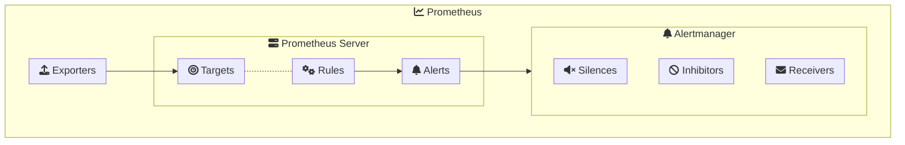

# Technologies

🔗 [Example - Django Postgre Nginx](https://testdriven.io/blog/dockerizing-django-with-postgres-gunicorn-and-nginx/)

🔗 [Example - Django SPA](https://testdriven.io/blog/django-spa-auth/)

## Django

Django is a high-level Python web framework that encourages rapid development and clean, pragmatic design. It is a widely used web framework for developing web applications.

Django is a Python framework that makes it easier to create web sites using Python.

Django takes care of the difficult stuff so that you can concentrate on building your web applications.

Django emphasizes reusability of components, also referred to as DRY (Don't Repeat Yourself), and comes with ready-to-use features like login system, database connection and CRUD operations (Create Read Update Delete).

🔗 [Django PIP](https://pypi.org/project/Django/#description)
🔗 [Django Documentation](https://docs.djangoproject.com/en/5.0/)
🔗 [Django Philosophies](https://docs.djangoproject.com/en/5.1/misc/design-philosophies/)
🦮 [Django - Secure Prod Environement](https://www.digitalocean.com/community/tutorials/how-to-harden-your-production-django-project)

### Learning Django

[🦮 W3School - Learn Django](https://www.w3schools.com/django/index.php)

### Django Concepts

<table border="1">
  <thead>
    <tr>
      <th>Concept</th>
      <th>Description</th>
    </tr>
  </thead>
  <tbody>
    <tr>
      <td>Model-View-Template (MVT)</td>
      <td>Django follows the MVT design pattern, which separates the data (Model), the user interface (Template), and the business logic (View).</td>
    </tr>
    <tr>
      <td>ORM (Object-Relational Mapping)</td>
      <td>Django's ORM allows you to interact with your database using Python code instead of SQL queries.</td>
    </tr>
    <tr>
      <td>Admin Interface</td>
      <td>Django provides a built-in admin interface for managing application data.</td>
    </tr>
    <tr>
      <td>Forms</td>
      <td>Django includes a powerful form handling library that simplifies form validation and rendering.</td>
    </tr>
    <tr>
      <td>Authentication</td>
      <td>Django comes with a robust authentication system that handles user login, logout, password management, and more.</td>
    </tr>
    <tr>
      <td>Middleware</td>
      <td>Middleware is a way to process requests globally before they reach the view or after the view has processed them.</td>
    </tr>
    <tr>
      <td>URL Routing</td>
      <td>Django uses a URL dispatcher to map URLs to views, making it easy to design clean, readable URLs.</td>
    </tr>
    <tr>
      <td>Templates</td>
      <td>Django's templating engine allows you to generate dynamic HTML pages using template tags and filters.</td>
    </tr>
    <tr>
      <td>Static Files</td>
      <td>Django provides a way to manage static files (CSS, JavaScript, images) for your web application.</td>
    </tr>
    <tr>
      <td>Internationalization</td>
      <td>Django supports internationalization and localization, allowing you to create applications for multiple languages and regions.</td>
    </tr>
    <tr>
      <td>Testing</td>
      <td>Django includes a testing framework to help you write and run tests for your application.</td>
    </tr>
  </tbody>
</table>

### Django Views/Models/Templates

<!-- Work with markdown preview extension (not sure with github) -->
<link
  href="https://cdnjs.cloudflare.com/ajax/libs/font-awesome/6.5.1/css/all.min.css"
  rel="stylesheet"
/>

```mermaid
%%{ init: { 'flowchart': { 'curve': 'basis' } } }%%
graph TD
  classDef black fill:#000,stroke:#333,stroke-width:1px;
  classDef white fill:#fff,color:#555,stroke:#333,stroke-width:1px;
  classDef white_border fill:#fff,color:#000,stroke:#333,stroke-width:1px, stroke-dasharray: 5, 5;
  classDef green fill:#0f0,color:#555,stroke:#333,stroke-width:1px;
  classDef lightblue fill:#99f,color:#fff,stroke:#333,stroke-width:1px;
  classDef lightgreen fill:#9f9,color:#555,stroke:#333,stroke-width:1px;
  classDef lightred fill:#f99,color:#555,stroke:#333,stroke-width:1px;
  classDef lightyellow fill:#ff9,color:#555,stroke:#333,stroke-width:1px;
  classDef lightorange fill:#f90,color:#555,stroke:#333,stroke-width:1px;
  classDef lightpurple fill:#75a,color:#fff,stroke:#333,stroke-width:1px;
  classDef lightcyan fill:#9ff,color:#555,stroke:#333,stroke-width:1px;
  classDef lightpink fill:#f9f,color:#555,stroke:#333,stroke-width:1px;
  classDef lightbrown fill:#963,color:#555,stroke:#333,stroke-width:1px;
  classDef lightgrey fill:#999,color:#555,stroke:#333,stroke-width:1px;
  classDef lightblack fill:#000,stroke:#333,stroke-width:1px;
  classDef lightwhite fill:#fff,color:#555,stroke:#333,stroke-width:1px;

  classDef file fill:#75a,color:#fff,stroke:#333,stroke-width:1px, stroke-dasharray: 5, 5;

  Database[(fas:fa-database Database<br>SQL)]:::lightorange
  Get_Data -.-> |"Object Relational Mapping <br>(ORM)"| Database
  linkStyle 0 stroke:#f90,stroke-width:2px;

  subgraph Django["fab:fa-python Django"]
    Web["fas:fa-globe Web"]:::lightblue
    url_file(["fas:fa-file-code urls.py"]):::file
    URL_Routing:::lightgreen
    Model["fas:fa-database Model"]:::lightgreen
    Web --> |"HTTP Request"| url_file
    subgraph URL_Routing["fas:fa-route URL Routing"]
      url_file
    end
    url_file --- |"Match URL to view"| view_file
    view_file(["fas:fa-file-code views.py"]):::file
    view_file --> View:::lightgreen
    subgraph View["fas:fa-eye View"]
      model_file(["fas:fa-file-code models.py"]):::file
      model_file --> Model
      subgraph Model["fas:fa-database Model"]
        Get_Data["fas:fa-database Get Data"]
      end
      template_folder(["fas:fa-folder Template"]):::file
      template_folder --> Template:::lightgreen
      Template["fas:fa-file-code Template"]:::lightgreen
      subgraph Template["fas:fa-file-code Template"]
        Render_HTML["fas:fa-file-code Render HTML"]
      end
      Model --> Template
    end
  end
```



<details>
  <summary>
  
### Django Infos
  
  </summary>

### Django Setup

#### Virtual Environment

A virtual environment is a self-contained directory that contains a Python installation for a particular version of Python, plus a number of additional packages. It allows you to work on a specific project without affecting other projects or the system Python installation.

🔗 [Python Virtual Environment](https://docs.python.org/3/library/venv.html)

```bash
# Create a virtual environment
python3 -m venv myenv
```

```bash
# Activate the virtual environment
source myenv/bin/activate
```

```bash
# Deactivate the virtual environment
deactivate
```

#### Django Installation

```bash
# Install Django
pip install Django
```

#### Django Project

```bash
# Create a Django project
django-admin startproject myproject
```

##### Django App

```bash
# Create a Django app
python3 manage.py startapp myapp
```

### Django Views

Django views are Python functions that take a web request and return a web response. They are responsible for processing user input, interacting with the database, and generating the HTML content that is sent back to the client.

```python
# views.py
from django.shortcuts import render
from django.http import HttpResponse

def index(request):
    return HttpResponse("Hello, world. You're at the polls index.")
```

##### Django URL Routing

```bash
# Create a URL routing file in the app folder (if not already created)
touch urls.py
```

```python
# urls.py
from django.urls import path
from . import views

urlpatterns = [
    #Add path to views.index function
    path('', views.index, name='index'),
]
```

```python
# urls.py in project folder
from django.contrib import admin
from django.urls import include, path

urlpatterns = [
    path('myapp/', include('myapp.urls')), # Add path to app urls.py url patterns
    path('admin/', admin.site.urls),
]
```

#### Django Views with Models and Templates

```python
# models.py
from django.db import models

class MyModel(models.Model):
    name = models.CharField(max_length=100)
    description = models.TextField()
    created_at = models.DateTimeField(auto_now_add=True)
```

```python
# views.py
from django.http import HttpResponse
from django.template import loader
from .models import MyModel

def index(request):
    my_objects = MyModel.objects.all()
    template = loader.get_template('index.html')
    context = {
        'my_objects': my_objects
    }
    return HttpResponse(template.render(context, request))
```

```html
<!-- index.html in ./app_folder/templates_folder -->
<!DOCTYPE html>
<html>
  <head>
    <title>My Model Objects</title>
</head>
<body>
  <h1>My Model Objects</h1>
    <ul>
      
        <li>{{ obj.name }} - {{ obj.description }}</li>
      
    </ul>
</body>
</html>
```

### Django Templates

Django templates are HTML files that contain template tags and filters. They allow you to generate dynamic HTML content using data from your Django application.

🔗 [Django Templates](https://docs.djangoproject.com/en/5.1/topics/templates/)

```html
<!-- template.html in ./app_folder/templates_folder -->
<!DOCTYPE html>
<html>
  <head>
    <title>{{ title }}</title>
</head>
<body>
  <h1>{{ heading }}</h1>
    <p>{{ content }}</p>
</body>
</html>
```

```python
# views.py
from django.shortcuts import render

def index(request):
    context = {
        'title': 'Welcome to My Website',
        'heading': 'Hello, World!',
        'content': 'This is a Django template example.'
    }
    return render(request, 'template.html', context)
```

Add the app folder to the `INSTALLED_APPS` list in the `settings.py` file.

```python
# settings.py
INSTALLED_APPS = [
    'myapp',
    ...
]
```

#### Django Template Tags

Django template tags are used to generate dynamic content in templates. They allow you to insert Python code into your templates to perform logic, iterate over lists, and display data.

🔗 [Django Template Tags](https://docs.djangoproject.com/en/5.1/ref/templates/builtins/)

```html
<!-- template.html -->

  <p>Welcome, {{ user.username }}!</p>

  <p>Please log in to continue.</p>

```

```html
<!-- template.html -->

  <p>{{ item }}</p>

```

##### Common Tags Table

<table>
  <thead>
    <tr>
      <th>Tag</th>
      <th>Description</th>
      <th>Example</th>
    </tr>
  </thead>
  <tbody>
    <tr>
      <td>block</td>
      <td>Defines a block that child templates can override.</td>
      <td>

```django
...
```
</td>
    </tr>
    <tr>
      <td>extends</td>
      <td>Indicates that this template extends a parent template.</td>
      <td>

```django

```
</td>
    </tr>
    <tr>
      <td>include</td>
      <td>Includes the contents of another template.</td>
      <td>

```django

```
</td>
    <tr>
      <td>comment</td>
      <td>Comments out text in the template.</td>
      <td>

```django

  This is a comment.


{# This is also a comment. #}
```
</td>
    </tr>
    <tr>
      <td>with</td>
      <td>Assigns a value to a variable for use in the block.</td>
      <td>

```django

  <p>Total items: {{ total }}</p>

```
</td>
    </tr>
    <tr>
      <td>if</td>
      <td>Checks if a condition is true and executes the block if it is.</td>
      <td>

```django

  <p>Welcome, {{ user.username }}!</p>

  <p>Please log in to continue.</p>

```
</td>
    </tr>
    <tr>
      <td>is</td>
      <td>Checks if a variable is of a certain type or value.</td>
      <td>

```django

  ...

```
</td>
  </tr>
  <tr>
    <td>in</td>
    <td>Checks if a value is in a list or other iterable.</td>
    <td>

```django

  ...

```
</td>
    </tr>
    <tr>
      <td>for</td>
      <td>Iterates over a list and executes the block for each item.</td>
      <td>

```django

  <p>{{ item }}</p>

```
</td>
    </tr>
    
    <tr>
      <td>url</td>
      <td>Generates a URL for a given view.</td>
      <td>

```django

```
</td>
    </tr>
    <tr>
      <td>csrf_token</td>
      <td>Generates a <a href="https://portswigger.net/web-security/csrf">CSRF</a> token for form submissions.</td>
      <td>

```django
<form>
  
  <!-- form fields -->
</form>
```
</td>
    </tr>
    <tr>
      <td>static</td>
      <td>Generates a URL for a static file.</td>
      <td>

```django

```
</td>
    </tr>
    <tr>
      <td>load</td>
      <td>Loads a custom template tag library.</td>
      <td>

```django

```
</td>
    </tr>
  </tbody>
</table>


##### Extend Template

```html
<!-- base.html in ./app_folder/templates_folder -->
<!DOCTYPE html>
<html>
  <head>
    <title></title>
</head>
<body>
  <h1></h1>
    
</body>
</html>
```

```html
<!-- template.html in ./app_folder/templates_folder -->


Welcome to My Website
Hello, World!
This is a Django template example.
```

### Django Models

Django models are Python classes that represent **database tables**. They define the structure of the database and provide an object-oriented interface for interacting with the database.

🔗 [Django Models](https://docs.djangoproject.com/en/5.1/topics/db/models/)

```python
# models.py
from django.db import models

class MyModel(models.Model):
    name = models.CharField(max_length=100)
    description = models.TextField()
    created_at = models.DateTimeField(auto_now_add=True)
```

```bash
# Create the database tables
python3 manage.py makemigrations # Update the database schema based on the models
python3 manage.py migrate # Apply the changes to the database
```

```python
# views.py
from .models import MyModel

def index(request):
    my_objects = MyModel.objects.all()
    context = {
        'my_objects': my_objects
    }
    return render(request, 'template.html', context)
```

#### Show SQL Queries

SQL statement that were executed from the migration above. All you have to do is to run this command, with the migration number:

```bash
# Show SQL queries
python3 manage.py sqlmigrate myapp 0001
```

#### Interactive Shell

```bash
# Start the Django shell
python3 manage.py shell
```

You can use the Django shell to interact with your database and test your models and queries. Inside the shell, you can create, retrieve, update, and delete objects like this:

```python
# Create a new object
from myapp.models import MyModel
obj = MyModel(name='Test', description='This is a test object')
obj.save()
```

```python
# Retrieve all objects
MyModel.objects.all()
```

```python
# Filter objects
MyModel.objects.filter(name='Test')
```

```python
# Update an object
obj = MyModel.objects.get(name='Test')
obj.description = 'This is an updated test object'
obj.save()
```

```python
# Delete an object
obj = MyModel.objects.get(name='Test')
obj.delete()
```

### Django Admin

Django provides a built-in admin interface that allows you to manage your application data. You can use the admin interface to create, read, update, and delete objects in your database.

🔗 [Django Admin](https://docs.djangoproject.com/en/5.1/ref/contrib/admin/)

```python
# admin.py
from django.contrib import admin
from .models import MyModel

admin.site.register(MyModel)
```

```python
# models.py
from django.db import models

class MyModel(models.Model):
    name = models.CharField(max_length=100)
    description = models.TextField()
    created_at = models.DateTimeField(auto_now_add=True)

    def __str__(self): # Add a string representation for the model object (displayed in the admin interface)
        return self.name
```

```bash
# Create a superuser
python3 manage.py createsuperuser
```

```bash
# Run the Django development server
python3 manage.py runserver
```

Navigate to `http://localhost:8000/admin` and log in with the superuser credentials to access the admin interface.

#### Customizing the Admin Interface

You can customize the admin interface by creating a custom admin class for your model.

```python
# admin.py
from django.contrib import admin
from .models import MyModel

class MyModelAdmin(admin.ModelAdmin):
    list_display = ('name', 'description', 'created_at')

admin.site.register(MyModel, MyModelAdmin)
```

### Django Static Files

Django provides a way to manage static files (CSS, JavaScript, images) for your web application. You can use the `` template tag to reference static files in your templates.

🔗 [Django Static Files](https://docs.djangoproject.com/en/5.1/howto/static-files/)

Django has no built-in support for serving static files in production. You can use WhiteNoise or a web server like Nginx to serve static files in production.

#### WhiteNoise

WhiteNoise is a Django middleware that allows you to serve static files directly from your Django application. It is useful for serving static files in production without the need for a separate web server.

🔗 [WhiteNoise - Django Static Files](https://whitenoise.readthedocs.io/en/stable/)

```bash
# Install WhiteNoise
pip install whitenoise
```

```python
# settings.py
## Add WhiteNoise for development and production
INSTALLED_APPS = [
    # ...
    "whitenoise.runserver_nostatic",
    "django.contrib.staticfiles",
    # ...
]

## Enable WhiteNoise middleware
MIDDLEWARE = [
    # ...
    "django.middleware.security.SecurityMiddleware",
    "whitenoise.middleware.WhiteNoiseMiddleware",
    # ...
]

## Add compression and caching support
STORAGES = {
    # ...
    "staticfiles": {
        "BACKEND": "whitenoise.storage.CompressedManifestStaticFilesStorage",
    },
}
```

```bash
# Collect static files for WhiteNoise before deploying
python3 manage.py collectstatic
```

#### Static Files Structure

```
myproject/
  myapp/
    static/
      images/
        logo.png
      style.css
    templates/
      template.html
```

#### Collect Static Files

Django collects static files from each app's `static` directory and copies them to the `STATIC_ROOT` directory. You can use the `` template tag to reference static files in your templates.

🔗 [Django Collect Static Files](https://docs.djangoproject.com/en/5.1/howto/static-files/)
🔗 [Django Static Files Configuration](https://docs.djangoproject.com/en/5.1/howto/static-files/#configuring-static-files)

```python
# settings.py
STATIC_URL = 'static/'
```

```bash
# Collect static files
python3 manage.py collectstatic
```

#### Global Static Files

You can also create a global `static` directory in the project root to store static files that are shared across multiple apps.

```
myproject/
  static/
    images/
      logo.png
    style.css
  myapp/
    static/
      myapp/
        images/
          icon.png
        style.css
```

```python
# settings.py

# Add the static files directory to the STATICFILES_DIRS list
STATICFILES_DIRS = [
    BASE_DIR / 'static',
]
```

### Django Commands

#### Django Run Server

```bash
# Run the Django development server
python3 manage.py runserver
```

#### Django Shell

```bash
# Start the Django shell
python3 manage.py shell
```

#### Django Migrations

```bash
# Create a new migration
python3 manage.py makemigrations
```

```bash
# Apply the migration
python3 manage.py migrate
```

</details>

-------------------------------------------------------------------------------

## Postgres Database

PostgreSQL is a powerful, open-source object-relational database system. It is a widely used database for web applications and is the default database for Django.

### PostgreSQL Docker

🔗 [PostgreSQL Docker Hub](https://hub.docker.com/_/postgres)
🧑‍🎓 [Docker - How to use Postgres Image](https://www.docker.com/blog/how-to-use-the-postgres-docker-official-image/)
🗃️ [Docker Image - Configuration Documentation](https://github.com/docker-library/docs/blob/master/postgres/README.md)

### PostgreSQL Commands

```bash
# Users list
psql -U $POSTGRES_USER -d $POSTGRES_DB -c "\du"
```

### psycopg2 - PostgreSQL adapter for Python

psycopg2 is a PostgreSQL adapter for Python. It is the most popular PostgreSQL adapter for Python. It is both compliant with the Python DB API 2.0 specification and has a number of PostgreSQL-specific extensions.

🔗 [psycopg2 - PostgreSQL/Python Adapter](https://pypi.org/project/psycopg2-binary/)

-------------------------------------------------------------------------------

## Remote Play

Using WebSockets, we can create a real-time multiplayer game that allows players to play against each other remotely. This feature is essential for creating a multiplayer game. The game server will handle the game logic and synchronize the game state between players.

### WebSockets


WebSockets is a communication protocol that provides **full-duplex communication channels over a single TCP connection**. It is used to create real-time web applications that require low latency and high performance. WebSockets allow the server to push data to the client without the client having to request it. This makes it ideal for real-time applications like chat, multiplayer games, and live streaming.

🔗 [WebSockets - MDN Web Docs](https://developer.mozilla.org/en-US/docs/Web/API/WebSockets_API)
🎬 [WebSocket - Beginners Guide](https://www.youtube.com/watch?v=8ARodQ4Wlf4)

<details>

#### [Opening Handshake](https://en.wikipedia.org/wiki/WebSocket#Opening_handshake)

WebSocket is a HTTP upgrade. You only need to send a HTTP request to the server with the `Upgrade: websocket` header to upgrade the connection to a WebSocket connection. The server will respond with a `101 Switching Protocols` status code if the upgrade is successful.

<table>
  <thead>
    <tr>
      <th>REQUEST</th>
      <th>RESPONSE</th>
    </tr>
  </thead>
  <tbody>
    <tr>
      <td>

```http
GET /chat HTTP/1.1
Host: example.com
Upgrade: websocket
Connection: Upgrade
Sec-WebSocket-Key: dGhlIHNhbXBsZSBub25jZQ==
Sec-WebSocket-Version: 13
```

</td>
<td>

```http
HTTP/1.1 101 Switching Protocols
Upgrade: websocket
Connection: Upgrade
Sec-WebSocket-Accept: s3pPLMBiTxaQ9kYGzzhZRbK+xOo=
```

</td>
    </tr>
  </tbody>
</table>

Once the connection is established, communication switches to a **binary frame-based protocol** which does not conform to the HTTP protocol.

</details>

#### Django Channels

Django Channels is a project that extends Django to handle WebSockets, chat protocols, IoT protocols, and more. It allows Django applications to handle real-time, asynchronous communication between clients and servers. Django Channels uses WebSockets to provide real-time communication between clients and servers.

🔗 [Django Channels - Official Website](https://channels.readthedocs.io/en/stable/)

🦮 [Guide WebSocket Django - Live VideoGame - Channels, Daphne](https://circumeo.io/blog/entry/django-websockets/)

<details>

##### Routing and Consumer

Routing is the process of mapping URLs to consumers in Django Channels. It allows you to define how WebSocket connections are handled in your Django application.

```python
# routing.py
from django.urls import re_path
from . import consumers

websocket_urlpatterns = [
  re_paths(r"ws/game/$", consumers.MultiplayerGameConsumer.as_asgi()),
]
```

Consumers is a class that handles WebSocket connections in Django Channels. It defines how messages are sent and received between clients and servers.

In Django Channels terminology, a consumer is much like a normal Django view.

```python
# consumers.py
from channels.generic.websocket import WebsocketConsumer

class MultiplayerGameConsumer(WebsocketConsumer):
  def connect(self):
    self.accept()

  def disconnect(self, close_code):
    pass

  def receive(self, text_data):
    pass
```

In ASCI config add the routing to allow websocket to reach the consumer object.

```python
# asgi.py

from django.urls import path
from channels.routing import ProtocolTypeRouter, URLRouter

from myapp.routing import websocket_urlpatterns

application = ProtocolTypeRouter({
  "http": get_asgi_application(),
  "websocket": URLRouter(websocket_urlpatterns),
})
```



</details>

```mermaid
%%{ init: { 'flowchart': { 'curve': 'basis' } } }%%

graph LR
  classDef black fill:#000,stroke:#333,stroke-width:1px;
  classDef white fill:#fff,color:#555,stroke:#333,stroke-width:1px;
  classDef white_border fill:#fff,color:#000,stroke:#333,stroke-width:1px, stroke-dasharray: 5, 5;
  classDef green fill:#0f0,color:#555,stroke:#333,stroke-width:1px;
  classDef lightblue fill:#49f,color:#fff,stroke:#333,stroke-width:1px;
  classDef lightgreen fill:#9f9,color:#555,stroke:#333,stroke-width:1px;
  classDef lightred fill:#f99,color:#555,stroke:#333,stroke-width:1px;
  classDef lightyellow fill:#ff9,color:#555,stroke:#333,stroke-width:1px;
  classDef lightorange fill:#f90,color:#555,stroke:#333,stroke-width:1px;classDef lightpurple fill:#99f,color:#fff,stroke:#333,stroke-width:1px;
  classDef lightcyan fill:#9ff,color:#555,stroke:#333,stroke-width:1px;
  classDef lightpink fill:#f9f,color:#555,stroke:#333,stroke-width:1px;
  classDef lightbrown fill:#963,color:#555,stroke:#333,stroke-width:1px;
  classDef lightgrey fill:#999,color:#555,stroke:#333,stroke-width:1px;
  classDef lightblack fill:#000,stroke:#333,stroke-width:1px;
  classDef lightwhite fill:#fff,color:#555,stroke:#333,stroke-width:1px;

  classDef file fill:#75a,color:#fff,stroke:#333,stroke-width:1px, stroke-dasharray: 5, 5;

  ASGI["fas:fa-server ASGI Server"]
  HTTP["fas:fa-globe HTTP"]
  WebSocket["fas:fa-link WebSocket"]
  ASGI -->|HTTP Request| HTTP
  HTTP --> Views["fas:fa-eye Views"]
  ASGI -->|WebSocket Connection| WebSocket
  WebSocket --> Consumers["fas:fa-user Consumers"]
```

### Socket.IO

Socket.IO is a JavaScript library that enables real-time, bidirectional communication between web clients and servers. It uses WebSockets when available and **falls back to other techniques** like long polling **when WebSockets are not supported**. Socket.IO provides a simple API for sending and receiving messages between clients and servers.

🔗 [Socket.IO - Official Website](https://socket.io/)


### Remote Play Architecture

```mermaid
%%{ init: { 'flowchart': { 'curve': 'basis' } } }%%

graph LR
  classDef black fill:#000,stroke:#333,stroke-width:1px;
  classDef white fill:#fff,color:#555,stroke:#333,stroke-width:1px;
  classDef white_border fill:#fff,color:#000,stroke:#333,stroke-width:1px, stroke-dasharray: 5, 5;
  classDef green fill:#0f0,color:#555,stroke:#333,stroke-width:1px;
  classDef lightblue fill:#49f,color:#fff,stroke:#333,stroke-width:1px;
  classDef lightgreen fill:#9f9,color:#555,stroke:#333,stroke-width:1px;
  classDef lightred fill:#f99,color:#555,stroke:#333,stroke-width:1px;
  classDef lightyellow fill:#ff9,color:#555,stroke:#333,stroke-width:1px;
  classDef lightorange fill:#f90,color:#555,stroke:#333,stroke-width:1px;classDef lightpurple fill:#99f,color:#fff,stroke:#333,stroke-width:1px;
  classDef lightcyan fill:#9ff,color:#555,stroke:#333,stroke-width:1px;
  classDef lightpink fill:#f9f,color:#555,stroke:#333,stroke-width:1px;
  classDef lightbrown fill:#963,color:#555,stroke:#333,stroke-width:1px;
  classDef lightgrey fill:#999,color:#555,stroke:#333,stroke-width:1px;
  classDef lightblack fill:#000,stroke:#333,stroke-width:1px;
  classDef lightwhite fill:#fff,color:#555,stroke:#333,stroke-width:1px;

  classDef file fill:#75a,color:#fff,stroke:#333,stroke-width:1px, stroke-dasharray: 5, 5;

  subgraph RemotePlay["fas:fa-gamepad Remote Play"]
    Server:::lightblue
    subgraph Server["fas:fa-server Server"]
      subgraph GameServer["fas:fa-gamepad Game Server"]
        subgraph GameLogic["fas:fa-cogs Game Logic"]
        end
        subgraph GameState["fas:fa-database Game State"]
        end
        subgraph GameSync["fas:fa-sync Game Sync"]
        end
      end
      subgraph WebSocketServer["fas:fa-globe WebSocket Server"]
      end
    end
    Client:::lightpurple
    subgraph Client["fas:fa-user Client"]
      subgraph GameClient["fas:fa-gamepad Game Client"]
        subgraph GameLogic["fas:fa-cogs Game Logic"]
        end
        subgraph GameInput["fas:fa-keyboard Game Input"]
        end
        subgraph GameSync["fas:fa-sync Game Sync"]
        end
      end
      subgraph WebSocketClient["fas:fa-link WebSocket Client"]
      end
    end
    WebSocketServer <-->|"Data"| WebSocketClient
  end
```



## ASGI

ASGI (Asynchronous Server Gateway Interface) is a standard interface between web servers and Python web applications or frameworks. It is designed to handle asynchronous and long-lived connections, such as WebSockets and HTTP/2. Django Channels uses ASGI to handle WebSockets and other asynchronous communication.

🔗 [ASGI - Official Website](https://asgi.readthedocs.io/en/latest/)

### Daphne

Daphne is an ASGI server that is designed to work with Django Channels. It is a high-performance, production-ready server that can handle thousands of concurrent connections. Daphne is used to run Django Channels applications in production.

🔗 [Daphne - Github](https://github.com/django/daphne)

-------------------------------------------------------------------------------

## Monitoring

### [Prometheus](https://prometheus.io/)

Prometheus is an open-source monitoring and alerting system. It is designed for reliability, scalability, and ease of use. Prometheus collects metrics from monitored targets by scraping metrics HTTP endpoints on these targets. It stores all scraped samples locally and runs rules over this data to either aggregate and record new time series from existing data or generate alerts.

🦮 [Tutorials - Official Website](https://prometheus.io/docs/tutorials/getting_started/)

📁 [Repo Git - Template project Prometheus](https://github.com/vegasbrianc/prometheus)

📁 [Github Prometheus Community - Postgres Exporter](https://github.com/prometheus-community/postgres_exporter)

🦮 [Github IO - Guide alerting system (config part deprecated)](https://jorzel.github.io/how-to-build-an-alerting-system-with-prometheus-and-alertmanager/)

<details>
  <summary> More Infos </summary>

#### Prometheus Architecture


#### [Basics of Prometheus](https://prometheus.io/docs/tutorials/getting_started/)

Prometheus help to monitor the system and application metrics.

Metrics are the key to understanding how your system is performing. They are used to track the health of your systems, identify performance issues, and diagnose problems. Prometheus provides a powerful query language called **PromQL** that allows you to query and analyze your metrics data.

Example of metrics:
- CPU usage
- Memory usage
- Disk space
- Network traffic
- Request latency
- Error rate

##### Basic Architecture


- **Prometheus Server**: The main component of Prometheus is the server, which is responsible for collecting metrics from monitored targets, storing them locally, and running rules over this data to generate alerts.

- **Prometheus Targets**: Prometheus collects metrics from monitored targets by scraping metrics HTTP endpoints on these targets. These targets can be anything that exposes metrics in the Prometheus format, such as applications, services, databases, and servers.

- **Prometheus Exporters**: Prometheus exporters are small programs that expose metrics in the Prometheus format. They are used to collect metrics from systems that do not natively support Prometheus.

- **Prometheus Alertmanager**: The Alertmanager is responsible for handling alerts generated by Prometheus. It can silence, inhibit, or route alerts to different receivers based on their labels.

- ... and more components

#### Collecting Metrics

##### Host Metrics

Prometheus can collect metrics from the host system, such as CPU usage, memory usage, disk space, and network traffic. These metrics are collected using the **Node Exporter**, which is a Prometheus exporter that exposes host metrics in the Prometheus format.

- [Node Exporter - Official Guide](https://prometheus.io/docs/guides/node-exporter/)

#### [PromQL - Prometheus Query Language](https://prometheus.io/docs/prometheus/latest/querying/basics/)

PromQL is the query language used in Prometheus to query and analyze metrics data. It allows you to select, filter, aggregate, and perform calculations on your metrics data. PromQL is a powerful and flexible language that can be used to create complex queries and generate meaningful insights from your metrics data.

#### [Alerting Rules](https://prometheus.io/docs/prometheus/latest/configuration/alerting_rules/)

Prometheus allows you to define alerting rules that generate alerts based on the metrics data collected by Prometheus. Alerting rules are defined in the Prometheus configuration file and can be used to generate alerts for specific conditions, such as high CPU usage, low disk space, or slow response times.

#### [Recording Rules](https://prometheus.io/docs/prometheus/latest/configuration/recording_rules/)

Prometheus allows you to define recording rules that generate new time series from existing data. Recording rules are defined in the Prometheus configuration file and can be used to aggregate and record new time series from existing data. Recording rules are useful for creating new metrics that can be used in queries and alerts.

#### [Alertmanager](https://prometheus.io/docs/alerting/alertmanager/)

The Alertmanager is responsible for handling alerts generated by Prometheus. It can silence, inhibit, or route alerts to different receivers based on their labels. The Alertmanager provides a powerful and flexible system for managing alerts and notifications in Prometheus.



##### Alertmanager Architecture


#### [Write Ahead Log](https://medium.com/@abhi18632/understanding-write-ahead-logs-in-distributed-systems-3b36892fa3ba)

Prometheus uses a **Write Ahead Log (WAL)** to store incoming samples before they are persisted to disk. The WAL is used to ensure that samples are not lost in the event of a crash or restart. It provides durability and consistency guarantees for the data stored in Prometheus.

</details>

### [Grafana](https://grafana.com/)


Grafana is an open-source analytics and monitoring platform. It allows you to query, visualize, alert on, and understand your metrics no matter where they are stored. It provides a powerful and flexible platform for creating dashboards and visualizing data.

🦮 [Grafana with Prometheus - Config Example](https://grafana.com/docs/grafana-cloud/send-data/metrics/metrics-prometheus/prometheus-config-examples/docker-compose-linux/)

🦮 [Grafana Tutorials - Provisionning dashboard and data sources](https://grafana.com/tutorials/provision-dashboards-and-data-sources/)

🗃️ [Grafana - Configuration - Variable expansion](https://grafana.com/docs/grafana/latest/setup-grafana/configure-grafana/#variable-expansion)

🗃️ [Grafana - Configure Docker](https://grafana.com/docs/grafana/latest/setup-grafana/configure-docker/)

🔗 [Grafana - Reverse Proxy with nginx](https://grafana.com/tutorials/run-grafana-behind-a-proxy/#introduction)

🔗 [Grafana - How to build dashboards](https://grafana.com/docs/grafana/latest/dashboards/build-dashboards/)

🦮 [Grafana - Example of query monitoring panels](https://apgapg.medium.com/analyzing-postgres-queries-performance-with-grafana-b8cd2f74c401)

-------------------------------------------------------------------------------

## Security

### CSRF Protection

Cross-Site Request Forgery ([CSRF](https://portswigger.net/web-security/csrf)) is an attack that tricks the victim into submitting a malicious request. It is a type of attack that occurs when a malicious website, email, or other content causes a user's web browser to perform an unwanted action on a trusted site where the user is authenticated. Django provides built-in protection against CSRF attacks.

🔗 [CSRF Protection - Django Documentation](https://docs.djangoproject.com/en/5.1/ref/csrf/)


### Certificates

#### SSL/TLS Certificates

SSL/TLS certificates are used to secure web traffic between a client and a server. They provide encryption and authentication to ensure that data is transmitted securely over the internet. SSL/TLS certificates are used to secure websites, email servers, and other internet services.

🔐 [Let's encrypt](https://letsencrypt.org/getting-started/)
🤖 [CertBot](https://certbot.eff.org/instructions?ws=nginx&os=debianbuster)

-------------------------------------------------------------------------------

## Useful Resources

🔗 [Can I Use - WebSite to check if features is available on Browsers](https://caniuse.com/)