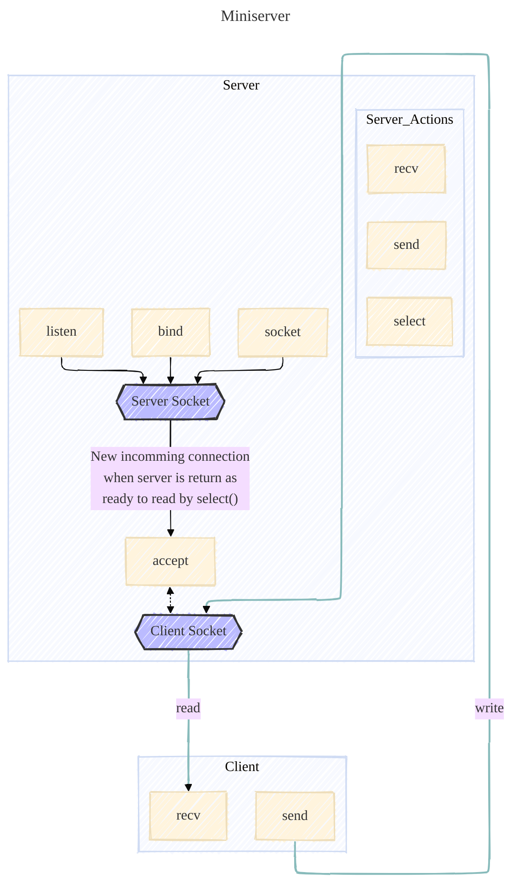

# Miniserver

## Diagram

<link href="https://fonts.googleapis.com/css2?family=Architects+Daughter&display=swap" rel="stylesheet">



## C Functions

<details>
<summary>Write</summary>

```c
ssize_t write(int fd, const void *buf, size_t count);
```

Writes up to `count` bytes from the buffer starting at `buf` to the file referred to by the file descriptor `fd`.

Errors happen when the function returns `-1`. The global variable `errno` is set to indicate the error.

Example:

```c
#include <unistd.h>

int main(void)
{
    char *str = "Hello, World!\n";
    write(1, str, 14);
    return (0);
}
```

</details>

<details>
<summary>Close</summary>

```c
int close(int fd);
```

Closes the file descriptor `fd`.

Errors happen when the function returns `-1`. The global variable `errno` is set to indicate the error.

Example:

```c
#include <unistd.h>

int main(void)
{
    int fd = open("file.txt", O_RDONLY);
    close(fd);
    return (0);
}
```

</details>

<details>
<summary>Select</summary>

```c
int select(int nfds, fd_set *readfds, fd_set *writefds, fd_set *exceptfds, struct timeval *timeout);
```

The `select()` function allows a program to monitor multiple file descriptors, waiting until one or more of the file descriptors become "ready" for some class of I/O operation.
When `select()` returns, the `fd_set` structures are updated to reflect which file descriptors are ready.

**Limitations**:
- The maximum number of file descriptors that `select()` can monitor is defined by the constant `FD_SETSIZE`. Usually, it is 1024.

**Parameters**:
- nfds: 
  - the highest-numbered file descriptor in any of the three sets, plus 1.
- readfds:
  - the set of file descriptors to be checked for being ready to read.
- writefds:
  - the set of file descriptors to be checked for being ready to write.
- exceptfds:
  - the set of file descriptors to be checked for error conditions.
- timeout:
  - the maximum time to wait before returning.
    - If `NULL`, `select()` will block indefinitely until at least one file descriptor is ready.
    - If `0`, `select()` will return immediately.
    - If not `NULL`, the `struct timeval` structure it points to specifies the maximum time to wait.
      - The `tv_sec` field specifies the number of seconds, and the `tv_usec` field specifies the number of microseconds.
      - The maximum time limit is 31.7 minutes.

**Returns**: 
- the number of file descriptors contained in the three returned descriptor sets (that is, the total number of bits that are set in readfds, writefds, exceptfds) which may be zero if the timeout expires before anything interesting happens.
- `-1` on error. The global variable `errno` is set to indicate the error.

**Example**:

```c
#include <sys/select.h>
#include <sys/time.h>
#include <sys/types.h>
#include <unistd.h>

int main(void)
{
    fd_set readfds;
    struct timeval tv;
    int retval;

    FD_ZERO(&readfds);
    FD_SET(0, &readfds);

    tv.tv_sec = 5;
    tv.tv_usec = 0;

    retval = select(1, &readfds, NULL, NULL, &tv);

    if (retval == -1)
        perror("select()");
    else if (retval)
        printf("Data is available now.\n");
    else
        printf("No data within five seconds.\n");

    return (0);
}
```

</details>

<details>
<summary>FD_SET, FD_CLR, FD_ISSET, FD_ZERO</summary>

```c
void FD_SET(int fd, fd_set *set);
```

```c
void FD_CLR(int fd, fd_set *set);
```

```c
int FD_ISSET(int fd, fd_set *set);
```

```c
void FD_ZERO(fd_set *set);
```

These functions are used to manipulate file descriptor sets.

- `FD_SET()` adds the file descriptor `fd` to the set `set`.
- `FD_CLR()` removes the file descriptor `fd` from the set `set`.
- `FD_ISSET()` tests whether the file descriptor `fd` is a member of the set `set`.
  - Returns a non-zero value if `fd` is a member of the set, and zero otherwise.
- `FD_ZERO()` initializes the set `set` to the null set.

</details>

<details>
<summary>Socket</summary>

```c
int socket(int domain, int type, int protocol);
```

Creates an endpoint for communication and returns a file descriptor that refers to the endpoint.

**Parameters**:

- domain:
  - the communication domain in which the socket should be created.
    - `AF_INET`: IPv4 Internet protocols.
    - `AF_INET6`: IPv6 Internet protocols.
    - `AF_UNIX`: Local communication.
    - ...
- type:
  - the type of socket to be created. Specifies the communication semantics.
    - `SOCK_STREAM`: Provides sequenced, reliable, two-way, connection-based byte streams.
    - `SOCK_DGRAM`: Supports datagrams (connectionless, unreliable messages of a fixed maximum length).
    - `SOCK_RAW`: Provides raw network protocol access.
    - ...
- protocol:
  - the protocol to be used with the socket.
    - `0`: The default protocol for the given domain and type.

**Returns**:
- a file descriptor that refers to the endpoint.
- `-1` on error. The global variable `errno` is set to indicate the error.

**Example**:

```c
#include <sys/types.h>
#include <sys/socket.h>

int main(void)
{
    int sockfd = socket(AF_INET, SOCK_STREAM, 0);
    if (sockfd == -1)
        perror("socket()");
    close(sockfd);
    return (0);
}
```

</details>

<details>
<summary>Bind</summary>

```c
int bind(int sockfd, const struct sockaddr *addr, socklen_t addrlen);
```

Assigns the address specified by `addr` to the socket referred to by the file descriptor `sockfd`.

**Parameters**:

- sockfd:
  - the file descriptor of the socket.
- addr:
  - a pointer to a `sockaddr` structure containing the address to be assigned to the socket.
- addrlen:
  - the size of the `sockaddr` structure pointed to by `addr`.

**Returns**:
- `0` on success.
- `-1` on error. The global variable `errno` is set to indicate the error.
  
**Example**:

```c
#include <sys/types.h>
#include <sys/socket.h>
#include <arpa/inet.h>

int main(void)
{
    int sockfd = socket(AF_INET, SOCK_STREAM, 0);
    struct sockaddr_in addr;

    addr.sin_family = AF_INET;
    addr.sin_port = htons(8080);
    addr.sin_addr.s_addr = INADDR_ANY;

    if (bind(sockfd, (struct sockaddr *)&addr, sizeof(addr)) == -1)
        perror("bind()");
    
    printf("Address family: %d\n", addr.sin_family);
    printf("Port: %d\n", ntohs(addr.sin_port));
    printf("IP address: %s\n", inet_ntoa(addr.sin_addr));
    close(sockfd);
    return (0);
}
```

</details>

<details>
<summary>Listen</summary>

```c
int listen(int sockfd, int backlog);
```

Marks the socket referred to by `sockfd` as a passive socket, that is, as a socket that will be used to accept incoming connection requests.

**Parameters**:
- sockfd:
  - the file descriptor of the socket.
- backlog:
  - the maximum length to which the queue of pending connections for the socket may grow.
  - If a connection request arrives when the queue is full, the client may receive an error with an indication of `ECONNREFUSED`.
  - If `backlog` is greater than `SOMAXCONN`, the value of `SOMAXCONN` is used. `SOMAXCONN` is a system-defined constant.
  - If `backlog` is set to `0`, the kernel will use a default value.

**Returns**:
- `0` on success.
- `-1` on error. The global variable `errno` is set to indicate the error.

**Example**:

```c
#include <sys/types.h>
#include <sys/socket.h>
#include <arpa/inet.h>

int main(void)
{
    int sockfd = socket(AF_INET, SOCK_STREAM, 0);
    struct sockaddr_in addr;

    addr.sin_family = AF_INET;
    addr.sin_port = htons(8080);
    addr.sin_addr.s_addr = INADDR_ANY;

    if (bind(sockfd, (struct sockaddr *)&addr, sizeof(addr)) == -1)
        perror("bind()");

    if (listen(sockfd, 5) == -1)
        perror("listen()");

    printf("Listening on port %d\n", ntohs(addr.sin_port));
    close(sockfd);
    return (0);
}
```

</details>

<details>
<summary>Accept</summary>

```c
int accept(int sockfd, struct sockaddr *addr, socklen_t *addrlen);
```

Accepts a new incoming connection on the socket referred to by the file descriptor `sockfd`.

**Parameters**:
- sockfd:
  - the file descriptor of the socket.
- addr:
  - a pointer to a `sockaddr` structure that will contain the address of the connecting entity.
- addrlen:
  - a pointer to a `socklen_t` that will contain the size of the `sockaddr` structure pointed to by `addr`.

**Returns**:
- a file descriptor for the accepted socket.
- `-1` on error. The global variable `errno` is set to indicate the error.

**Example**:

```c
// To connect to the server, use the command: nc
// nc 127.0.0.1 8080

#include <sys/types.h>
#include <sys/socket.h>
#include <arpa/inet.h>

int main(void)
{
    int sockfd = socket(AF_INET, SOCK_STREAM, 0);
    if (sockfd == -1)
        perror("socket()");
    struct sockaddr_in addr;
    socklen_t addrlen = sizeof(addr);

    addr.sin_family = AF_INET;
    addr.sin_port = htons(8080);
    addr.sin_addr.s_addr = inet_addr("127.0.0.1");

    if (bind(sockfd, (struct sockaddr *)&addr, sizeof(addr)) == -1)
        perror("bind()");

    if (listen(sockfd, 5) == -1)
        perror("listen()");

    int newsockfd = accept(sockfd, (struct sockaddr *)&addr, &addrlen);
    if (newsockfd == -1)
        perror("accept()");

    printf("Accepted connection from %s:%d\n", inet_ntoa(addr.sin_addr), ntohs(addr.sin_port));
    close(newsockfd);
    close(sockfd);
    return (0);
}
```

</details>

<details>
<summary>Send</summary>

```c
ssize_t send(int sockfd, const void *buf, size_t len, int flags);
```

Sends a message on the socket referred to by the file descriptor `sockfd`. 

**Parameters**:
- sockfd:
  - the file descriptor of the socket.
- buf:
  - a pointer to the buffer containing the message to be sent.
- len:
  - the length of the message in bytes.
- flags:
  - the type of message transmission.
    - `0`: No flags are set.
    - `MSG_OOB`: Send out-of-band data.
    - `MSG_EOR`: Indicate the end of a record.
    - `MSG_NOSIGNAL`: Do not send a `SIGPIPE` signal if the peer has closed the connection.
    - ...

**Returns**:
- the number of bytes sent.
- `-1` on error. The global variable `errno` is set to indicate the error.

**Example**:

```c
// To connect to the server, use the command: nc
// nc 127.0.0.1 8080
// You should see the message "Hello, World!" on the client side.
#include <sys/types.h>
#include <sys/socket.h>
#include <arpa/inet.h>

int main(void)
{
  int sockfd = socket(AF_INET, SOCK_STREAM, 0);
  if (sockfd == -1)
    perror("socket()");
  struct sockaddr_in addr;
  socklen_t addrlen = sizeof(addr);

  addr.sin_family = AF_INET;
  addr.sin_port = htons(8080);
  addr.sin_addr.s_addr = inet_addr("127.0.0.1");

  if (bind(sockfd, (struct sockaddr *)&addr, sizeof(addr)) == -1)
    perror("bind()");

  if (listen(sockfd, 5) == -1)
    perror("listen()");
  
  int newsockfd = accept(sockfd, (struct sockaddr *)&addr, &addrlen);
  if (newsockfd == -1)
    perror("accept()");

  char *msg = "Hello, World!";
  if (send(newsockfd, msg, 13, 0) == -1)
    perror("send()");

  close(newsockfd);
  close(sockfd);
  return (0);
}
```

</details>

<details>
<summary>Recv</summary>

```c
ssize_t recv(int sockfd, void *buf, size_t len, int flags);
```

Receives a message from a socket.

**Parameters**:
- sockfd:
  - the file descriptor of the socket.
- buf:
  - a pointer to the buffer where the message should be stored.
- len:
  - the length of the buffer in bytes.
- flags:
  - the type of message reception.
    - `0`: No flags are set.
    - `MSG_OOB`: Receive out-of-band data.
    - `MSG_PEEK`: Return data from the beginning of the receive queue without removing it from the queue.
    - `MSG_WAITALL`: Block until the full amount of data can be returned.
    - ...

**Returns**:
- the number of bytes received.
- `0` when the peer has performed an orderly shutdown.
- `-1` on error. The global variable `errno` is set to indicate the error.

**Example**:

```c
#include <sys/types.h>
#include <sys/socket.h>
#include <arpa/inet.h>

int main(void)
{
  // To receive the message, use the command: nc
  // nc localhost 8080
  int sockfd = socket(AF_INET, SOCK_STREAM, 0);
  if (sockfd == -1)
      perror("socket()");
  struct sockaddr_in addr;
  socklen_t addrlen = sizeof(addr);

  addr.sin_family = AF_INET;
  addr.sin_port = htons(8080);
  addr.sin_addr.s_addr = inet_addr("127.0.0.1");

  if (bind(sockfd, (struct sockaddr *)&addr, sizeof(addr)) == -1)
      perror("bind()");
  
  if (listen(sockfd, 5) == -1)
      perror("listen()");
  
  int newsockfd = accept(sockfd, (struct sockaddr *)&addr, &addrlen);
  if (newsockfd == -1)
      perror("accept()");

  char buf[1024];
  if (recv(newsockfd, buf, 1024, 0) == -1)
      perror("recv()");

  printf("Received message: %s\n", buf);
  close(newsockfd);
  close(sockfd);
  return (0);
}
```

</details>

<details>
<summary>Sprintf</summary>

```c
int sprintf(char *str, const char *format, ...);
```

Writes the formatted data to the string `str`. The function is similar to `printf()` but writes the **output to a string instead of file descriptor**.

**Parameters**:
- str:
  - a pointer to the buffer where the formatted data should be stored.
- format:
  - a format string that contains the text to be written to the buffer.

**Returns**:
- the number of characters written to the buffer.
- a negative value if an error occurred.

**Example**:

```c
#include <stdio.h>

int main(void)
{
    char buf[1024];
    sprintf(buf, "Hello, %s!\n", "World");
    printf("%s", buf);
    return (0);
}
```