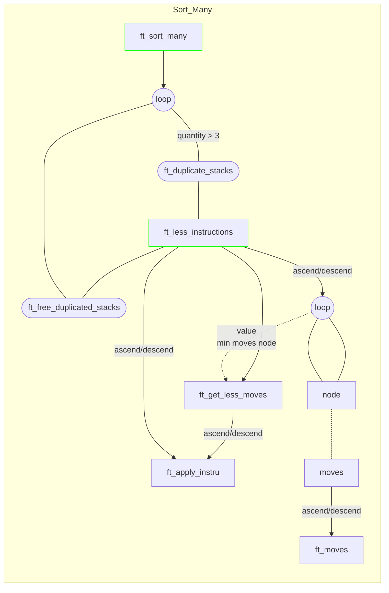
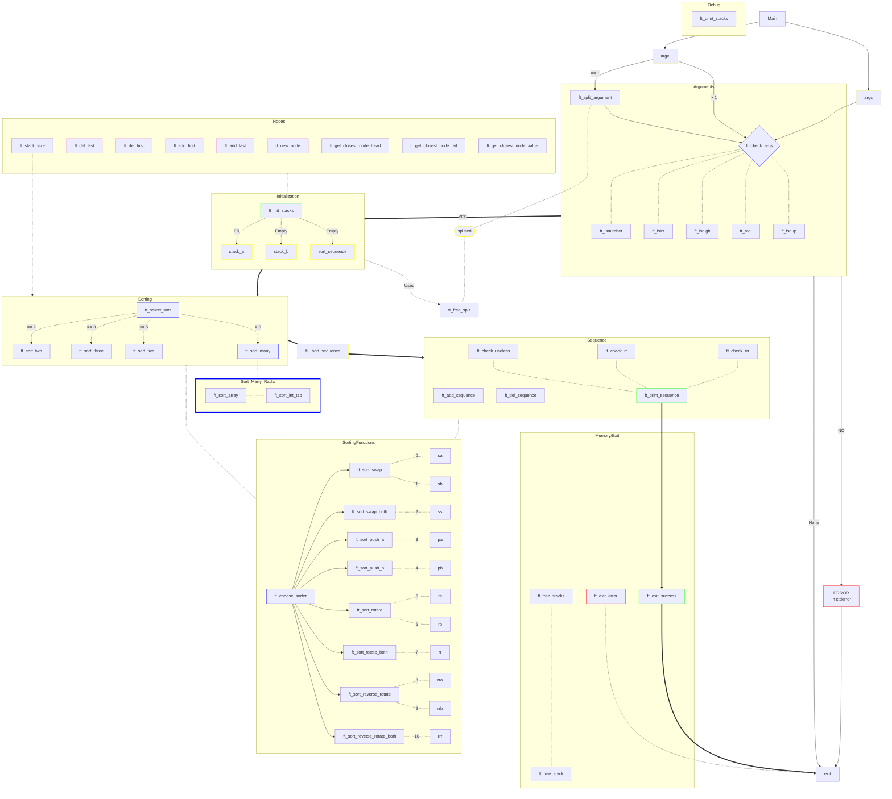

# Push Swap

## Description

Data must be sorted.

You have at your disposal a set of int values, 2 stacks and a set of instructions to manipulate both stacks.

Sorting values is simple. To sort them the fastest way possible is less simple. Especially
because from one integers configuration to another, the most efficient sorting solution can
differ.

## Rules

- You have 2 stacks called a and b.
- At the beginning:
  - a contains a random number of either positive and/or negative numbers without
    any duplicates.
  - b is empty
- The goal is to sort in ascending order numbers into stack a.

- To do this you have the following operations at your disposal:
  - `sa` (`swap a`) :
    - swap the first 2 elements at the top of stack a. Do nothing if there
    is only one or no elements.
  - `sb` (`swap b`) :
    - swap the first 2 elements at the top of stack b. Do nothing if there
    is only one or no elements.
  - `ss` (`swap a` and `swap b`) :
    - do `sa` and `sb` at the same time.
  - `pa` (`push a`) :
    - take the first element at the top of b and put it at the top of a. Do
    nothing if b is empty.
  - `pb` (`push b`) :
    - take the first element at the top of a and put it at the top of b. Do
    nothing if a is empty.
  - `ra` (`rotate a`) :
    - shift up all elements of stack a by 1. The first element becomes
    the last one.
  - `rb` (`rotate b`) :
    - shift up all elements of stack b by 1. The first element becomes
    the last one.
  - `rr` (`rotate a` and `rotate b`) :
    - do `ra` and `rb` at the same time.
  - `rra` (`reverse rotate a`) :
    - shift down all elements of stack a by 1. The last element
    becomes the first one.
  - `rrb` (`reverse rotate b`) :
    - shift down all elements of stack b by 1. The last element
    becomes the first one.
  - `rrr` (`reverse rotate a` and `reverse rotate b`) :
    - do `rra` and `rrb` at the same
    time.


## Push Swap Program

| Item | Description |
| --- | --- |
| Program name | **push_swap** |
| Turn in files | `Makefile`, `*.h`, `*.c` |
| Makefile | `NAME`, `all`, `clean`, `fclean`, `re` |
| Arguments | stack a: A list of integers |
| External functs. | `read`, `write`, `malloc`, `free`, `exit`, `ft_printf` and any equivalent you coded|
| Libft authorized | Yes |
| Description | Sort stacks with the lowest possible number of operations. |

You have to write a program named `push_swap` that takes as an argument the `stack a` formatted as a list of integers. The **first argument should be at the top of the stack** (be careful about the order).

The program must **display** the smallest **list of instructions** possible to sort the `stack
a`, the smallest number being at the top.

Instructions must be separated by a `\n` and nothing else.

The goal is to sort the stack with the lowest possible number of operations. During
the evaluation process, the number of instructions found by **your program will be
compared against a limit**: the maximum number of operations tolerated. If your
program either **displays a longer list or if the numbers aren’t sorted properly, your
grade will be 0**.

If **no parameters** are specified, the program must **not display anything and give the prompt back**.

In **case of error**, it must display **"Error" followed by a ’\n’ on the standard error**.
Errors include for example: **some arguments aren’t integers**, **some arguments are bigger than an integer and/or there are duplicates**.

## Coding part

### Code Flowchart

!TODO: Check moves by advance into simulation stacks for like (2 or 3 moves in future)





### Structures


## Useful links

### Testers

- ⚙️ [Push Swap tester](https://github.com/laisarena/push_swap_tester)

- 📊 [Push Swap Visualizer](https://github.com/o-reo/push_swap_visualizer)

### Articles

- [Sorting Algorithm](https://www.programiz.com/dsa/sorting-algorithm)

- [Radix Algorithm](https://www.geeksforgeeks.org/radix-sort/)

- 📖 [Turk Algo article](https://medium.com/@ayogun/push-swap-c1f5d2d41e97)

- 📖 [Push Swap article - Quick sort (pre sort) -> (sort) algo to make less moves according to sorted array](https://medium.com/@julien-ctx/push-swap-an-easy-and-efficient-algorithm-to-sort-numbers-4b7049c2639a)
  - Tester from article:

  ```shell
  git clone git@github.com:julien-ctx/push-swap-tester.git && mv push-swap-tester/tester.py . && mv push-swap-tester/checker_linux . && rm -rf push-swap-tester && chmod 777 checker_linux && sed -i -- 's/checker_Mac/checker_linux/g' tester.py && make && python3 tester.py
  ```

- ⏯️ [Push Swap video - Oceano - Own algo](https://www.youtube.com/watch?v=OaG81sDEpVk)

### Algo considered

#### Radix (in binary after indexing)


<details>
<summary> Pseudocode </summary>

```c
Radix_Sort(Array, p) // p is the number of passes

       for j = 1 to p do

          int count_array[10] = {0};

          for i = 0 to n do

              count_array[key of(Array[i]) in pass j]++ // count array stores the count of key

          for k = 1 to 10 do

              count_array[k] = count_array[k] + count_array[k-1]

          for i = n-1 downto 0 do

              result_array[ count_array[key of(Array[i])] ] = Array[j]

              //Construct the resulting array (result_array) by checking new Array[i] position from count_array[k]

              count_array[key of(Array[i])]--

          for i=0 to n do

              Array[i] = result_array[i]  

          //The main array Array[] now contains sorted numbers based on the current digit position.

       the end for(j)

 end function
```

</details>

<details><summary>Code in C</summary>

```c
// Radix Sort in C Programming

#include <stdio.h>

// Function to get the largest element from an array
int getMax(int array[], int n) {
  int max = array[0];
  for (int i = 1; i < n; i++)
    if (array[i] > max)
      max = array[i];
  return max;
}

// Using counting sort to sort the elements in the basis of significant places
void countingSort(int array[], int size, int place) {
  int output[size + 1];
  int max = (array[0] / place) % 10;

  for (int i = 1; i < size; i++) {
    if (((array[i] / place) % 10) > max)
      max = array[i];
  }
  int count[max + 1];

  for (int i = 0; i < max; ++i)
    count[i] = 0;

  // Calculate count of elements
  for (int i = 0; i < size; i++)
    count[(array[i] / place) % 10]++;
    
  // Calculate cumulative count
  for (int i = 1; i < 10; i++)
    count[i] += count[i - 1];

  // Place the elements in sorted order
  for (int i = size - 1; i >= 0; i--) {
    output[count[(array[i] / place) % 10] - 1] = array[i];
    count[(array[i] / place) % 10]--;
  }

  for (int i = 0; i < size; i++)
    array[i] = output[i];
}

// Main function to implement radix sort
void radixsort(int array[], int size) {
  // Get maximum element
  int max = getMax(array, size);

  // Apply counting sort to sort elements based on place value.
  for (int place = 1; max / place > 0; place *= 10)
    countingSort(array, size, place);
}

// Print an array
void printArray(int array[], int size) {
  for (int i = 0; i < size; ++i) {
    printf("%d  ", array[i]);
  }
  printf("\n");
}

// Driver code
int main() {
  int array[] = {121, 432, 564, 23, 1, 45, 788};
  int n = sizeof(array) / sizeof(array[0]);
  radixsort(array, n);
  printArray(array, n);
}
```

</details>
