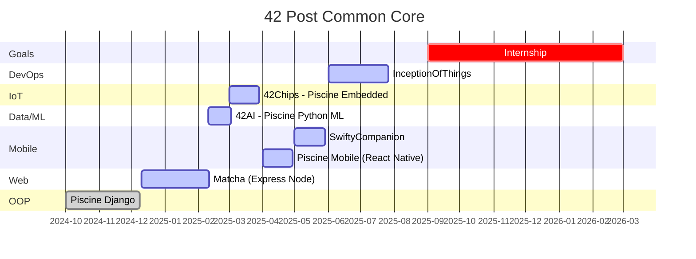
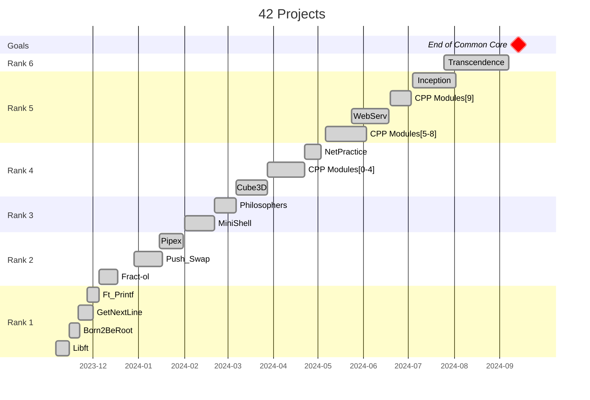
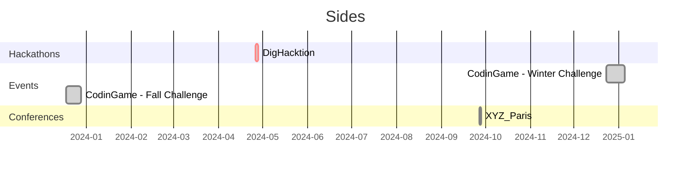

# 42 Projects

Notes and projects during my time at 42.

## Projects

### 🔮 Post Common Core

#### Data/ML

- [42AI - Piscine Python ML](./Others/42AI/Piscine_ML/)

#### Backend

- [Piscine Python Django](./Projects/Django)

#### Web

- [Matcha](./Projects/Matcha)

### 🦄 Common Core

#### Rank 6

- [Transcendence](./Projects/Transcendence)

#### Rank 5

- [Inception](./Projects/Inception)
- [CPP Modules [5-9]](./Projects/CPP_Modules)
- [WebServ](./Projects/WebServ)

#### Rank 4

- [NetPractice](./Projects/NetPractice/)
- [CPP Modules [0-4]](./Projects/CPP_Modules)
- [Cube3D](./Projects/Cube3D/)

#### Rank 3

- [Philosophers](./Projects/Philosophers/)
- [MiniShell](./Projects/MiniShell/)

#### Rank 2

- [Pipex](./Projects/Pipex/)
- [Push_Swap](./Projects/Push_swap/)
- [Fract-ol](./Projects/Fract-ol/)

#### Rank 1

- [Ft_Printf](./Projects/Ft_printf/)
- [GetNextLine](./Projects/GetNextLine/)
- [Born2BeRoot](./Projects/Born2BeRoot/)

#### Rank 0

- [Libft](./Projects/Libft/)
- [PiscineReloaded](./Projects/PiscineReloaded/)

## [Notes](./Notes/)

- [Color/Ascii (e.g in Terminal)](./Notes/ascii-art.md)
- [Git Conventions](./Notes/git-conventions.md)
- [Computer Science](./Notes/computer_science.md)
- [Makefile](./Notes/makefile.md)
- [Useful Links](./Notes/useful_links.md)

## [Configs](./Config/)

- [Gnome Customization - Themes, Icons, Buttons...](./Config/Theme/gnome-customization/)
- [VirtualBox - Shared Folder](https://www.golinuxcloud.com/virtualbox-shared-folder/)
- [IDE](./Config/IDE/)

## About this repository

### Documentation Preview

> [!WARNING]\
> Some display in `.md` files of this repository may not be supported by github (svg, css display, some math in latex, ...), you can clone the repository and view it locally.

> [!NOTE]\
> Recommened extensions for better experience in `vscode` are as follows:
>
> - [Markdown Preview Github Styling](https://marketplace.visualstudio.com/items?itemName=bierner.markdown-preview-github-styles)
>
>   - ID: `bierner.markdown-preview-github-styles`
>
> - [Markdown Preview Mermaid](https://marketplace.visualstudio.com/items?itemName=bierner.markdown-mermaid)
>   - ID: `bierner.markdown-mermaid`

## Timeline

## 42Paris

- 🤖 [Friends List/Map - 42Friends](https://friends.42paris.fr/)
- 🔎 [Find help for your 42 Projects](https://github.com/rfautier/find_correction)
- ⏳ [Timework tracker - 42Dashboard](https://dashboard.42paris.fr/)
