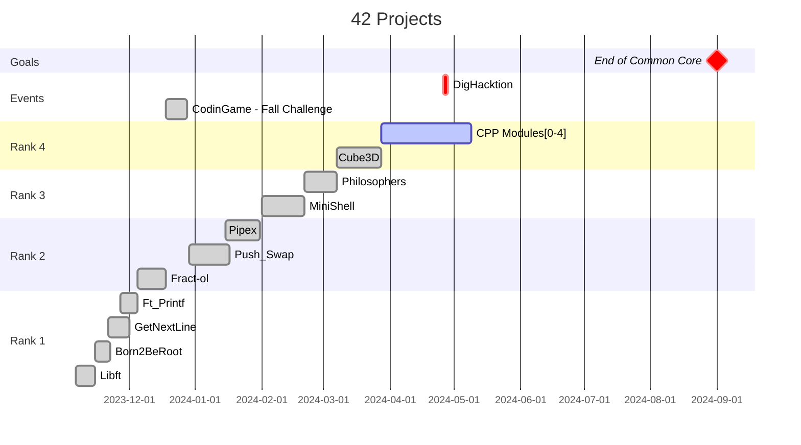

# 42 Projects

This repository contain my work at 42 school, it act as a backup as well as share space for projects

## Projects

### Rank 4

* [Cube3D](./Projects/Cube3D/)
* [CPP Modules [0-4]](./Projects/CPP_Modules)
* [NetPractice](./Projects/NetPractice/)

### Rank 3

* [Philosophers](./Projects/Philosophers/)
* [MiniShell](./Projects/MiniShell/)

### Rank 2

* [Fract-ol](./Projects/Fract-ol/)
* [Push_Swap](./Projects/Push_swap/)
* [Pipex](./Projects/Pipex/)

### Rank 1

* [Libft](./Projects/Libft/)
* [Born2BeRoot](./Projects/Born2BeRoot/)
* [GetNextLine](./Projects/GetNextLine/)
* [Ft_Printf](./Projects/Ft_printf/)

### Piscine

* [PiscineReloaded](./Projects/PiscineReloaded/)

## [Notes](./Notes/)

* [MinilibX](./Notes/minilibx.md)
* [Makefile](./Notes/makefile.md)
* [Git](./Notes/git.md)

## [Configs](./Config/)

* [VIM/Neovim](./Config/VIM/)

## About this repository

### Documentation Preview

Some display in `.md` files of this repository may not be supported by github (svg, css display, some math in latex, ...), you can clone the repository and view it locally.

Recommened extensions for better experience in `vscode` are as follows:
* [Markdown Preview Github Styling](https://marketplace.visualstudio.com/items?itemName=bierner.markdown-preview-github-styles)
  - ID: `bierner.markdown-preview-github-styles`

* [Markdown Preview Mermaid](https://marketplace.visualstudio.com/items?itemName=bierner.markdown-mermaid)
  - ID: `bierner.markdown-mermaid`

## Timeline

